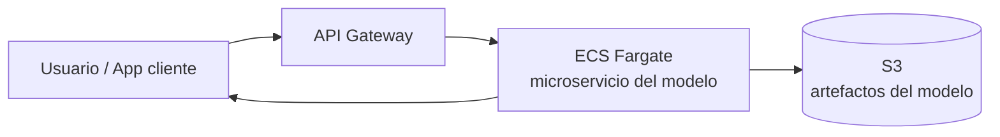
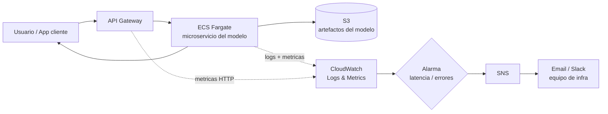
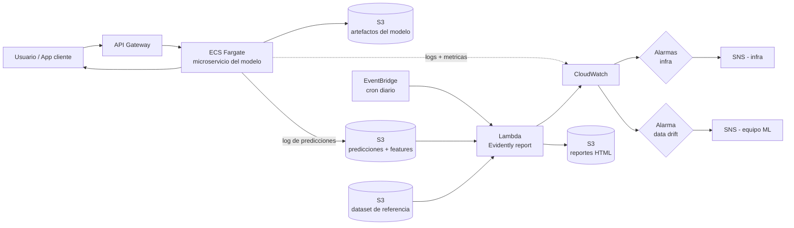
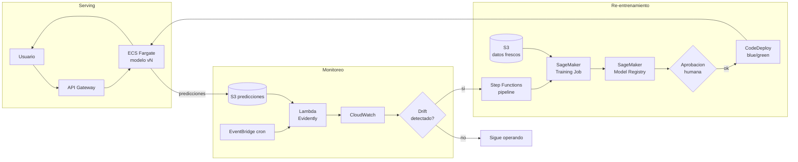

# Modulo 05: Monitoreo de Modelos y Data Drift

## Por que monitorear?

Un modelo en produccion **se degrada con el tiempo**. Los datos del mundo real cambian
y el modelo, entrenado con datos historicos, deja de ser preciso.

```
Entrenamiento (datos historicos)     Produccion (datos nuevos)
     [Enero 2024]          -->         [Octubre 2024]
     Distribucion A                    Distribucion B  (cambio!)
     Modelo funciona bien              Modelo se degrada
```

Sin monitoreo, no sabes que el modelo esta fallando hasta que el negocio se ve afectado.

## Tipos de degradacion

### 1. Data Drift (cambio en los datos de entrada)

La distribucion de las **features** cambia respecto a los datos de entrenamiento.

**Ejemplo**: Entrenaste un modelo de prediccion de duracion de taxis con datos de enero.
En julio, hay mas turistas, rutas diferentes, mas trafico — las features (`trip_distance`,
`PULocationID`) tienen distribuciones distintas.

```
Entrenamiento:              Produccion:
trip_distance               trip_distance
  media: 3.2 km              media: 5.8 km     <-- DRIFT
  std: 2.1                    std: 4.3
```

### 2. Concept Drift (cambia la relacion feature -> target)

La relacion entre features y target cambia. Aunque las features se vean igual,
el patron aprendido ya no aplica.

**Ejemplo**: Antes, viajes largos = duracion larga. Pero se abrio una autopista nueva
y ahora viajes largos pueden ser rapidos. El modelo no sabe esto.

### 3. Prediction Drift (cambia la distribucion de las predicciones)

Las predicciones del modelo cambian su distribucion, incluso si no puedes verificar
contra las etiquetas reales.

## Como detectar drift

### Metodos estadisticos comunes

| Metodo | Que compara | Cuando usarlo |
|--------|------------|---------------|
| Kolmogorov-Smirnov (KS) | Distribuciones continuas | Features numericas |
| Chi-cuadrado | Distribuciones categoricas | Features categoricas |
| Population Stability Index (PSI) | Estabilidad general | Monitoreo periodico |
| Jensen-Shannon Divergence | Distancia entre distribuciones | General |

### Regla practica

Si el **p-value** del test KS es menor a 0.05, hay evidencia estadistica de que
la distribucion cambio (drift detectado).

## Herramientas de monitoreo para ML

| Herramienta | Tipo | Descripcion |
|-------------|------|-------------|
| **Evidently** | Open source | Reportes de drift, calidad de datos, performance |
| **Great Expectations** | Open source | Validacion de datos (expectativas sobre los datos) |
| **Grafana + Prometheus** | Open source | Dashboards de metricas operacionales |
| **WhyLabs** | SaaS | Monitoreo continuo con perfiles estadisticos |
| **Arize** | SaaS | Observabilidad de modelos |

Para este curso usaremos **Evidently** por ser open source, facil de usar,
y generar reportes visuales claros.

## Ejemplo practico: Detectando Data Drift

### Escenario

Usaremos el dataset de taxis de NYC (el mismo de los modulos anteriores).
Simularemos drift comparando datos de **enero** (entrenamiento) contra
**datos modificados** (produccion simulada).

### Codigo

```python
import pandas as pd
import numpy as np

# --- Simular datos de "entrenamiento" (enero) ---
np.random.seed(42)
n = 1000

train_data = pd.DataFrame({
    "trip_distance": np.random.exponential(3.0, n),
    "PULocationID": np.random.choice(range(1, 50), n),
    "DOLocationID": np.random.choice(range(1, 50), n),
    "duration": np.random.normal(15, 5, n).clip(1, 60),
})

# --- Simular datos de "produccion" CON drift ---
# Distancias mas largas, diferentes zonas
prod_data = pd.DataFrame({
    "trip_distance": np.random.exponential(5.5, n),       # media cambio: 3.0 -> 5.5
    "PULocationID": np.random.choice(range(30, 80), n),   # zonas diferentes
    "DOLocationID": np.random.choice(range(30, 80), n),
    "duration": np.random.normal(22, 8, n).clip(1, 60),   # duraciones mas largas
})

print("=== Comparacion de medias ===")
for col in ["trip_distance", "duration"]:
    print(f"{col}:")
    print(f"  Train: {train_data[col].mean():.2f}")
    print(f"  Prod:  {prod_data[col].mean():.2f}")
    print()
```

### Detectar drift con scipy (sin dependencias extra)

```python
from scipy import stats

print("=== Test de Kolmogorov-Smirnov ===\n")
for col in ["trip_distance", "PULocationID", "DOLocationID", "duration"]:
    stat, p_value = stats.ks_2samp(train_data[col], prod_data[col])
    drift = "DRIFT DETECTADO" if p_value < 0.05 else "Sin drift"
    print(f"{col}:")
    print(f"  KS statistic: {stat:.4f}")
    print(f"  p-value: {p_value:.6f}")
    print(f"  Resultado: {drift}")
    print()
```

**Output esperado**: todas las features mostraran drift porque modificamos
intencionalmente las distribuciones de produccion.

### Detectar drift con Evidently (reportes visuales)

```python
# pip install evidently  (o: uv add evidently)
from evidently.report import Report
from evidently.metric_preset import DataDriftPreset

# Crear reporte de drift
report = Report(metrics=[DataDriftPreset()])
report.run(reference_data=train_data, current_data=prod_data)

# Guardar como HTML (abre en el navegador)
report.save_html("drift_report.html")
print("Reporte guardado en drift_report.html")

# Ver resumen en consola
report_dict = report.as_dict()
for col_name, col_data in report_dict["metrics"][0]["result"]["drift_by_columns"].items():
    status = "DRIFT" if col_data["drift_detected"] else "OK"
    print(f"{col_name}: {status} (p-value: {col_data['stattest_pvalue']:.4f})")
```

## Que monitorear en produccion

### Metricas de datos (Data Quality)

- Porcentaje de valores nulos por feature
- Distribucion de cada feature vs entrenamiento (drift)
- Valores fuera de rango esperado
- Volumen de datos (alertar si cae drasticamente)

### Metricas del modelo (Model Performance)

- Distribucion de predicciones (prediction drift)
- Metricas de performance (si tienes labels): accuracy, RMSE, etc.
- Latencia de prediccion (tiempo de respuesta)
- Tasa de errores del servicio

### Metricas operacionales

- Uso de CPU/memoria del servicio
- Numero de requests por segundo
- Errores HTTP (4xx, 5xx)

## Cuando re-entrenar

No hay una regla universal. Opciones comunes:

| Estrategia | Cuando usarla |
|-----------|---------------|
| **Periodico** (cada semana/mes) | Datos cambian gradualmente |
| **Por drift** (cuando se detecta) | Datos cambian de forma impredecible |
| **Por performance** (cuando las metricas caen) | Tienes labels en produccion |
| **Continuo** (entrenamiento incremental) | Alto volumen de datos nuevos |

## Conexion con el curso

Este modulo cierra el ciclo de MLOps:

```
Entrenamiento (Mod 01-02)
    -> Orquestacion (Mod 03)
    -> Deployment (Mod 04)
    -> Monitoreo (Mod 05)  <-- estas aqui
    -> Re-entrenamiento (vuelta al inicio)
```

El monitoreo es lo que convierte un modelo "desplegado" en un modelo **en produccion**.
Sin monitoreo, no hay MLOps — solo hay un modelo que eventualmente dejara de funcionar.

## Arquitecturas de referencia en AWS (teorico)

Estos diagramas son **conceptuales**: muestran como se veria tu sistema en AWS
a medida que agregas capacidades. No los desplegaremos en clase, pero sirven
para entender que piezas necesitarias y en que orden conviene agregarlas.

**Analogia**: piensalo como un auto.
1. Primero, un auto que **funciona** (te lleva del punto A al B).
2. Luego le agregas **tablero** (velocimetro, luz de gasolina) para saber que pasa.
3. Despues, **alertas inteligentes** (check engine) que te avisan antes de quedarte varado.
4. Finalmente, un auto que **se auto-diagnostica y se repara solo** (MLOps completo).

### Nivel 1 — Despliegue simple (sin monitoreo)

El minimo indispensable: el modelo responde peticiones. No sabes si funciona bien,
solo sabes si esta "prendido" o "apagado".



**Pros**: rapido de montar, barato.
**Contras**: no hay visibilidad. Si el modelo empieza a fallar o a predecir basura,
nadie se entera hasta que el negocio reclama.

### Nivel 2 — Monitoreo operacional basico

Agregas **CloudWatch** para logs, metricas de infraestructura y alertas via **SNS**.
Ya sabes si el servicio esta caido, lento o con errores HTTP, pero **todavia no sabes
si las predicciones son correctas**.



**Pros**: detectas caidas, picos de latencia, errores 5xx.
**Contras**: un modelo puede responder rapido y sin errores **y aun asi predecir mal**.
Esto solo cubre la salud del servicio, no la salud del **modelo**.

### Nivel 3 — Monitoreo de ML (data drift y calidad de predicciones)

Ahora guardas cada prediccion en **S3**, y un job programado con **EventBridge + Lambda**
corre **Evidently** para comparar la distribucion actual contra la de entrenamiento.
Si detecta drift, dispara una alerta al equipo de ML.



**Pros**: detectas data drift, prediction drift y calidad de datos **antes** de que el
negocio lo sienta.
**Contras**: todavia alguien tiene que decidir **que hacer** cuando salta la alarma
(normalmente: re-entrenar el modelo a mano).

### Nivel 4 — MLOps completo con re-entrenamiento automatico

El ultimo nivel cierra el ciclo: cuando Evidently detecta drift sostenido, se dispara
un pipeline en **Step Functions** que re-entrena con **SageMaker**, registra el modelo
en el **Model Registry** y despliega la nueva version con aprobacion humana.



**Pros**: el sistema se auto-repara. El equipo de ML solo aprueba, no apaga incendios.
**Contras**: mas piezas, mas costo, mas cosas que pueden fallar. Solo vale la pena
cuando ya tienes volumen y el re-entrenamiento manual duele.

### Como elegir el nivel correcto

| Situacion | Nivel recomendado |
|-----------|-------------------|
| POC / demo interna | Nivel 1 |
| Primer modelo en produccion, pocos usuarios | Nivel 2 |
| Modelo con impacto de negocio real, labels tardios | Nivel 3 |
| Varios modelos, datos cambian rapido, equipo dedicado | Nivel 4 |

**Regla de oro**: no saltes directo al Nivel 4. Cada nivel te ensena que alarmas
son utiles y cuales son ruido, y te prepara para operar el siguiente.
