# Guia de Cierre: Como se Conecta Todo en MLOps

> **Para quien es esta guia:** Personas que completaron los modulos de Experiment Tracking (MLflow) y Orquestacion (Prefect/Mage) y quieren entender como se conecta todo, como se usa en produccion real, y que pasa cuando hay plataformas como Databricks o SageMaker en la ecuacion.

---

## Tabla de Contenidos

**Parte 1 - Lo que aprendimos (resumen visual)**
1. [El Mapa Completo: Como se conectan los 3 modulos](#1-el-mapa-completo)
2. [Analogia central: La Panaderia de ML](#2-analogia-central-la-panaderia-de-ml)
3. [Resumen visual de MLflow](#3-resumen-visual-de-mlflow)
4. [Resumen visual de Orquestacion](#4-resumen-visual-de-orquestacion)
5. [Como se integran MLflow + Orquestacion](#5-como-se-integran-mlflow--orquestacion)

**Parte 2 - Preguntas de produccion**
6. [Para que necesito un orquestador en produccion real?](#6-para-que-necesito-un-orquestador-en-produccion-real)
7. [Y si tengo Databricks, SageMaker o similar?](#7-y-si-tengo-databricks-sagemaker-o-similar)
8. [Hasta donde llegan las alertas y el monitoreo?](#8-hasta-donde-llegan-las-alertas-y-el-monitoreo)
9. [Un dia en la vida de un pipeline en produccion](#9-un-dia-en-la-vida-de-un-pipeline-en-produccion)
10. [Mapa de decisiones: que herramienta uso?](#10-mapa-de-decisiones-que-herramienta-uso)

> **Guia complementaria:** Para la guia practica paso a paso de Mage, ver [GUIA_MAGE_PASO_A_PASO.md](GUIA_MAGE_PASO_A_PASO.md)

---

# PARTE 1: Lo que Aprendimos

## 1. El Mapa Completo

Todo el curso sigue un camino logico. Cada modulo resuelve un problema que el anterior deja abierto:

```
 MODULO 01                    MODULO 02                    MODULO 03
 Intro a ML                   Experiment Tracking           Orquestacion
 ──────────                   ──────────────────           ─────────────

 "Aprendo a                   "Aprendo a ANOTAR            "Aprendo a que
  COCINAR un                   lo que hice para              TODO se haga
  plato"                       poder repetirlo"              SOLO"

 ┌─────────────┐             ┌─────────────┐              ┌─────────────┐
 │ - Cargar    │             │ - MLflow     │              │ - Prefect   │
 │   datos     │────────────>│ - Parametros │─────────────>│ - Mage      │
 │ - Entrenar  │             │ - Metricas   │              │ - Pipelines │
 │ - Evaluar   │             │ - Modelos    │              │ - Schedules │
 └─────────────┘             └─────────────┘              └─────────────┘

  Problema:                   Problema:                    Problema:
  "Entrene un modelo          "Entrene 50 modelos          "Tengo que correr
   pero no guarde nada"        y no se cual fue             esto todos los dias
                               el mejor"                    a las 2am"
```

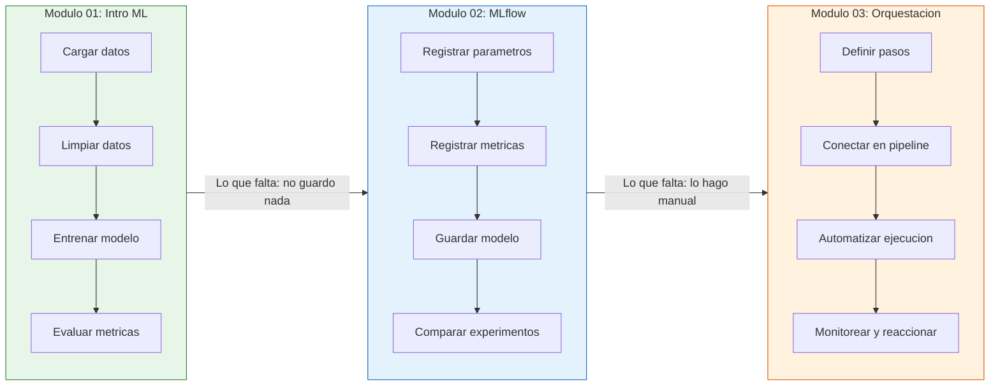

---

## 2. Analogia Central: La Panaderia de ML

```
 ┌──────────────────────────────────────────────────────────────────┐
 │                    PANADERIA SIN ORGANIZACION                    │
 │                                                                  │
 │   Lunes:  "Hice un pan delicioso... pero no anote la receta"    │
 │   Martes: "Cambie algo y quedo horrible... que cambie?"          │
 │   Miercoles: "Se me olvido prender el horno a las 4am"          │
 │   Jueves: "El cliente pidio 100 panes y los hice uno por uno"   │
 │   Viernes: "Nadie sabe que receta usamos esta semana"            │
 └──────────────────────────────────────────────────────────────────┘

 ┌──────────────────────────────────────────────────────────────────┐
 │                    PANADERIA CON MLOPS                           │
 │                                                                  │
 │   Modulo 01 = Aprender a HACER el pan                           │
 │   Modulo 02 = Tener un CUADERNO DE RECETAS (MLflow)             │
 │   Modulo 03 = Tener una FABRICA AUTOMATIZADA (Prefect/Mage)     │
 └──────────────────────────────────────────────────────────────────┘
```

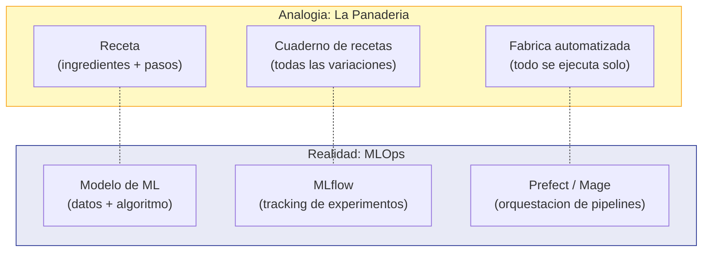

---

## 3. Resumen Visual de MLflow

### Los 4 elementos que MLflow guarda

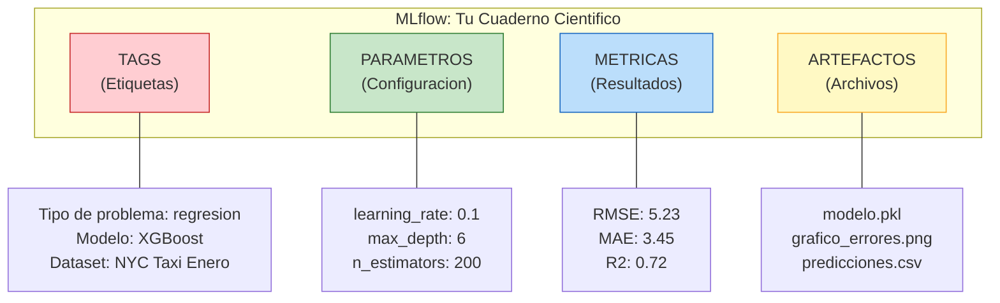

```
 ┌─────────────────────────────────────────────────────────────────┐
 │   TAGS       = Etiqueta del estante en la biblioteca            │
 │   PARAMETROS = Ingredientes de la receta                        │
 │   METRICAS   = Calificacion del jurado                          │
 │   ARTEFACTOS = El pan terminado + la foto del pan               │
 └─────────────────────────────────────────────────────────────────┘
```

### Las 3 arquitecturas que vimos (Escenarios)

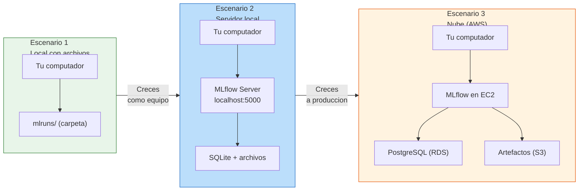

```
 ┌────────────────┬────────────────────┬────────────────────────────┐
 │ Escenario 1    │ Escenario 2        │ Escenario 3                │
 │ (Solo yo)      │ (Mi equipo)        │ (Produccion)               │
 ├────────────────┼────────────────────┼────────────────────────────┤
 │ Archivos en    │ Servidor local     │ EC2 + RDS + S3             │
 │ mi laptop      │ + SQLite           │ en Amazon Web Services     │
 │                │                    │                            │
 │ Sin Model      │ Con Model Registry │ Con Model Registry         │
 │ Registry       │ (versiones, alias) │ + persistencia real        │
 │                │                    │                            │
 │ Para Kaggle,   │ Para equipo de     │ Para empresa que tiene     │
 │ aprender       │ 2-10 personas      │ modelos en produccion      │
 └────────────────┴────────────────────┴────────────────────────────┘
```

---

## 4. Resumen Visual de Orquestacion

### Los 5 pilares

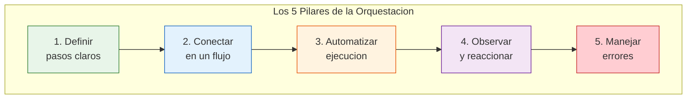

### Lo que vimos en el curso

```
 ┌──────────────────────────────────────────────────────────────────┐
 │                    QUE APRENDIMOS                                │
 │                                                                  │
 │  Prefect (code-first)              Mage (UI-first)              │
 │  ─────────────────────             ──────────────────            │
 │                                                                  │
 │  @flow y @task                     @data_loader                 │
 │  Reintentos automaticos            @transformer                 │
 │  Cache de resultados               @data_exporter               │
 │  Artefactos (tablas, markdown)     Tests integrados (@test)     │
 │  Cron scheduling                   UI en navegador              │
 │  Deploy con parametros             Bloques individuales         │
 │  Secrets para API keys             Pipeline visual              │
 │                                                                  │
 │  Pipeline completo:                Pipeline identico:            │
 │  Cargar → Validar → Features       Cargar → Validar → Features  │
 │  → Optuna → XGBoost → MLflow       → Optuna → XGBoost → MLflow │
 │                                                                  │
 └──────────────────────────────────────────────────────────────────┘
```

---

## 5. Como se Integran MLflow + Orquestacion

**Por que necesito ambos?** Porque cada uno responde preguntas diferentes:

```
 ┌──────────────────────────────────────────────────────────────────┐
 │                                                                  │
 │     ORQUESTADOR                          MLFLOW                 │
 │     (Prefect/Mage)                       (Tracking)             │
 │                                                                  │
 │     CUANDO se ejecuto?          ──   QUE parametros use?        │
 │     EN QUE ORDEN?               ──   QUE metricas obtuve?      │
 │     QUE HACER si falla?         ──   QUE modelo entrene?       │
 │     ESTADO general              ──   COMPARAR experimentos     │
 │                                                                  │
 │              ┌─────────────────────────────┐                    │
 │              │     JUNTOS responden:       │                    │
 │              │                             │                    │
 │              │  "El pipeline corrio ayer   │                    │
 │              │   a las 2am, entreno un     │                    │
 │              │   XGBoost con lr=0.1 y      │                    │
 │              │   obtuvo RMSE=4.12"         │                    │
 │              └─────────────────────────────┘                    │
 │                                                                  │
 └──────────────────────────────────────────────────────────────────┘
```

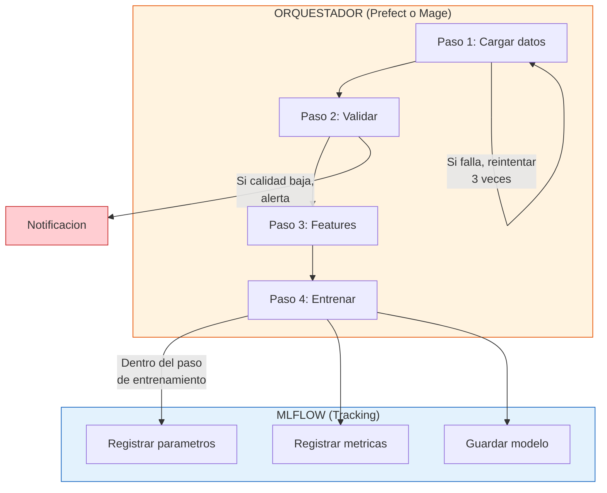

### Analogia: El hospital

```
 ┌──────────────────────────────────────────────────────────────────┐
 │                         EL HOSPITAL                              │
 │                                                                  │
 │   ORQUESTADOR = El protocolo del hospital                       │
 │   "Primero triaje, luego diagnostico, luego tratamiento"        │
 │   "Si el laboratorio falla, reintentar en 10 minutos"           │
 │   "El turno de noche arranca automaticamente a las 10pm"        │
 │                                                                  │
 │   MLFLOW = La historia clinica del paciente                      │
 │   "Que medicamento se le dio? (parametros)"                     │
 │   "Cual fue su temperatura despues? (metricas)"                 │
 │   "Donde estan las radiografias? (artefactos)"                  │
 │   "Que tratamiento funciono mejor? (comparar experimentos)"     │
 │                                                                  │
 │   JUNTOS: El protocolo dice CUANDO y EN QUE ORDEN hacer cosas. │
 │   La historia clinica dice QUE se hizo y COMO resulto.          │
 └──────────────────────────────────────────────────────────────────┘
```

---

# PARTE 2: Preguntas de Produccion

---

## 6. Para que Necesito un Orquestador en Produccion Real?

Esta es probablemente la pregunta mas comun: *"En el curso corremos todo local... pero en la vida real, por que no simplemente pongo un cron en el servidor?"*

### La respuesta corta

Un `cron` solo **ejecuta**. Un orquestador **ejecuta, vigila, reintenta, notifica, y registra**.

### La respuesta con analogia

```
 ┌──────────────────────────────────────────────────────────────────┐
 │                                                                  │
 │   CRON = Un despertador                                         │
 │   "Suena a las 4am y ya. Si te quedas dormido, no insiste."    │
 │   "No sabe si te levantaste. No sabe si llegaste al trabajo."  │
 │                                                                  │
 │   ORQUESTADOR = Un asistente personal                           │
 │   "Te despierta a las 4am."                                    │
 │   "Si no respondes, te llama otra vez en 5 minutos."           │
 │   "Si despues de 3 intentos no respondes, llama a tu jefe."    │
 │   "Anota a que hora te levantaste y cuanto tardaste."           │
 │   "Al final del dia, te da un resumen de todo lo que paso."    │
 │                                                                  │
 └──────────────────────────────────────────────────────────────────┘
```

### Los 5 problemas reales que resuelve

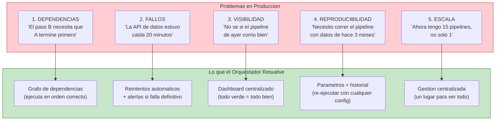

### Ejemplo concreto: que pasa cuando NO hay orquestador

```
 ┌──────────────────────────────────────────────────────────────────┐
 │                HISTORIA REAL (simplificada)                      │
 │                                                                  │
 │  Empresa de e-commerce. Modelo de recomendacion de productos.   │
 │                                                                  │
 │  Lunes 2am:  Cron ejecuta pipeline. Todo bien.                 │
 │  Martes 2am: La base de datos estaba en mantenimiento.          │
 │              Pipeline falla silenciosamente.                     │
 │              Nadie se entera.                                    │
 │  Miercoles:  Las recomendaciones usan datos de hace 48 horas.  │
 │              Ventas bajan 12%.                                   │
 │  Jueves:     Alguien nota que "las recomendaciones estan raras" │
 │  Viernes:    Investigan. Descubren que el pipeline fallo martes.│
 │              3 dias perdidos.                                    │
 │                                                                  │
 │  CON ORQUESTADOR:                                               │
 │  Martes 2:05am: Pipeline falla. Se reintenta automaticamente.  │
 │  Martes 2:15am: Falla de nuevo. Se reintenta.                  │
 │  Martes 2:25am: Falla por tercera vez.                          │
 │  Martes 2:26am: Llega alerta a Slack: "Pipeline fallo 3 veces" │
 │  Martes 8:00am: El equipo revisa, ve que fue mantenimiento.    │
 │  Martes 8:05am: Re-ejecuta manualmente. Todo resuelto.         │
 │  Impacto: 6 horas, no 3 dias.                                  │
 │                                                                  │
 └──────────────────────────────────────────────────────────────────┘
```

---

## 7. Y si Tengo Databricks, SageMaker o Similar?

Esta pregunta surge frecuentemente: *"Mi empresa usa Databricks (o SageMaker, o Vertex AI). Ya tiene todo integrado. Entonces para que necesito aprender Prefect o MLflow por separado?"*

### La respuesta clave: son CAPAS, no competidores

Las plataformas como Databricks o SageMaker son **ecosistemas completos** que incluyen versiones propias de lo que aprendimos. Pero entender las piezas individuales te da el poder de decidir que usar y cuando.

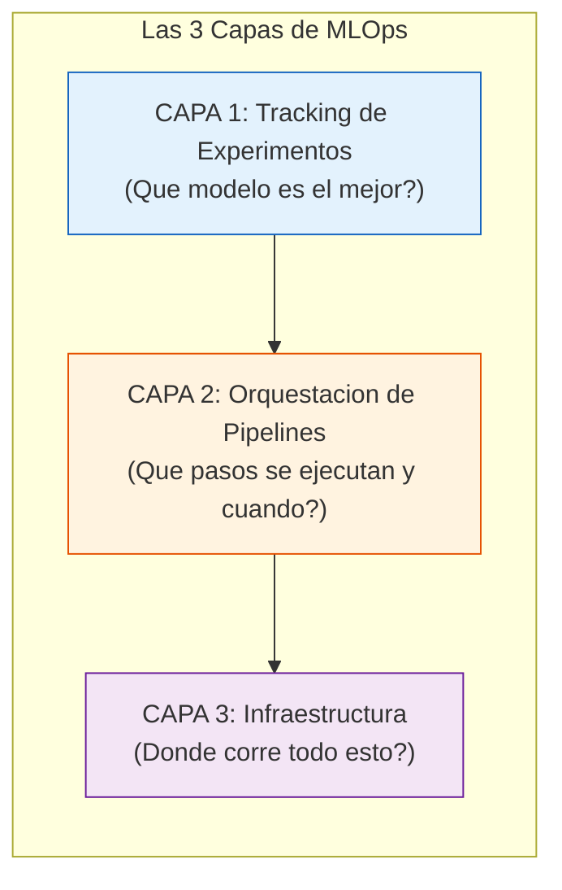

### Como cada plataforma cubre estas capas

```
 ┌──────────────────┬──────────────┬──────────────┬──────────────┐
 │  Capa            │ Lo que       │ Databricks   │ AWS          │
 │                  │ aprendimos   │              │ SageMaker    │
 ├──────────────────┼──────────────┼──────────────┼──────────────┤
 │                  │              │              │              │
 │  Tracking de     │ MLflow       │ MLflow       │ SageMaker    │
 │  experimentos    │ (open source)│ (integrado!) │ Experiments  │
 │                  │              │              │              │
 ├──────────────────┼──────────────┼──────────────┼──────────────┤
 │                  │              │              │              │
 │  Orquestacion    │ Prefect      │ Databricks   │ SageMaker    │
 │                  │ Mage         │ Workflows    │ Pipelines    │
 │                  │              │ (Jobs)       │ Step Func.   │
 │                  │              │              │              │
 ├──────────────────┼──────────────┼──────────────┼──────────────┤
 │                  │              │              │              │
 │  Infraestructura │ Tu laptop    │ Cluster en   │ Instancias   │
 │                  │ o EC2        │ la nube de   │ en AWS       │
 │                  │              │ Databricks   │              │
 │                  │              │              │              │
 ├──────────────────┼──────────────┼──────────────┼──────────────┤
 │                  │              │              │              │
 │  Model Registry  │ MLflow       │ Unity        │ SageMaker    │
 │                  │ Registry     │ Catalog      │ Model        │
 │                  │              │              │ Registry     │
 │                  │              │              │              │
 └──────────────────┴──────────────┴──────────────┴──────────────┘
```

### Dato clave sobre Databricks

```
 ┌──────────────────────────────────────────────────────────────────┐
 │                                                                  │
 │   Databricks COMPRO MLflow en 2018.                             │
 │                                                                  │
 │   MLflow sigue siendo open-source y gratuito.                   │
 │   Pero Databricks lo tiene integrado nativamente.               │
 │                                                                  │
 │   Entonces: si tu empresa usa Databricks,                       │
 │   TODO lo que aprendiste de MLflow aplica directamente.         │
 │   Solo cambia el "donde" (ya no es localhost:5000,              │
 │   sino el workspace de Databricks).                             │
 │                                                                  │
 │   El codigo es casi identico:                                   │
 │                                                                  │
 │   En el curso:                     En Databricks:               │
 │   mlflow.set_tracking_uri(         mlflow.set_tracking_uri(     │
 │     "http://localhost:5000")         "databricks")              │
 │   mlflow.log_metric("rmse", 5.2)  mlflow.log_metric("rmse",5.2)│
 │                                                                  │
 │   El resto es IDENTICO.                                         │
 │                                                                  │
 └──────────────────────────────────────────────────────────────────┘
```

### Analogia: Aprender a manejar vs comprar un auto

```
 ┌──────────────────────────────────────────────────────────────────┐
 │                                                                  │
 │   Lo que aprendimos en el curso = APRENDER A MANEJAR            │
 │   (embrague, freno, volante, espejos, senales)                  │
 │                                                                  │
 │   Databricks/SageMaker = COMPRAR UN AUTO AUTOMATICO             │
 │   (No tiene pedal de embrague, tiene sensores de parqueo,       │
 │    tiene GPS integrado)                                          │
 │                                                                  │
 │   Pero si sabes manejar estandar, puedes manejar CUALQUIER auto.│
 │   Si solo sabes manejar automatico, estas atado a ese auto.    │
 │                                                                  │
 │   El curso te ensena los FUNDAMENTOS. Las plataformas son       │
 │   versiones "con mas lujos" de los mismos fundamentos.          │
 │                                                                  │
 └──────────────────────────────────────────────────────────────────┘
```

### Mapa visual: donde encaja lo que aprendiste

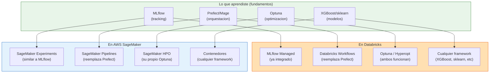

### Entonces... cuando uso cada cosa?

```
 ┌──────────────────────────────────────────────────────────────────┐
 │                                                                  │
 │  "Mi empresa NO tiene plataforma de ML"                         │
 │  → Usa MLflow + Prefect/Mage (lo que aprendiste)               │
 │  → Es gratis, flexible, y lo controlas tu                       │
 │                                                                  │
 │  "Mi empresa tiene Databricks"                                  │
 │  → Usa MLflow de Databricks (mismo codigo, mejor infra)        │
 │  → Usa Databricks Workflows (reemplaza Prefect)                │
 │  → Lo que aprendiste de MLflow aplica directo                   │
 │                                                                  │
 │  "Mi empresa tiene SageMaker"                                   │
 │  → Usa SageMaker Experiments (similar a MLflow)                 │
 │  → Usa SageMaker Pipelines (reemplaza Prefect)                 │
 │  → Los conceptos aplican, la sintaxis cambia un poco           │
 │                                                                  │
 │  "Mi empresa tiene Google Cloud (Vertex AI)"                    │
 │  → Vertex AI Experiments (similar a MLflow)                     │
 │  → Vertex AI Pipelines (basado en Kubeflow)                    │
 │  → Los conceptos aplican, la sintaxis cambia bastante           │
 │                                                                  │
 │  "Mi empresa usa Airflow"                                       │
 │  → Airflow hace la orquestacion (reemplaza Prefect)            │
 │  → MLflow se integra dentro de las tasks de Airflow            │
 │  → Misma idea: el orquestador ejecuta, MLflow registra         │
 │                                                                  │
 └──────────────────────────────────────────────────────────────────┘
```

---

## 8. Hasta Donde Llegan las Alertas y el Monitoreo?

Otra pregunta frecuente: *"Si algo falla en produccion, me entero? Como?"*

### Lo que ya vimos (reintentos)

En el curso aprendimos que Prefect puede reintentar tareas automaticamente:

```python
@task(retries=3, retry_delay_seconds=[10, 30, 60])
def cargar_datos():
    # Si falla, reintenta en 10s, luego 30s, luego 60s
    ...
```

Pero **reintentar no es lo mismo que alertar**. Los reintentos son el primer nivel. Las alertas son el siguiente.

### Los 4 niveles de respuesta ante fallos

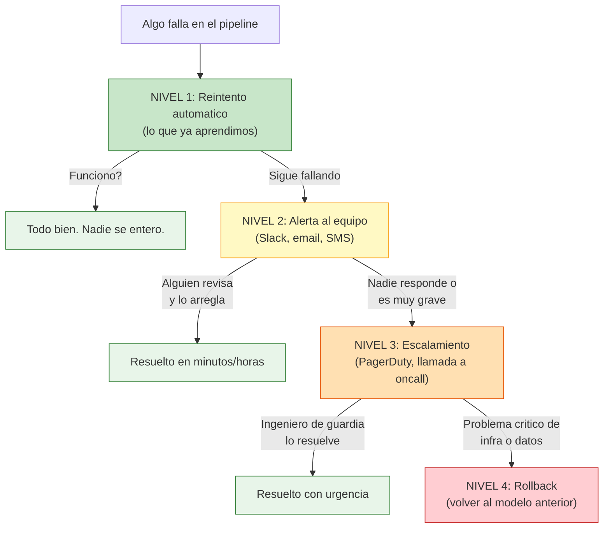

### Como se implementa cada nivel

```
 ┌──────────────────────────────────────────────────────────────────┐
 │  NIVEL 1: REINTENTOS (lo que ya sabemos)                        │
 │                                                                  │
 │  Prefect: @task(retries=3, retry_delay_seconds=30)              │
 │  Mage: Configuracion por bloque                                 │
 │                                                                  │
 │  Util para: errores temporales (red, API lenta, timeout)        │
 │  Limitacion: si el problema es permanente, reintenta en vano    │
 ├──────────────────────────────────────────────────────────────────┤
 │  NIVEL 2: ALERTAS (lo que sigue en produccion)                  │
 │                                                                  │
 │  Prefect Cloud: Notificaciones nativas a Slack, email, webhook  │
 │  Prefect open-source: Automations + webhooks personalizados     │
 │  Mage: Callbacks configurables por pipeline                     │
 │  Databricks: Alertas nativas en Jobs                            │
 │  SageMaker: CloudWatch Alarms                                   │
 │                                                                  │
 │  Ejemplo conceptual en Prefect:                                 │
 │  "Si el flow 'entrenamiento' falla, enviar mensaje a Slack"    │
 │                                                                  │
 │  Util para: el equipo se entera rapidamente                     │
 ├──────────────────────────────────────────────────────────────────┤
 │  NIVEL 3: ESCALAMIENTO (equipos grandes)                        │
 │                                                                  │
 │  PagerDuty, OpsGenie: llaman al telefono del ingeniero on-call  │
 │  Se integra via webhooks desde Prefect o CloudWatch             │
 │                                                                  │
 │  Util para: modelos criticos (fraude, recomendaciones, pricing) │
 ├──────────────────────────────────────────────────────────────────┤
 │  NIVEL 4: ROLLBACK (volver a lo que funcionaba)                 │
 │                                                                  │
 │  MLflow Model Registry: volver al modelo en "Production"        │
 │  "El modelo v5 falla. Vuelvo a usar v4 que estaba bien."       │
 │                                                                  │
 │  Util para: el modelo nuevo es peor que el anterior             │
 └──────────────────────────────────────────────────────────────────┘
```

### Que monitorear en un pipeline de ML

No solo se monitorea si "el pipeline corrio". En produccion real se monitorean varias cosas:

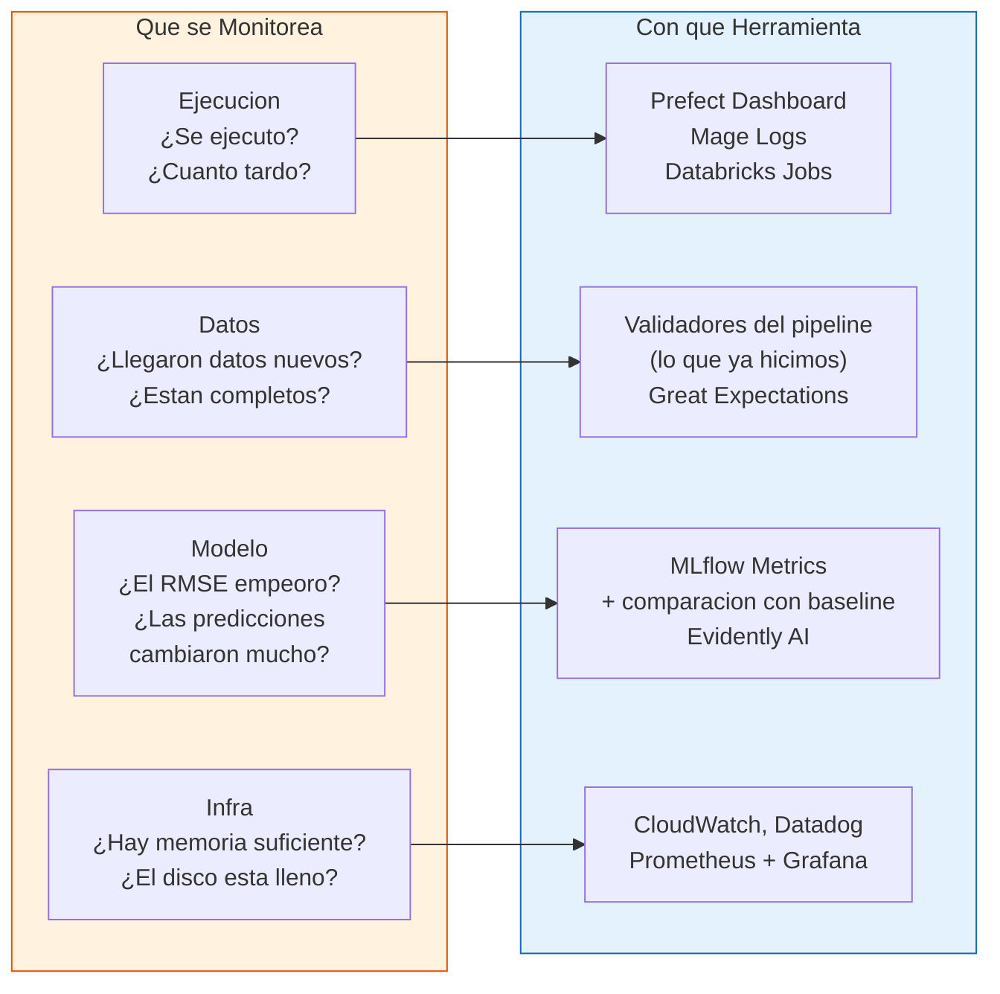

### Analogia: Los 4 tipos de alarma en un edificio

```
 ┌──────────────────────────────────────────────────────────────────┐
 │                                                                  │
 │   Alarma de INCENDIO    = Pipeline fallo (Nivel 1-2)            │
 │   "Suena la sirena, los bomberos se activan automaticamente"    │
 │                                                                  │
 │   Alarma de GAS         = Datos corruptos (Nivel 2)             │
 │   "Algo huele mal, se corta el suministro y se avisa"           │
 │                                                                  │
 │   Alarma de INTRUSION   = Modelo se degrado (Nivel 3)           │
 │   "Alguien entro que no debia: las predicciones cambiaron"      │
 │                                                                  │
 │   Alarma SISMICA        = Infraestructura caida (Nivel 4)       │
 │   "Todo el edificio se mueve: rollback inmediato"               │
 │                                                                  │
 └──────────────────────────────────────────────────────────────────┘
```

---

## 9. Un Dia en la Vida de un Pipeline en Produccion

Para aterrizar todo, veamos como se ve un dia normal (y un dia con problemas) en una empresa que tiene un modelo en produccion.

### Dia normal (todo funciona)

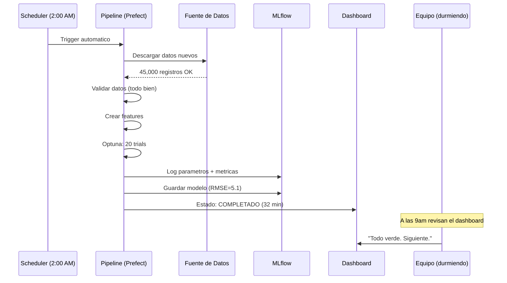

### Dia con problema (la API de datos falla)

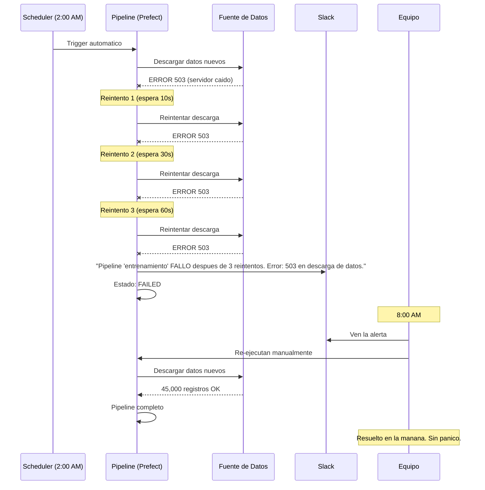

### Dia con problema grave (el modelo se degrada)

```
 ┌──────────────────────────────────────────────────────────────────┐
 │  CRONOLOGIA DE UN MODELO QUE SE DEGRADA                        │
 │                                                                  │
 │  Semana 1:  RMSE = 5.1  (normal)                               │
 │  Semana 2:  RMSE = 5.3  (un poco mas, pero aceptable)          │
 │  Semana 3:  RMSE = 6.8  (ALERTA: empeoro mas del 20%)         │
 │                                                                  │
 │  Que paso? Los datos cambiaron.                                 │
 │  - Subieron los precios de gasolina                             │
 │  - Cambio un patron de trafico por obras en Manhattan           │
 │  - El modelo viejo ya no representa la realidad                 │
 │                                                                  │
 │  Esto se llama DATA DRIFT (deriva de datos)                    │
 │  y es uno de los problemas mas comunes en produccion.           │
 │                                                                  │
 │  Solucion:                                                      │
 │  1. MLflow detecto que RMSE subio (registro historico)          │
 │  2. El pipeline compara RMSE actual vs baseline                 │
 │  3. Si supera un umbral → alerta                                │
 │  4. Reentrenar con datos mas recientes                          │
 │  5. Si el nuevo modelo es peor → rollback al anterior           │
 │                                                                  │
 └──────────────────────────────────────────────────────────────────┘
```

---

## 10. Mapa de Decisiones: Que Herramienta Uso?

### Arbol de decision para elegir herramientas

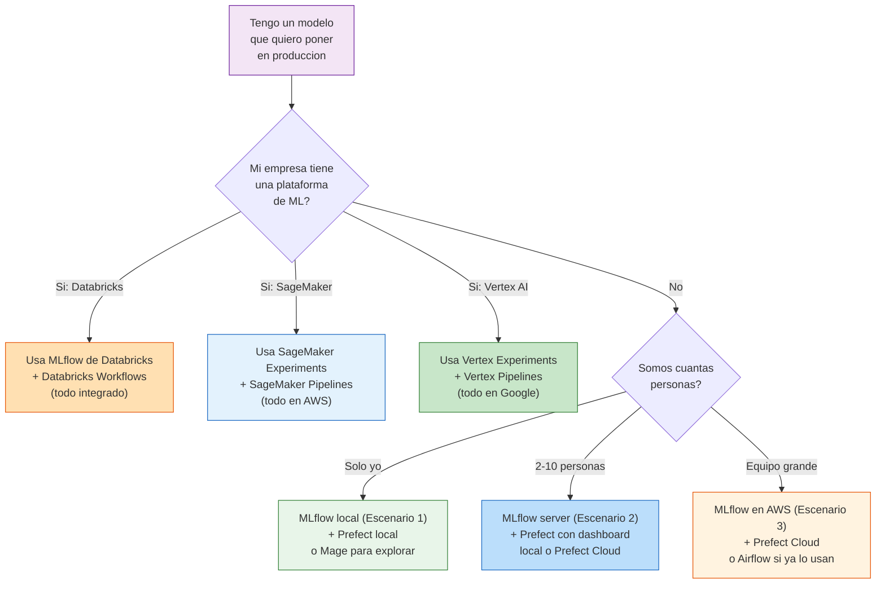

### Resumen: que se transfiere a donde

```
 ┌──────────────────────────────────────────────────────────────────┐
 │              LO QUE APRENDISTE → DONDE SE USA                   │
 │                                                                  │
 │  mlflow.log_param()          →  Funciona en TODAS las platafor- │
 │  mlflow.log_metric()            mas. MLflow es open-source y    │
 │  mlflow.log_model()             universal.                      │
 │                                                                  │
 │  @flow, @task                →  Conceptos identicos en          │
 │  (Prefect)                      Databricks Workflows,           │
 │                                 SageMaker Pipelines,            │
 │                                 Airflow DAGs, Mage blocks.      │
 │                                 Cambia la SINTAXIS, no la IDEA. │
 │                                                                  │
 │  Optuna trials               →  Funciona en cualquier lugar.    │
 │  + MLflow nested runs           Databricks tiene Hyperopt       │
 │                                 (similar), SageMaker tiene HPO. │
 │                                                                  │
 │  Reintentos, caching,        →  Todos los orquestadores los     │
 │  scheduling                     tienen. Es el ABC.              │
 │                                                                  │
 │  Model Registry              →  MLflow Registry, Unity Catalog  │
 │  (staging → production)         (Databricks), SM Model Registry. │
 │                                 El concepto es IDENTICO.         │
 │                                                                  │
 └──────────────────────────────────────────────────────────────────┘
```

### Mapa mental de cierre

```
                            MLOps en Produccion
                                   │
                 ┌─────────────────┼─────────────────┐
                 │                 │                 │
            TRACKING          ORQUESTACION       MONITOREO
            (Modulo 02)       (Modulo 03)        (siguiente paso)
                 │                 │                 │
           ┌─────┴─────┐   ┌─────┴─────┐    ┌─────┴─────┐
           │           │   │           │    │           │
        MLflow     Model  Prefect    Mage  Alertas   Data
        Tracking   Registry  Mage    Airflow  (Slack)  Drift
           │           │   │           │    │           │
           │     ┌─────┘   └─────┐     │    │     ┌────┘
           │     │               │     │    │     │
           └─────┴───────────────┴─────┘    └─────┘
                         │                      │
                    En cualquier                 │
                    plataforma:            Herramientas:
                    Databricks             Evidently AI
                    SageMaker              Great Expectations
                    Vertex AI              Prometheus
                    Self-hosted            CloudWatch
```

---

## Tarjeta de Referencia Final

```
 ┌──────────────────────────────────────────────────────────────────┐
 │           PREGUNTAS FRECUENTES - RESPUESTA RAPIDA               │
 │                                                                  │
 │  "Para que un orquestador si puedo usar cron?"                  │
 │  → Cron ejecuta. El orquestador ejecuta + vigila + reintenta   │
 │    + alerta + registra. En produccion, necesitas todo eso.      │
 │                                                                  │
 │  "Si tengo Databricks, necesito Prefect?"                       │
 │  → No. Databricks Workflows reemplaza a Prefect.               │
 │    Pero los conceptos que aprendiste son los mismos.            │
 │                                                                  │
 │  "Si tengo Databricks, necesito MLflow?"                        │
 │  → Databricks USA MLflow internamente. Tu codigo es identico.  │
 │                                                                  │
 │  "Me avisa si algo falla?"                                      │
 │  → Nivel 1: Reintenta solo. Nivel 2: Alerta (Slack/email).    │
 │    Nivel 3: Escala (PagerDuty). Nivel 4: Rollback.             │
 │                                                                  │
 │  "Y si el modelo empeora con el tiempo?"                        │
 │  → Eso se llama data drift. Se detecta comparando metricas     │
 │    historicas en MLflow. Herramientas: Evidently AI.            │
 │                                                                  │
 │  "Lo que aprendi sirve en el mundo real?"                       │
 │  → Si. MLflow es el estandar de la industria. Los conceptos    │
 │    de orquestacion son universales. Solo cambia la sintaxis     │
 │    segun la plataforma que use tu empresa.                      │
 │                                                                  │
 └──────────────────────────────────────────────────────────────────┘
```

---

> **Guias relacionadas:**
> - [Guia paso a paso de Mage](GUIA_MAGE_PASO_A_PASO.md) - para armar tu primer pipeline visual
> - [Guia de clase de Orquestacion](GUIA_CLASE_ORQUESTACION.md) - guia del instructor para la clase de Prefect

---

> **Nota para el instructor:** Los diagramas Mermaid se renderizan automaticamente en GitHub, VS Code (con extension Markdown Preview Mermaid), y en la mayoria de herramientas de documentacion. Los diagramas de texto (ASCII art) se ven bien en cualquier editor.
