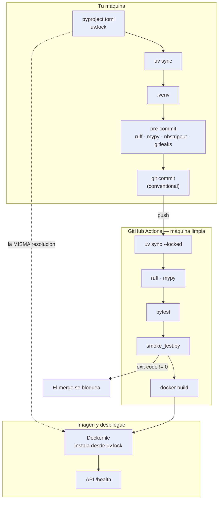

# Guion de clase — Sesión 1: Reproducibilidad y disciplina de ingeniería

Guion minutado para las **4 horas** del formato de sesión del curso. Cada bloque indica
qué archivo abrir, qué comando correr y qué salida esperar.

**Duración total:** 240 min (4 h), con pausa de 15 min.
**Terminales:** 1 (2 desde el bloque 7, para comparar `hook` y CI).
**Directorio base:** la **raíz del repositorio**. Todos los comandos se corren desde ahí.
**Material del estudiante:** [`sesiones/s01-reproducibilidad/`](../sesiones/s01-reproducibilidad/).

| Tramo | Min | Bloques |
|---|---|---|
| Arranque | 0-15 | 1 |
| El dolor | 15-40 | 2 |
| Bloque A — el entorno | 40-95 | 3, 4, 5 |
| Pausa | 95-110 | — |
| Bloque B — git, LFS y calidad | 110-165 | 6, 7, 8 |
| Taller | 165-220 | 9 |
| Cierre | 220-240 | 10 |

> **Sobre los tiempos de ejecución:** este guion **no** promete duraciones de comando.
> Depende de la máquina, del caché de `uv` y de la red del aula. Donde importa, el
> guion dice *mide y compara*, y el número lo produce la clase. Una cifra inventada te
> deja desmentido en vivo, que es la peor forma de perder autoridad en la sesión que
> trata sobre no inventarse cosas.

> **Particularidad de esta sesión:** es la primera, así que **no hay tarea previa de un
> estudiante ni revisión del CI de talleres entregados**. Ese ritual empieza en S02.
> El arranque de hoy es encuadre. Dilo en voz alta, para que quede claro que a partir
> de la semana que viene alguien va a tener que explicar la sesión anterior.

---

## Mapa de archivos

```
sesiones/s01-reproducibilidad/
├── README.md                                 Bloques 1, 10
├── entorno.md                                Bloques 3, 4, 5
├── git.md                                    Bloques 6, 7
├── calidad.md                                Bloque 8
├── troubleshooting-so.md                     Bloque 3.3 y consulta permanente
├── taller.md                                 Bloque 9
├── notebooks/
│   ├── 01-del-notebook-al-paquete.ipynb      Bloque 2
│   └── _generar_notebooks.py                 (fuente del notebook)
├── templates/                                Bloque 9
├── scripts/                                  Bloque 3.3
└── _soluciones/                              NO publicar antes del taller
    ├── solucion-taller.md
    └── adr-000-stack.md

Se usa de la raíz:
Makefile                                      Bloques 3, 4, 8
scripts/smoke_test.py                         Bloque 5
pyproject.toml                                Bloques 4, 8
.pre-commit-config.yaml                       Bloque 8
.github/workflows/ci.yml                      Bloque 8
.devcontainer/                                Bloque 1.4 (plan B) y 3.3
docs/adr/001-caso-guia-y-particiones.md       Bloques 2, 10
```

---

## Antes de clase — checklist

Ver el [Anexo B](#anexo-b--checklist-antes-de-clase). Hazlo el día antes, no la
misma mañana: dos de los puntos requieren red.

---

## BLOQUE 1 — Arranque y encuadre (0-15 min)

**Archivos:** `sesiones/s01-reproducibilidad/README.md`, `proyecto/README.md`.
**Terminales:** 0.

### 1.1 El curso en una frase (4 min)

Ocho sesiones, un solo sistema que crece. No son ocho temas: es **un** repositorio al
que cada sesión le añade una capa. Mostrar el `Makefile` en pantalla y leer los
`targets` de arriba abajo: `setup`, `smoke`, `data`, `train`, `promote`, `serve`,
`drift`. "Al final de la sesión 8, todos esos comandos van a existir en el
repositorio de cada uno de ustedes."

### 1.2 El caso guía (4 min)

NYC Green Taxi, particiones **fijas**: train 2023-01..03, valid 2023-04, holdout
2023-05, producción 2023-07 y 2024-01. Abrir
[`docs/adr/001-caso-guia-y-particiones.md`](../docs/adr/001-caso-guia-y-particiones.md)
y mostrar **solo la tabla del contexto**: cada módulo del curso anterior usaba un
`dataset` distinto, o el mismo con features incompatibles.

La frase: "No van a aprender de taxis. Van a poder comparar el número de la sesión 3
con el de la sesión 7, que es lo que hace que MLOps signifique algo."

### 1.3 El proyecto del curso (4 min)

[`proyecto/README.md`](../proyecto/README.md): el proyecto en grupo es el 100 %
de la nota del curso, con dominio libre. Los talleres de cada sesión son
opcionales y suman un bonus de hasta 1.0 sobre la nota final. Conviene decir las
dos cosas hoy, en la primera clase, para que nadie se lleve sorpresas. Y la
elección del `dataset` empieza ya: es lo primero que traba a los grupos.

Recomendación explícita: **no usar el caso guía en el proyecto**. El repositorio ya lo
resuelve, así que copiar es trivial y aprender es cero.

### 1.4 El plan B, antes de necesitarlo (3 min)

Esto se dice **ahora**, no cuando alguien esté atascado:

> "Si a mitad del bloque A tu máquina no colabora y llevas más de 10 minutos, no
> pelees. Abre el `devcontainer` y sigues la clase desde ahí."

Enseñar en pantalla: *Code → Codespaces → Create codespace*. Dejar el enlace al
[`.devcontainer/README.md`](../.devcontainer/README.md) en el chat del aula. Que la
opción exista y esté anunciada evita que tres personas se descuelguen en silencio.

---

## BLOQUE 2 — El dolor (15-40 min)

**Archivo:** `notebooks/01-del-notebook-al-paquete.ipynb`. **Terminales:** 1 + notebook.

No se abre `uv` en este bloque. Ni se menciona. Tres actos.

### Acto 1 — El notebook que da tres respuestas (12 min)

Abrir el notebook y **detenerse en la celda de markdown del estado 1**, que pide
encontrar cuatro problemas antes de ejecutar nada. Dar 90 segundos reales de
silencio. Que los busquen.

Los cuatro, para cuando salgan (o no salgan):

1. `!pip install pandas==1.5.3` en la celda 12;
2. el límite de duración válida escrito a mano, con **dos valores distintos** en dos
   celdas;
3. una celda que depende del estado del kernel dejado por otra;
4. el resultado en una global que las celdas siguientes sobrescriben.

Ahora **ejecutar en desorden**: primero la celda C, luego la B, luego la C otra vez.

**Salida esperada:** dos medias distintas, `13.7476` y `13.996` con los datos de
2023-01. (Verifícalo antes de clase; si tu muestra difiere, usa tus números.) Ningún
error en pantalla.

**La pregunta:** "¿Cuál de los dos es el número correcto?" Dejar que discutan. La
respuesta que se busca: **la pregunta está mal planteada.** El notebook no tiene un
número, tiene un rango que depende del orden en que le dieron a Shift+Enter.

Cerrar el acto con `Kernel → Restart & Run All` y la pregunta incómoda:

> "¿Cuántos de los notebooks que tienen ahora mismo en el disco pasarían esa prueba?"

### Acto 2 — El notebook que no ejecuta en ninguna máquina (6 min)

Este acto usa el material **anterior** de este curso, que está en el historial de git.
El notebook `01-panorama-mlops.ipynb` tenía, en su cuarta celda:

```python
from generate_data import UserGenerator
```

`generate_data.py` **no existe en el repositorio**. Nunca se commiteó.

```bash
git log --oneline --diff-filter=D -- sesiones/s01-reproducibilidad/notebooks/
```

**Qué preguntar:** "Este notebook estuvo publicado como material de la sesión 1 de un
curso de posgrado. ¿Por qué nadie lo notó?" La respuesta que se busca: porque
funcionaba en la máquina de quien lo escribió, donde el archivo sí estaba, y **nada
lo comprobaba automáticamente**. Es el mismo mecanismo que la ruta absoluta en el
`prefect.yaml` y que el `.env` no commiteado.

Segundo golpe, en la misma línea: ese notebook pesaba **175 KB** para 33 celdas, de
los cuales ~82 KB eran **una** imagen en base64 en el campo `attachments` de una celda
de markdown, y sus `outputs` contenían la ruta absoluta del disco de la autora
original. Eso es lo que arregla `nbstripout` en el bloque 8.

Y el tercero, que es el que más duele: su `target` se asignaba **al azar**. El
notebook enseñaba a leer un `classification_report` de un modelo con ROC-AUC ~0.5.

### Acto 3 — Los tres estados, y el mismo número (7 min)

Recorrer los estados 2 y 3 del notebook. Lo único que hay que sacar:

- **el número coincide** (estado 1 celda B, estado 2 y estado 3);
- lo que cambia es **quién puede volver a obtenerlo**.

Escribir en la pizarra, y que se quede las cuatro horas:

> **La reproducibilidad no es una propiedad del resultado. Es una propiedad del
> proceso.**

Detenerse 60 segundos en la última celda, que da un número **distinto** (`13.7387`
frente a `13.7476`) porque `preparar_particion` además muestrea y filtra por
distancia. Preguntar si eso rompe la reproducibilidad. (No: la muestra es
determinista, con semilla declarada. La diferencia con el estado 1 es que aquí **sabes
qué transformaciones se aplicaron y en qué orden**.)

Y la matización que evita que se lleven la lección equivocada: los notebooks no son
el enemigo. **El notebook explora, el paquete decide.**

---

## BLOQUE 3 — Instalar `uv` y reconstruir el entorno (40-60 min)

**Archivos:** `entorno.md` sección 1, sección 4; `troubleshooting-so.md`. **Terminales:** 1.

### 3.1 Las tres preguntas del entorno (5 min)

`entorno.md` sección 1, la tabla de tres filas. Insistir en que son **preguntas distintas** y
que hacen falta las tres:

- ¿qué intérprete? → `.python-version` + `requires-python`
- ¿qué dependencias directas, y con qué margen? → `pyproject.toml`
- ¿qué versión exacta de cada paquete, directo o transitivo? → `uv.lock`

### 3.2 El `Quick Start`, en vivo (5 min)

Correr en pantalla, desde un clon limpio si puedes:

```bash
make setup
```

**Mide y compara**: apunta cuánto tardó en tu máquina y pregunta en el aula qué
tardó en las suyas. La dispersión es el dato interesante, no la media.

### 3.3 Los cuatro fallos de Windows (10 min)

**Este es el bloque que salva la clase**, porque la mayoría del grupo está en Windows.
Recorrer `troubleshooting-so.md` sección 2, sección 3, sección 4 y sección 6 en pantalla, en este orden:

1. **`ExecutionPolicy`** (sección 2). La política por defecto es `Restricted` y bloquea
   *todo* `.ps1`, incluido `Activate.ps1`. El remedio va en el **paso 1**:
   `Set-ExecutionPolicy -Scope CurrentUser -ExecutionPolicy RemoteSigned`.
   Decir en voz alta por qué `CurrentUser` y no `LocalMachine` (no necesita
   administrador), y por qué `RemoteSigned` y no `Bypass`.
   *Qué se corrigió:* en el material anterior este remedio estaba en el documento
   nº 7, y el script de setup se ofrecía en el nº 0.
2. **El punto inicial** (sección 3). El material anterior escribía
   `` `\.venv\Scripts\Activate.ps1` ``, **sin el punto**. Eso apunta a la raíz del
   disco. Escribirlo mal en pantalla, ver el error, y arreglarlo. Vale más que
   explicarlo.
3. **`chmod +x ./script.sh`** (sección 4). No funciona en Windows y no es que falte
   configurar algo: `chmod` es POSIX y el bit de ejecución no existe en NTFS. Tres
   salidas: el `.ps1`, Git Bash, o WSL declarado explícitamente.
4. **`make` no existe en Windows** (sección 6). `devcontainer`,
   `winget install ezwinports.make`, o los comandos a mano.

Y decir la recomendación de fondo: **`uv python install 3.11`, no `pyenv-win`.** No
porque `pyenv` sea malo, sino porque su instalación en Windows son cuatro puntos de
fallo antes de tener un intérprete.

---

## BLOQUE 4 — `pyproject.toml` vs `uv.lock`, y el experimento (60-85 min)

**Archivos:** `entorno.md` sección 2, sección 3; `pyproject.toml`; `uv.lock`. **Terminales:** 1.

### 4.1 Intención frente a hecho (8 min)

El diagrama de `entorno.md` sección 2 en pantalla, y luego los números reales del
repositorio:

```bash
grep -A4 '^dependencies' pyproject.toml | head -6
grep -c '^\[\[package\]\]' uv.lock
uv run python -c "import pandas; print(pandas.__version__)"
```

**Mide y compara** el segundo número con el número de dependencias declaradas. El
delta es la superficie de riesgo real, y es lo que el `lockfile` fija.

La pregunta de comprensión: "¿Por qué se commitean los dos, si el `lock` ya contiene
todo?" (Porque responden preguntas distintas: el `lock` dice *qué se instaló*, el
`pyproject` dice *qué margen aceptas*, que es lo que se usa para decidir si un
`upgrade` es legítimo.)

### 4.2 EL EXPERIMENTO (12 min)

**El bloque central del bloque A.** `entorno.md` sección 3. Correrlo en vivo, en `/tmp`, no
en el repo del curso:

```bash
cd /tmp && rm -rf demo-uv && mkdir demo-uv && cd demo-uv
uv init --no-workspace
uv add rich                # (a) declarado
uv pip install tabulate    # (b) NO declarado
uv run python -c "import rich, tabulate; print('ambos importan')"
```

**Preguntar ANTES de la siguiente parte:** "Voy a borrar `.venv` y correr `uv sync`.
¿Qué va a pasar con cada uno de los dos paquetes?" Que voten a mano alzada.

```bash
rm -rf .venv && uv sync
uv run python -c "
import importlib
for m in ('rich', 'tabulate'):
    try:
        importlib.import_module(m); print(m, 'OK')
    except ImportError:
        print(m, 'DESAPARECIO')
"
```

**Salida esperada** (verificada con `uv 0.8.17`, agosto de 2026):

```
rich OK
tabulate DESAPARECIO
```

Segundo acto, y este sí sorprende a todos, **sin borrar nada**:

```bash
uv pip install tabulate
uv sync
uv run python -c "
try:
    import tabulate; print('tabulate SIGUE')
except ImportError:
    print('tabulate ELIMINADO por uv sync')
"
```

**Salida esperada:** `tabulate ELIMINADO por uv sync`.

La lección: `uv sync` no es "instalar lo que falta". Es **hacer que el entorno sea
exactamente el `lockfile`**, lo que incluye quitar lo que sobra. Es una virtud
—hace que "mi entorno" y "el entorno" signifiquen lo mismo— pero hay que decirlo
antes de que a alguien le desaparezca un paquete en medio de un taller.

### 4.3 El comando que no existe (5 min)

```bash
uv update pandas
```

**Salida esperada:** `error: unrecognized subcommand 'update'`.

Y el remate: **el material anterior de este curso lo documentaba dos veces**,
incluida su tabla resumen de comandos.

**La pregunta que hay que hacer:** "Ese documento no tenía fecha ni versión. ¿Cómo
habrían sabido que el comando era inventado, sin ejecutarlo?" Respuesta que se busca:
no se puede. De ahí la regla del curso: **toda tabla de herramientas declara criterio,
fecha de evaluación y un enlace a la doc oficial por fila.** Mostrar la tabla del
[README sección 7](../sesiones/s01-reproducibilidad/README.md#7-alternativas-y-trade-offs)
como el formato que se les va a pedir en su ADR.

Lo correcto: `uv lock --upgrade-package pandas && uv sync`.

---

## BLOQUE 5 — `make smoke` y alternativas honestas (85-95 min)

**Archivos:** `scripts/smoke_test.py`; `entorno.md` sección 6, sección 8. **Terminales:** 1.

### 5.1 Un diagnóstico que puede fallar (6 min)

```bash
make smoke
```

Recorrer la salida línea a línea y señalar la distinción **`WARN` vs `FAIL`**:

- Docker ausente → `WARN`. No se necesita hasta S05.
- Punteros de LFS sin resolver → **`FAIL`**. Rompe la S04.

Abrir el encabezado del script y leerlo en voz alta:

```
# Por que existe: la auditoria del repositorio encontro que la unica verificacion
# de entorno era `python -V; uv --version`, que no prueba nada de lo que
# realmente falla.
```

Y el detalle que lo convierte en ingeniería: **exit code**. Por eso el mismo script
es un `job` del CI.

Mostrar, sin detenerse mucho, la parte que valida el contrato de datos con un
`dataframe` sintético **y comprueba que rechaza uno roto**. Es el puente literal a la
sesión 2: "un contrato que nunca falla no protege nada".

### 5.2 Alternativas, sin dogma (4 min)

README sección 7, la tabla. Los tres puntos que hay que decir, en este orden:

1. **Poetry no es legado.** 2.4.1, mayo de 2026, activo y mantenido. Si en su empresa
   hay Poetry funcionando, migrar por migrar es una mala decisión.
2. **conda sigue ganando** en lo que `uv` no hace: dependencias que **no** son
   Python. CUDA, GDAL, compiladores, R en el mismo entorno. No ha desaparecido.
3. **`pip freeze` no es un `lockfile`.** Sin hashes, sin distinguir directas de
   transitivas, y específico de la plataforma que lo generó.

Cerrar con lo que se les va a pedir: el taller acepta cualquiera de las cinco
herramientas de la tabla. Lo que se evalúa es la **propiedad** —reproducibilidad
demostrada— no la marca.

---

## PAUSA (95-110 min)

Aprovecha para pasar por las máquinas que no lograron `make smoke` en verde. Los que
sigan atascados, al `devcontainer`.

---

## BLOQUE 6 — Git y `conventional commits` (110-130 min)

**Archivos:** `git.md` sección 1, sección 2, sección 3. **Terminales:** 1.

### 6.1 SSH en tres comandos (5 min)

`git.md` sección 1. Correrlo si hay alguien que no lo tenga; si todos lo tienen, mostrarlo y
seguir. La idea que hay que dejar: clave privada se queda, clave pública se registra.

Mencionar la firma de commits con la **misma clave SSH** (`gpg.format ssh`), que es
más simple que montar GPG, y la trampa: en GitHub hay que registrar la clave **dos
veces**, una como *Authentication Key* y otra como *Signing Key*.

### 6.2 El flujo diario (5 min)

`git.md` sección 2. Una rama por entrega, un PR por entrega. Vale la pena vender el PR
como formato de trabajo tambien para el proyecto: "un zip produce una nota; un PR
produce comentarios en las líneas de código."

Sobre `rebase` vs `merge`: explicar la regla que lo hace seguro (*nunca reescribas una
rama que otra persona ya tiene*) y decir en voz alta que **`merge origin/main` no baja
la nota**. Lo que importa es que el PR esté actualizado y el CI verde.

### 6.3 `conventional commits`, con el `hook` de verdad (10 min)

Esto no se explica: se demuestra. Intentar un commit malo:

```bash
git commit --allow-empty -m "arreglos varios"
```

**Salida esperada:** el `hook` de `commit-msg` rechaza el mensaje y el commit no se
hace.

```bash
git commit --allow-empty -m "chore: demostrar el hook de commit-msg"
```

Y ahora sí pasa. Luego deshacerlo: `git reset --hard HEAD~1`.

Recorrer la tabla de los once tipos de `git.md` sección 3 —son exactamente los que acepta
[`.pre-commit-config.yaml`](../.pre-commit-config.yaml)— y la tabla de errores
frecuentes. El caso `!` / `BREAKING CHANGE` merece 60 segundos, porque en la sesión 5
van a cambiar el nombre de un campo de la API.

---

## BLOQUE 7 — Git LFS, **antes** del binario (130-145 min)

**Archivos:** `git.md` sección 5. **Terminales:** 1-2.

### 7.1 El problema, con los diagramas del curso (5 min)

```bash
git lfs ls-files
ls -la sesiones/s04-orquestacion/diagrams/ | head
```

Y ahora la demostración que se recuerda: abrir uno de los `.png` **con un editor de
texto**.

```bash
head -3 sesiones/s04-orquestacion/diagrams/01_el_problema.png
```

Si LFS está resuelto, sale basura binaria. Si no, sale:

```
version https://git-lfs.github.com/spec/v1
oid sha256:...
size ...
```

**Este es exactamente lo que veía cualquiera que clonara el repositorio anterior**,
donde LFS era el documento nº 10 de 13. Los 12 diagramas de la sesión 4, roros.

### 7.2 El orden, que es el punto (7 min)

`git.md` sección 5. Los cuatro pasos, y el énfasis en el 3:

```bash
git lfs install
git lfs track "*.png"
git add .gitattributes && git commit -m "chore: track png with git lfs"   # PRIMERO
git add diagrams/mi-diagrama.png && git commit -m "docs: add diagram"     # DESPUES
```

**La pregunta:** "Si lo hago al revés —primero el `.png`, después el
`.gitattributes`—, ¿lo arreglo con `git lfs pull`?"

Respuesta: **no.** `git lfs pull` trae objetos LFS, y ese archivo nunca fue un objeto
LFS: entró al historial como `blob` normal y ahí sigue. Para sacarlo hay que
reescribir el historial (`git lfs migrate import`) y forzar el `push`, lo que rompe
todos los clones existentes.

**La frase del bloque:** "Un binario mal versionado no se arregla después. Se
reescribe el historial, y eso rompe el repositorio de todo el mundo."

### 7.3 LFS **no** es versionado de datos (3 min)

Corrección de un error conceptual muy común. LFS resuelve **el tamaño del blob en
Git**. No da `diff` de tablas, ni `time travel`, ni ramas de datos, ni `lineage`. Para
eso están DVC, lakeFS y Delta/Iceberg, y **eso es la sesión 2**.

Puente explícito:
[`sesiones/s02-datos/versionado-de-datos.md`](../sesiones/s02-datos/versionado-de-datos.md).

---

## BLOQUE 8 — Calidad automática y CI (145-165 min)

**Archivos:** `calidad.md`; `pyproject.toml`; `.pre-commit-config.yaml`;
`.github/workflows/ci.yml`. **Terminales:** 2.

### 8.1 La regla (2 min)

En la pizarra, y no se borra:

> **El `hook` local y el CI ejecutan exactamente lo mismo.**

Y la cadena de consecuencias si divergen: el `hook` aprueba lo que el CI rechaza → la
gente descubre `--no-verify` → el `hook` deja de existir → el CI es donde te enteras
quince minutos tarde.

```bash
make check     # lint + typecheck + test-fast. Lo mismo que el CI
```

### 8.2 Ruff, y el argumento sobre Black (6 min)

```bash
uv run ruff check .
uv run ruff format --check --diff .
```

Abrir `[tool.ruff.lint]` en `pyproject.toml` y detenerse en **`B` (bugbear)**: no
comprueba estilo, comprueba **bugs**. Ejemplo en vivo, `B006`:

```bash
cat > /tmp/malo.py <<'EOF'
def acumular(x, xs=[]):
    xs.append(x)
    return xs
EOF
uv run ruff check /tmp/malo.py
```

Preguntar qué devuelve `acumular(1)` la segunda vez que se llama. (`[1, 1]`. En un
`pipeline` de datos, eso es un bug que aparece en la segunda partición.)

Y ahora **el argumento sobre Black**, que hay que dar con la cita textual y no con una
opinión:

> "While the formatter is designed to be a drop-in replacement for Black, it is not
> intended to be used interchangeably with Black on an ongoing basis, as the formatter
> *does* differ from Black in a few conscious ways."
> — [docs.astral.sh/ruff/formatter](https://docs.astral.sh/ruff/formatter/)

El escenario, contado como historia: tú guardas con `ruff format`, tu compañero tiene
la extensión "Black Formatter" con `formatOnSave`, cada `push` reformatea archivos que
nadie tocó, el diff del PR tiene cientos de líneas de ruido, y el CI está rojo **para
los dos**.

**Matiz que hay que dar, o se llevan la lección equivocada:** Black no es malo y sigue
mantenido. Lo que no se puede es tener los dos. Uno por repositorio, y escrito.

### 8.3 `mypy`, y lo que **no** hace (4 min)

```bash
uv run mypy
```

Mostrar el alcance en `pyproject.toml`: `files = ["src/taxi", "scripts"]`, con
`disallow_untyped_defs = true` ahí y `false` en tests y sesiones. Explicar la decisión:
tipar el 100 % de un repositorio de ML con `pandas` y `mlflow` sin `stubs` completos es
una batalla perdida.

**Y lo importante, que es el puente a S02:** `mypy` **no** valida el contenido de un
`DataFrame`. Que `df` sea `pd.DataFrame` no dice nada de sus columnas, sus unidades ni
sus rangos.

**La pregunta:** "`mypy` está en verde y mi `pipeline` entrena con `trip_distance` en
kilómetros. ¿Por qué no lo detectó? ¿Qué lo detectaría?" Dejar la pregunta abierta: se
responde la semana que viene.

### 8.4 `pre-commit` y `nbstripout` (4 min)

```bash
uv run pre-commit run --all-files
```

Recorrer la tabla de grupos de `calidad.md` sección 5 y detenerse en los **tres `hooks`
propios**, porque cada uno codifica un bug con nombre:

- `sin-rutas-absolutas`: el `prefect.yaml` con `set_working_directory` apuntando al
  disco de quien lo escribió. `prefect deploy --all` fallaba en cualquier otra
  máquina.
- `mlflow-sin-stages`: coherencia con el
  [ADR 002](../docs/adr/002-aliases-en-vez-de-stages.md).
- `mypy-src`.

Y `nbstripout`, con la medición en pantalla:

```bash
uv run python -c "
import nbformat, pathlib
p = pathlib.Path('sesiones/s02-datos/notebooks/02-validacion-temporal-y-leakage.ipynb')
nb = nbformat.read(p, as_version=4)
print('KB:', p.stat().st_size // 1024, '| celdas:', len(nb.cells))
print('con outputs:', sum(1 for c in nb.cells if c.get('outputs')))
print('con attachments:', sum(1 for c in nb.cells if 'attachments' in c))
"
```

**Salida esperada:** cero y cero. Contrastar con el notebook eliminado: 175 KB,
~82 KB de una sola imagen en base64.

Y la consecuencia práctica que hay que decir: **el notebook que commiteas no lleva
resultados.** Si un resultado importa, va en markdown o en `reports/`.

### 8.5 El CI, y el anti-patrón más caro del repositorio (4 min)

Abrir [`.github/workflows/ci.yml`](../.github/workflows/ci.yml) y leer su encabezado
en voz alta:

```
# El CI anterior terminaba en:
#     uv run pytest -q || echo "No tests configured yet"
# Un pipeline que no puede fallar es peor que no tener pipeline: produce
# confianza injustificada.
```

Y el dato: el repositorio estaba **rojo** —50 errores de `ruff`, 67 archivos sin
formatear— y nadie lo notaba, porque el paso de tests nunca fallaba.

**La frase:** "Un `step` que no puede fallar no es una comprobación, es decoración."

Recorrer los cinco `jobs` (tabla de `calidad.md` sección 6) y señalar dos decisiones:

- **Windows en la matriz de `tests`.** A propósito: cuatro de los fallos de esta
  sesión eran específicos de Windows y ninguno se detectaba.
- **`checkout` con `lfs: true` solo en el `job` `smoke`.** Ahí sí interesa verificar
  que los punteros se resuelven; en los demás sería gastar cuota.

Cerrar con lo que le da autoridad al CI: *Settings → Branches*, `checks` requeridos.
**Un CI que no bloquea el `merge` es una opinión.**

---

## BLOQUE 9 — Taller (165-220 min)

**Archivo:** [`sesiones/s01-reproducibilidad/taller.md`](../sesiones/s01-reproducibilidad/taller.md)

Los estudiantes trabajan **en su propio repositorio**. El instructor circula. Se
entrega en clase.

**Al empezar, decir en voz alta:**

1. **No alcanza para los nueve puntos.** Prioridad: paquete + `lock` + `Makefile`
   (puntos 1-3) es lo imprescindible; `smoke`, `hooks` y CI (4, 5, 8) si da tiempo;
   LFS, tests y ADR (6, 7, 9) como tarea.
2. **Abran el PR al final de la clase aunque esté incompleto**, con la descripción
   diciendo qué falta. Un PR incompleto y declarado se revisa.
3. **El criterio 2 tiene dos mitades.** Que `make smoke` salga OK no vale nada sin la
   otra: que **falle** cuando el entorno esté roto.
4. **El criterio 7 se cae por la misma cosa siempre:** el ADR sin ninguna consecuencia
   negativa. Si no encuentran ninguna, no han entendido la decisión.
5. Pueden partir de
   [`proyecto/starter-template/`](../proyecto/starter-template/), que ya tiene la
   forma.

Quien acabe antes: los cinco extras de la sección "Si acabas antes" del enunciado. El
más útil de los cinco es añadir `windows-latest` a la matriz y arreglar lo que se
rompa.

**No publicar `_soluciones/` antes del taller.** En particular el
[ADR de ejemplo](../sesiones/s01-reproducibilidad/_soluciones/adr-000-stack.md), que
desactiva por completo el punto 9.

### Errores que van a aparecer, con su causa

| Síntoma | Causa habitual |
|---|---|
| `ModuleNotFoundError: miproyecto` en CI y en local funciona | falta declarar el paquete en el `backend` de build (`[tool.hatch.build.targets.wheel]`), o no se usó `src/` layout |
| `The lockfile is not up to date` | se commiteó `pyproject.toml` sin `uv.lock` |
| El CI sale verde con los tests rotos | `continue-on-error`, `\|\| true` o `\|\| echo` heredados de un tutorial |
| `pre-commit` "no hace nada" | falta `pre-commit install`, o se commitea con `--no-verify` |
| El PR tiene 300 líneas de reformateo | dos formatters: Black en el editor y `ruff format` en el `hook` |
| `make: command not found` | Windows. `troubleshooting-so.md` sección 6 |
| `uv sync` borró un paquete | se instaló con `uv pip install`; nunca se declaró |
| `smoke_test.py` verde con el entorno roto | usa `pip list` en lugar de `import`, o no llama a `sys.exit(1)` |
| `UnauthorizedAccess` al correr cualquier `.ps1` | `ExecutionPolicy`. `troubleshooting-so.md` sección 2 |
| `Activate.ps1` "no existe" | falta el `.\` inicial. `troubleshooting-so.md` sección 3 |

---

## BLOQUE 10 — Cierre (220-240 min)

### 10.1 Autoverificación (7 min)

Las cinco preguntas del
[README sección 6](../sesiones/s01-reproducibilidad/README.md#6-autoverificación), en voz
alta y por sorteo. Las dos que más discusión dan:

- la nº 2 (`--locked` en CI): la trampa es que la respuesta fácil —quitar
  `--locked`— **oculta** la única comprobación que avisaba del problema;
- la nº 3 (LFS después del commit): la respuesta correcta es "no se arregla con
  `git lfs pull`".

### 10.2 Alternativas y qué NO usar (5 min)

README sección 7 y sección 8. Leer en voz alta los que más daño hacen:

- `uv update` (no existe);
- `\.venv\Scripts\Activate.ps1` sin el punto;
- `pyenv-win` por `Invoke-WebRequest` como ruta por defecto;
- `chmod +x` en Windows;
- Black **y** `ruff format` a la vez;
- `pip freeze` como estrategia de reproducibilidad;
- `git commit --no-verify` como hábito;
- notebooks con `outputs`;
- `python -V; uv --version` como verificación de entorno.

Y el meta-mensaje, que es el que sostiene todo el curso: **cada tabla comparativa de
este material lleva criterio, fecha de evaluación y un enlace a la doc oficial por
fila.** Las del material anterior no, y por eso documentaban un comando que no existe.
Es exactamente lo que se les va a exigir en su ADR y en su `dataset card`.

### 10.3 Tarea y puente a S02 (6 min)

**Tarea:** terminar el taller si quedó a medias (suma al bonus) y **empezar a
mirar el `dataset` del proyecto** con el enunciado de
[`proyecto/README.md`](../proyecto/README.md) al lado.

**El puente, que conviene dejar montado como un cliffhanger:**

> "Hoy conseguimos que el **código** dé siempre el mismo resultado, dado el mismo
> dato. La semana que viene atacamos la otra mitad, que es la que rompe los sistemas
> de ML de verdad: qué pasa cuando el dato cambia y nadie se da cuenta.
>
> Adelanto: voy a cambiar **una sola cosa** en el parquet. Una columna, de millas a
> kilómetros. Y el `pipeline` **no va a fallar**. Va a entrenar, va a registrar un
> RMSE perfectamente creíble y va a servir predicciones. Todo verde, todo mal.
>
> La pregunta con la que se van hoy: ¿qué de todo lo que montamos en estas cuatro
> horas —`ruff`, `mypy`, los tests, el CI— habría detectado eso? Piénsenlo. La
> respuesta es incómoda."

---

## Anexo A — Clase y producción: qué cambia y qué no

| Aspecto | En clase | En producción |
|---|---|---|
| Gestor de dependencias | `uv` | el mismo, o Poetry / `pip-tools`. Lo que no cambia es que haya **un `lockfile` commiteado** |
| Quién instala | tú, con `make setup` | la imagen de Docker y el CI, desde el mismo `lock` |
| Verificación de entorno | `make smoke` en tu terminal | el mismo script como `job` de CI y como `healthcheck` del contenedor |
| Versión de Python | `.python-version` | la misma, pinneada también en el `Dockerfile` (`ARG PYTHON_VERSION`) |
| `Hooks` | `pre-commit` local | el CI, que los repite. Los `hooks` son un atajo, no la garantía |
| Binarios | Git LFS para diagramas | `object storage` con versionado y retención declarada |
| Modelos | `registry` de MLflow (S03) | el mismo `registry`, con `aliases` y `gate` de promoción |
| Secretos | `.env` local, gitignorado | gestor de secretos (Actions secrets, Vault, Secrets Manager) |
| Quién decide que "está bien" | tú | el `check` requerido de la rama protegida |



**Mensaje final del anexo:** lo único que hace reproducible a un sistema es que la
resolución de versiones ocurra **una vez** y que todos los entornos partan de ahí. Todo
lo demás de esta sesión son mecanismos para que eso no se rompa sin que nadie se
entere.

---

## Anexo B — Checklist antes de clase

- [ ] **Un clon limpio del repositorio** en el que hacer `make setup` en vivo, para
      que la clase vea el arranque desde cero. Hazlo **antes** una vez y **mide** lo
      que tarda en tu máquina: es el número que te van a preguntar.
- [ ] `uv run taxi data` ejecutado: las 7 particiones en `data/raw/`, para que el
      notebook del bloque 2 no dependa de la red del aula.
- [ ] El notebook `01-del-notebook-al-paquete.ipynb` **ejecutado de arriba abajo** y
      apuntados los tres números que salen (con 2023-01: `13.7476`, `13.996` y
      `13.7387`). Si tus números difieren, usa los tuyos: los del guion son los
      medidos en agosto de 2026. Si lo editas, regenéralo con
      `uv run python sesiones/s01-reproducibilidad/notebooks/_generar_notebooks.py`
      y publícalo **sin outputs**.
- [ ] `make smoke` en verde, y **una segunda terminal con el entorno roto a propósito**
      para el bloque 5.1 (por ejemplo, un clon con `uv sync` sin `--group dev`).
- [ ] `git lfs pull` hecho, y **un clon sin LFS** preparado para el bloque 7.1: la
      demostración del puntero de 130 bytes es la que se recuerda.
- [ ] `uv run pre-commit run --all-files` en verde.
- [ ] `uv --version` comprobado, y **actualizada la tabla de versiones** del
      [README](../sesiones/s01-reproducibilidad/README.md) si tu `uv` es otro. La
      sesión pierde toda su autoridad si el material declara una versión y la pantalla
      muestra otra.
- [ ] **Re-verificadas las últimas releases** de la tabla de alternativas del
      [README sección 7](../sesiones/s01-reproducibilidad/README.md#7-alternativas-y-trade-offs)
      (`uv`, Poetry, `pip-tools`). La fecha de evaluación declarada es agosto de 2026:
      si estás en otra cohorte, actualízala. Es la tabla que envejece más rápido de
      esta sesión, y es la que sostiene el argumento "Poetry no es legado".
- [ ] El `devcontainer` **probado y con el enlace listo para pegar en el chat**. Es el
      plan B y hay que anunciarlo en el bloque 1.4, no cuando alguien esté atascado.
      Construye uno el día antes: la primera construcción no es instantánea.
- [ ] Puertos libres en tu máquina: 5001, 4200, 8000.
- [ ] Decidido si se publica `_soluciones/` (recomendación: **no** antes del taller).
