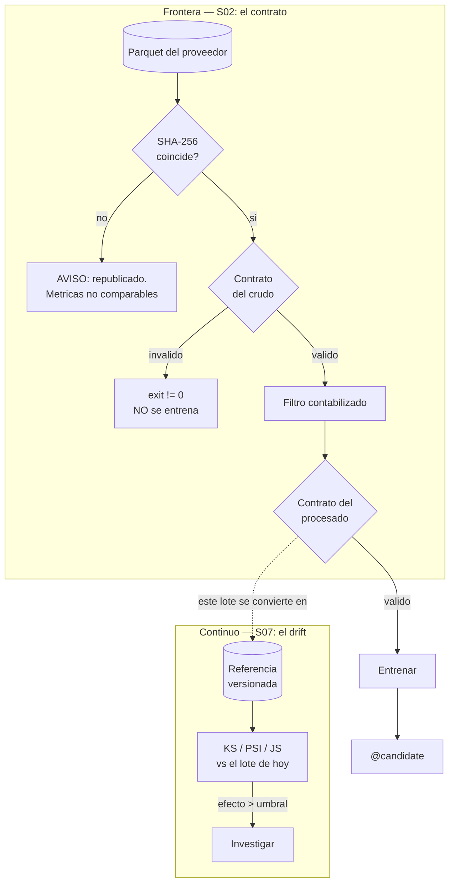

# Guion de clase — Sesión 2: Datos como código

Guion minutado para las **4 horas** del formato de sesión del curso. Cada bloque indica
qué archivo abrir, qué comando correr y qué salida esperar.

**Duración total:** 240 min (4 h), con pausa de 15 min.
**Terminales:** 1 + notebook (2 en el bloque 5).
**Directorio base:** la **raíz del repositorio**. Todos los comandos se corren desde ahí.
**Material del estudiante:** [`sesiones/s02-datos/`](../sesiones/s02-datos/).

| Tramo | Min | Bloques |
|---|---|---|
| Arranque | 0-15 | 1 |
| El dolor | 15-40 | 2 |
| Bloque A — contratos y los tres niveles | 40-95 | 3, 4, 5 |
| Pausa | 95-110 | — |
| Bloque B — versionado, `split` temporal y `leakage` | 110-165 | 6, 7, 8 |
| Taller | 165-220 | 9 |
| Cierre | 220-240 | 10 |

> **Sobre los tiempos de ejecución:** este guion **no** promete duraciones de comando.
> Depende de la máquina, del caché y de la red del aula. Donde importa, el guion dice
> *mide y compara*, y el número lo produce la clase.
>
> **Sobre las cifras de datos: todas las de este guion están medidas** el 19 de agosto de
> 2026 sobre las particiones reales de la TLC. **Verifícalas antes de tu cohorte** (el
> [Anexo B](#anexo-b--checklist-antes-de-clase) dice cómo): si la TLC republicó un
> archivo, cambian, y el material pierde exactamente el argumento que quiere enseñar.

---

## Mapa de archivos

```
sesiones/s02-datos/
├── README.md                                    Bloques 1, 3, 4, 5, 10
├── versionado-de-datos.md                       Bloque 6
├── dataset-card.md                              Bloque 8.4
├── taller.md                                    Bloque 9
├── notebooks/
│   ├── 01-el-dolor-de-los-datos.ipynb           Bloques 2, 4, 5
│   ├── 02-validacion-temporal-y-leakage.ipynb   Bloques 7, 8
│   └── _generar_notebooks.py                    (fuente de los dos notebooks)
└── _soluciones/                                 NO publicar antes del taller
    ├── README.md
    └── solucion-taller.md

Ya implementado, y que esta sesión explica:
src/taxi/data/contract.py                        Bloques 3, 4, 5
src/taxi/data/loaders.py                         Bloques 4.3, 6.2
src/taxi/features/contract.py                    Bloque 2.2
tests/conftest.py                                Bloque 3.3
tests/data/test_contrato_datos.py                Bloques 3.2, 5.1
tests/data/test_niveles_de_check.py              Bloques 4.2, 4.4

docs/adr/005-contratos-de-datos.md               Bloques 5.3, 10.2
docs/adr/001-caso-guia-y-particiones.md          Bloques 6.2, 7.1
proyecto/README.md                               Bloques 1.3, 10.3
```

---

## BLOQUE 1 — Arranque (0-15 min)

**Archivos:** ninguno al principio. **Terminales:** 0-1.

### 1.1 Recap por un estudiante (5 min)

**Rotativo, y a partir de hoy es el ritual de todas las sesiones.** La persona ya lo
sabía desde la S01 (era el último punto del checklist de la semana pasada).

Qué quedó de S01: entorno reproducible, `pyproject` frente a `uv.lock`, `hooks` y CI que
puede fallar. La pregunta de cierre que conecta con hoy es la que se dejó abierta:

> *"`mypy` está en verde, `ruff` está en verde, los tests pasan, el CI está verde. Y mi
> `pipeline` está entrenando con `trip_distance` en kilómetros. ¿Por qué no lo detectó
> nada de eso?"*

### 1.2 Revisión del CI de los talleres entregados (7 min)

Abrir dos PR de estudiantes de la S01 y mirar el workflow. Rutina de todas las sesiones.
Lo que hay que buscar, porque es el fallo nº 1 de la S01:

```bash
grep -rn -E "continue-on-error|\|\| *true|\|\| *echo" .github/workflows/
```

Y comprobar que `uv.lock` está commiteado en el mismo commit que el `pyproject.toml`.

### 1.3 Encuadre de hoy y del proyecto (3 min)

"La semana pasada conseguimos que el **código** dé siempre el mismo resultado dado el
mismo dato. Hoy atacamos la otra mitad, que es la que rompe los sistemas de ML de
verdad: **qué pasa cuando el dato cambia y nadie se da cuenta.**"

Y decirlo ahora, no al final: **lo que hacemos hoy es exactamente la fase 1 del proyecto**
([`proyecto/README.md`](../proyecto/README.md)), y el taller de hoy **es** casi
literalmente esa fase.

---

## BLOQUE 2 — El dolor (15-40 min)

**Archivo:** `notebooks/01-el-dolor-de-los-datos.ipynb` §1-2.
**Terminales:** 1 + notebook.

**No se abre Pandera en este bloque. Ni se menciona.** Dos actos.

### Acto 1 — Una columna cambia de unidad (14 min)

Abrir el notebook y correr las celdas de la §1. Antes de la celda del RMSE,
**detenerse en la tabla comparativa** y preguntar qué se rompió:

**Salida esperada** de la celda de comparación:

```
dtypes iguales: True
nulos nuevos: 0
filas iguales: True
```

Con las medianas pasando de ~3,4 a ~5,5 millas.

**La pregunta que hay que hacer aquí**, dejando 60 segundos de silencio: *"¿qué tiene que
detectar esto?"* Que propongan. Van a decir `try/except` (no hay excepción), tipos (el
`dtype` es idéntico), tests (el código es correcto: es el **dato** el que cambió de
significado).

Ahora la celda del entrenamiento. **Salida esperada:**

```
RMSE del modelo entrenado en millas :  8.508 min
RMSE del modelo entrenado en 'km'   :  9.351 min

degradacion: 9.9%
```

**Mide y compara** en tu máquina; es determinista con la semilla del `fixture`, así que
debería salir igual.

**La frase del acto:** *"El modelo entrenado con la columna equivocada funciona. Predice
minutos. Su RMSE es del mismo orden. Se registra bien en MLflow. La API responde 200 en
8 ms. Y aprendió que 3,4 unidades significan una cosa cuando en producción va a recibir
otra."*

Y la pregunta incómoda, que hay que dejar caer sin responder: *"con un 10 % de
degradación y nada con lo que comparar, ¿cuánto tarda alguien en notarlo?"*

Escribir en la pizarra, y que se quede las cuatro horas:

> **La asimetría: un fallo ruidoso cuesta una tarde. Un fallo silencioso cuesta meses.**

### Acto 2 — La categoría que desaparece (11 min)

Correr la celda de `DictVectorizer` de la §2.

**Salida esperada:**

```
features aprendidas en fit: 2511

valores no cero de la fila transformada: [('dia_semana_pickup', 2.0), ('hora_pickup', 9.0), ('trip_distance', 4.2)]
```

Las **tres** features categóricas valen cero. Sin excepción y sin `warning`.

**Qué preguntar:** *"El modelo va a devolver un número razonable, calculado ignorando la
mitad de la información del viaje. ¿Cuántas predicciones así puede estar sirviendo su API
ahora mismo?"* La respuesta honesta es que no lo saben.

Y el matiz que evita la lección equivocada: **`DictVectorizer` está haciendo lo
correcto.** `PU_DO` tiene miles de valores y varios aparecen solo en producción; no
queremos que la API explote por una ruta nueva.
`OneHotEncoder(handle_unknown="ignore")` hace exactamente lo mismo — por eso existe ese
parámetro. Con `"error"`, la API se cae en la primera ruta nueva.

> **O degradas en silencio, o rompes en voz alta. Ninguna de las dos es gratis. Lo que no
> vale es no haber elegido, ni no haber instrumentado la elección.**

Cerrar con la tabla de las tres formas de enterarse (contrato / métrica / `drift`) y
señalar que las dos últimas son de la S07.

---

## BLOQUE 3 — Contratos: qué son y dónde viven (40-58 min)

**Archivos:** `README.md` §2, `src/taxi/data/contract.py`, `tests/conftest.py`.
**Terminales:** 1.

### 3.1 La definición, y el diagrama (6 min)

`README.md` §2: un contrato es un esquema **ejecutable y versionado junto al código** que
describe cómo se ve un dato válido, y se valida **en la frontera**: donde el dato entra,
no donde se usa.

El diagrama de §2 en pantalla. Señalar los dos contratos y por qué son dos:

- si falla `ViajesCrudos`, el problema es **del proveedor** o de la descarga;
- si falla `ViajesProcesados`, el problema es **nuestro**.

Abrir `contract.py` y detenerse en `strict = False`. Preguntar por qué no `True`. (Porque
el parquet trae ~20 columnas y solo importan cinco; un contrato que se rompe cada vez que
la TLC agrega un campo **entrena al equipo a ignorarlo**.)

### 3.2 El contrato describe, el test verifica (6 min)

La distinción que hay que dejar clarísima, en la pizarra:

| | Vive en | Corre en | Afirma sobre |
|---|---|---|---|
| **Contrato** | `src/` | **producción**, en la frontera | el **mundo** |
| **Test** | `tests/` | el CI | **nuestro código** |

*"El contrato es la regla; el test es la prueba de que la regla está encendida."*

Abrir el encabezado de `tests/data/test_contrato_datos.py` y leerlo en voz alta:

> *"Un contrato que nunca se prueba contra datos malos se degrada hasta aceptar cualquier
> cosa: basta que alguien relaje un rango para desbloquear un `pipeline` y nadie lo note.
> Aquí cada relajación rompe un test con nombre explícito."*

### 3.3 Los `fixtures` se generan en código (6 min)

Abrir `tests/conftest.py` y leer las tres razones de su `docstring`: un CSV commiteado es
**opaco**, se desactualiza en silencio y **no explica por qué está roto**.

Recorrer los tres `fixtures` rotos y su propiedad clave, que hay que decir en voz alta:

> *"Ninguno de los tres lanza una excepción por sí mismo. Los tres entrenan un modelo y
> producen un RMSE plausible. Ese es exactamente el punto del contrato."*

Y el cuarto, `df_crudo_con_duraciones_extremas`, que enseña la frontera: el contrato
**acepta** un viaje de 90 minutos; es el **filtro de negocio** el que lo elimina.
*"El contrato dice qué es un dato bien formado; el filtro dice qué es un viaje."*

---

## BLOQUE 4 — Los tres niveles de check (58-80 min)

**Archivos:** `README.md` §3, `notebooks/01-...` §3, `tests/data/test_niveles_de_check.py`.
**Terminales:** 1 + notebook.

**Es el bloque central del bloque A.**

### 4.1 La tabla de los tres niveles (5 min)

`README.md` §3. Insistir en la última columna, que es la que decide por qué hacen falta
los tres: **qué NO puede ver cada nivel.**

- nivel 1 no ve nada sistemático: si *todas* las filas se desplazan a la vez, cada una
  sigue siendo válida;
- nivel 2 no dice qué fila concreta está mal;
- nivel 3 no ve un desplazamiento que respete la relación entre columnas.

### 4.2 La tabla de veredictos, en vivo (8 min)

Correr la celda de `diagnosticar` del notebook §3.

**Salida esperada, exacta:**

```
crudo valido (control positivo)            PASA

--- Nivel 1: por fila ---
distancia negativa (imposible)             FALLA -> ['greater_than_or_equal_to(0.0)']
zona 999 (fuera del rango 1-265 de la TLC) FALLA -> ['less_than_or_equal_to(265)']
1 outlier de 120.098 millas                PASA

--- Nivel 2: por distribucion ---
el 2% supera las 100 millas                FALLA -> ['outliers_de_distancia_son_marginales']
millas -> km (el fallo de la seccion 1)    FALLA -> ['outliers_de_distancia_son_marginales']
solo 50 filas (ingesta cortada)            FALLA -> ['volumen_minimo']

--- Nivel 3: entre columnas ---
velocidad implicita de ~300 mph            FALLA -> ['velocidad_implicita_plausible']
el viaje termina antes de empezar          FALLA -> ['dropoff_posterior_a_pickup']
```

**Parar en la cuarta línea.** `1 outlier de 120.098 millas` → **PASA**.

**Preguntar si eso es un bug.** Van a decir que sí. Entonces los números:

- el parquet real de 2023-01 trae **37 viajes de más de 100 millas** (uno de
  **120.098,84**) en **68.211** filas — un **0,054 %**;
- el contrato original exigía `trip_distance <= 100` **por fila**;
- resultado: `taxi data` fallaba con `SchemaErrors` en la primera partición y **bloqueaba
  el curso entero**.

> **Un contrato que rechaza el lote completo por 37 filas de 68.211 es un contrato que el
> equipo aprende a desactivar. Y un contrato desactivado protege exactamente cero.**

### 4.3 El filtro no es silencioso (4 min)

Los outliers no se ignoran: se **filtran y se cuentan**. Abrir
`loaders.preparar_particion` y mostrar el `logger.info` con el conteo y el `warning` por
encima del 35 %.

*"Un filtro silencioso es tan peligroso como no tener filtro: si mañana se descarta el
40 % de los datos, alguien tiene que enterarse."*

### 4.4 La calibración del umbral (5 min)

`README.md` §3, la tabla de calibración:

| Cantidad | Valor |
|---|---|
| Fracción real de viajes > 100 millas | **0,054 %** (37 de 68.211) |
| Umbral del contrato | **0,3 %** |
| Margen | ~5,5x |

Y abrir `tests/data/test_niveles_de_check.py`, `test_umbral_calibrado_con_la_proporcion_real`.
Las dos aserciones, una por cada forma de equivocarse: no puede bajar hasta el ruido real
ni subir por encima de `0,01`.

> **Eso es lo que distingue un umbral calibrado de un número puesto a ojo: dos aserciones
> con su razón escrita.**

Y la advertencia que hay que dar dos veces, porque es lo primero que copian: **`0.003` no
significa nada fuera del green taxi.** El taller **penaliza** copiarlo.

---

## BLOQUE 5 — El límite honesto, y el puente a S07 (80-95 min)

**Archivos:** `README.md` §4, `notebooks/01-...` §5. **Terminales:** 1-2.

**Este es el bloque que más se recuerda de la sesión, y el que separa este material del
resto.** Todo lo anterior fue sobre un `fixture` sintético.

### 5.1 El experimento sobre el parquet real (7 min)

**Anunciar el experimento antes de correrlo y pedir una predicción a mano alzada:**

> *"Voy a coger el parquet REAL de la TLC, multiplicar `trip_distance` por 1,60934 y
> pasarle el contrato. ¿Lo detecta? Levanten la mano los que digan que sí."*

Van a levantar casi todos la mano. Correr las celdas de la §5.

**Salida esperada, exacta:**

```
filas: 68,211
mediana en millas: 1.85
mediana en 'km'  : 2.98

fraccion > 100 en millas: 0.000542  (37 viajes)
fraccion > 100 en 'km'  : 0.000557  (38 viajes)
umbral del contrato     : 0.003

parquet REAL en millas                     PASA
parquet REAL en 'km'                       PASA
```

**El contrato no lo detecta.**

Dejar que se asiente. Y después la explicación, que es exacta y está en el propio test
del repositorio:

> *"El contrato no compara unidades (no puede: el número no las lleva). Lo que detecta es
> que los viajes largos legítimos, al convertirse a km, se salen del límite de 100. **Si
> el dataset no tuviera cola larga, este contrato NO atraparía el cambio de unidades**, y
> conviene que eso quede escrito."*

El `fixture` sintético tiene una cola diseñada de 70-95 millas. El parquet real de green
taxi es abrumadoramente urbano: mediana **1,85** millas, p99 por debajo de 15. En km, la
mediana va a **2,98**, que sigue siendo plausible para un taxi. Y la velocidad implícita
pasa de **10,63** a **17,10** mph, **también** dentro del rango aceptado de 2-45.

> **Un factor de 1,6 está en el borde de lo que un contrato estático puede detectar sobre
> un solo lote. No es un defecto del contrato: es su definición.**

### 5.2 Lo que sí lo detecta (5 min)

Correr la celda del `KS`.

**Salida esperada:**

```
KS entre la referencia (millas) y el lote actual (km):
  D = 0.2513   <- tamano de efecto, acotado en [0, 1]
  p = 0

  dos muestras del MISMO dato: D = 0.0069  (ruido del instrumento)
```

`D = 0,25` frente a un ruido de `0,007`. El contrato no lo vio; el `drift` no tiene
ninguna duda.

**Señalar el control negativo** y su parentesco con el control negativo del contrato:
*"sin él, 'mi detector marcó drift' no significa nada."* La S07 lo llama **calibrar
contra el ruido bajo el nulo**, y es donde se demuestra que un umbral por debajo de su
propio ruido garantiza falsos positivos.

### 5.3 El puente S02 → S07 (3 min)

La tabla de `README.md` §4 en pantalla. La frase que hay que decir:

> **No compiten. Se complementan. Un curso que enseñe solo una de las dos deja
> justamente el hueco por el que se cuelan los incidentes reales.**

- solo contrato → un factor de 1,6 se te pasa;
- solo `drift` → entrenas con nulos y con zonas inexistentes mientras esperas a acumular
  un lote.

Y la consecuencia operativa que se paga en la S07: **el `drift` necesita una referencia
versionada.** Si no puedes decir con exactitud qué dato usó tu `champion`, no puedes
calcular `drift` contra nada. Eso es el bloque 6.

Cerrar mostrando el [ADR 005](../docs/adr/005-contratos-de-datos.md), en particular la
sección de alternativas descartadas: **A** (Great Expectations), **D** (un solo nivel con
cotas estrictas, que es la que rompía el curso) y **G** (delegar todo al `drift`).

---

## PAUSA (95-110 min)

---

## BLOQUE 6 — Versionado de datos (110-130 min)

**Archivos:** `versionado-de-datos.md`, `src/taxi/data/loaders.py`. **Terminales:** 1.

### 6.1 La pregunta correcta (4 min)

`versionado-de-datos.md` §1. El error habitual es preguntar *"¿qué herramienta uso?"*. La
pregunta es **"¿qué problema tengo?"**.

La tabla de cuatro filas, y la regla que la ordena: **la estrategia 1 es el mínimo no
negociable y las otras tres se apilan encima**, no la reemplazan.

Y la corrección del error conceptual que se traen de la S01: **Git LFS no es versionado
de datos.** Resuelve el tamaño del `blob` en Git; no da `diff`, ni `time travel`, ni
ramas, ni `lineage`.

### 6.2 La estrategia 1, en vivo (10 min)

**Esta es la única que se demuestra ejecutando**, y hay que decir por qué: DVC no está
instalado en el repositorio del curso.

```bash
cat data/raw/metadata.json | head -20
```

Los cinco campos: `url`, `sha256`, `bytes`, `fuente`, `licencia`.

Ahora la demostración que da sentido al hash — `versionado-de-datos.md` §2, pasos 3 a 5:
falsear el hash registrado y ver el aviso.

**Salida esperada del paso 4:** un `WARNING` con las dos líneas de hash y la frase
*"El proveedor republico el archivo. Las metricas calculadas con la version anterior ya no
son comparables."*

> **Aviso al instructor:** el paso 4 **vuelve a descargar** el archivo, así que necesita
> red. Si el aula no la tiene, haz solo `cat metadata.json` y muestra el `if` del `loader`
> en el editor. Y **acuérdate de correr el paso 5** para restaurar el hash correcto.

**Qué preguntar:** *"¿Por qué importa que el proveedor republique un archivo?"* Respuesta
que se busca: porque el RMSE de marzo y el de agosto dejan de ser comparables, y **la
comparación de modelos es el centro de MLOps**.

Y el detalle del `.gitignore`, que documenta un bug real: el anterior ignoraba `*.json`
globalmente y hacía **invisible** el `metadata.json`. La buena práctica existía y no se
veía. De ahí el `!**/metadata.json` actual.

### 6.3 DVC, lakeFS, Delta/Iceberg: el marco mental (6 min)

**Decirlo explícitamente:** DVC **no está instalado en este entorno** y los comandos de
`versionado-de-datos.md` §3 están tomados de la doc oficial, **no ejecutados aquí**. Está
escrito en el aviso de la cabecera del documento. *"Prefiero declararlo a fingir una
demostración: es la disciplina que esta sesión pide."*

Si quieres demostrarlo, `versionado-de-datos.md` §3.1 explica cómo instalarlo en un
proyecto de usar y tirar **sin tocar el `uv.lock` del curso**.

Recorrer las tres en marco mental, una frase cada una:

- **DVC** = control de versiones a nivel de **experimento**. `git checkout` + `dvc pull`
  te devuelve código y dato de marzo a la vez.
- **lakeFS** = control de versiones a nivel de **repositorio de datos**. Ramas y
  `rollback` atómico del `lake`. Y lo más interesante para esta sesión: **`hooks`
  pre-`merge`** — puedes exigir que el contrato pase antes de que el `merge` sea visible.
  Es un `gate` de calidad de datos.
- **Delta / Iceberg** = tabla **transaccional**. ACID, `time travel`, `schema evolution`.
  Es lo que permite decir *"la referencia de `drift` es la tabla tal como estaba el 1 de
  marzo"*.

Cerrar con las cinco preguntas de §6 y con la advertencia sobre el error inverso, que en
un curso es más frecuente que quedarse corto:

> *"Un `lake` con lakeFS y tres tablas Iceberg para un `dataset` de 40 MB de Kaggle no
> demuestra criterio: demuestra lo contrario."*

---

## BLOQUE 7 — `Split` temporal (130-145 min)

**Archivos:** `notebooks/02-validacion-temporal-y-leakage.ipynb` §1-2, `README.md` §7.
**Terminales:** notebook.

### 7.1 La regla (3 min)

En la pizarra:

> **En producción, el modelo siempre predice sobre el futuro. Cualquier validación que no
> respete eso mide algo que no va a ocurrir.**

El diagrama ASCII del notebook §1. Y la conexión con el caso guía: `train` 2023-01..03,
`valid` 2023-04, `holdout` 2023-05, nada aleatorio
([ADR 001](../docs/adr/001-caso-guia-y-particiones.md)).

Correr las celdas de construcción de la serie diaria.

**Salida esperada:**

```
filas: 339,630 -> 339,621 (descartadas 9 fuera de rango)
serie diaria: 151 dias, de 2023-01-01 a 2023-05-31
...
144 dias utilizables (los primeros 7 se pierden por los lags)
```

**Dos cosas que señalar en esa salida**, y las dos son de contrato de datos:

1. **9 filas descartadas por estar fuera del rango declarado.** El parquet de un mes
   contiene `timestamps` de otros periodos — en 2023-01 hay filas de **2009** y de
   **2022**. *"El nombre del archivo no es un contrato."*
2. **Los primeros 7 días se pierden y eso es correcto.** Un modelo con lag de 7 días no
   puede predecir el día 3: esa información no existía. `dropna()` aquí no es limpieza, es
   honestidad. Rellenarlos con la media —o con `fillna(0)`— inventaría un pasado.

### 7.2 `TimeSeriesSplit` vs `KFold(shuffle=True)` (9 min)

Correr la celda de los `folds` y luego la de la comparación.

**Salida esperada:**

```
                                                por fold     media
TimeSeriesSplit          [129.  159.4 220.5 230.7 183.2]     184.6
KFold(shuffle=True)      [189.9 102.3 171.4 223.3 143. ]     166.0

El KFold aleatorio reporta un RMSE 10.1% MEJOR.
```

**Mide y compara** los tuyos.

Las dos precisiones que hay que dar, o se llevan la lección equivocada:

1. **La dirección del sesgo no es casual.** Al mezclar días, cada `fold` de `test` queda
   rodeado de vecinos que están en `train`; con lags autocorrelacionados eso es casi tener
   la respuesta. En producción no hay vecinos futuros.
2. **La magnitud depende del `dataset`, y aquí es moderada.** *"Si encuentran un tutorial
   donde la diferencia es un factor 3, probablemente el dato esté construido para que lo
   sea."*

Y el matiz que casi todo el material omite: **`TimeSeriesSplit` tampoco es
automáticamente correcto.** Con ventanas de 30 días, el `fold` de `test` contiene
información derivada de días que están en `train`. La solución es `gap`.

> **El valor de la validación temporal no es dar mejores números; es dar números que se
> sostengan al desplegar. La métrica correcta suele ser la peor.**

### 7.3 Encuadre: por qué el `leakage` es un tema de datos (3 min)

*"El `leakage` no es un error de modelado: es un error de construcción del `dataset`. Se
comete al decidir qué columna es una feature y cómo se calcula, y se paga en producción.
Por eso está en la sesión de datos."*

---

## BLOQUE 8 — Las tres formas de `leakage` (145-165 min)

**Archivos:** `notebooks/02-...` §3-6, `README.md` §7, `dataset-card.md` §7.

### 8.1 Leakage 1 — preprocesar antes del `split` (7 min)

Correr la celda de la §3 del notebook.

**Salida esperada:**

```
RMSE con fit sobre TODO (leakage) :   146.38
RMSE con Pipeline (correcto)      :   146.62

  media de viajes_lag_1 con fit sobre TODO  :  2255.28
  media de viajes_lag_1 con fit solo en train:  2267.59
```

**Los dos RMSE son casi iguales**, y el "malo" es incluso ligeramente mejor. Preguntar si
eso significa que el `leakage` no importa.

Y la respuesta, que es la lección de verdad del bloque:

> **El `leakage` que no mueve tu métrica es el que sobrevive al `code review`.** Si te
> regalara un RMSE de 0,01 lo detectarías. El peligroso es este: te contamina el estimador
> un poco, no lo suficiente para levantar sospechas, y te deja creyendo que tu validación
> mide generalización.

Por eso la defensa **no es medir: es estructural.** Señalar con el dedo las dos últimas
líneas: **las medias son distintas.** Ese es el hecho objetivo, independiente de la
métrica.

**La regla, sin excepciones:** toda transformación que **aprende** algo del dato
—`scaler`, `imputer`, `encoder`, `SelectKBest`, `PCA`— va **dentro de un `Pipeline`**.

### 8.2 Leakage 2 — features del futuro (5 min)

La celda aritmética de la §4 primero, **antes** de entrenar nada.

**Salida esperada** (la fila concreta puede variar si cambias `i`):

```
dia 2023-02-17: viajes = 2668   <- el target

  viajes_media_7      =  2366.71   (media de [2601, 2206, 1901, 2206, 2466, 2565, 2622])
  media_7_con_leakage =  2376.29   (media de [2206, 1901, 2206, 2466, 2565, 2622, 2668])
```

**El último número de la segunda lista es el `target`.** El modelo solo tiene que
multiplicar por 7 y restar los otros seis.

Y luego la medición: **184,6** (correcto) frente a **167,6** (con `leakage`).

*"Ocho caracteres de diferencia: `shift(1).` La mañana en que hay que predecir hoy, el
conteo de hoy no existe."*

### 8.3 Leakage 3 — el `target` dentro de una feature, y la sorpresa (6 min)

Correr la §5 del notebook.

**Salida esperada:**

```
RMSE con las features del curso            :   5.20 min
RMSE anadiendo 'velocidad_media' (LEAKAGE) :   3.96 min

'mejora' del 23.9%, imposible de reproducir en produccion

Y ahora la parte que hay que mirar dos veces:
  corr(velocidad_media, duration) = 0.113   <- BAJA
```

**Este es el momento más valioso del bloque B.** Preguntar antes de mostrar la
correlación: *"¿cómo detectarían esta feature envenenada?"* Alguien va a decir "mirando
las correlaciones". Entonces mostrar el `0,113`.

> **Una correlación baja no es evidencia de ausencia de `leakage`.**

La razón es exacta: `duration = distancia / velocidad` es una relación **inversa y no
lineal**, y Pearson mide relación lineal. Un modelo la explota sin problema; un
coeficiente de correlación no la ve.

Y lo único que sí lo habría detectado, sin ejecutar nada: *¿de dónde sale este número?*
De `duration`. Y `duration` es el `target`. Fin del análisis.

### 8.4 La pregunta que sí funciona, y su forma operativa (2 min)

En la pizarra:

> **¿Este valor estaba disponible en el momento en que hay que hacer la predicción?**

Y su versión operativa, que es lo que se lleva al proyecto: **la tabla de disponibilidad
temporal por feature**, con el instante en que cada valor queda disponible. Así la
pregunta se responde comparando dos `timestamps` en lugar de discutiéndola en un PR.

Mostrar la tabla de [`dataset-card.md`](../sesiones/s02-datos/dataset-card.md) §7 y
detenerse en la fila con **matiz**: `trip_distance` es la distancia **registrada** por el
taxímetro, que solo se conoce al final. Para una ETA honesta habría que usar la
**estimada** de la ruta. *"El curso usa la registrada por simplicidad didáctica, y lo
declara. Un `leakage` declarado es manejable; uno escondido rompe el sistema."*

Si queda tiempo, el `baseline` tonto de la §6: **277,8** (la media), **266,8** (como
ayer), **215,7** (el modelo). *"Si su modelo no le gana a 'como ayer', no tienen un
modelo. Y si le gana por un factor de 5, sospechen antes de celebrar."*

---

## BLOQUE 9 — Taller (165-220 min)

**Archivo:** [`sesiones/s02-datos/taller.md`](../sesiones/s02-datos/taller.md)

Los estudiantes trabajan **en su propio repositorio**. El instructor circula. Se entrega
en clase.

**Al empezar, decir en voz alta:**

1. **No alcanza para los siete puntos.** Prioridad: contrato con los tres niveles,
   `fixtures` rotos y control negativo (puntos 1, 3 y el criterio 5). Hash, CI y "pasa
   sobre el dato real" si da tiempo. `Split` y `dataset card` como tarea.
2. **El criterio 5 es el que decide.** Que el contrato rechace los tres `fixtures` rotos
   **no vale nada** sin el control negativo: un contrato que rechaza todo también los
   rechaza.
3. **No copien el `0.003`.** El criterio 6 exige la tabla de calibración con **sus**
   datos. El umbral del curso sale de haber medido `0,054 %` en el parquet de la TLC.
4. **Sus `fixtures` rotos no deben lanzar excepciones.** Si `pandas` explota, están
   demostrando lo contrario de lo que se pedía: el punto son los fallos **silenciosos**.
5. **El punto 5, si su `dataset` no tiene eje temporal**, exige los tres puntos de
   justificación, y el tercero es el importante: cómo simularán referencia vs producción
   en la S07. *"Un `dataset` sin eje temporal no descalifica su proyecto; descubrirlo en la
   sesión 7 sí lo hunde."*
6. Esto, más la propuesta del problema y la ficha del dataset, **es la fase 1 del proyecto ya resuelta**.

Quien acabe antes: el extra 1, que es **medir el límite de su propio contrato** (¿a partir
de qué factor de escala deja de detectarlo?). Es el ejercicio más valioso del taller
porque el resultado suele ser incómodo, y es el que demuestra que entendieron el bloque 5.

**No publicar `_soluciones/` antes del taller.**

### Errores que van a aparecer, con su causa

| Síntoma | Causa habitual |
|---|---|
| El contrato falla sobre su partición real | cotas por fila demasiado estrictas. Es el bug del curso: mover la señal al nivel 2 |
| El contrato no detecta nada | solo tiene reglas de nivel 1, o rangos que aceptan cualquier cosa |
| Sus `fixtures` rotos lanzan `KeyError` / `ValueError` de `pandas` | están rotos de forma **ruidosa** |
| `pytest tests/data` necesita red | están leyendo el `dataset` real en un test. Generar en código |
| `FutureWarning` al importar Pandera | `import pandera as pa` para clases de `pandas`. Es `import pandera.pandas as pa` |
| `AttributeError: SchemaModel` | renombrado a `DataFrameModel`; el nombre viejo se eliminó |
| Un `snippet` de Great Expectations no ejecuta | es de la API 0.18. GX Core 1.x reorganizó el modelo por completo |
| `TypeError: ... unexpected keyword argument 'squared'` | `squared` se **eliminó** en `scikit-learn` 1.6. Usar `root_mean_squared_error` |
| Reportan la métrica del `KFold(shuffle=True)` porque es mejor | es el `leakage` del punto 5 |
| `metadata.json` no está en `git ls-files` | `.gitignore` con `*.json` global. Añadir `!**/metadata.json` |
| El umbral de nivel 2 es exactamente `0.003` | lo copiaron. Criterio 6 |

---

## BLOQUE 10 — Cierre (220-240 min)

### 10.1 Autoverificación (7 min)

Las cinco preguntas del
[README §9](../sesiones/s02-datos/README.md#9-autoverificación), en voz alta y por
sorteo. Las dos que más discusión dan:

- la **nº 3** (el contrato pasa y una columna se multiplicó por 1,6): la respuesta
  correcta incluye *"a costa de qué"* — el `drift` necesita una referencia y un lote
  acumulado;
- la **nº 5** (AUC de 0,72 a 0,97 con correlación 0,08): la respuesta es **no**, y la
  justificación es la medición del bloque 8.3.

### 10.2 Alternativas y qué NO usar (5 min)

`README.md` §5 y §10. Leer en voz alta los que más daño hacen:

- `train_test_split(shuffle=True)` y `KFold(shuffle=True)` sobre series temporales;
- **`df.fillna(0)` por defecto** — no es un valor por defecto, es una decisión oculta que
  **inventa ceros que el modelo aprende como reales**;
- `mean_squared_error(..., squared=False)` — **eliminado** en `scikit-learn` 1.6;
- `import pandera as pa` para clases de `pandas`, y `pandera.SchemaModel`;
- **las APIs de Great Expectations 0.18** — GX Core 1.x reorganizó el modelo, y la
  mayoría de los tutoriales de la web no ejecutan;
- **`ColumnMapping` de Evidently** — eliminado en 0.7, y aparece en tutoriales de
  contratos de datos;
- Pydantic para `DataFrames`;
- cotas por fila estrictas como único check;
- un contrato **sin control negativo**;
- filtrar filas en silencio;
- Git LFS como versionado de datos;
- `datetime.now()` para elegir la partición.

Y el meta-mensaje, que es el mismo de la S01 y hay que repetirlo: **cada tabla
comparativa de este material lleva criterio, fecha de evaluación y un enlace a la doc
oficial por fila.** La fila de Great Expectations es la que envejece más rápido, y es
justo lo que se les exige en su ADR y en su `dataset card`.

Cerrar mostrando el [ADR 005](../docs/adr/005-contratos-de-datos.md): la decisión
escrita, con las ocho alternativas descartadas y **la limitación declarada** en las
consecuencias.

### 10.3 Tarea, proyecto y puente a S03 (6 min)

**Tarea:** terminar el taller si quedó a medias. Y avanzar en la **fase 1 del proyecto, que se
entrega en 5 días** ([`proyecto/README.md`](../proyecto/README.md)): el taller de hoy más
la propuesta del problema, la métrica de negocio y la `dataset card` completa.

Recordar que la ficha rellena del caso guía
([`dataset-card.md`](../sesiones/s02-datos/dataset-card.md)) es la plantilla, y que la
versión con `TODO` está en
[`proyecto/starter-template/docs/dataset-card.md`](../proyecto/starter-template/docs/dataset-card.md).

**El puente a S03:**

> *"Hoy el dato tiene contrato, procedencia y un `split` honesto. La semana que viene
> entrenamos, y aparece el problema siguiente: **entrenaron doce modelos y no saben cuál
> produjo el número que le enseñaron a alguien.** Ni con qué parámetros, ni con qué
> versión del código, ni con qué partición.
>
> Y hay una consecuencia directa de hoy que van a agradecer: sin el hash de la partición,
> ese experimento no es reproducible **aunque tengan el `run` guardado**. MLflow les va a
> decir qué parámetros usaron; solo el `metadata.json` les va a decir con qué bytes."*

---

## Anexo A — Clase y producción: qué cambia y qué no

| Aspecto | En clase | En producción |
|---|---|---|
| Código del contrato | `src/taxi/data/contract.py` | **exactamente el mismo** |
| Dónde se ejecuta | `preparar_particion`, en tu terminal | el mismo punto del `pipeline`, en el `job` del orquestador |
| Qué pasa si falla | `SchemaErrors` en la consola | el `pipeline` se detiene, alerta al `on-call`, y **no** se entrena |
| `Fixtures` rotos | sintéticos, en `tests/` | los mismos: son tests, no datos |
| Procedencia | `data/raw/metadata.json` local | el mismo esquema, en un catálogo o en `object storage` con retención |
| Versionado | hash + partición inmutable | lo mismo, más DVC / lakeFS / Delta según el problema |
| Referencia para `drift` | particiones de `train` cacheadas | **snapshot versionado** del `dataset` de entrenamiento del `champion` |
| Quién decide que el dato está bien | tú | el contrato, y el `hook` pre-`merge` si usas lakeFS |
| Umbrales de nivel 2 | en el código, con su ADR | los mismos, en el código, versionados y con ADR |



**Mensaje final del anexo:** el contrato falla rápido en la frontera y el `drift` vigila
la deriva. Son los dos únicos mecanismos que convierten un problema de datos silencioso en
uno visible, y **ninguno de los dos puede hacer el trabajo del otro**.

---

## Anexo B — Checklist antes de clase

- [ ] `uv run taxi data` ejecutado: las 7 particiones en `data/raw/`, para que los bloques
      5, 7 y 8 no dependan de la red del aula.
- [ ] **Los dos notebooks ejecutados de arriba abajo**, y apuntadas las cifras que salgan
      en **tu** máquina. Las de este guion son las medidas el 19 de agosto de 2026. Si se
      editan, se regeneran con
      `uv run python sesiones/s02-datos/notebooks/_generar_notebooks.py` y se publican
      **sin outputs**.
- [ ] **Re-verificadas las cifras del caso guía**, que son el argumento central de los
      bloques 4 y 5. Si la TLC republicó una partición, cambian:

      ```bash
      uv run python -c "
      import pandas as pd
      df = pd.read_parquet('data/raw/green_tripdata_2023-01.parquet')
      f = (df.trip_distance > 100)
      print('filas:', len(df), '| >100 millas:', int(f.sum()), f'({100 * f.mean():.4f}%)')
      print('max:', df.trip_distance.max(), '| mediana:', df.trip_distance.median())
      km = df.trip_distance * 1.60934
      print('en km -> mediana:', round(km.median(), 2), '| >100:', int((km > 100).sum()))
      "
      ```

      **Esperado:** 68.211 filas, 37 viajes > 100 millas (0,0542 %), máximo 120.098,84,
      mediana 1,85; en km, mediana 2,98 y 38 viajes > 100.
- [ ] `uv run pytest tests/data -q` en verde.
- [ ] **La demostración del hash del bloque 6.2 ensayada**, y comprobado que el paso 5
      restauró el `metadata.json`. Si no hay red en el aula, decidido el plan alternativo.
- [ ] **Comprobado que DVC sigue sin estar instalado** (`uv run python -c "import dvc"`),
      porque el bloque 6.3 lo declara en voz alta. Si alguien lo añadió al
      `pyproject.toml`, hay que actualizar el aviso de
      [`versionado-de-datos.md`](../sesiones/s02-datos/versionado-de-datos.md).
- [ ] **Re-verificadas las versiones y fechas** de las dos tablas comparativas:
      `README.md` §5 (Pandera / GX / Pydantic) y §6 (las cuatro estrategias de
      versionado). La fecha declarada es el 19 de agosto de 2026. La fila de Great
      Expectations es la que envejece más rápido de la sesión.
- [ ] Leído el [ADR 005](../docs/adr/005-contratos-de-datos.md) completo. Los bloques 4.2
      y 5.3 son un resumen suyo, y la sección de alternativas descartadas es lo que
      contesta las preguntas difíciles de la clase.
- [ ] Preparadas **dos PR de la S01** para la revisión de CI del bloque 1.2.
- [ ] Anunciado quién hace el **recap al empezar la S03**.
- [ ] Recordado en el aula virtual el **enunciado del proyecto**, con el enlace a
      [`proyecto/README.md`](../proyecto/README.md).
- [ ] Decidido si se publica `_soluciones/` (recomendación: **no** antes del taller).
