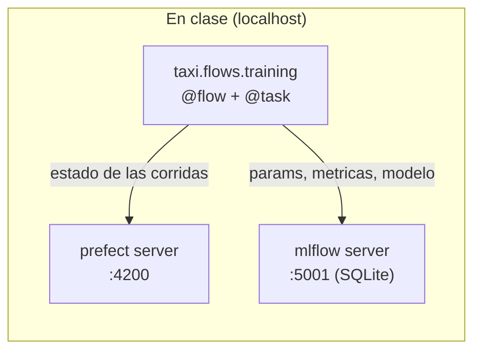
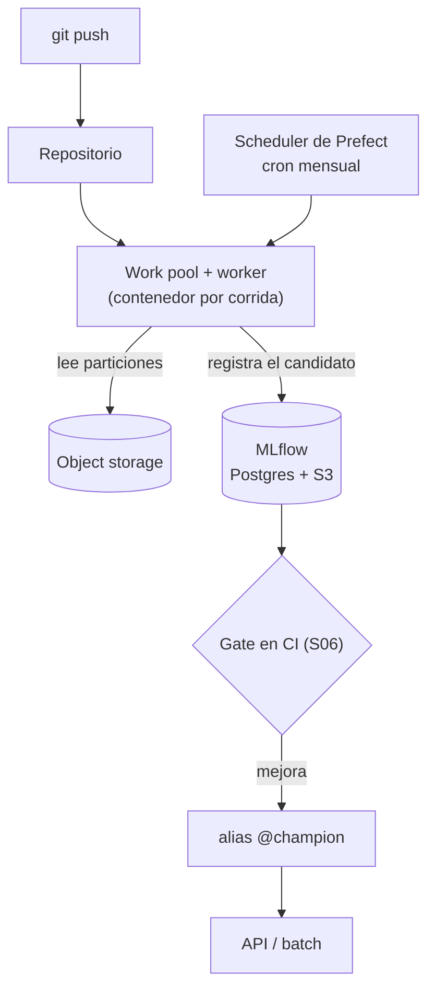

# Guion de clase — Sesión 4: Orquestación y Continuous Training

Guion minutado para las **4 horas** del formato de sesión del curso. Cada bloque
indica qué archivo abrir, qué comando correr, qué salida esperar y qué diagrama
mostrar.

**Duración total:** 240 min (4 h), con pausa de 15 min.
**Terminales:** 2 desde el bloque 6 (3 si se abre la UI de MLflow en paralelo).
**Directorio base:** la **raíz del repositorio**. Todos los comandos se corren desde ahí.
**Material del estudiante:** [`sesiones/s04-orquestacion/`](../sesiones/s04-orquestacion/).

| Tramo | Min | Bloques |
|---|---|---|
| Arranque | 0-15 | 1 |
| El dolor | 15-40 | 2 |
| Bloque A — del script al flow | 40-95 | 3, 4, 5, 6 |
| Pausa | 95-110 | — |
| Bloque B — deployments, schedules y CT | 110-165 | 7, 8, 9, 10 |
| Taller | 165-220 | 11 |
| Cierre | 220-240 | 12 |

---

## Mapa de archivos

Lo que se toca en esta sesión. El pipeline vive en el paquete; la carpeta de la
sesión lo ejecuta y lo analiza.

```
src/taxi/flows/                      # EL pipeline, una sola vez
├── training.py                      # Bloque 9: flow de entrenamiento
├── batch.py                         # Bloque 9: batch de predicciones
└── deploy.py                        # Bloque 10: serve, deploy, schedules

sesiones/s04-orquestacion/
├── README.md                        # Bloques 2 y 12: el porqué y el panorama
├── taller.md                        # Bloque 11
├── 00-escalera/                     # Bloque 2: los tres peldaños, ejecutables
│   ├── README.md                    # la tabla comparativa y la medición
│   ├── pasos.py                     # los 3 pasos, iguales en los 3 peldaños
│   ├── 1-script.py                  # Bloque 2, Acto 1 (python puro)
│   ├── 2-cron/
│   │   ├── programar.sh             # Bloque 2, Acto 3: la coreografia de 4 min
│   │   ├── correr.sh                # el envoltorio (PATH, cwd, log)
│   │   └── crontab.txt              # las 5 columnas, para leer
│   └── 3-orquestador.py             # Bloque 2, cierre (@flow con retries)
├── 00-intro-prefect/
│   ├── README.md                    # la progresión, en tabla
│   ├── flows/
│   │   ├── weather1-bare.py         # Bloque 3
│   │   ├── weather1-flow.py         # Bloque 3 (variante; entrypoint del YAML)
│   │   ├── weather1-serve.py        # Bloque 7
│   │   ├── weather1-serve-schedule.py   # Bloque 8
│   │   ├── weather1-serve-params.py     # Bloque 7
│   │   ├── serve-two-flows.py           # Bloque 8
│   │   ├── serve-two-flows-scheduled.py # Bloque 8
│   │   └── weather1-deploy.py       # Bloque 10 (deploy + work pool)
│   ├── workflows/
│   │   ├── my-first-task.py         # Bloque 4
│   │   ├── retries.py               # Bloque 5
│   │   ├── simple-artifacts.py      # Bloque 6
│   │   ├── runtime_context.py       # Bloque 6
│   │   ├── get_variable.py          # Bloque 6 (mostrar)
│   │   ├── create_secret.py         # Bloque 6 (mostrar)
│   │   └── openai_with_secret.py    # Bloque 6 (mostrar)
│   ├── infrastructure/prefect-yaml-guide.md   # Bloque 10
│   └── prefect.yaml                 # Bloque 10
├── 01-pipeline-ml/
│   ├── README.md                    # Bloque 9
│   ├── medir_caching.py             # Bloque 9 (la medición)
│   ├── consultas-predicciones.sql   # Bloque 9 (trazabilidad en SQL)
│   └── ejercicio/                   # Bloque 11 (ejercicio real, con TODOs)
├── _soluciones/                     # no publicar antes del taller
└── diagrams/                        # 12 PNG en Git LFS
```

> **Antes de clase:** `git lfs pull`. Sin eso, los diagramas son archivos de texto
> de tres líneas y no se ven.

---

## BLOQUE 1 — Arranque (0-15 min)

**Archivos:** ninguno. **Terminales:** 0.

1. **Arranque directo** (5 min): dudas sueltas de S03 si las hay, y en una frase propia lo que quedó — tracking,
   registry, aliases. La pregunta de cierre que conecta con hoy: *"¿quién ejecutó
   ese entrenamiento y cuándo?"*
2. **Revisión del CI de los talleres entregados** (7 min): abrir dos PR de
   estudiantes, mirar el workflow en verde o en rojo. Es la rutina de todas las
   sesiones y es la que sostiene el hábito.
3. **Encuadre de hoy** (3 min): "Ya saben entrenar y registrar. Hoy hacemos que
   eso ocurra sin ustedes delante, y que cuando falle se pueda saber qué pasó."

---

## BLOQUE 2 — El dolor (15-40 min)

**Archivos:** `sesiones/s04-orquestacion/README.md` sección 1, y la carpeta
`00-escalera/`. **Terminales:** 1.

Tres actos. No se abre Prefect hasta el final del bloque.

> **Sobre `00-escalera/`.** Es este bloque hecho ejecutable: el mismo pipeline de
> tres pasos como script pelado, como línea de crontab y como flow. Su README
> trae la tabla comparativa, la medición de los tres peldaños y —importante para
> no vender humo— la nota de que en esa maqueta el orquestador es *más lento*,
> porque el overhead es fijo y el ahorro es proporcional a lo que cuesten los
> pasos. Se puede dictar el bloque sin abrirla, pero es la carpeta que responde
> "¿por qué no simplemente un cron?" con números en vez de con autoridad.

### Acto 1 — El fallo a mitad de camino (8 min)

Dos formas de provocarlo. La primera es más dramática; la segunda no depende de
nada y es la que conviene si la clase es remota o el WiFi es del auditorio.

**Opción dramática** — lanzar el entrenamiento del caso guía y, mientras descarga,
**cortar la red** (desactivar el WiFi):

```bash
uv run taxi train
```

El script muere con un `ConnectionError`. Reactivar la red y relanzarlo: vuelve a
empezar desde cero.

**Opción determinista** — el peldaño 1 de la escalera, con el fallo inyectado:

```bash
ESCALERA_FALLAR_EN=3 uv run python sesiones/s04-orquestacion/00-escalera/1-script.py
uv run python sesiones/s04-orquestacion/00-escalera/1-script.py
```

El primero muere en el paso 3; el segundo repite los pasos 1 y 2 enteros.

Falla siempre, en el mismo paso, sin red y en tres segundos y medio. Los pasos 1
y 2 habían terminado bien y se repiten enteros al relanzar.

**Qué preguntar:** "¿Cuánto de lo que acabábamos de hacer se conservó? Nada.
¿Cuánto de eso hacía falta repetir? Nada."

### Acto 2 — La pregunta sin respuesta (8 min)

> "El modelo que está en `@champion`, ¿quién lo entrenó, cuándo, y con qué
> parámetros? ¿Se puede repetir esa ejecución exactamente?"

Se puede responder a medias con MLflow (params y métricas), pero **no** quién la
lanzó, ni desde dónde, ni si terminó bien, ni cuántas veces se reintentó. Eso es
lo que falta.

### Acto 3 — El lunes a las 3 a.m. (6 min)

> "Hay que reentrenar cada lunes a las 3 a.m. ¿Quién se levanta? ¿Y quién se
> entera si falla?"

Aparece `cron` como primera respuesta, y hay que **darle la razón**: es una buena
respuesta y lleva cuarenta años funcionando. El punto del acto es llevarla hasta
donde se acaba, no descartarla de entrada.

Este acto tiene una **coreografía de cuatro minutos**: se programa el cron al
empezar, se habla mientras espera, y dispara solo delante de la clase. Ese
disparo es el acto entero; dicho no convence, visto sí.

#### Minuto 0 — programarlo (1 min)

Terminal 1. El script resuelve su propia ubicacion, asi que **no hace falta
`cd`**: funciona desde donde estes, con la ruta completa desde la raiz del repo
o con `./programar.sh` si ya estas dentro de la carpeta.

```bash
sesiones/s04-orquestacion/00-escalera/2-cron/programar.sh --instalar
```

Imprime la hora exacta a la que va a disparar. **Decirla en voz alta y escribirla
en la pizarra**: "a las 10:48 esto va a correr solo, sin que yo toque nada". Sin
ese anuncio, cuando aparezca el bloque nadie va a notar que pasó algo.

Terminal 2, y se deja a la vista el resto del acto:

```bash
tail -f "$HOME/escalera-cron.log"
```

#### Minutos 1 a 3 — hablar mientras espera (3 min)

Abrir `correr.sh` y mostrar las tres piezas que hacen falta para que la línea de
crontab funcione de verdad. Son la sorpresa del acto: cron no lee tu `~/.zshrc`,
arranca con un PATH mínimo, trabaja desde tu `HOME`, y manda la salida al correo
local que nadie lee. El script del peldaño 1 **no cambió una línea**; todo esto es
andamiaje alrededor.

Después la tabla de once filas del README de esa carpeta. Los primeros seis
síntomas se arreglan con configuración; los cinco últimos —no avisa, no
reintenta, no deja historia, no acepta parámetros, no conoce los pasos de
adentro— tienen todos la misma columna de arreglo: **escribirlo a mano**. Ahí es
donde entra el peldaño 3.

#### Minuto 4 — dispara

El bloque aparece solo en el `tail -f`. Callarse dos segundos y dejar que lo vean.

> **La pregunta:** "Acabo de conseguir la mitad de lo que pedía el enunciado: corre
> sin que nadie se levante. ¿Qué mitad me falta?" La respuesta que se busca es
> *"que alguien se entere si falla"*, y es literalmente la fila 7 de la tabla.

#### Al terminar el bloque

```bash
./programar.sh --quitar
```

No es opcional y conviene decirlo en voz alta: un crontab no tiene disparo único,
así que esa línea volvería a disparar mañana a la misma hora. Es el hábito que se
está enseñando.

> **Antes de clase, si tu repo está en `~/Documents` (macOS).** Hay que darle
> **Acceso total al disco** a `/usr/sbin/cron`, o el job falla con
> `Operation not permitted` y la coreografía se cae en el minuto 4. Está en el
> [checklist del Anexo B](#anexo-b--checklist-antes-de-clase) y `programar.sh` lo
> detecta y lo avisa, pero el permiso pide contraseña y hay que darlo a mano.
> **Ensáyalo una vez**: es el único paso de la sesión que depende de un permiso
> del sistema operativo.

### Cierre del bloque (3 min, o 5 con el peldaño 3)

> Ver: 
> y 

**Guion:** "Los cinco pilares aplican a cualquier herramienta: Prefect, Airflow,
Dagster, Kubeflow. La herramienta cambia; el concepto, no. Y una advertencia
antes de empezar: la orquestación no mejora su modelo. Un pipeline orquestado que
entrena sobre datos malos entrena sobre datos malos, con más puntualidad."

**Opcional (2 min): cerrar la escalera con el peldaño 3.** Es el mismo fallo del
Acto 1, sobre el mismo código, ahora sobrevivido:

```bash
ESCALERA_FALLAR_EN=3 uv run python sesiones/s04-orquestacion/00-escalera/3-orquestador.py
```

Lo que hay que señalar en la salida, y nada más: `descargar` y `preparar` en
`Completed`, `resumir` con `Retry 1/2 will start 1 second(s) from now`, el segundo
intento pasando, y el flow en `Completed`. **Los pasos 1 y 2 no se repitieron.**

Si se decide hacerlo aquí, el bloque termina en el minuto 42 en vez del 40, y el
Bloque 3 se acorta: los estudiantes ya vieron `@flow` y `@task`. Si no, se deja
para el Bloque 3, que es donde aparecen igual, y el cierre se queda en 3 minutos.
Cualquiera de las dos funciona; lo que no funciona es hacerlo aquí y además
dictar el Bloque 3 completo.

---

## BLOQUE 3 — Flow mínimo (40-55 min)

**Archivo:** `sesiones/s04-orquestacion/00-intro-prefect/flows/weather1-bare.py`
**Terminales:** 1.

Una función normal de Python con un decorador encima. Nada más.

```python
@flow
def fetch_weather(lat: float = 38.9, lon: float = -77.0) -> float:
    temps = httpx.get(base_url, params={...}, timeout=30)
    ...
    return forecasted_temp
```

### Comando

```bash
uv run python sesiones/s04-orquestacion/00-intro-prefect/flows/weather1-bare.py
```

### Salida esperada (la hora y el nombre del run cambian)

```
13:45:01.123 | INFO | prefect.engine - Created flow run 'crimson-falcon' for flow 'fetch-weather'
Temperatura pronosticada: 22.3 C
13:45:02.456 | INFO | Flow run 'crimson-falcon' - Finished in state Completed()
```

### Qué explicar

"Con `@flow`, y sin escribir una línea más, Prefect le puso nombre a la corrida,
midió su duración, capturó los logs y reportó el estado final. Fíjense en el
`timeout=30` del `httpx.get`: sin timeout, una petición colgada bloquea el flow
para siempre y **ningún** reintento se dispara, porque nunca falla."

**Variante:** `weather1-flow.py` es el mismo código con `@flow()`. Las dos formas
son válidas; se conserva porque es el `entrypoint` del `prefect.yaml`.

---

## BLOQUE 4 — Tasks y el grafo (55-70 min)

**Archivo:** `sesiones/s04-orquestacion/00-intro-prefect/workflows/my-first-task.py`
**Terminales:** 1.

> Ver: 
> y 

La misma lógica, ahora partida en dos `@task`: `obtener_temperatura` y
`guardar_temperatura`.

```bash
uv run python sesiones/s04-orquestacion/00-intro-prefect/workflows/my-first-task.py
```

### Salida esperada

```
13:50:01 | INFO | Flow run 'jade-tiger' - Created task run 'obtener_temperatura-0'
13:50:02 | INFO | Task run 'obtener_temperatura-0' - Temperatura pronosticada: 22.3 C
13:50:02 | INFO | Task run 'obtener_temperatura-0' - Finished in state Completed()
13:50:03 | INFO | Task run 'guardar_temperatura-0' - Guardado en weather.csv
13:50:03 | INFO | Flow run 'jade-tiger' - Finished in state Completed()
```

### Qué explicar

1. **El grafo no se declara: se deriva.** `guardar_temperatura(temperatura)`
   recibe el resultado de la task anterior, y de ahí sale la dependencia. Si dos
   tasks no dependen entre sí, se pueden ejecutar en paralelo.
2. **Ahora cada paso tiene estado propio.** Cuando algo falla se sabe *cuál* paso
   falló, no solo que "el script falló".
3. **Los `retries` van en la task que habla con la red**, no en el flow completo.
   Reintentar el flow entero repite también lo que ya había funcionado.

> **Pregunta para la clase:** "¿Y si pusiéramos `retries=3` en el `@flow` en lugar
> de en la task?" (Respuesta: se repite todo, incluido lo que ya funcionó; y si el
> paso que falla es el último, se pagan tres descargas por nada.)

---

## BLOQUE 5 — Reintentos y backoff (70-82 min)

**Archivo:** `sesiones/s04-orquestacion/00-intro-prefect/workflows/retries.py`
**Terminales:** 1.

> Ver: 
> y 

**Nota para el instructor:** este archivo cambió. Antes llamaba a un endpoint de
terceros (`tools-httpstatus.pickup-services.com`) con `random.choice([200, 500])`.
Dos problemas: si el servicio está caído, la demo de resiliencia falla por una
razón que no es la que se quiere enseñar; y la salida es distinta cada vez, así
que no se puede anticipar en un guion. Ahora el fallo es **local y determinista**:
la task falla exactamente las primeras N veces, leyendo el número de intento de
`prefect.runtime.task_run.run_count`.

```bash
uv run python sesiones/s04-orquestacion/00-intro-prefect/workflows/retries.py
```

### Salida esperada (verificada; los tiempos varían por el jitter)

```
Task run 'descargar_particion_inestable-...' - Intento 1
Task run '...' - Task run failed with exception: ConnectionError('fallo de red simulado en el intento 1') - Retry 1/3 will start 1 second(s) from now
Task run '...' - Intento 2
Task run '...' - Task run failed with exception: ConnectionError('fallo de red simulado en el intento 2') - Retry 2/3 will start 2 second(s) from now
Task run '...' - Intento 3
Task run '...' - Finished in state Completed()
Flow run '...' - Finished in state Completed()
```

### Qué explicar — el backoff no es opcional

```python
@task(retries=3, retry_delay_seconds=[1, 2, 4], retry_jitter_factor=0.2)
```

- **`retry_delay_seconds=2`** (lo que estaba antes): los tres intentos caen dentro
  de la misma ventana de degradación de la red. Es casi lo mismo que no
  reintentar, y encima agrega carga al servicio que ya está mal.
- **Lista ascendente**: cada intento espera más. En el pipeline real usamos
  `[10, 30, 60]`, que cubre ~100 s: la escala de un pico de red o de un despliegue
  del proveedor.
- **`retry_jitter_factor`**: desincroniza reintentos simultáneos. Sin jitter, cien
  tasks que fallaron a la vez reintentan a la vez (*thundering herd*).

**Segunda corrida, para ver el fallo definitivo:** cambiar la llamada a
`demo_reintentos(fallos_simulados=9)`. La task agota los reintentos, la excepción
se propaga y el flow termina en `Failed`.

> **Concepto de Prefect 3 que conviene decir aquí:** el estado final del flow se
> deriva de su **valor de retorno o de la excepción que se propague**, no de los
> estados de las tasks. Un flow puede terminar en `Completed` con tasks fallidas
> si las capturó y devolvió algo. Eso es potente y es peligroso.

---

## BLOQUE 6 — Artifacts, contexto, variables y secretos (82-95 min)

**Archivos:** `00-intro-prefect/workflows/simple-artifacts.py`, `runtime_context.py`,
`get_variable.py`, `create_secret.py`, `openai_with_secret.py`.
**Terminales:** 1 (aún no hace falta el servidor; los runs quedan en el temporal).

### 6.1 Artifacts (6 min)

```bash
uv run python sesiones/s04-orquestacion/00-intro-prefect/workflows/simple-artifacts.py
```

Termina solo. En la UI (cuando se levante, bloque 7): **Runs → demo-artifacts →
pestaña Artifacts**. Hay una tabla y un markdown.

**Qué explicar:** "Un artifact es un resultado **asociado a la corrida que lo
produjo**. La diferencia con guardar un HTML en una carpeta es que aquí se sabe de
qué ejecución salió, con qué parámetros y a qué hora. Fíjense en la tabla: el
número solo tiene sentido junto al baseline."

### 6.2 Contexto de ejecución (3 min)

```bash
uv run python sesiones/s04-orquestacion/00-intro-prefect/workflows/runtime_context.py
```

**Qué explicar:** "El uso que nos importa en MLOps es escribir el id del flow run
como **tag de la versión registrada**. Eso es lo que permite reconstruir el linaje
corrida → modelo → predicción. Lo van a ver hecho en el bloque 9."

### 6.3 Variables y secretos — solo mostrar el código (4 min)

- `get_variable.py` — `Variable`: configuración no sensible, editable desde la UI
  sin volver a desplegar. Siempre con `default` explícito.
- `create_secret.py` — bloque `Secret`. **Aquí hay una corrección importante que
  mostrar:** la versión anterior de este archivo tenía
  `Secret(value="shhh!-it's-a-secret")` commiteado en el repositorio.

> **Guion, textual:** "Un secreto que está en el repositorio no es un secreto. Y
> no se arregla borrando la línea: queda en el historial de git para siempre, así
> que hay que **rotar la credencial**. Por eso el pre-commit del curso corre
> `gitleaks`."

- `openai_with_secret.py` — usa el secreto y **lee el nombre del modelo de
  configuración**. Antes estaba hardcodeado `gpt-3.5-turbo`, hoy un modelo legacy.
  Los nombres de modelo son la parte del código que envejece más rápido.

---

## PAUSA (95-110 min)

Si se va a correr el pipeline completo en el bloque 9, **lánzalo ahora** en la
Terminal 3 y déjalo trabajando durante la pausa:

```bash
uv run python -m taxi.flows.training
```

---

## BLOQUE 7 — Dashboard y `serve` (110-128 min)

**Archivos:** `00-intro-prefect/flows/weather1-serve.py` y `weather1-serve-params.py`
**Terminales:** 2, de aquí al final.

> Ver: 

> **Advertencia operativa que hay que decir en voz alta:** un script con
> `.serve()` **bloquea la terminal**: el proceso queda vivo esperando corridas.
> Se detiene con Ctrl+C, y al detenerlo el deployment desaparece. Un `serve` por
> terminal. Esto aplica a los bloques 7, 8 y 10.

### 7.1 Terminal 1 — el servidor

```bash
uv run prefect server start
```

```
Check out the dashboard at http://127.0.0.1:4200
```

**Terminal 1 queda ocupada.** No cerrarla, no escribirle, no hacerle Ctrl+C.

### 7.2 Terminal 2 — apuntar el cliente al servidor (una sola vez)

```bash
uv run prefect config set PREFECT_API_URL=http://127.0.0.1:4200/api
```

```
Set 'PREFECT_API_URL' to 'http://127.0.0.1:4200/api'.
Updated profile 'default'.
```

> **Si se omite este paso**, cada `.serve()` levanta un servidor temporal propio y
> **no aparece nada** en el dashboard. Es el error más común de la sesión: cuando
> alguien diga "no veo mi flow", empezar por aquí.

### 7.3 Terminal 2 — servir el primer flow

```bash
uv run python sesiones/s04-orquestacion/00-intro-prefect/flows/weather1-serve.py
```

```
Your flow 'fetch-weather' is being served and polling for scheduled runs!
To trigger a run for this flow, use the following command:
    $ prefect deployment run 'fetch-weather/clima-manual'
```

### 7.4 En el navegador

1. **Deployments** (no "Runs", no "Flows") → aparece `clima-manual`.
2. Clic en el nombre → botón **Run** arriba a la derecha → **Run** para confirmar.
3. **Runs** → aparece la corrida con nombre aleatorio y estado verde.
4. Clic en la corrida: **Logs** (el output), **Parameters** (con qué se ejecutó),
   **Timeline** (cuánto tardó cada paso), **Artifacts** (los del bloque 6, si se
   corrieron con el servidor ya apuntado).

### 7.5 Parámetros (Ctrl+C y siguiente archivo)

```bash
uv run python sesiones/s04-orquestacion/00-intro-prefect/flows/weather1-serve-params.py
```

En **Deployments → clima-con-parametros → Run**, el formulario llega con
`lat: 6.2476` y `lon: -75.5658` precargados y editables.

**Qué explicar:** "Mismo código, parámetros distintos desde la UI. Es la forma de
reentrenar con otras particiones sin tocar el código. Y ojo: los parámetros de un
deployment tienen que ser serializables a JSON. Por eso los flows del curso
reciben strings como `'2023-01'` y no objetos `Particion`."

Ctrl+C antes de seguir.

---

## BLOQUE 8 — Schedules (128-140 min)

**Archivos:** `weather1-serve-schedule.py`, `serve-two-flows-scheduled.py`
**Terminales:** 2.

> Ver: 

```bash
uv run python sesiones/s04-orquestacion/00-intro-prefect/flows/weather1-serve-schedule.py
```

```python
fetch_weather.serve(
    name="clima-programado",
    schedules=[Cron("* * * * *", timezone="America/Bogota")],
)
```

En el navegador: **Runs**, esperar un minuto. Aparece una corrida. Esperar otro:
aparece otra. **Nadie las lanzó.**

### Qué explicar

- **`schedules=[...]` en plural.** El `schedule=` singular con un dict
  `cron`/`timezone` es la forma de Prefect 2. En `prefect.yaml`, la clave es
  `schedules:`; si aparecen las dos, el deploy falla.
- **Sin `timezone`, el cron se interpreta en UTC.** Es el motivo habitual de "el
  pipeline corrió cinco horas antes de lo que dice el enunciado".
- **`* * * * *` es para *ver* el mecanismo, no una frecuencia de producción.** El
  bloque 10 vuelve sobre esto, y es el punto conceptual de la sesión.

Pizarra:

| Expresión | Significado |
|---|---|
| `* * * * *` | cada minuto (solo pruebas) |
| `0 2 * * *` | diario a las 02:00 |
| `0 9 * * 1-5` | lunes a viernes a las 09:00 |
| `0 3 5 * *` | el día 5 de cada mes a las 03:00 |

Ctrl+C. Después, dos flows con schedules distintos en un solo proceso:

```bash
uv run python sesiones/s04-orquestacion/00-intro-prefect/flows/serve-two-flows-scheduled.py
```

**Qué explicar:** "`to_deployment()` construye el deployment, `serve()` sirve
todos los que le pases. Así conviven un entrenamiento mensual y una validación
diaria en un solo proceso." Ctrl+C.

---

## BLOQUE 9 — El pipeline del caso guía (140-158 min)

**Archivos:** `src/taxi/flows/training.py`, `src/taxi/flows/batch.py`,
`sesiones/s04-orquestacion/01-pipeline-ml/`
**Terminales:** 2 (+ la 3 con el pipeline que se lanzó en la pausa).

> Ver: 
> y 

### 9.1 Lo primero que hay que decir sobre la estructura (3 min)

"En la carpeta de la sesión **no hay una copia del pipeline**. El pipeline vive en
`src/taxi/flows/`, una sola vez, y la sesión lo importa. La versión anterior de
este curso tenía aquí un `src/` paralelo completo que resolvía el mismo problema
con **otras features** y otro nombre de modelo: tres copias, tres veces la
superficie de bugs y ninguna fuente de verdad."

Abrir `src/taxi/flows/training.py` y recorrer las seis tasks en orden:

| Task | Qué garantiza | Qué mirar en el código |
|---|---|---|
| `extraer` | los datos están en disco | `retries=3`, `retry_delay_seconds=[10, 30, 60]` |
| `validar` | el dato cumple el contrato **antes** de gastar CPU | contrato Pandera de S02, en la frontera |
| `preparar` | no se repite trabajo idéntico | `cache_key_fn=task_input_hash`, `cache_expiration`, `persist_result` |
| `entrenar` | hay un modelo con signature en MLflow | `name="model"` (no `artifact_path=`), **sin `try/except`** |
| `evaluar` | hay métricas en validación | `PARTICION_TEST` no se toca: es del gate |
| `registrar_candidato` | existe un candidato trazable | alias `candidate`; **nada** mueve `champion` |

### 9.2 Caching: medirlo, no afirmarlo (7 min)

> Ver: 

**Nota para el instructor:** la versión anterior de este guion decía "la primera
vez descarga los datos (45 seg), la segunda vez tarda 0 segundos". No lo diga. Con
red variable y datos que quizá ya estaban en disco, esos números se desmienten en
vivo y con ellos se va la credibilidad del resto del bloque. Lo que se enseña es
**cómo medirlo**:

```bash
uv run python sesiones/s04-orquestacion/01-pipeline-ml/medir_caching.py
```

Salida (los números son los de **esa** máquina y esa red):

```
Ejecucion 1:  ___ s  (180,000 filas)
Ejecucion 2:  ___ s  (180,000 filas)

Aceleracion de la segunda ejecucion: ___x
```

Anotar los dos números en la pizarra y preguntar por el cociente. Es exactamente
lo que el taller pide entregar.

**Y el caso interesante: si la segunda ejecución NO fue más rápida.** Cuatro
causas, en orden de frecuencia: (1) la primera corrida no llegó a `Completed` —una
task fallida no cachea; (2) `persist_result` está desactivado, así que el
resultado no sobrevive al proceso; (3) expiró `cache_expiration`; (4) los inputs
no son idénticos (una lista y una tupla dan claves distintas).

**Diferencia con el caching automático de Prefect 3, que hay que decir:** por
defecto la política incluye el código de la task y el flow run, así que el caché
normalmente **no** se comparte entre corridas. `task_input_hash` depende solo de
los inputs, y por eso sí se comparte — con el precio de que si cambias el cuerpo
de la task sin cambiar los inputs, sigues sirviendo el resultado viejo. La
alternativa moderna y más segura es `cache_policy=INPUTS + TASK_SOURCE`.

### 9.3 Los artifacts de la corrida y el registry (5 min)

En la UI: **Runs → entrenamiento-taxi → Artifacts**. Hay una tabla con las
métricas de esa corrida y un markdown con el resumen, que dice explícitamente:

> El candidato **no** fue promovido. La promoción a `@champion` es una decisión
> del gate de CI (Sesión 6).

En MLflow (`http://127.0.0.1:5001`): la versión nueva tiene alias `candidate`,
`validation_status=pending` y tags con el `prefect_flow_run_id`.

> **Guion, y es el punto central de la sesión:** "La versión anterior de este
> curso llamaba a `transition_model_version_stage(stage='Production',
> archive_existing_versions=True)` en **cada** corrida. Un modelo llegaba a
> producción porque el entrenamiento no lanzó excepciones. Piénsenlo: eso
> significa que un modelo peor que el actual entra a producción, archivando al
> bueno, y nadie lo decidió. Registrar y promover son dos actos distintos.
> Registrar dice 'este artefacto existe y es trazable'; promover dice 'este
> artefacto atiende tráfico'."

### 9.4 Batch y trazabilidad en SQL (3 min)

```bash
uv run python -m taxi.flows.batch
sqlite3 -header -column data/predicciones.db < sesiones/s04-orquestacion/01-pipeline-ml/consultas-predicciones.sql
```

Mostrar la consulta 4 (trazabilidad de una predicción concreta) y la 6
(integridad, que debe devolver **cero filas**).

**Qué explicar:** "Cada fila guarda la versión del modelo que la produjo. Sin eso
no se puede responder qué predicciones hay que revisar tras un rollback. Y noten
qué **no** guardamos: un `stage: 'Production'` literal, que era lo que hacía el
batch anterior en cada fila. Un literal que miente en cuanto el modelo cambia."

---

## BLOQUE 10 — Deployments de verdad y el trigger (158-165 min)

**Archivos:** `src/taxi/flows/deploy.py`, `00-intro-prefect/flows/weather1-deploy.py`,
`00-intro-prefect/prefect.yaml`
**Terminales:** 2.

### 10.1 `serve` vs `deploy` + work pool (3 min)

| Criterio | `serve()` | `deploy()` + work pool |
|---|---|---|
| Quién ejecuta | el proceso que quedó vivo | un **worker** que toma trabajo del pool |
| Infraestructura | estática: esta máquina | dinámica: contenedor o pod por corrida |
| Aislamiento | ninguno | por corrida |
| Setup | cero | pool + worker (+ registro de imágenes) |
| Cuándo | clase, laboratorio, un servidor propio | producción, cargas heterogéneas |

```bash
uv run prefect work-pool create curso-mlops --type process
uv run prefect worker start --pool curso-mlops        # Terminal 3
uv run python sesiones/s04-orquestacion/00-intro-prefect/flows/weather1-deploy.py
```

**Qué explicar:** "Este archivo tenía un bug: llamaba a `.deploy()` **sin**
`work_pool_name`. En Prefect 3 es obligatorio, porque sin work pool no hay quién
ejecute. Y los **agents** (`prefect agent start`) fueron eliminados: si un
tutorial los menciona, está escrito para Prefect 2."

Mencionar `prefect.yaml` como la vía declarativa —"un cambio de schedule se
revisa en un PR en lugar de ser un comando que alguien corrió una vez"— y su bug
corregido: el `set_working_directory` con la ruta absoluta del disco de la autora,
que hacía fallar `prefect deploy --all` en cualquier otra máquina.

### 10.2 El anti-patrón, con la clase decidiendo (4 min)

Mostrar `src/taxi/flows/deploy.py`: `CRON_ENTRENAMIENTO = "0 3 5 * *"`,
zona `America/Bogota`.

> **Preguntar antes de explicar:** "El repo anterior reentrenaba el modelo
> completo con `cron='*/2 * * * *'`, cada dos minutos, descargando los parquets de
> la TLC en cada corrida. Estaba documentado como buena práctica *for learning
> purposes*. Denme tres razones por las que está mal."

Las cinco razones, para completar lo que falte:

1. no aporta señal: las particiones son mensuales e inmutables;
2. cuesta: 720 descargas y 720 entrenamientos diarios contra un servidor público;
3. ensucia el registry: con auto-promoción, 720 "versiones de producción" al día;
4. rompe la noción de trigger: CT es reentrenar **cuando hay una razón**;
5. enseña el hábito equivocado, que se replica en el trabajo.

Cerrar con la tabla de estrategias de trigger (periódico / por llegada de datos /
por drift / por caída de performance) y decir que el ADR del taller es
exactamente esta decisión, argumentada por escrito.

---

## BLOQUE 11 — Taller (165-220 min)

**Archivo:** [`sesiones/s04-orquestacion/taller.md`](../sesiones/s04-orquestacion/taller.md)

Los estudiantes trabajan **en su propio repositorio de proyecto**. El instructor
circula. Se entrega en clase.

Los siete criterios de aceptación están en el enunciado. Los tres que hay que
recordar en voz alta al empezar:

- el criterio 2 se **mide**: dos tiempos y el cociente, no "funciona";
- el criterio 3 se verifica en la UI: el deployment tiene que mostrar su
  **próxima ejecución**;
- el criterio 4 es el conceptual: la versión de `champion` **no cambia** al correr
  el flow.

Quien acabe antes: el ejercicio de clasificación en
`sesiones/s04-orquestacion/01-pipeline-ml/ejercicio/`. Tiene los cuerpos de
función vacíos, TODO numerados y sus propios criterios de aceptación. (La versión
anterior de ese ejercicio era un notebook cuyas celdas ya traían el código escrito
con `%%writefile` —copiar y pegar, no resolver— y que además podía sobreescribir
el pipeline real si se ejecutaba desde el directorio equivocado.)

**No publicar `_soluciones/` antes del taller.**

### Errores que van a aparecer, con su causa

| Síntoma | Causa habitual |
|---|---|
| "No veo nada en el dashboard" | falta `prefect config set PREFECT_API_URL=…` |
| "La terminal se quedó pegada" | es `.serve()`: el proceso queda vivo. Ctrl+C |
| "El caching no hace nada" | la primera corrida no llegó a `Completed`, o `persist_result` está desactivado, o los inputs cambiaron |
| "El deployment no tiene próxima ejecución" | `cron` sin `timezone`, o el schedule está pausado |
| `.deploy()` falla | falta `work_pool_name`, o no hay worker escuchando el pool |
| El run queda en `Completed` pero no hay modelo en MLflow | el `log_model` está envuelto en `try/except` |

---

## BLOQUE 12 — Cierre (220-240 min)

> Ver: 

### 12.1 Panorama de orquestadores (8 min)

Usar la tabla de `sesiones/s04-orquestacion/README.md` sección 5, y **declarar los
criterios antes de mostrarla**: modelo mental, encaje con ML, costo de entrada y
estado del proyecto, evaluados en agosto de 2026.

Los cuatro mensajes:

- **Airflow 3.3** es el estándar de facto en data engineering; su ventaja real es
  el ecosistema de operadores. En Airflow 3 la autoría es `airflow.sdk`, hay DAG
  versioning, el parámetro es `schedule=` (`schedule_interval=` fue removido), la
  REST API es v2 y `SubDagOperator` ya no existe.
- **Dagster 1.13** cambia la unidad: el *asset* (el dato producido), no la tarea.
  Es un modelo mental distinto, con `dg` CLI y Components.
- **ZenML, Metaflow y Flyte** son ML-first; Kubeflow solo tiene sentido si ya
  viven en Kubernetes.
- **Mage**: su última release open source es de **enero de 2026**. No lo
  presentemos como un proyecto vivo sin verificarlo antes de la cohorte. (Por eso
  la implementación en Mage salió del repositorio: 875 líneas de guía documentando
  algo que no se puede ejecutar de forma confiable.)

Y por qué Prefect aquí: el costo de entrada más bajo de la lista, lo que deja las
cuatro horas para los conceptos en lugar de para levantar infraestructura. Con
Airflow, la primera hora se va en el scheduler y la base de datos.

### 12.2 Autoverificación (7 min)

Las cuatro preguntas del README sección 6. Se responden en voz alta, por sorteo:

1. ¿En qué task pones `retries` y en cuál no, y por qué? ¿Qué diferencia hay entre
   `retry_delay_seconds=2` y `[10, 30, 60]` cuando el fallo es de red?
2. La segunda corrida tarda lo mismo que la primera, con `cache_key_fn` puesto.
   Tres causas posibles, en orden de revisión.
3. Tu entrenamiento programado siempre termina en `Completed`. ¿Qué garantiza eso
   sobre el modelo que está sirviendo? (Nada. Solo que el pipeline corrió.)
4. Quieren reentrenar "en cuanto lleguen datos nuevos". ¿Qué necesitas para eso, y
   qué haces mientras no lo tengas?

### 12.3 Qué NO usar (3 min)

Leer la tabla del README sección 7: `prefect agent start`,
`Deployment.build_from_flow`, `prefect deployment build`, bloques de
infraestructura, `schedule=` singular, `.deploy()` sin `work_pool_name`, rutas
absolutas en `prefect.yaml`. Y del lado de MLflow:
`transition_model_version_stage`, URIs por stage, `artifact_path=`, `try/except`
alrededor del `log_model`.

### 12.4 Tarea y puente a S05 (2 min)

Para el proyecto, lo que sale de hoy: tracking completo, modelo registrado con
`@champion`, pipeline orquestado con schedule, model card, CI verde.

Puente: "Ya tienen un modelo que se reentrena y se registra solo. La sesión que
viene: cómo se sirve, sin que 'en mi máquina funciona'."

---

## Anexo A — Clase y producción: qué cambia y qué no

| Aspecto | En clase | En producción |
|---|---|---|
| Código del pipeline | `src/taxi/flows/*.py` | **exactamente el mismo** |
| Quién ejecuta | tu portátil (`serve`) | un worker en ECS / EC2 / Kubernetes |
| Servidor de Prefect | `prefect server start` en localhost | Prefect Cloud o un server propio |
| Backend de MLflow | SQLite local | Postgres gestionado (RDS) |
| Artefactos | carpeta local | S3 o MinIO |
| Schedule | `serve(schedules=[...])` en tu terminal | deployment registrado, worker permanente |
| Código fuente | tu disco | el worker lo trae (`git_clone` o imagen) |





**Mensaje final:** "Lo que aprendieron es el concepto y el código. El salto a
producción cambia **dónde** corre, no **cómo** se escribe."

Qué es open source de lo que usamos: el SDK de Prefect y `prefect server` lo son.
Prefect Cloud es el servicio gestionado (tiene tier gratuito) y las funciones de
SSO, RBAC y audit logs son de pago. Todo lo de esta clase es open source.

---

## Anexo B — Checklist antes de clase

- [ ] `make setup` y `make smoke` en verde en la máquina del instructor.
- [ ] `git lfs pull` ejecutado: los 12 diagramas se abren como imágenes.
- [ ] Puertos libres: 4200 (Prefect), 5001 (MLflow).
- [ ] **La coreografía de cron del bloque 2, ensayada una vez.** Es el único paso
      de la sesión que depende de un permiso del sistema operativo:
      `sesiones/s04-orquestacion/00-escalera/2-cron/programar.sh` avisa si hace falta (funciona desde cualquier directorio). Si el repo está en `~/Documents`, `~/Desktop` o `~/Downloads` en
      macOS, hay que darle **Acceso total al disco** a `/usr/sbin/cron` (Ajustes
      del Sistema → Privacidad y seguridad → Acceso total al disco → `+` →
      `Mayús-Cmd-G` → `/usr/sbin/cron`). Sin eso el job falla con
      `Operation not permitted`. Ensáyalo con `--instalar`, espera el disparo,
      comprueba el log, y `--quitar`.
- [ ] `crontab -l` sin entradas de ensayos anteriores (`./programar.sh --quitar`).
- [ ] `uv run prefect version` responde 3.8.x.
- [ ] `uv run prefect config set PREFECT_API_URL=http://127.0.0.1:4200/api` hecho.
- [ ] Work pool creado: `uv run prefect work-pool create curso-mlops --type process`.
- [ ] Las particiones descargadas (`uv run taxi data`), para que el bloque 9 no
      dependa de la red del aula. **Y una copia de `data/raw/` sin descargar** en
      otra carpeta, para poder mostrar el acto 1 del bloque 2 con un fallo real.
- [ ] Un modelo en `@champion` en el MLflow local, para que el batch del bloque
      9.4 tenga qué cargar.
- [ ] `sqlite3` instalado (para las consultas del bloque 9.4).
- [ ] Verificado el estado de las versiones de la tabla de orquestadores
      (README sección 5): envejecen entre cohortes.
- [ ] Decidido si se publica `_soluciones/` (recomendación: no antes del taller).
