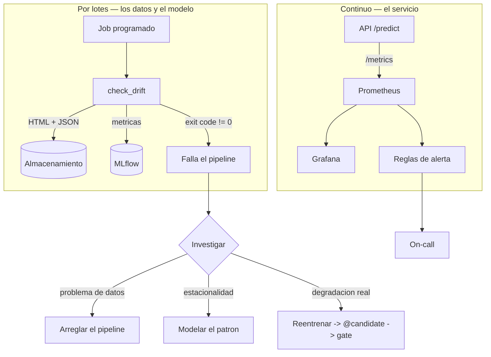

# Guion de clase — Sesión 7: Monitoreo, observabilidad y gobernanza

Guion minutado para las **4 horas** del formato de sesión del curso. Cada bloque indica
qué archivo abrir, qué comando correr y qué salida esperar.

**Duración total:** 240 min (4 h), con pausa de 15 min.
**Terminales:** 2 desde el bloque 5 (3 si se abre Grafana en paralelo).
**Directorio base:** la **raíz del repositorio**. Todos los comandos se corren desde ahí.
**Material del estudiante:** [`sesiones/s07-monitoreo/`](../sesiones/s07-monitoreo/).

| Tramo | Min | Bloques |
|---|---|---|
| Arranque | 0-15 | 1 |
| El dolor | 15-40 | 2 |
| Bloque A — medir drift y no engañarse | 40-100 | 3, 4, 5 |
| Pausa | 100-115 | — |
| Bloque B — el check que falla, y el servicio | 115-165 | 6, 7, 8 |
| Gobernanza | 165-185 | 9 |
| Taller | 185-225 | 10 |
| Cierre | 225-240 | 11 |

> **Sobre los tiempos de ejecución:** este guion **no** promete duraciones de comando.
> Depende de la máquina, del cache y de la red del aula. Donde importa, el guion dice
> *mide y compara*, y el número lo produce la clase.

---

## Mapa de archivos

```
src/taxi/monitoring/
├── estadistico.py    Bloque 4: KS, chi2, PSI, JS, tamanos de efecto, veredicto
├── reporte.py        Bloque 6: adapter del dict de Evidently, tabla, JSON
└── check_drift.py    Bloque 6: el check con exit code

sesiones/s07-monitoreo/
├── README.md                                   Bloques 2, 3, 5, 11
├── gobernanza.md                               Bloque 9
├── taller.md                                   Bloque 10
├── notebooks/
│   ├── 01-drift-real.ipynb                     Bloques 3, 4, 5
│   ├── 02-observabilidad-del-servicio.ipynb    Bloques 7, 8
│   └── _generar_notebooks.py                   (fuente de los dos notebooks)
├── plantillas/
│   ├── politica-de-reentrenamiento.md          Bloque 10
│   └── riesgos.md                              Bloque 10
└── _soluciones/                                NO publicar antes del taller
    ├── solucion-taller.md
    ├── politica-de-reentrenamiento-resuelta.md
    ├── riesgos-resuelto.md
    └── evidencia.sh                            Bloque 6 (util para el instructor)

Ya existente y que se reutiliza:
src/taxi/api/metricas.py                        Bloque 8
observabilidad/grafana/dashboards/api-modelo.json   Bloque 8
docs/adr/003-umbrales-de-drift.md               Bloques 5 y 11
```

---

## BLOQUE 1 — Arranque (0-15 min)

**Archivos:** ninguno. **Terminales:** 0.

1. **Arranque directo** (5 min): dudas sueltas de S06 si las hay, y en una frase propia lo que quedó — CI/CD, gate de
   promoción, aliases, rollback. La pregunta de cierre que conecta con hoy: *"el modelo
   pasó el gate en marzo. Hoy es agosto. ¿Sigue siendo bueno? ¿Cómo lo sabes?"*
2. **Revisión del CI de los talleres entregados** (7 min): abrir dos PR de estudiantes,
   mirar el workflow. Rutina de todas las sesiones.
3. **Encuadre de hoy** (3 min): "Ya saben construir, entrenar, servir y desplegar con
   control. Hoy construimos lo único que no tiene final: la parte que avisa cuando lo que
   desplegaron dejó de servir. Y vamos a descubrir que la parte difícil no es medir; es
   decidir qué hacer con la medición."

---

## BLOQUE 2 — El dolor (15-40 min)

**Archivos:** ninguno ejecutable al principio. **Terminales:** 1.

Tres actos. No se abre Evidently hasta el bloque 6.

### Acto 1 — El tutorial que ya no ejecuta (8 min)

Abrir la versión anterior del material de esta sesión (está en el historial de git) y
copiar su snippet estrella en una terminal:

```bash
uv run python -c "from evidently.report import Report"
```

`ModuleNotFoundError`. No es una deprecación con aviso: el módulo fue eliminado en 0.7.

**Qué preguntar:** "Este material tenía dos años. ¿Cuántos tutoriales de los que van a
encontrar hoy en Google están así? ¿Cómo lo sabrían **antes** de basar su proyecto en
ellos?" Respuesta que se busca: declarando la versión con la que se verificó, y el
lockfile.

Segundo golpe, en la misma línea: `pip index versions whylogs` (o la página de PyPI).
Última release, diciembre de 2024. Estaba recomendado en la tabla de herramientas del
material anterior, sin fecha.

### Acto 2 — El detector que siempre dice sí (10 min)

Mostrar el otro snippet del material anterior: `np.random.exponential(3.0)` contra
`(5.5)`, y `drift = p_value < 0.05`.

Dos problemas, y hay que dejar que la clase los encuentre:

1. **El drift es inventado**, así que el resultado nunca es ambiguo. Nadie tiene que
   decidir nada.
2. **El criterio es incorrecto** con volúmenes reales. Escribir en la pizarra
   `D_critico ≈ 1.36·sqrt(2/n)` y calcularlo en voz alta para n = 1.000, 60.000 y
   500.000: 0.061, 0.008, 0.003.

**La frase del bloque:** "Con medio millón de filas, `p < 0.05` alerta siempre. Un
detector que siempre dice sí tiene exactamente la misma información que uno que siempre
dice no."

### Acto 3 — El dashboard verde (7 min)

Pregunta directa: "Su API responde en 8 ms, cero errores 5xx, throughput estable. ¿Está
el modelo funcionando bien?"

Dejar que se equivoquen. Entonces: el servicio puede estar devolviendo basura en 8 ms.
Prometheus mide el **servicio**; nada de lo que hay en ese dashboard habla del modelo.

Cerrar con las dos preguntas de la sesión escritas en la pizarra, que se quedan ahí las
cuatro horas:

- **¿el servicio está sano?** → Prometheus / Grafana
- **¿el modelo sigue siendo válido?** → Evidently / estadística

---

## BLOQUE 3 — Taxonomía y label lag (40-60 min)

**Archivos:** `README.md` sección 2. **Terminales:** 0-1.

### 3.1 Los cuatro fenómenos (8 min)

Tabla del README sección 2. Insistir en la cuarta columna, que es la que decide qué se puede
hacer mañana: **¿es observable sin etiquetas?**

- data drift → sí
- prediction drift → sí
- **concept drift → no directamente**
- degradación de performance → solo con etiquetas

Contraejemplo para fijarlo: "Se abre un carril nuevo. Las features no cambian nada:
mismo origen, mismo destino, misma distancia. ¿Qué test lo detecta?" Ninguno. Cambió
`P(y|X)`, y para verlo hacen falta etiquetas.

### 3.2 Label lag (10 min)

Tabla del README sección 2.2. Recorrerla con los proyectos **de los estudiantes**: que cada uno
diga en voz alta el label lag del suyo. Es el momento más útil del bloque, porque
determina qué monitoreo puede construir cada uno.

Regla que se escribe: **cuanto mayor es el label lag, más peso tiene el monitoreo de
datos**, porque es la única señal dentro del horizonte de decisión.

Y el problema fino, si el nivel del grupo lo permite: *selective labeling*. Si solo
llegan etiquetas de las filas en las que se actuó, la muestra etiquetada está sesgada
por la decisión del propio modelo, y medir performance sobre ella sobreestima la
calidad.

### 3.3 Encuadre del caso guía (2 min)

`PARTICIONES_TRAIN` = 2023-01..03 · `PARTICIONES_PRODUCCION` = 2023-07 y 2024-01. Drift
real: estacionalidad de verano y un año de distancia. Cero `np.random`.

---

## BLOQUE 4 — Medir a mano, con scipy (60-85 min)

**Archivos:** `notebooks/01-drift-real.ipynb` (pasos 1 a 4),
`src/taxi/monitoring/estadistico.py`. **Terminales:** 1 + notebook.

### 4.1 Mirar antes de medir (6 min)

Correr las celdas de histogramas y CDF empíricas. Señalar en la CDF **dónde está el
estadístico `D`**: la máxima separación vertical entre las dos curvas. Que lo vean como
una distancia y no como un número que devuelve una función.

### 4.2 Los cuatro instrumentos (10 min)

Correr la celda de la tabla KS / chi² / PSI / JS. Los puntos que hay que decir, en este
orden:

1. **El `D` del KS ya es un tamaño de efecto**: acotado, independiente de `n`,
   interpretable. Es lo que lo hace un buen primer test.
2. **El chi² no lo es**: crece linealmente con `n`. De ahí la **V de Cramér**.
3. **El PSI no está acotado.** Enseñar el caso real: con categorías nuevas se ven PSI de
   14, porque `p_ref` se sustituye por un epsilon. Buena señal, mala escala.
4. **La distancia de Jensen-Shannon sí está acotada** en [0,1], y por eso es comparable
   entre features y entre periodos.

Abrir `estadistico.py` en el binning: los bordes se toman por **cuantiles de la
referencia**, y los extremos se abren a ±inf. Preguntar por qué. (Si los bordes cambian
con los datos nuevos, el PSI de dos periodos no es comparable; si los extremos se
cierran, el valor más extremo jamás visto —que es la observación más informativa—
desaparece del histograma.)

### 4.3 La trampa, con datos reales (12 min)

**Este es el bloque central de la sesión.** Correr la celda del barrido de `n`: la misma
diferencia entre enero y julio, submuestreada a tamaños crecientes.

Lo que se ve: el `D` se mantiene estable —es una propiedad de las distribuciones— y el
p-valor se derrumba. **Mide y compara** los números que salgan en el aula.

Después, la comparación de los tres criterios sobre los mismos datos:

```bash
uv run python -m taxi.monitoring.check_drift --sin-evidently --criterio efecto  --actual 2023-07
uv run python -m taxi.monitoring.check_drift --sin-evidently --criterio p_valor --actual 2023-07
uv run python -m taxi.monitoring.check_drift --sin-evidently --criterio psi     --actual 2023-07
```

Salida esperada (medida en agosto de 2026; **verificar antes de la cohorte**): el
criterio por p-valor marca **7 de 7** columnas, el criterio por efecto **2 de 7**, el
criterio por PSI **1 de 7**. Mismos datos, tres respuestas.

**La pregunta:** "¿Cuál de las tres es la correcta?" La respuesta correcta no es "la
segunda": es "depende de lo que cueste equivocarse en cada dirección, y eso hay que
escribirlo". Pero la primera es **incorrecta por construcción** con este `n`.

---

## BLOQUE 5 — Calibrar el umbral (85-100 min)

**Archivos:** notebook 01 (paso 4, calibración), `docs/adr/003-umbrales-de-drift.md`.

### 5.1 El control negativo (5 min)

Partir la referencia en dos mitades aleatorias y correr el detector. **Debe dar cero.**

Preguntar antes de correr: "¿Qué debería salir?" Y después: "¿Cuántos de ustedes tienen
este test en su proyecto?" Es el test que valida el detector, y casi nadie lo escribe.

Matiz honesto que hay que dar: sobre el nulo verdadero, el criterio por p-valor **también
da cero**. Su tasa de error es alfa, por construcción. El problema del p-valor no está en
el nulo, está en las alternativas ciertas pero triviales, que es lo que midió el bloque
4.3. Decirlo evita enseñar una caricatura.

### 5.2 El ruido del instrumento (10 min)

Correr la celda de calibración: ruido bajo el nulo / umbral configurado / señal
observada.

El hallazgo que hay que dejar que aparezca solo: **`PU_DO` marca ~0.12 sobre datos donde
no pasa nada.** La V de Cramér tiene sesgo positivo con muchas celdas de conteo bajo. Un
umbral de 0.10 —el default razonable para una categórica— queda **por debajo de su
propio ruido**.

**La regla del bloque:** el umbral se fija **después** de medir el ruido, no antes. Un
umbral por debajo de la línea base nula garantiza falsos positivos, y es así como se
entrena a un equipo para ignorar sus alertas.

Cerrar mostrando el ADR 003: la decisión escrita, con las seis alternativas descartadas.
Las tres que suenan bien y no lo son: alfa más estricto, Bonferroni, y delegar el umbral
al `drift_share` de Evidently.

---

## PAUSA (100-115 min)

---

## BLOQUE 6 — Evidently 0.7 y el check que falla (115-140 min)

**Archivos:** notebook 01 (paso 5), `check_drift.py`, `reporte.py`. **Terminales:** 2.

### 6.1 La tabla de migración (7 min)

README sección 4.2, en pantalla. Los tres cambios que rompen todo lo que hay en internet:

| Antes | Ahora |
|---|---|
| `from evidently.report import Report` | `from evidently import Report` |
| `ColumnMapping(...)` | `DataDefinition(...)` + `Dataset.from_pandas(...)` |
| `report.run(reference_data=ref, current_data=cur)` | `report.run(cur, ref)` — **primero el actual** |

Detenerse en el tercero: **no lanza error**, invierte la comparación. Preguntar qué
consecuencia tiene. (Las distancias son simétricas, así que el veredicto de drift apenas
cambia; pero las métricas de resumen y calidad describen el dataset equivocado.)

### 6.2 La trampa del `value` (6 min)

Correr la celda que imprime el `dict()` y mirar el `metric_name`:
`ValueDrift(column=trip_distance,method=Wasserstein distance (normed),threshold=0.1)`.

**El `value` no es un p-valor.** Con el default de 0.7 para numéricas es una distancia,
así que hay drift si `value >= threshold`; con `method="ks"` es un p-valor y hay drift si
`value < threshold`. Invertirlo invierte el veredicto sin error.

Por eso el curso lee el `status` de la sección `tests` en lugar de comparar a mano.

### 6.3 El adapter (7 min)

Abrir `reporte.desde_evidently`. Una función, un archivo. Diagrama del README sección 4.4.

**La lección, que no es sobre monitoreo:** depende de la interfaz que **tú** controlas,
no de la que controla tu proveedor. El material anterior tenía el parsing del dict en el
snippet que el estudiante copiaba, así que un cambio de versión de la librería rompió el
material y todos los proyectos a la vez.

Segundo argumento, en la misma función: es tolerante a claves faltantes **a propósito**.
Un monitoreo que se cae por un cambio de dependencia deja al sistema sin señal justo
cuando nadie lo nota.

### 6.4 El exit code (5 min)

**Este es el bloque que convierte el monitoreo en ingeniería.** Dos comandos seguidos:

```bash
uv run python -m taxi.monitoring.check_drift --actual 2023-07 --umbral 0.10 --sin-mlflow
echo $?   # 1

uv run python -m taxi.monitoring.check_drift \
  --referencia 2023-01,2023-02,2023-03 --actual 2023-01,2023-02,2023-03 --sin-mlflow
echo $?   # 0
```

(El instructor puede generar toda la evidencia de golpe con
`bash sesiones/s07-monitoreo/_soluciones/evidencia.sh`.)

Los tres exit codes: `0` sin alerta, `1` umbral superado, `2` **no evaluable**.
Preguntar por qué existe el 2. (Porque "no pude medir" no es "todo bien", y un pipeline
que los confunde reporta verde cuando se quedó sin datos.)

**Nota de honestidad que hay que dar en voz alta:** con el umbral real del curso (30%),
julio de 2023 **no** dispara la alerta — solo 1 de 7 columnas supera su umbral. El
`--umbral 0.10` del primer comando es para demostrar el **mecanismo**, no el veredicto.
Con drift sintético las dos cosas se confunden; ese era el problema del material
anterior.

### 6.5 Degradación elegante (2 min)

`--sin-evidently` fuerza el motor de scipy. Se pierde el HTML, no la detección. Y el
motivo: la última release de Evidently es de marzo de 2026 y la cadencia previa era
mensual. Un check crítico no debería quedarse sin señal porque una dependencia opcional
se detuvo.

---

## BLOQUE 7 — Prometheus: los tipos y el p95 (140-155 min)

**Archivos:** `notebooks/02-observabilidad-del-servicio.ipynb`.

### 7.1 Counter / Gauge / Histogram / Summary (5 min)

Tabla del notebook. La pregunta que decide entre Histogram y Summary: **"¿vas a agregar
esta métrica entre instancias?"** Con tres réplicas detrás de un balanceador, un
`Summary` da tres p95 y **no hay forma matemática de combinarlos**: el promedio de tres
percentiles no es un percentil. Por eso el curso usa `Histogram`.

### 7.2 Leer `/metrics` a mano (4 min)

Correr la celda de `generate_latest`. Tres cosas que hay que señalar con el dedo:

1. un `Histogram` genera **tres** familias: `_bucket`, `_sum`, `_count`;
2. los buckets son **acumulativos** (`le="0.05"` cuenta todo lo ≤ 0.05, no el intervalo);
3. existe `le="+Inf"` y es igual a `_count`.

### 7.3 Calcular el p95 (6 min)

Correr `cuantil_desde_buckets`, que es `histogram_quantile` reimplementado en diez
líneas, y comparar con `np.percentile`.

Lo que hay que sacar: **el p95 de un histograma nunca es exacto**, es una interpolación
lineal dentro del bucket donde cae el percentil. Y si cae en `+Inf`, PromQL devuelve el
último borde finito y la cola queda invisible.

Después, la celda de comparación de buckets. **Mide y compara**: mirar las dos columnas
de error, p50 y p95, no solo el p95. Con buckets mal elegidos (tres buckets, el primero
en 1 s) el error es de órdenes de magnitud. Con los afinados del curso —y **menos**
buckets que los de por defecto— el p50 es casi exacto.

Los tres criterios para elegir buckets: que el SLO sea un borde exacto; espaciado
logarítmico alrededor de la latencia típica; pocos buckets, porque cada uno es una serie
más multiplicada por cada combinación de labels. Y el aviso: **cambiar los buckets rompe
la comparabilidad histórica** del cuantil.

---

## BLOQUE 8 — La instrumentación real y el dashboard (155-165 min)

**Archivos:** `src/taxi/api/metricas.py`,
`observabilidad/grafana/dashboards/api-modelo.json`. **Terminales:** 2-3.

```bash
docker compose up -d
curl -s localhost:8000/metrics | grep '^taxi_' | head -20
# Grafana en localhost:3000 -> dashboard "API de inferencia - modelo de duracion"
```

Tres decisiones de `metricas.py` que hay que explicar porque son las que se olvidan:

1. **Pre-inicializar los counters de error en 0.** Sin eso,
   `rate(taxi_errores_total[5m])` no devuelve `0`: no devuelve **nada**, y el panel
   muestra "No data", indistinguible de "el exporter está caído".
2. **`Gauge` con `.clear()` para la info del modelo**, no el tipo `Info`. Al promover
   hay que dejar de reportar la versión anterior; con `Info` quedarían dos series
   activas.
3. **`tipo` de error como conjunto cerrado.** Usar el nombre de la excepción como label
   deja que una librería de terceros decida la cardinalidad de tus métricas, y puede
   filtrar internals a un endpoint público.

Y el puente entre las dos mitades de la sesión: el panel **"Distribución de predicciones
por clase"**. Es prediction drift observable en tiempo real, con una métrica de
Prometheus, sin etiquetas y sin esperar un lote. No sustituye al check de drift; es la
señal temprana.

Cerrar con la regla de cardinalidad: nunca un label con id de request, zona o timestamp.
`PU_DO` tiene miles de valores.

---

## BLOQUE 9 — Cuándo reentrenar, y gobernanza (165-185 min)

**Archivos:** `README.md` sección 7, `gobernanza.md`, notebook 01 (pasos 6 y 7).

### 9.1 La pregunta ambigua (8 min)

**El bloque que más se recuerda de la sesión.** Correr las dos celdas finales del
notebook 01 y poner los resultados en la pizarra:

- comparación de efectos: mismo mes del año siguiente vs otro mes del mismo año;
- degradación de RMSE en 2023-04 (validación), 2023-07 y 2024-01.

Resultado medido en agosto de 2026 (**verificar antes de la cohorte**): en las siete
columnas el efecto contra julio es mayor que contra enero del año siguiente, y el RMSE
de julio empeora ~3% mientras el de enero de 2024 **mejora** respecto a validación.

Es decir: **hay drift de datos medible y no hay degradación relevante de performance.**

**Preguntar antes de mostrar el RMSE:** "El detector está rojo. ¿Reentrenamos?" Dejar
que voten. Luego mostrar el RMSE.

La conclusión que hay que construir con ellos: la respuesta correcta a una alerta de
drift es **investigar**, y reentrenar es solo una de las salidas. Si el patrón es
estacional, reentrenar es perseguir la propia cola: el modelo se ajusta a julio, llega
septiembre y vuelve a "driftear". La alternativa es **modelar la estacionalidad** y
entrenar con más de un ciclo.

Tabla de estrategias del README sección 7, con la última fila subrayada: *no reentrenar,
modelar el cambio*. Y la regla que no se negocia, heredada de S06: el reentrenamiento
produce `@candidate`, nunca `@champion`.

### 9.2 Tres marcos, tres preguntas (7 min)

`gobernanza.md` sección 1:

- **AI Act** = qué exige la ley (obligatorio, no certificable);
- **ISO/IEC 42001** = cómo organizas la gobernanza (voluntario, **certificable**);
- **NIST AI RMF** = cómo razonas el riesgo técnico (Govern / Map / Measure / Manage).

Mostrar el mapeo de las cuatro funciones del RMF a archivos que **ya existen** en el
repositorio. El mensaje: no es burocracia añadida; es lo que ya hacen, escrito.

### 9.3 Las fechas, con la corrección del Omnibus (5 min)

Tabla de `gobernanza.md` sección 2. Los tres puntos:

1. el **AI Omnibus entró en vigor el 27 de julio de 2026** y aplazó el alto riesgo:
   anexo III al **2-dic-2027**, anexo I al **2-ago-2028**;
2. **la transparencia del art. 50 sí aplica desde el 2-ago-2026** — no se aplazó, y es
   la parte que más equipos ignoran porque no se sienten "de alto riesgo";
3. prohibiciones y alfabetización en IA desde **feb-2025**; GPAI desde **ago-2025**.

Y el mensaje meta: este documento lleva **fecha de verificación y enlaces primarios**
porque la información legal caduca. Igual que la tabla de herramientas. Igual que el
snippet de Evidently del bloque 2.

El caso guía **no** es de alto riesgo, y eso es lo didáctico: recorrer la tabla de
variantes de `gobernanza.md` sección 2.1 y ver que lo que mueve la clasificación no es la
técnica —el mismo XGBoost en todos los casos— sino **sobre quién decide y con qué
consecuencia**.

Cerrar con el art. 72: el **monitoreo post-mercado es una obligación legal** para alto
riesgo, y lo que la satisface es exactamente el HTML, el JSON y el exit code de esta
sesión, más el registro escrito de qué se hizo cuando saltó.

---

## BLOQUE 10 — Taller (185-225 min)

**Archivo:** [`sesiones/s07-monitoreo/taller.md`](../sesiones/s07-monitoreo/taller.md)

Los estudiantes trabajan **en su propio repositorio**. El instructor circula. Se entrega
en clase.

Los diez criterios de aceptación están en el enunciado. Los cuatro que hay que recordar
en voz alta al empezar:

- el criterio 2 (falla con drift) **no vale nada sin el criterio 3** (pasa sin drift);
- el criterio 5 exige **calibrar**: copiar los umbrales del curso es motivo de
  devolución;
- el criterio 6 se verifica con `curl | grep -c`, no con una captura;
- el criterio 8: el aprobador es **una persona**, no "el equipo".

Quien acabe antes: las plantillas de gobernanza rellenadas de verdad, y el análisis
drift-vs-estacionalidad de su propio dataset.

**No publicar `_soluciones/` antes del taller.**

### Errores que van a aparecer, con su causa

| Síntoma | Causa habitual |
|---|---|
| `ModuleNotFoundError: evidently.report` | tutorial de 0.6. La API vigente es `from evidently import Report` |
| `TypeError` en `report.run(...)` | se pasaron `reference_data=` / `current_data=` como kwargs; ahora son posicionales, `(current, reference)` |
| El reporte sale pero describe el dataset equivocado | orden invertido en `run()`. No lanza error |
| `Duplicated timeseries in CollectorRegistry` | se registró la misma métrica dos veces en el registro global; en un notebook pasa al re-ejecutar la celda. Usar un `CollectorRegistry()` propio |
| El panel de Grafana dice "No data" | el counter con labels no existe hasta la primera llamada a `.labels(...)`. Pre-inicializar |
| El p95 del dashboard "no cambia nunca" | todas las observaciones caen en el mismo bucket. Buckets mal elegidos |
| El check nunca falla | el exit code no se propaga: se usó `ctx.exit()` bajo `standalone_mode=False`, o se capturó `SystemExit` |
| El detector marca todas las columnas | criterio por p-valor con `n` grande, o umbral por debajo del ruido |
| El detector no marca nada, nunca | umbral demasiado alto, o el "actual" es un submuestreo del mismo periodo |
| `KeyError` al leer el `dict()` de Evidently | se está parseando la forma de 0.6 (`["metrics"][0]["result"]["drift_by_columns"]`) |

---

## BLOQUE 11 — Cierre (225-240 min)

### 11.1 Autoverificación (7 min)

Las cinco preguntas del README sección 9, en voz alta y por sorteo:

1. Label lag de 12 meses y un proveedor cambia la escala de una feature de 0-100 a 0-1.
   ¿Qué lo detecta hoy y qué no lo detectaría a tiempo?
2. KS sobre 500.000 filas, `D = 0.004`, `p = 1e-9`. ¿Alertas? Con números.
3. ¿Por qué `run(ref, cur)` y `run(cur, ref)` dan reportes distintos sin lanzar error?
4. Dashboard todo verde y un usuario dice que las predicciones no tienen sentido. ¿Es
   posible? ¿Qué mirarías?
5. Drift en `hora_pickup` cada julio, tres años seguidos. ¿Reentrenas?

### 11.2 Qué NO usar (3 min)

Tabla del README sección 10. Los siete que hay que leer en voz alta: la API vieja de Evidently
(`evidently.report`, `evidently.metric_preset`, `ColumnMapping`, `as_dict()`,
`TestSuite` suelto), `p < 0.05` como único criterio, drift sintético con `np.random`,
umbral global para todas las features, labels de alta cardinalidad en Prometheus,
dashboards hechos a mano en la UI, y whylogs/WhyLabs OSS (última release: diciembre de
2024).

### 11.3 Tarea y puente a S08 (5 min)

Para el proyecto: check de drift con exit code en el CI, umbrales calibrados con su
ADR, `/metrics` con tres o más métricas graficadas, política de reentrenamiento y
registro de riesgos.

Puente: "Ya tienen un sistema de ML que se entrena, se sirve, se despliega con control y
avisa cuando se degrada. La sesión que viene: qué de todo esto sigue funcionando cuando
el modelo es un LLM que no entrenaste tú, y qué hay que reinventar. Pista: el monitoreo
es lo que cambia más."

---

## Anexo A — Clase y producción: qué cambia y qué no

| Aspecto | En clase | En producción |
|---|---|---|
| Código del check | `src/taxi/monitoring/check_drift.py` | **exactamente el mismo** |
| Referencia | particiones de train cacheadas | snapshot versionado del dataset de entrenamiento del champion |
| "Actual" | una partición histórica fija | el lote del día, o una ventana móvil de tráfico real |
| Quién lo ejecuta | tu terminal | un job programado del orquestador |
| Qué pasa si falla | `echo $?` | alerta al on-call, ticket, o bloqueo del despliegue |
| Artefactos | `reports/*.html` local | object storage, con retención declarada |
| Métricas del servicio | `/metrics` en localhost | Prometheus con retención y reglas de alerta |
| Dashboards | provisionados por `docker compose` | los mismos JSON, provisionados por IaC |
| Umbrales | `UMBRALES_POR_FEATURE` en el código | los mismos, en el código, versionados y con ADR |



**Mensaje final:** "El monitoreo no es un informe. Es la parte del sistema que tiene
autoridad para detener un despliegue y para llamar a alguien. Si el suyo no puede hacer
ninguna de las dos cosas, todavía no es monitoreo."

---

## Anexo B — Checklist antes de clase

- [ ] `uv run taxi data` ejecutado: las 7 particiones en `data/processed/`, para que los
      bloques 4, 5 y 9 no dependan de la red del aula.
- [ ] `bash sesiones/s07-monitoreo/_soluciones/evidencia.sh` corrido en la máquina del
      instructor: confirma exit code 1 con drift, 0 sin drift, y regenera la tabla de
      calibración con los números de **esta** cohorte.
- [ ] `uv run pytest tests/unit/test_monitoring.py -q` en verde.
- [ ] Los dos notebooks ejecutados de arriba abajo **antes** de clase. Si se editan, se
      regeneran con `uv run python sesiones/s07-monitoreo/notebooks/_generar_notebooks.py`
      y se publican **sin outputs**.
- [ ] `docker compose up -d` funcionando: API en 8000, Prometheus en 9090, Grafana en
      3000. Dashboard visible sin configurar nada a mano.
- [ ] Un modelo en `@champion` en el MLflow local, para el bloque 8.
- [ ] Puertos libres: 8000, 9090, 3000, 5001.
- [ ] **Verificada la versión de `evidently` instalada** y comprobado que la tabla de
      migración del README sigue siendo correcta. Es la tabla que envejece más rápido de
      todo el curso.
- [ ] **Verificadas las fechas del AI Act** contra las fuentes primarias enlazadas en
      `gobernanza.md`. Cambiaron en julio de 2026 y pueden volver a cambiar.
- [ ] Verificada la última release de whylogs y de Evidently (la tabla de herramientas
      del README sección 10 declara fechas: si están desactualizadas, el material pierde
      justamente el argumento que quiere enseñar).
- [ ] Decidido si se publica `_soluciones/` (recomendación: no antes del taller).
