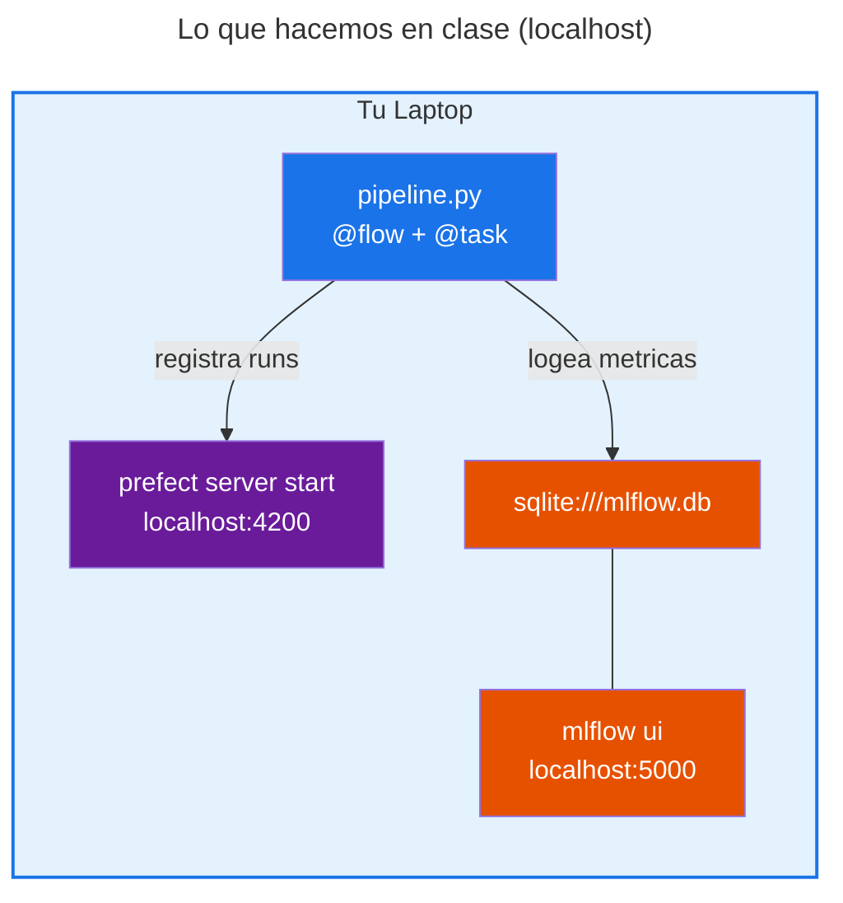
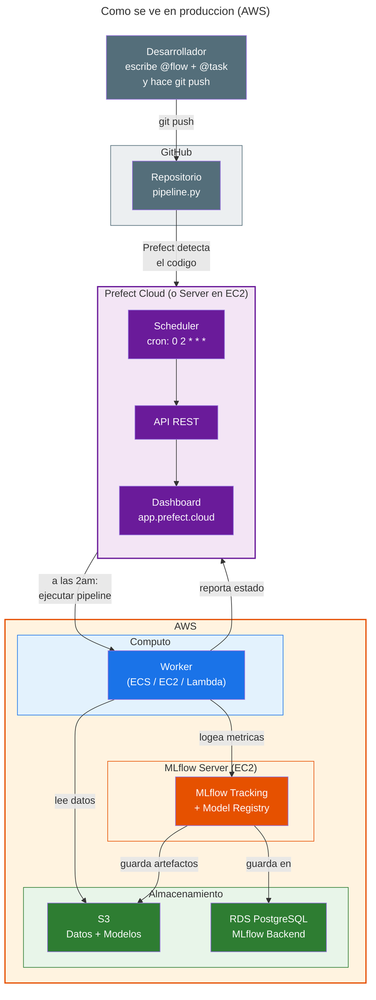

# Guia de Clase: Orquestacion de Pipelines de ML con Prefect

Guia paso a paso para explicar **todo** el contenido de `03-Orchestration/`.
Cada bloque indica que archivo abrir, que comando correr, que salida esperar, y que diagrama mostrar.

**Duracion total:** ~3 horas (sin Mage)
**Terminales necesarias:** 2 (a partir del Bloque 5)
**Directorio base:** `03-Orchestration/`

---

## Mapa de archivos completo

Antes de empezar, esta es la lista completa de **todo** lo que hay en `03-Orchestration/`. Cada archivo se cubre en esta guia.

```
03-Orchestration/
│
├── 00-intro-prefect/                    # BLOQUES 2-8: Conceptos basicos
│   ├── flows/                           # Ejemplos progresivos de flows
│   │   ├── weather1-bare.py             # Bloque 2: Flow minimo
│   │   ├── weather1-flow.py             # Bloque 2: Flow con decorador (variante)
│   │   ├── weather1-serve.py            # Bloque 5: Serve + dashboard
│   │   ├── weather1-serve-params.py     # Bloque 5: Serve con parametros
│   │   ├── weather1-serve-schedule.py   # Bloque 6: Cron automatico
│   │   ├── weather1-deploy.py           # Bloque 8: Deploy remoto (referencia)
│   │   ├── serve-two-flows.py           # Bloque 7: Multiples flows
│   │   └── serve-two-flows-scheduled.py # Bloque 7: Multiples flows + cron
│   │
│   ├── workflows/                       # Funcionalidades avanzadas
│   │   ├── my-first-task.py             # Bloque 3: @task + @flow
│   │   ├── retries.py                   # Bloque 4: Reintentos
│   │   ├── simple-artifacts.py          # Bloque 8: Artifacts basicos
│   │   ├── artifacts-ml.py              # Bloque 8: Artifacts de ML (extendido)
│   │   ├── runtime_context.py           # Bloque 8: runtime.flow_run.name
│   │   ├── get_variable.py              # Bloque 8: Variables de Prefect
│   │   ├── create_secret.py             # Bloque 8: Crear secretos
│   │   └── openai_with_secret.py        # Bloque 8: Usar secretos con API
│   │
│   ├── infrastructure/
│   │   └── prefect-yaml-guide.md        # Bloque 8: Guia escrita de prefect.yaml
│   │
│   └── prefect.yaml                     # Bloque 8: Ejemplo de config YAML
│
├── Prefect-pipelines/                   # BLOQUES 9-10: Pipeline completo
│   ├── pipeline.py                      # Bloque 9: Flow principal
│   ├── deploy.py                        # Bloque 10: Deployment automatico
│   ├── models/
│   │   └── preprocessor.b              # Archivo generado (DictVectorizer serializado)
│   └── src/                             # Bloque 9: Codigo modular
│       ├── __init__.py
│       ├── config/
│       │   ├── __init__.py              # Re-exporta constantes y setup
│       │   ├── constants.py             # Constantes del pipeline
│       │   └── mlflow_setup.py          # Conexion a MLflow
│       ├── data/
│       │   ├── __init__.py              # Re-exporta funciones de datos
│       │   ├── loaders.py               # @task: descargar datos con cache
│       │   ├── validators.py            # @task: validar calidad
│       │   └── utils.py                 # Calcular periodo siguiente
│       ├── features/
│       │   ├── __init__.py
│       │   └── engineering.py           # @task: DictVectorizer
│       └── models/
│           ├── __init__.py
│           └── optimization.py          # @task: Optuna + XGBoost + MLflow
│
├── Mage-pipelines/                      # BLOQUE 11 (no se ejecuta en clase)
│   ├── comparacion_orquestadores.ipynb  # Notebook: comparacion detallada
│   ├── setup_and_run.sh                 # Script de instalacion
│   ├── pyproject.toml                   # Dependencias aisladas
│   ├── test_blocks.py                   # Tests de los bloques
│   └── nyc_taxi_project/               # Proyecto Mage
│       ├── metadata.yaml                # Config del proyecto
│       ├── io_config.yaml               # Config de conexiones
│       ├── data_loaders/
│       │   ├── __init__.py
│       │   └── load_taxi_data.py        # Equivalente a loaders.py
│       ├── transformers/
│       │   ├── __init__.py
│       │   ├── validate_data.py         # Equivalente a validators.py
│       │   └── create_features.py       # Equivalente a engineering.py
│       ├── data_exporters/
│       │   ├── __init__.py
│       │   └── train_model.py           # Equivalente a optimization.py
│       ├── pipelines/
│       │   └── nyc_taxi_training/
│       │       ├── __init__.py
│       │       └── metadata.yaml        # Grafo del pipeline (bloques y conexiones)
│       └── utils/
│           ├── __init__.py
│           └── constants.py             # Constantes compartidas
│
├── diagrams/                            # 12 PNGs educativos
│   ├── generate_diagrams.py             # Script para regenerar
│   ├── 01_el_problema.png
│   ├── 02_cinco_pilares.png
│   ├── 03_flow_y_task.png
│   ├── 04_grafo_dependencias.png
│   ├── 05_estados_ejecucion.png
│   ├── 06_reintentos.png
│   ├── 07_caching.png
│   ├── 08_deployment.png
│   ├── 09_arquitectura.png
│   ├── 10_pipeline_ml_completo.png
│   ├── 11_prefect_mlflow.png
│   └── 12_panorama_orquestadores.png
│
└── README.md
```

---

## BLOQUE 1: Motivacion (10 min)

**Archivos:** ninguno (solo diagramas y pizarra)
**Terminales:** 0

### Que explicar

"Hasta ahora tienen scripts de Python que corren manualmente. Eso funciona para aprender, pero en produccion un modelo necesita reentrenarse cada dia, cada semana, o cuando llegan datos nuevos. Que pasa si el script falla a las 3am? Quien se entera?"

### Diagrama: El Problema


**Guion:** "A la izquierda: lo que hacen hoy. Scripts sueltos, ejecucion manual, si falla nadie se entera. A la derecha: con un orquestador. El mismo codigo, pero ahora tiene estado, logs, reintentos, y un dashboard donde ven todo."

### Diagrama: Los 5 Pilares


**Guion:** "La orquestacion resuelve 5 cosas. Estos 5 pilares aplican a CUALQUIER herramienta: Prefect, Airflow, Mage, Dagster. La herramienta cambia, el concepto no."

1. **Definir pasos claros** — cada paso es una funcion
2. **Conectarlos en un flujo** — un paso le pasa datos al siguiente
3. **Automatizar** — cron, intervalos, triggers
4. **Observar** — dashboard, logs, artefactos
5. **Manejar errores** — retries, alertas

---

## BLOQUE 2: Flow minimo (15 min)

**Archivo:** `00-intro-prefect/flows/weather1-bare.py`
**Terminales:** 1

### Que es este archivo

Una funcion normal de Python que consulta una API publica del clima (Open-Meteo). La unica diferencia con codigo normal es que tiene `@flow` encima. Eso es todo.

### Codigo clave

```python
from prefect import flow

@flow
def fetch_weather(lat: float = 38.9, lon: float = -77.0):
    # Consulta API publica del clima
    temps = httpx.get(base_url, params=dict(latitude=lat, longitude=lon, hourly="temperature_2m"))
    forecasted_temp = float(temps.json()["hourly"]["temperature_2m"][0])
    print(f"Forecasted temp C: {forecasted_temp} degrees")
    return forecasted_temp

if __name__ == "__main__":
    fetch_weather()
```

### Comando

```bash
uv run python 00-intro-prefect/flows/weather1-bare.py
```

### Salida esperada

```
13:45:01.123 | INFO    | prefect.engine - Created flow run 'crimson-falcon' for flow 'fetch-weather'
13:45:01.124 | INFO    | Flow run 'crimson-falcon' - View at ...
Forecasted temp C: 22.3 degrees
13:45:02.456 | INFO    | Flow run 'crimson-falcon' - Finished in state Completed()
```

### Que explicar

"Con solo agregar `@flow`, Prefect automaticamente:
- Le puso un nombre aleatorio al run (`crimson-falcon`)
- Midio cuanto tardo
- Reporto que completo exitosamente
- Ustedes no escribieron nada de eso"

### Archivo variante: `weather1-flow.py`

Es exactamente el mismo codigo pero con `@flow()` (con parentesis). No cambia nada funcional. Solo es para mostrar que ambas formas son validas.

---

## BLOQUE 3: Flow + Tasks (15 min)

**Archivo:** `00-intro-prefect/workflows/my-first-task.py`
**Terminales:** 1

### Diagrama: Flow y Task


**Guion:** "A la izquierda: su codigo Python normal con decoradores. A la derecha: lo que Prefect 've'. El `@flow` es el contenedor, los `@task` son los pasos dentro. Prefect sabe que `cargar_datos` va antes que `entrenar` porque uno le pasa datos al otro."

### Que es este archivo

Ahora la funcion esta dividida en 2 `@task` separados:
- `fetch_weather` — descarga la temperatura (el dato)
- `save_weather` — guarda el resultado en un archivo CSV y crea un artifact

El `@flow` los conecta: llama primero a `fetch_weather`, le pasa el resultado a `save_weather`.

### Codigo clave

```python
@task
def fetch_weather(lat: float, lon: float):
    # ... consulta API ...
    return forecasted_temp

@task
def save_weather(temp: float):
    with open("weather.csv", "w+") as w:
        w.write(str(temp))
    create_table_artifact(key="weather-data", table=df.to_dict('records'))
    return "Successfully wrote temp"

@flow(retries=3, log_prints=True)
def pipeline(lat: float = 38.9, lon: float = -77.0):
    temp = fetch_weather(lat, lon)      # Task 1
    result = save_weather(temp)          # Task 2: recibe el resultado del Task 1
    return result
```

### Comando

```bash
uv run python 00-intro-prefect/workflows/my-first-task.py
```

### Salida esperada

```
13:50:01 | INFO | Flow run 'jade-tiger' - Created task run 'fetch_weather-0'
Forecasted temp C: 22.3 degrees
13:50:02 | INFO | Task run 'fetch_weather-0' - Finished in state Completed()
13:50:02 | INFO | Flow run 'jade-tiger' - Created task run 'save_weather-0'
Successfully wrote temp
13:50:03 | INFO | Task run 'save_weather-0' - Finished in state Completed()
13:50:03 | INFO | Flow run 'jade-tiger' - Finished in state Completed()
```

### Que explicar

"Ahora cada task tiene su propio estado. Si `fetch_weather` falla, Prefect sabe EXACTAMENTE cual paso fallo. No solo 'el script fallo'. Ademas, el flow tiene `retries=3`: si todo falla, reintenta 3 veces el flow completo."

### Diagrama: Grafo de Dependencias


**Guion:** "Este es el pipeline completo que vamos a construir al final de la clase. Cada caja es un `@task`. Las flechas son datos que pasan de uno a otro. Prefect ejecuta los tasks en el orden correcto automaticamente."

---

## BLOQUE 4: Reintentos automaticos (10 min)

**Archivo:** `00-intro-prefect/workflows/retries.py`
**Terminales:** 1

### Diagrama: Reintentos


**Guion:** "Sin retries: tu pipeline falla a las 3am y te enteras a las 9am. Con retries: Prefect reintenta automaticamente, esperando entre cada intento para no saturar el servicio."

### Que es este archivo

Un task que hace una peticion HTTP a un servicio que **aleatoriamente** responde 200 (ok) o 500 (error). Tiene `retries=4` y espera 2 segundos entre reintentos.

### Codigo clave

```python
@task(retries=4, retry_delay_seconds=2)
def fetch_random_code():
    status = random.choice([200, 500])   # Aleatoriamente exito o fallo
    random_code = httpx.get(f"https://tools-httpstatus.pickup-services.com/{status}")
    if random_code.status_code >= 400:
        raise Exception(f"Got status code: {random_code.status_code}")
    print(f"Success! Status: {random_code.status_code}")
```

### Comando

```bash
uv run python 00-intro-prefect/workflows/retries.py
```

### Salida esperada (varia porque es aleatorio)

```
14:00:01 | INFO | Task run 'fetch_random_code-0' - Encountered exception during execution:
    Exception: Got status code: 500
14:00:03 | INFO | Task run 'fetch_random_code-0' - Retrying task run (2 of 4)...
14:00:04 | INFO | Task run 'fetch_random_code-0' - Encountered exception during execution:
    Exception: Got status code: 500
14:00:06 | INFO | Task run 'fetch_random_code-0' - Retrying task run (3 of 4)...
Success! Status: 200
14:00:07 | INFO | Task run 'fetch_random_code-0' - Finished in state Completed()
```

### Que explicar

"Corranlo varias veces. A veces funciona al primer intento, a veces necesita 3 reintentos. El punto es: ustedes no escribieron logica de reintento. Solo dijeron `retries=4` y Prefect se encarga."

### Diagrama: Estados de Ejecucion


**Guion:** "Cada task pasa por estos estados. El camino feliz es SCHEDULED -> PENDING -> RUNNING -> COMPLETED. Si falla, va a FAILED. Si tiene retries, pasa a RETRYING y vuelve a RUNNING."

---

## BLOQUE 5: Dashboard + Serve (20 min)

**Archivos:** `00-intro-prefect/flows/weather1-serve.py` y `weather1-serve-params.py`
**Terminales:** 2 (a partir de aqui siempre 2)

Aqui los estudiantes ven por primera vez el **dashboard visual**.

> **IMPORTANTE — Como funciona `.serve()` en Prefect:**
> Cada vez que corren `python archivo.py` con `.serve()`, el flow queda "vivo" esperando runs.
> La terminal queda **bloqueada** — no pueden escribir mas en ella.
> Para detenerlo, presionan **Ctrl+C** en esa terminal. El deployment desaparece.
> Solo pueden tener **un serve corriendo por terminal**. Para correr otro, primero Ctrl+C al anterior.
> Esto aplica para TODOS los bloques siguientes (5, 6, 7, 8, 9, 10).

---

### Paso 5.1 — Terminal 1: Levantar el servidor de Prefect

En la **primera terminal**:

```bash
uv run prefect server start
```

Salida esperada:

```
 ___ ___ ___ ___ ___ ___ _____
| _ | _ | __| __| __/ __|_   _|
|  _|   | _|| _|| _| (__  | |
|_| |_|_|___|_| |___\___| |_|

Configure Prefect to communicate with the server with:
    prefect config set PREFECT_API_URL=http://127.0.0.1:4200/api

Check out the dashboard at http://127.0.0.1:4200
```

**Instruccion a estudiantes:** "Abran http://localhost:4200 en el navegador. Esta vacio por ahora, eso va a cambiar."

> **Terminal 1 queda ocupada para siempre.** No la cierren, no le escriban mas, no le hagan Ctrl+C. Todo lo demas se hace en la Terminal 2. Si cierran esta terminal, el dashboard deja de funcionar.

---

### Paso 5.2 — Terminal 2: Configurar conexion al servidor

Abran una **segunda terminal**. Antes de correr cualquier flow, ejecuten este comando **una sola vez**:

```bash
uv run prefect config set PREFECT_API_URL=http://127.0.0.1:4200/api
```

Salida esperada:

```
Set 'PREFECT_API_URL' to 'http://127.0.0.1:4200/api'.
Updated profile 'default'.
```

> **Si no hacen esto**, cada `.serve()` levanta su propio servidor temporal y **no aparece nada en el dashboard**. Este es el error mas comun. Solo se hace una vez — queda guardado para siempre.

---

### Diagrama: Arquitectura de Prefect


**Guion:** "Lo que acaban de levantar es el Prefect Server. Tiene 3 partes: la API (recibe datos de su codigo), la base de datos (guarda estado), y el dashboard (lo que ven en el navegador). Su codigo se comunica con el server via API REST. El comando `config set` le dijo a su codigo donde esta el server."

---

### Paso 5.3 — Terminal 2: Servir el primer flow

**Archivo:** `00-intro-prefect/flows/weather1-serve.py`

En la misma Terminal 2:

```bash
uv run python 00-intro-prefect/flows/weather1-serve.py
```

Salida esperada:

```
Your flow 'fetch-weather' is being served and polling for scheduled runs!

To trigger a run for this flow, use the following command:
    $ prefect deployment run 'fetch-weather/deploy-1'
```

> La Terminal 2 ahora esta **bloqueada** — el flow esta escuchando. No pueden escribir mas ahi. Eso es normal.

---

### Paso 5.4 — En el navegador: Ver el deployment y lanzar un run

Ahora vayan al navegador (http://localhost:4200) y sigan estos pasos exactos:

**1. Clic en "Deployments"** en el menu izquierdo (no "Runs", no "Flows" — **Deployments**).

**2. Van a ver el deployment `deploy-1`** listado. Hagan clic en el nombre `deploy-1`.

**3. Arriba a la derecha van a ver un boton azul "Run".** Hagan clic para lanzar una ejecucion manual.

**4. Les va a mostrar un formulario con parametros** (lat, lon). Pueden dejar los valores por defecto o cambiarlos. Hagan clic en **"Run"** otra vez para confirmar.

**5. Ahora vayan a "Runs"** en el menu izquierdo. Van a ver el run apareciendo con un nombre aleatorio (ej: `popular-whippet`) y estado verde "Completed".

**6. Hagan clic en el nombre del run** (ej: `popular-whippet`). Adentro ven:
   - **Logs tab:** El output del flow, incluyendo `Forecasted temp C: 22.3 degrees`
   - **Parameters:** Los parametros con los que se ejecuto (lat, lon)
   - **Timeline:** Cuanto tardo cada paso

**Que explicar:** "El flow esta vivo esperando instrucciones. Ustedes lo lanzaron desde la UI. En produccion, en vez de hacer clic manual, le ponen un cron para que se lance solo — eso lo vemos en el siguiente bloque."

> **Tambien pueden lanzar un run desde la terminal** (si tuvieran una tercera terminal abierta):
> ```bash
> uv run prefect deployment run 'fetch-weather/deploy-1'
> ```

---

### Paso 5.5 — Terminal 2: Detener y probar con parametros

**Presionen Ctrl+C en Terminal 2.** El serve se detiene. El deployment `deploy-1` desaparece del dashboard. Esto es normal — `.serve()` crea deployments temporales que viven mientras el proceso corre.

Ahora corran la variante con parametros:

**Archivo:** `00-intro-prefect/flows/weather1-serve-params.py`

```bash
uv run python 00-intro-prefect/flows/weather1-serve-params.py
```

Salida esperada:

```
Your flow 'fetch-weather' is being served and polling for scheduled runs!

To trigger a run for this flow, use the following command:
    $ prefect deployment run 'fetch-weather/deploy-params'
```

**En el navegador:**
1. Vayan a **Deployments** → van a ver `deploy-params` (ya no `deploy-1`, ese desaparecio).
2. Hagan clic en `deploy-params` → **Run**.
3. En el formulario van a ver los parametros `lat: 11` y `lon: 12` pre-llenados.
4. Pueden cambiarlos (ej: poner las coordenadas de Medellin: lat=6.25, lon=-75.57) y ejecutar.

**Que explicar:** "Es el mismo flow, pero ahora tiene parametros por defecto que se pueden cambiar desde la UI sin tocar el codigo. Util cuando quieren re-entrenar con diferentes datos."

**Presionen Ctrl+C en Terminal 2** para detener antes de pasar al siguiente bloque.

---

## BLOQUE 6: Schedule automatico con Cron (10 min)

**Archivo:** `00-intro-prefect/flows/weather1-serve-schedule.py`
**Terminales:** 2 (Terminal 1 sigue corriendo el server, no la toquen)

### Diagrama: Deployment y Cron


**Guion:** "Hay 4 niveles para ejecutar un flow. Empezamos en el nivel 1 (manual) y ahora llegamos al nivel 3: cron. Una expresion cron define CUANDO se ejecuta automaticamente."

---

### Paso 6.1 — Terminal 2: Servir con schedule

Asegurense de que el serve anterior esta detenido (si no hicieron Ctrl+C, haganlo ahora).

```bash
uv run python 00-intro-prefect/flows/weather1-serve-schedule.py
```

Salida esperada:

```
Your flow 'fetch-weather' is being served and polling for scheduled runs!
```

> La Terminal 2 queda bloqueada otra vez. Eso esta bien.

### Codigo clave de este archivo

```python
if __name__ == "__main__":
    fetch_weather.serve(name="deploy-scheduled", cron="* * * * *")

# * * * * *
# | | | | |
# | | | | +-- dia de la semana (0-6)
# | | | +---- mes (1-12)
# | | +------ dia del mes (1-31)
# | +-------- hora (0-23)
# +---------- minuto (0-59)
```

---

### Paso 6.2 — En el navegador: Ver ejecuciones automaticas

**1.** Vayan a **Deployments** en el menu izquierdo. Van a ver `deploy-scheduled`.

**2. No hagan clic en Run.** Esta vez no necesitan lanzar nada manualmente.

**3.** Vayan a **Runs** en el menu izquierdo. **Esperen 1 minuto.** Va a aparecer un run automatico con estado "Completed".

**4.** Esperen otro minuto. Aparece otro run. Y otro. Cada minuto, Prefect lanza el flow **sin que nadie haga nada**.

**5.** Hagan clic en cualquier run para ver sus logs.

**Que explicar:** "`* * * * *` significa 'cada minuto'. Nadie lanzo estos runs — Prefect los hizo solo por el cron. En produccion pondrian `0 2 * * *` (diario a las 2am) en vez de cada minuto."

### Expresiones cron utiles (escribir en pizarra)

| Expresion | Significado |
|---|---|
| `* * * * *` | Cada minuto (solo para pruebas) |
| `0 2 * * *` | Todos los dias a las 2:00 AM |
| `*/5 * * * *` | Cada 5 minutos |
| `0 9 * * 1-5` | Lunes a viernes a las 9 AM |
| `0 0 1 * *` | El primer dia de cada mes |

Referencia para los estudiantes: https://crontab.cronhub.io/

**Presionen Ctrl+C en Terminal 2** para detener antes de pasar al siguiente bloque.

---

## BLOQUE 7: Servir multiples flows (10 min)

**Archivos:** `00-intro-prefect/flows/serve-two-flows.py` y `serve-two-flows-scheduled.py`
**Terminales:** 2 (Terminal 1 sigue con el server)

Hasta ahora cada serve tenia un solo flow. Ahora vamos a servir **dos flows a la vez**.

---

### Paso 7.1 — Terminal 2: Servir dos flows

Asegurense de que el serve anterior esta detenido (Ctrl+C si no lo hicieron).

```bash
uv run python 00-intro-prefect/flows/serve-two-flows.py
```

### Codigo clave

```python
@flow
def slow_flow(sleep: int = 60):
    time.sleep(sleep)          # Duerme 60 segundos

@flow
def fast_flow():
    return                     # Retorna inmediatamente

if __name__ == "__main__":
    slow_deploy = slow_flow.to_deployment(name="sleeper")
    fast_deploy = fast_flow.to_deployment(name="fast")
    serve(slow_deploy, fast_deploy)   # Sirve AMBOS a la vez
```

### Paso 7.2 — En el navegador: Ver dos deployments

**1.** Vayan a **Deployments**. Ahora ven **2 deployments**: `sleeper` y `fast`.

**2.** Hagan clic en `fast` → **Run** → confirmen. Vuelve inmediatamente con estado "Completed".

**3.** Hagan clic en `sleeper` → **Run** → confirmen. Este tarda 60 segundos. En **Runs** lo ven con estado "Running" durante 1 minuto, luego cambia a "Completed".

**Que explicar:** "Con `to_deployment()` crean un deployment por cada flow, y con `serve()` los sirven todos juntos desde un solo proceso. Pueden lanzar cada uno independientemente."

**Presionen Ctrl+C en Terminal 2.**

---

### Paso 7.3 — Terminal 2: Dos flows con schedules automaticos

```bash
uv run python 00-intro-prefect/flows/serve-two-flows-scheduled.py
```

```python
slow_deploy = slow_flow.to_deployment(name="sleeper-scheduling", interval=20)    # Cada 20 segundos
fast_deploy = fast_flow.to_deployment(name="fast-scheduling", cron="* * * * *")   # Cada minuto
```

**En el navegador:** Vayan a **Runs** y esperen. Van a ver runs apareciendo automaticamente: `slow_flow` cada 20 segundos y `fast_flow` cada minuto. Ambos corriendo de forma independiente.

**Que explicar:** "Pueden tener multiples flows con diferentes schedules corriendo desde un solo proceso. En produccion esto seria un pipeline de entrenamiento diario y uno de validacion cada hora, por ejemplo."

**Presionen Ctrl+C en Terminal 2** para pasar al siguiente bloque.

---

## BLOQUE 8: Artifacts, Variables, Secretos y YAML (20 min)

**Archivos:** toda la carpeta `workflows/` + `infrastructure/` + `prefect.yaml`
**Terminales:** 2 (Terminal 1 sigue con el server, no la toquen)

Este bloque cubre funcionalidades avanzadas. No todos se ejecutan — algunos se muestran como referencia.

> **Nota:** Los archivos de este bloque (`simple-artifacts.py`, `runtime_context.py`) usan ejecucion directa (`python archivo.py`), **no** `.serve()`. Eso significa que corren una vez, terminan, y la terminal queda libre. No necesitan Ctrl+C — simplemente corren y terminan solos. Los resultados aparecen en el dashboard en la seccion **Runs** (no en Deployments).

---

### Paso 8.1 — Terminal 2: Artifacts basicos

Asegurense de que el serve anterior esta detenido (Ctrl+C si no lo hicieron).

**Archivo:** `00-intro-prefect/workflows/simple-artifacts.py`

```bash
uv run python 00-intro-prefect/workflows/simple-artifacts.py
```

Salida esperada (termina solo, no queda bloqueada):

```
14:20:01 | INFO | Flow run - Starting artifacts example
14:20:02 | INFO | Task run 'train_model-0' - Training model
14:20:03 | INFO | Task run 'create_summary_artifact-0' - Finished
14:20:03 | INFO | Task run 'create_comparison_artifact-0' - Finished
14:20:03 | INFO | Flow run - Artifacts created successfully

Flow completed
Result: {'status': 'success', 'rmse': 7.15}
```

**En el navegador — ver los artifacts:**

**1.** Vayan a **Runs** en el menu izquierdo.

**2.** Van a ver un run reciente del flow `artifacts-example`. Hagan clic en su nombre (ej: `turquoise-parrot`).

**3.** Dentro del run, van a ver tabs arriba. Hagan clic en la tab **"Artifacts"**.

**4.** Ahi ven:
   - Un **markdown** con el resumen del entrenamiento (tabla de metricas, tiempo, timestamp)
   - Una **tabla** comparando el modelo actual con el baseline

**Que explicar:** "Los artifacts son resultados visuales que quedan en el dashboard. En produccion los usan para ver metricas, comparaciones, y resumenes sin abrir un notebook. Todo queda versionado por run."

---

### Paso 8.2 — Terminal 2: Artifacts de ML (opcional, si hay tiempo)

**Archivo:** `00-intro-prefect/workflows/artifacts-ml.py`

```bash
uv run python 00-intro-prefect/workflows/artifacts-ml.py
```

Termina solo. Crea 7 artifacts diferentes: summary markdown, tabla de metricas, hiperparametros, feature importance, links a MLflow, validacion. En el dashboard: **Runs** → clic en el run → tab **Artifacts** para verlos todos.

---

### Paso 8.3 — Terminal 2: Runtime Context (demo rapida)

**Archivo:** `00-intro-prefect/workflows/runtime_context.py`

```bash
uv run python 00-intro-prefect/workflows/runtime_context.py
```

Salida esperada (termina solo):

```
My name is adorable-narwhal
I belong to deployment None
My name is my_task-0
Flow run parameters: {'x': 1}
```

**Que explicar:** "Desde dentro de un flow o task pueden acceder al nombre del run, los parametros, el nombre del deployment, etc. Util para logging dinamico o para tomar decisiones basadas en el contexto."

### 8.4 Variables y Secretos — Solo mostrar codigo

**Archivos:**
- `00-intro-prefect/workflows/get_variable.py` — Lee una variable de Prefect Cloud
- `00-intro-prefect/workflows/create_secret.py` — Crea un secreto (ej: API key)
- `00-intro-prefect/workflows/openai_with_secret.py` — Usa un secreto para llamar a OpenAI

**No ejecutar en clase** (requieren Prefect Cloud o configuracion previa). Solo mostrar el codigo y explicar:

"Prefect permite guardar configuraciones (`Variable`) y credenciales (`Secret`) de forma segura. En vez de poner tu API key en el codigo, la guardas en Prefect y la cargas con `Secret.load('nombre')`. El archivo `openai_with_secret.py` muestra un ejemplo real: carga la API key de OpenAI desde Prefect y la usa para hacer un prompt."

```python
# create_secret.py — Crear un secreto
my_secret_block = Secret(value="shhh!-it's-a-secret")
my_secret_block.save(name="secret-thing")

# openai_with_secret.py — Usar un secreto
api_key = Secret.load("openai-api-key").get()
client = OpenAI(api_key=api_key)
```

### 8.5 Deployment con YAML — Solo mostrar

**Archivos:**
- `00-intro-prefect/prefect.yaml` — Configuracion declarativa
- `00-intro-prefect/infrastructure/prefect-yaml-guide.md` — Guia escrita completa

**No ejecutar** (el path en el YAML apunta a la maquina de Camila). Solo mostrar y explicar:

"Hasta ahora deployaron con `.serve()` en Python. La alternativa es un archivo `prefect.yaml` donde definen todo de forma declarativa: que flow, que schedule, que parametros. Esto es el Nivel 4 del diagrama."

```yaml
# prefect.yaml
deployments:
  - name: simple-flow-deployment
    entrypoint: flows/weather1-flow.py:fetch_weather
    schedule:
      cron: "*/10 * * * *"           # Cada 10 minutos
      timezone: "America/Bogota"
    parameters:
      lat: 6.2476                     # Medellin
      lon: -75.5658

  - name: scheduled-flow
    entrypoint: flows/weather1-flow.py:fetch_weather
    schedule:
      cron: "0 */2 * * *"            # Cada 2 horas
    parameters:
      lat: 4.7110                     # Bogota
      lon: -74.0721
```

"Con `prefect deploy --all` se crean todos los deployments de una vez. Pueden tener el mismo flow con diferentes schedules y parametros."

La guia completa esta en `infrastructure/prefect-yaml-guide.md` — los estudiantes pueden leerla despues de clase.

---

## BLOQUE 9: Pipeline Completo de ML — NYC Taxi (30 min)

**Archivos:** toda la carpeta `Prefect-pipelines/`
**Terminales:** 2 (Terminal 1 sigue con el server)

Este es el bloque principal. Todo lo anterior fue preparacion para esto.

### Diagrama: Pipeline ML Completo


**Guion:** "Este es el pipeline completo. 6 pasos, cada uno es un `@task`. Descarga datos reales de taxis de NYC, los valida, crea features, optimiza hiperparametros con Optuna (20 trials), entrena con XGBoost, y registra todo en MLflow. Veamoslo por dentro."

### Diagrama: Prefect + MLflow


**Guion:** "Prefect y MLflow hacen cosas diferentes. Prefect dice CUANDO y COMO correr el pipeline. MLflow dice QUE resultados produjo. Son complementarios."

### Explicar la arquitectura modular antes de correr

Abran el archivo `pipeline.py` y muestren la estructura:

```
Prefect-pipelines/
├── pipeline.py          # El @flow principal — orquesta todo
├── deploy.py            # Configura el deployment automatico
├── models/
│   └── preprocessor.b   # Archivo generado: DictVectorizer serializado (pickle)
└── src/                 # Cada carpeta es un dominio
    ├── config/
    │   ├── constants.py     # Constantes: YEAR=2025, MONTH=1, OPTUNA_TRIALS=20, etc.
    │   └── mlflow_setup.py  # Conecta a MLflow (primero busca un Secret, luego SQLite local)
    ├── data/
    │   ├── loaders.py       # @task read_dataframe: descarga parquet, filtra duracion 1-60 min
    │   ├── validators.py    # @task validate_data: verifica volumen y nulos (warnings, no errores)
    │   └── utils.py         # calculate_next_period: si enero -> febrero para validacion
    ├── features/
    │   └── engineering.py   # @task create_features: DictVectorizer sobre PULocationID/DOLocationID
    └── models/
        └── optimization.py  # @task optimize_hyperparameters: Optuna 20 trials + MLflow
                             # @task train_model: XGBoost final + log model + artifacts
```

### Explicar cada archivo clave

**`constants.py`** — Todas las constantes en un solo lugar:
```python
DEFAULT_YEAR = 2025
DEFAULT_MONTH = 1
OPTUNA_TRIALS = 20
MLFLOW_EXPERIMENT_NAME = "nyc-taxi-experiment-prefect"
CATEGORICAL_FEATURES = ['PULocationID', 'DOLocationID']
TARGET_COLUMN = 'duration'
MIN_DURATION = 1   # minutos
MAX_DURATION = 60  # minutos
```

**`loaders.py`** — Tiene las features mas avanzadas de Prefect:
```python
@task(
    retries=3,                                    # Si falla la descarga, reintenta
    retry_delay_seconds=[10, 30, 60],             # Espera 10s, luego 30s, luego 60s
    cache_key_fn=task_input_hash,                 # Cache basado en los parametros
    cache_expiration=timedelta(hours=24),          # Cache valido por 24h
)
def read_dataframe(year: int, month: int):
    url = f'https://...green_tripdata_{year}-{month:02d}.parquet'
    df = pd.read_parquet(url)
    df['duration'] = (df.lpep_dropoff_datetime - df.lpep_pickup_datetime).dt.total_seconds() / 60
    df = df[(df.duration >= 1) & (df.duration <= 60)]   # Solo viajes de 1 a 60 min
    return df
```

### Diagrama: Caching


**Guion:** "La primera vez descarga los datos (45 seg). La segunda vez, si los parametros no cambiaron, usa el cache y tarda 0 segundos. Esto ahorra mucho tiempo en desarrollo."

**`optimization.py`** — Lo mas complejo del pipeline:
```python
@task
def optimize_hyperparameters(X_train, y_train, X_val, y_val):
    def objective(trial):
        params = {
            'learning_rate': trial.suggest_float('learning_rate', 0.01, 0.3),
            'max_depth': trial.suggest_int('max_depth', 3, 10),
            # ... 7 hiperparametros
        }
        with mlflow.start_run(nested=True):    # Cada trial es un run de MLflow
            mlflow.log_params(params)
            model = xgb.train(params, dtrain, ...)
            rmse = root_mean_squared_error(y_val, preds)
            mlflow.log_metric("rmse", rmse)
        return rmse

    study = optuna.create_study(direction='minimize')
    study.optimize(objective, n_trials=20)      # 20 combinaciones
    return study.best_params
```

**`mlflow_setup.py`** — La conexion a MLflow:
```python
def setup_mlflow():
    try:
        mlflow_uri = Secret.load("mlflow-tracking-uri").get()   # Primero intenta Prefect Secret
    except:
        mlflow_uri = os.getenv("MLFLOW_TRACKING_URI", "sqlite:///mlflow.db")  # Si no, SQLite local
    mlflow.set_tracking_uri(mlflow_uri)
    mlflow.set_experiment("nyc-taxi-experiment-prefect")
```

### Orden para escribir el pipeline desde cero

Si quisieras reconstruir este pipeline paso a paso (o explicarlo en ese orden), la logica es: **config -> datos -> features -> modelos -> orquestacion -> deploy**. De las hojas al tronco.

```
Orden de escritura:
                                                  ┌─────────────────────┐
Paso 1:  src/config/constants.py                  │ Primero las          │
Paso 2:  src/config/mlflow_setup.py               │ constantes y config  │
Paso 3:  src/config/__init__.py                   │ que todo usa         │
                                                  └────────┬────────────┘
                                                           │
                                                  ┌────────▼────────────┐
Paso 4:  src/data/loaders.py                      │ Despues los datos:   │
Paso 5:  src/data/validators.py                   │ descargar, validar,  │
Paso 6:  src/data/utils.py                        │ utilidades           │
Paso 7:  src/data/__init__.py                     └────────┬────────────┘
                                                           │
                                                  ┌────────▼────────────┐
Paso 8:  src/features/engineering.py              │ Luego features:      │
Paso 9:  src/features/__init__.py                 │ DictVectorizer       │
                                                  └────────┬────────────┘
                                                           │
                                                  ┌────────▼────────────┐
Paso 10: src/models/optimization.py               │ Despues modelos:     │
Paso 11: src/models/__init__.py                   │ Optuna + XGBoost     │
                                                  └────────┬────────────┘
                                                           │
Paso 12: src/__init__.py                                   │
                                                  ┌────────▼────────────┐
Paso 13: pipeline.py                              │ El @flow que         │
                                                  │ conecta todo         │
                                                  └────────┬────────────┘
                                                           │
                                                  ┌────────▼────────────┐
Paso 14: deploy.py                                │ El cron que lo       │
                                                  │ ejecuta solo         │
                                                  └─────────────────────┘
```

**Paso 1 — `src/config/constants.py`:** Lo primero que defines son los valores que todo el pipeline usa. Sin esto, ningun otro archivo funciona.

```python
DEFAULT_YEAR = 2025
DEFAULT_MONTH = 1
OPTUNA_TRIALS = 20
CATEGORICAL_FEATURES = ['PULocationID', 'DOLocationID']
TARGET_COLUMN = 'duration'
# ... etc
```

**Paso 2 — `src/config/mlflow_setup.py`:** Configura donde se guardan los experimentos. Intenta cargar la URI desde un Secret de Prefect; si no existe, usa SQLite local.

**Paso 3 — `src/config/__init__.py`:** Re-exporta todo para poder hacer `from src.config import DEFAULT_YEAR` en vez de `from src.config.constants import DEFAULT_YEAR`.

**Paso 4 — `src/data/loaders.py`:** El primer `@task` real. Descarga datos de NYC TLC con `retries=3` y `cache_expiration=24h`. Filtra viajes entre 1 y 60 minutos. Crea artifacts con resumen de datos.

**Paso 5 — `src/data/validators.py`:** El segundo `@task`. Verifica volumen minimo (1000 registros) y porcentaje de nulos (< 10%). Solo genera warnings, no rompe el pipeline.

**Paso 6 — `src/data/utils.py`:** Funcion auxiliar `calculate_next_period()`. Si entrenas con enero 2025, la validacion usa febrero 2025.

**Paso 7 — `src/data/__init__.py`:** Re-exporta `read_dataframe`, `validate_data`, `calculate_next_period`.

**Paso 8 — `src/features/engineering.py`:** El `@task` `create_features`. Toma las columnas categoricas (PULocationID, DOLocationID), las convierte a diccionarios, y aplica DictVectorizer para crear una matriz sparse de ~448 features. Si recibe un DictVectorizer ya entrenado (para validacion), solo transforma.

**Paso 9 — `src/features/__init__.py`:** Re-exporta `create_features`.

**Paso 10 — `src/models/optimization.py`:** Los dos tasks mas complejos:
- `optimize_hyperparameters`: Crea un estudio de Optuna con 20 trials. Cada trial genera un `mlflow.start_run(nested=True)` y logea parametros + RMSE. Al final marca el mejor trial con tag especial.
- `train_model`: Entrena XGBoost con los mejores parametros, guarda el preprocessor como pickle (`models/preprocessor.b`), logea el modelo en MLflow, y crea artifacts de resumen.

**Paso 11 — `src/models/__init__.py`:** Re-exporta `optimize_hyperparameters`, `train_model`.

**Paso 12 — `src/__init__.py`:** Vacio, solo marca `src/` como paquete Python.

**Paso 13 — `pipeline.py`:** El `@flow` principal. Importa todos los tasks y los conecta en orden: cargar -> validar -> features -> optimizar -> entrenar. Recibe `year` y `month` como argumentos. Al final crea un artifact markdown con el resumen completo del pipeline.

**Paso 14 — `deploy.py`:** Llama a `duration_prediction_flow.serve()` con `cron="*/2 * * * *"` para que el pipeline corra automaticamente cada 2 minutos.

> **Archivo generado — `models/preprocessor.b`:** No se escribe a mano. Lo genera `train_model` al serializar el DictVectorizer con pickle. Es el archivo que se necesitaria en produccion para transformar datos nuevos con el mismo encoding.

### Paso 9.1 — Terminal 2: Ejecutar el pipeline

> **Este pipeline usa ejecucion directa** (como los Bloques 2-4), no `.serve()`. Corre una vez, termina solo, y la terminal queda libre. Tarda ~2-5 minutos porque descarga datos, optimiza 20 trials, y entrena.

Asegurense de que no hay nada corriendo en Terminal 2 (Ctrl+C si hace falta).

```bash
cd Prefect-pipelines/
uv run python pipeline.py --year 2025 --month 1
```

Salida esperada (~2-5 minutos, termina solo):

```
14:30:01 | INFO | Flow run 'emerald-wolf' - Created flow run
14:30:02 | INFO | Task run 'load_data-0' - Loading data from: https://...green_tripdata_2025-01.parquet
14:30:15 | INFO | Task run 'load_data-0' - Successfully loaded 46307 records
14:30:16 | INFO | Task run 'validate_data-0' - Data loaded: 46307 rows, 0.00% nulls
14:30:17 | INFO | Task run 'create_features-0' - Created 46307 feature dictionaries
14:30:18 | INFO | Starting hyperparameter optimization...
[Optuna] Trial 0: RMSE=7.82
[Optuna] Trial 1: RMSE=7.45
[Optuna] Trial 2: RMSE=7.91
...
[Optuna] Trial 19: RMSE=7.15
14:32:00 | INFO | Training final model with optimized parameters...
14:32:05 | INFO | Task run 'train_model-0' - Finished in state Completed()

Pipeline completed successfully!
MLflow run_id: abc123def456
```

> Mientras corre, pueden ir al dashboard y ver el progreso en tiempo real.

---

### Paso 9.2 — En el navegador: Ver el pipeline en el dashboard

**1.** Vayan a **Runs** en el menu izquierdo.

**2.** Van a ver un run del flow `NYC Taxi Duration Prediction Pipeline`. Si el pipeline aun esta corriendo, el estado sera azul "Running". Cuando termine, cambia a verde "Completed".

**3.** Hagan clic en el nombre del run (ej: `emerald-wolf`).

**4.** Dentro del run ven:
   - **Timeline:** Todos los tasks con su duracion visual (load_data, validate_data, create_features, optimize_hyperparameters, train_model)
   - **Logs tab:** Todo el output, incluyendo los trials de Optuna
   - **Artifacts tab:** Tablas con metricas, resumen del pipeline, informacion de features, resultados de optimizacion

**5.** Tambien pueden ir a **Flows** en el menu izquierdo para ver el flow registrado, y a **Task runs** para ver cada task individual.

---

### Paso 9.3 — Terminal 2: Ver resultados en MLflow

Despues de que termine el pipeline (la terminal quedo libre), levanten la UI de MLflow:

```bash
uv run mlflow ui --backend-store-uri sqlite:///mlflow.db
```

> Esto bloquea la Terminal 2 con el servidor de MLflow. Para detenerlo despues: Ctrl+C.

> **Troubleshooting — si no pueden ver los experimentos:**
>
> | Problema | Causa | Solucion |
> |---|---|---|
> | La UI abre pero no muestra experimentos | Typo en el nombre de la base de datos (ej: `mflow.db` en vez de `mlflow.db`). Si ven el log `Creating initial MLflow database tables...` al levantar la UI, significa que creo una DB nueva y vacia. | Verificar que el nombre sea exactamente `sqlite:///mlflow.db` |
> | Error **HTTP 403** — "Access denied" | Versiones recientes de MLflow (2.15+) traen un middleware de seguridad que puede bloquear el acceso. | Usar `mlflow server` en vez de `mlflow ui`: `uv run mlflow server --backend-store-uri sqlite:///mlflow.db --host 127.0.0.1 --port 5000 --no-serve-artifacts` |
> | Sigue el 403 con el comando anterior | El middleware necesita permisos explicitos. | Agregar `--allowed-hosts all`: `uv run mlflow server --backend-store-uri sqlite:///mlflow.db --host 0.0.0.0 --port 5000 --allowed-hosts all` |
> | Error "Address already in use" (puerto 5000 ocupado) | Otro proceso ya esta usando ese puerto (un MLflow anterior que no se cerro, AirPlay en Mac, etc). | Cambiar el puerto: agregar `--port 5001` y abrir `http://localhost:5001` |

**En el navegador:** Abran http://localhost:5000. Van a ver:

**1.** El experimento `nyc-taxi-experiment-prefect` en el panel izquierdo. Hagan clic.

**2.** Los 20 trials de Optuna como runs. Cada uno tiene sus parametros y RMSE.

**3.** El trial marcado con tag `best_trial = true` (la mejor combinacion de hiperparametros).

**4.** Hagan clic en cualquier run para ver: parametros, metricas, modelo guardado.

**Que explicar:** "MLflow guarda QUE paso en cada experimento. Prefect guarda CUANDO y COMO corrio el pipeline. Juntos dan observabilidad completa."

**Presionen Ctrl+C en Terminal 2** para detener MLflow antes de pasar al siguiente bloque.

---

## BLOQUE 10: Deploy automatico (10 min)

**Archivo:** `Prefect-pipelines/deploy.py`
**Terminales:** 2 (Terminal 1 sigue con el server de Prefect)

> **Este archivo usa `.serve()`,** asi que la Terminal 2 queda bloqueada. El pipeline completo se ejecuta automaticamente cada 2 minutos.

### Codigo clave

```python
duration_prediction_flow.serve(
    name="learning-training",
    cron="*/2 * * * *",                    # Cada 2 minutos (para aprender)
    tags=["learning", "testing", "ml"],
    description="Train model every 2 minutes for learning purposes",
    parameters={
        "year": DEFAULT_YEAR,              # 2025
        "month": DEFAULT_MONTH             # 1
    }
)
```

---

### Paso 10.1 — Terminal 2: Lanzar el deploy

Asegurense de que no hay nada corriendo en Terminal 2 (Ctrl+C si hace falta).

```bash
cd Prefect-pipelines/
uv run python deploy.py
```

Salida esperada (la terminal queda bloqueada):

```
Starting learning deployment (every 2 minutes)...
   Name: learning-training
   Schedule: */2 * * * *
   Timezone: America/Bogota

Your flow 'NYC Taxi Duration Prediction Pipeline' is being served and polling for scheduled runs!
```

---

### Paso 10.2 — En el navegador: Ver el deployment automatico

**1.** Vayan a **Deployments** en el menu izquierdo. Van a ver `learning-training`.

**2.** Hagan clic en `learning-training`. Ven el schedule (`*/2 * * * *`), los parametros, y los tags.

**3.** Vayan a **Runs**. **Esperen 2 minutos.** Va a aparecer un run automatico del pipeline completo. Cada 2 minutos aparece otro.

**4.** Hagan clic en un run para ver el progreso: los tasks corriendo, los logs de Optuna, los artifacts.

**Que explicar:** "Ahora el pipeline completo corre cada 2 minutos automaticamente. Nadie lo lanzo — Prefect lo hizo solo por el cron. En produccion cambiarian `*/2 * * * *` por `0 2 * * *` (diario a las 2am)."

Dejar correr 1-2 ciclos para que vean los runs automaticos aparecer en el dashboard.

**Presionen Ctrl+C en Terminal 2** para detener.

---

## BLOQUE 11: Mage como alternativa visual (no ejecutar, solo contexto)

**Archivos:** toda la carpeta `Mage-pipelines/`
**Terminales:** 0 (no se ejecuta)

### Diagrama: Panorama de Orquestadores


**Guion:** "Prefect no es la unica opcion. Mage es un orquestador visual tipo notebook. Implementamos el MISMO pipeline de NYC Taxi en Mage para que vean la diferencia de filosofia."

### Que explicar (sin ejecutar)

"En la carpeta `Mage-pipelines/` hay exactamente el mismo pipeline pero usando Mage. La diferencia fundamental es:"

| Aspecto | Prefect | Mage |
|---|---|---|
| **Filosofia** | Code-first (decoradores) | UI-first (bloques visuales) |
| **Unidad basica** | `@flow` + `@task` | `@data_loader`, `@transformer`, `@data_exporter` |
| **Donde se edita** | Tu editor/IDE | UI web tipo notebook |
| **Como se conectan pasos** | En el codigo Python | En `metadata.yaml` o visualmente |

### Estructura del proyecto Mage (solo mostrar)

```
nyc_taxi_project/
├── data_loaders/
│   └── load_taxi_data.py        # Equivalente a loaders.py: descarga + filtra
├── transformers/
│   ├── validate_data.py         # Equivalente a validators.py: volumen + nulos
│   └── create_features.py       # Equivalente a engineering.py: DictVectorizer
├── data_exporters/
│   └── train_model.py           # Equivalente a optimization.py: Optuna + XGBoost
├── pipelines/
│   └── nyc_taxi_training/
│       └── metadata.yaml        # Grafo del pipeline (quien conecta con quien)
├── utils/
│   └── constants.py             # Constantes compartidas
├── metadata.yaml                # Config general del proyecto
└── io_config.yaml               # Config de conexiones externas
```

"El notebook `comparacion_orquestadores.ipynb` tiene una comparacion detallada entre Prefect, Mage, Airflow y Dagster. Incluye tabla de popularidad, ventajas/desventajas, y cuando usar cada uno. Les recomiendo leerlo despues de clase."

### Archivos de soporte

- **`setup_and_run.sh`** — Script que crea un entorno virtual aislado con `uv` e instala Mage. Se necesita entorno aparte porque las dependencias de Mage (SQLAlchemy 1.4) chocan con Prefect.
- **`pyproject.toml`** — Dependencias del entorno aislado de Mage.
- **`test_blocks.py`** — Tests para los bloques de Mage.

---

## Resumen de la clase

| Bloque | Min | Archivo principal | Terminales | Concepto | Diagrama |
|---|---|---|---|---|---|
| 1 | 10 | (diagramas) | 0 | Motivacion | 01, 02 |
| 2 | 15 | `weather1-bare.py` | 1 | `@flow` basico | — |
| 3 | 15 | `my-first-task.py` | 1 | `@flow` + `@task` | 03, 04 |
| 4 | 10 | `retries.py` | 1 | Reintentos | 05, 06 |
| 5 | 20 | `weather1-serve.py` | 2 | Dashboard + serve | 09 |
| 6 | 10 | `weather1-serve-schedule.py` | 2 | Cron automatico | 08 |
| 7 | 10 | `serve-two-flows-scheduled.py` | 2 | Multiples flows | — |
| 8 | 20 | `simple-artifacts.py` + refs | 2 | Artifacts, vars, secrets, YAML | 07 |
| 9 | 30 | `pipeline.py` | 2 | Pipeline ML completo | 10, 11 |
| 10 | 10 | `deploy.py` | 2 | Deploy automatico | — |
| 11 | 10 | (no ejecutar) | 0 | Mage como alternativa | 12 |

**Total: ~2.5-3 horas**

---

## Bonus: Como se ve esto en produccion?

Todo lo que hacemos en clase corre en localhost. En produccion, la arquitectura cambia pero **el codigo del pipeline no cambia** — los `@flow` y `@task` son los mismos.

### Que es open source y que no

| Componente | Costo | Que es |
|---|---|---|
| `prefect` (Python SDK) | Gratis, open source | Los decoradores `@flow`, `@task`, retries, cache |
| `prefect server start` | Gratis, open source | El servidor local con dashboard (lo que usamos en clase) |
| **Prefect Cloud** | Freemium (tier gratis limitado) | Servidor hosted por Prefect, sin mantener infra |
| **Prefect Cloud Enterprise** | De pago | SSO, RBAC, audit logs, soporte, SLA |

**Todo lo que usamos en clase es 100% open source.**

### Diagrama: Clase vs Produccion





### Que cambia y que no cambia

| Aspecto | En clase | En produccion |
|---|---|---|
| **Codigo del pipeline** | `pipeline.py` con `@flow` + `@task` | **Exactamente el mismo** |
| **Quien ejecuta** | Tu laptop | Worker en ECS/EC2/Lambda |
| **Servidor Prefect** | `prefect server start` (localhost) | Prefect Cloud o Server en EC2 |
| **Dashboard** | localhost:4200 | app.prefect.cloud |
| **Base de datos MLflow** | SQLite local | RDS PostgreSQL |
| **Artefactos y modelos** | Carpeta local | S3 |
| **Schedule** | `.serve(cron=...)` en tu terminal | Deployment registrado en Prefect Cloud |
| **Codigo fuente** | En tu laptop | GitHub → el Worker lo clona |

### Alternativas en AWS nativo

| Servicio AWS | Que hace | Equivalente en Prefect |
|---|---|---|
| **Step Functions** | Orquesta pasos con JSON | `@flow` + `@task` |
| **Amazon MWAA** | Airflow managed | Prefect Cloud |
| **EventBridge** | Cron triggers | `cron="0 2 * * *"` |
| **SageMaker Pipelines** | Pipelines de ML completos | Prefect + MLflow juntos |

Muchas empresas usan Prefect o Airflow **ademas de** servicios AWS, no en reemplazo.

### Mensaje para los estudiantes

"Lo que aprenden en clase es el concepto y el codigo. El salto a produccion es cambiar DONDE corre (de tu laptop a AWS), no COMO se escribe. Sus `@flow` y `@task` funcionan igual en localhost que en un cluster de Kubernetes."

---

## Checklist antes de clase

- [ ] `uv` instalado
- [ ] Dependencias instaladas: `uv add prefect mlflow optuna xgboost scikit-learn httpx pandas`
- [ ] Puerto 4200 libre (para Prefect dashboard)
- [ ] Puerto 5000 libre (para MLflow UI)
- [ ] Conexion a internet (para descargar datos de NYC TLC y la API del clima)
- [ ] Probar que `uv run prefect version` funciona
- [ ] Configurar la API URL: `uv run prefect config set PREFECT_API_URL=http://127.0.0.1:4200/api`
- [ ] Probar que `uv run python 00-intro-prefect/flows/weather1-bare.py` funciona
