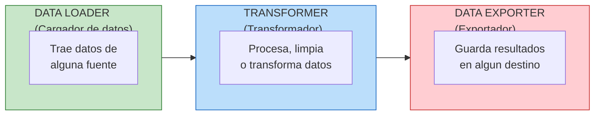
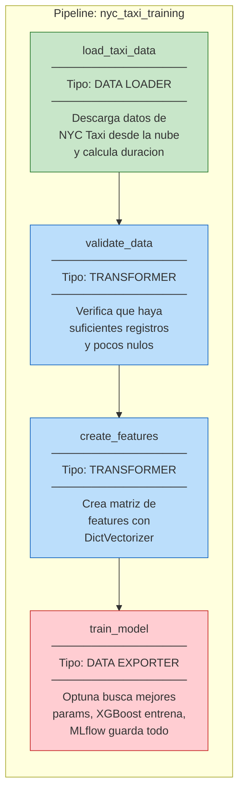
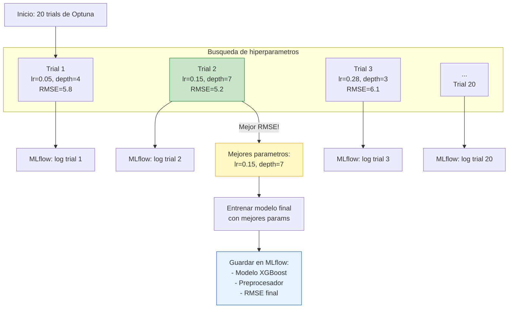
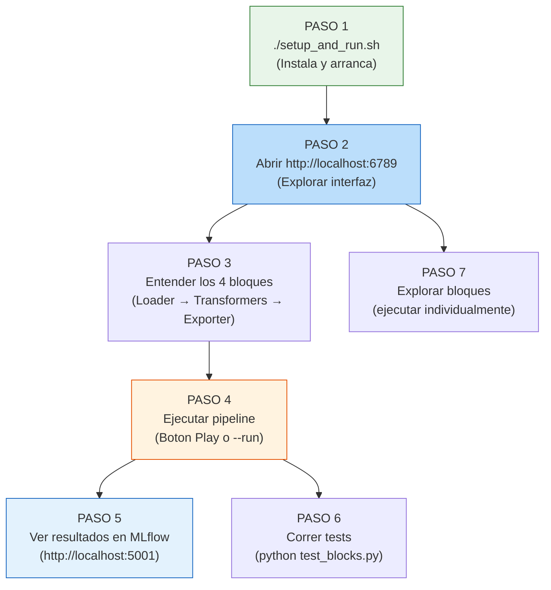
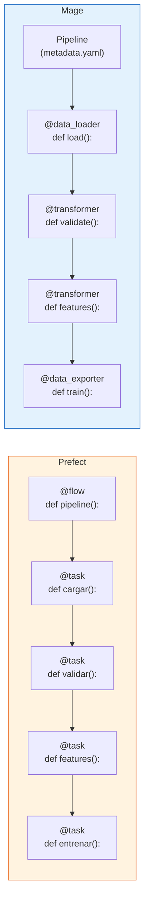

# Guia Paso a Paso: Mage - Pipeline Visual de ML

> **Para quien es esta guia:** Personas que quieren aprender a armar un pipeline de Machine Learning de forma visual, usando Mage como orquestador. No necesitas experiencia previa en orquestacion.
>
> **Prerequisito:** Haber leido la [Guia de Integracion MLOps](GUIA_INTEGRACION_MLOPS.md) para entender el panorama general.

---

## Tabla de Contenidos

1. [Que es Mage y por que usarlo](#1-que-es-mage-y-por-que-usarlo)
2. [Los 3 tipos de bloques](#2-los-3-tipos-de-bloques)
3. [Nuestro pipeline: mapa visual](#3-nuestro-pipeline-mapa-visual)
4. [Paso 0: Entender la estructura de archivos](#paso-0-entender-la-estructura-de-archivos)
5. [Paso 1: Instalacion y arranque](#paso-1-instalacion-y-arranque)
6. [Paso 2: Explorar la interfaz](#paso-2-explorar-la-interfaz-de-mage)
7. [Paso 3: Entender cada bloque](#paso-3-entender-cada-bloque-con-analogias)
8. [Paso 4: Ejecutar el pipeline](#paso-4-ejecutar-el-pipeline)
9. [Paso 5: Verificar resultados en MLflow](#paso-5-verificar-resultados-en-mlflow)
10. [Paso 6: Probar la logica sin Mage](#paso-6-probar-la-logica-sin-mage-tests)
11. [Paso 7: Explorar bloques individualmente](#paso-7-explorar-los-bloques-en-la-ui)
12. [Comparacion: Prefect vs Mage](#comparacion-visual-prefect-vs-mage)
13. [Tarjeta de referencia rapida](#tarjeta-de-referencia-rapida)

---

## 1. Que es Mage y por que usarlo

Mage es un orquestador **visual**. Mientras que Prefect es "escribo codigo y pongo decoradores", Mage es "armo mi pipeline en el navegador como si fueran bloques de Lego".

```
 ┌──────────────────────────────────────────────────────────────────┐
 │                                                                  │
 │   PREFECT                              MAGE                     │
 │   ────────                             ─────                    │
 │                                                                  │
 │   Escribo codigo con                   Armo bloques en el       │
 │   @flow y @task en mi                  navegador y cada bloque  │
 │   editor favorito                      tiene su propio archivo  │
 │                                                                  │
 │   Como escribir una                    Como armar un            │
 │   receta en Word                       rompecabezas visual      │
 │                                                                  │
 │   Ideal para: equipos                  Ideal para: explorar,    │
 │   de ingenieria que                    prototipar, y equipos    │
 │   prefieren codigo                     que prefieren lo visual  │
 │                                                                  │
 └──────────────────────────────────────────────────────────────────┘
```

---

## 2. Los 3 Tipos de Bloques



```
 ┌──────────────────────────────────────────────────────────────────┐
 │                   BLOQUES DE MAGE                                │
 │                                                                  │
 │   DATA LOADER (verde)      = El cartero que trae los paquetes   │
 │   "Descarga datos de internet o lee de una base de datos"       │
 │                                                                  │
 │   TRANSFORMER (azul)       = El chef que prepara ingredientes   │
 │   "Limpia, valida, y transforma los datos"                      │
 │   Puedes tener VARIOS transformadores en cadena                 │
 │                                                                  │
 │   DATA EXPORTER (rojo)     = El repartidor que lleva el pedido  │
 │   "Guarda el modelo, escribe en base de datos, etc."            │
 │                                                                  │
 └──────────────────────────────────────────────────────────────────┘
```

---

## 3. Nuestro Pipeline: Mapa Visual



---

## PASO 0: Entender la estructura de archivos

Antes de tocar nada, miremos que hay dentro de la carpeta:

```
03-Orchestration/Mage-pipelines/
│
├── setup_and_run.sh              ← Script que instala todo y arranca Mage
├── pyproject.toml                ← Lista de dependencias (librerias)
├── test_blocks.py                ← Tests para verificar la logica sin Mage
├── comparacion_orquestadores.ipynb  ← Notebook comparando Prefect vs Mage
│
└── nyc_taxi_project/             ← El proyecto Mage en si
    │
    ├── metadata.yaml             ← Configuracion del proyecto
    ├── io_config.yaml            ← Config de bases de datos (no la usamos)
    │
    ├── data_loaders/             ← Carpeta de bloques tipo "Data Loader"
    │   └── load_taxi_data.py     ← Nuestro cargador de datos
    │
    ├── transformers/             ← Carpeta de bloques tipo "Transformer"
    │   ├── validate_data.py      ← Validador de calidad
    │   └── create_features.py    ← Creador de features
    │
    ├── data_exporters/           ← Carpeta de bloques tipo "Data Exporter"
    │   └── train_model.py        ← Entrenador (Optuna + XGBoost + MLflow)
    │
    ├── pipelines/
    │   └── nyc_taxi_training/
    │       └── metadata.yaml     ← Define el ORDEN de los bloques
    │
    └── utils/
        └── constants.py          ← Configuracion compartida
```

**Concepto clave:** Cada bloque vive en su propia carpeta segun su tipo. Mage sabe que hacer con cada uno por el **decorador** (`@data_loader`, `@transformer`, `@data_exporter`).

---

## PASO 1: Instalacion y arranque

> **Requisito previo:** Tener `uv` instalado (el gestor de paquetes que usamos en el curso).

**Abrir la terminal** y navegar a la carpeta del proyecto:

```bash
cd 03-Orchestration/Mage-pipelines/
```

**Dar permisos al script** (solo la primera vez):

```bash
chmod +x setup_and_run.sh
```

**Ejecutar el script de instalacion + UI:**

```bash
./setup_and_run.sh
```

**Que hace este script por dentro? (paso a paso):**

```
 ┌──────────────────────────────────────────────────────────────────┐
 │   setup_and_run.sh - Lo que pasa por dentro                     │
 │                                                                  │
 │   1. Verifica que "uv" este instalado                           │
 │      (si no esta, te dice como instalarlo)                      │
 │                                                                  │
 │   2. Crea un entorno virtual SEPARADO (.venv-mage)              │
 │      Por que separado? Porque Mage tiene dependencias que       │
 │      pelean con Prefect. Es como tener dos cocinas separadas    │
 │      para dos chefs que no se llevan bien.                      │
 │                                                                  │
 │   3. Instala todas las librerias necesarias:                    │
 │      mage-ai, pandas, scikit-learn, xgboost, optuna, mlflow    │
 │                                                                  │
 │   4. Arranca la interfaz web de Mage en:                        │
 │      http://localhost:6789                                       │
 │                                                                  │
 └──────────────────────────────────────────────────────────────────┘
```

**Lo que deberias ver en la terminal:**

```
============================================
  Mage Pipeline - NYC Taxi Duration
============================================

[1/3] Creando entorno virtual con uv...
      Entorno .venv-mage listo.

[2/3] Instalando dependencias con uv...
      Dependencias instaladas.

[3/3] Iniciando Mage...

      Abriendo Mage UI en http://localhost:6789
      Pipeline: nyc_taxi_training
      Presiona Ctrl+C para detener
```

**Ahora abre tu navegador** y ve a: `http://localhost:6789`

> **Nota:** Si ves una pantalla de login, haz hard refresh con `Cmd+Shift+R` (Mac) o `Ctrl+Shift+R` (Windows). La autenticacion esta desactivada.

---

## PASO 2: Explorar la interfaz de Mage

Al abrir Mage en el navegador, veras algo como esto:

```
 ┌──────────────────────────────────────────────────────────────────┐
 │  MAGE  │  Pipelines  │  Triggers  │  Logs                      │
 ├────────┴─────────────────────────────────────────────────────────┤
 │                                                                  │
 │  Pipelines                                                      │
 │  ─────────                                                      │
 │                                                                  │
 │  ┌─────────────────────────────┐                                │
 │  │  nyc_taxi_training          │  ← Nuestro pipeline!           │
 │  │  Status: Ready              │                                │
 │  │  Blocks: 4                  │                                │
 │  └─────────────────────────────┘                                │
 │                                                                  │
 └──────────────────────────────────────────────────────────────────┘
```

**Haz clic en "nyc_taxi_training"** para ver los bloques:

```
 ┌──────────────────────────────────────────────────────────────────┐
 │  Pipeline: nyc_taxi_training                                    │
 │                                                                  │
 │  ┌─────────────────────┐                                        │
 │  │  load_taxi_data     │  (Data Loader - verde)                 │
 │  └────────┬────────────┘                                        │
 │           │                                                      │
 │           v                                                      │
 │  ┌─────────────────────┐                                        │
 │  │  validate_data      │  (Transformer - azul)                  │
 │  └────────┬────────────┘                                        │
 │           │                                                      │
 │           v                                                      │
 │  ┌─────────────────────┐                                        │
 │  │  create_features    │  (Transformer - azul)                  │
 │  └────────┬────────────┘                                        │
 │           │                                                      │
 │           v                                                      │
 │  ┌─────────────────────┐                                        │
 │  │  train_model        │  (Data Exporter - rojo)                │
 │  └─────────────────────┘                                        │
 │                                                                  │
 └──────────────────────────────────────────────────────────────────┘
```

---

## PASO 3: Entender cada bloque (con analogias)

### Bloque 1: `load_taxi_data` (Data Loader)

**Analogia:** Es como ir al supermercado a comprar ingredientes.

**Que hace:**
1. Descarga datos de viajes de taxi de NYC desde internet (archivo Parquet)
2. Calcula cuanto duro cada viaje en minutos
3. Filtra viajes "raros" (menos de 1 minuto o mas de 60 minutos)
4. Convierte las zonas de recogida/destino a texto

**Archivo:** `nyc_taxi_project/data_loaders/load_taxi_data.py`

```
 ┌──────────────────────────────────────────────────────────────────┐
 │  ENTRADA: Nada (es el primer bloque)                            │
 │                                                                  │
 │  PROCESO:                                                       │
 │  1. Descarga datos de enero 2025 desde la nube                  │
 │  2. Calcula: duracion = hora_llegada - hora_salida              │
 │  3. Filtra: solo viajes entre 1 y 60 minutos                   │
 │  4. Convierte zonas a texto (para el modelo)                    │
 │                                                                  │
 │  SALIDA: Tabla (DataFrame) con ~46,000 viajes limpios           │
 │                                                                  │
 │  TEST: Verifica que la tabla no este vacia y tenga              │
 │        las columnas correctas                                    │
 └──────────────────────────────────────────────────────────────────┘
```

**Codigo clave (simplificado):**

```python
@data_loader                           # "Soy un bloque cargador de datos"
def load_taxi_data(**kwargs):
    url = "https://...green_tripdata_2025-01.parquet"
    df = pd.read_parquet(url)          # Descargar datos

    df['duration'] = (                 # Calcular duracion
        df.lpep_dropoff_datetime - df.lpep_pickup_datetime
    ).dt.total_seconds() / 60

    df = df[(df.duration >= 1) &       # Filtrar viajes raros
            (df.duration <= 60)]

    return df                          # Pasar al siguiente bloque

@test                                  # "Verificar que todo salio bien"
def test_output(output):
    assert len(output) > 0             # Que no este vacio
```

---

### Bloque 2: `validate_data` (Transformer)

**Analogia:** Es como el inspector de calidad que revisa los ingredientes antes de cocinar.

**Que hace:**
1. Verifica que haya al menos 1,000 registros (si no, algo raro paso)
2. Verifica que no haya demasiados datos faltantes (menos del 10% de nulos)
3. NO elimina datos, solo avisa si hay problemas

**Archivo:** `nyc_taxi_project/transformers/validate_data.py`

```
 ┌──────────────────────────────────────────────────────────────────┐
 │  ENTRADA: DataFrame del bloque anterior (~46,000 viajes)        │
 │                                                                  │
 │  PROCESO:                                                       │
 │  1. Cuenta registros → Son mas de 1,000? ✓                     │
 │  2. Cuenta nulos → Son menos del 10%? ✓                        │
 │  3. Si algo falla, AVISA pero no detiene                        │
 │                                                                  │
 │  SALIDA: El mismo DataFrame (sin cambios, solo validado)        │
 │                                                                  │
 │  Analogia: Como cuando el mesero te pregunta                    │
 │  "Todo bien con el pedido?" antes de llevarlo                   │
 └──────────────────────────────────────────────────────────────────┘
```

**Codigo clave (simplificado):**

```python
@transformer                           # "Soy un bloque transformador"
def validate_data(df):                 # Recibe datos del bloque anterior
    if len(df) < 1000:
        print("ADVERTENCIA: Muy pocos datos!")

    null_pct = df.isnull().sum().sum() / (df.shape[0] * df.shape[1]) * 100
    if null_pct > 10:
        print("ADVERTENCIA: Muchos datos faltantes!")

    return df                          # Pasar al siguiente bloque
```

---

### Bloque 3: `create_features` (Transformer)

**Analogia:** Es como picar, pelar y preparar todos los ingredientes antes de meterlos al horno.

**Que hace:**
1. Toma las zonas de recogida/destino y las convierte en numeros que el modelo entiende (DictVectorizer)
2. Descarga datos del MES SIGUIENTE para validacion
3. Separa los datos en "entrenamiento" y "validacion"
4. Retorna 5 cosas empaquetadas en una tupla

**Archivo:** `nyc_taxi_project/transformers/create_features.py`

```
 ┌──────────────────────────────────────────────────────────────────┐
 │  ENTRADA: DataFrame validado (~46,000 viajes de enero)          │
 │                                                                  │
 │  PROCESO:                                                       │
 │  1. Descargar datos de febrero (para validar)                   │
 │  2. Convertir zonas a numeros con DictVectorizer                │
 │     - "Zona 43" + "Zona 152" → vector de ~448 numeros          │
 │  3. Separar en train (enero) y validacion (febrero)             │
 │                                                                  │
 │  SALIDA: Tupla con 5 elementos:                                 │
 │  (X_train, y_train, X_val, y_val, dv)                          │
 │                                                                  │
 │  X_train = Datos de entrada para entrenar (~46K x 448)          │
 │  y_train = Lo que quiero predecir (duracion del viaje)          │
 │  X_val   = Datos para validar                                   │
 │  y_val   = Duraciones reales para comparar                      │
 │  dv      = El "traductor" de zonas a numeros                    │
 └──────────────────────────────────────────────────────────────────┘
```

**Por que necesito un "traductor" (DictVectorizer)?**

```
 El modelo NO entiende texto, solo numeros:

 ANTES (texto):                    DESPUES (numeros):
 ┌─────────────────────┐          ┌─────────────────────────────┐
 │ Recogida: "Zona 43" │   ───>   │ [0, 0, ..., 1, ..., 0, 0] │
 │ Destino: "Zona 152" │          │  (vector de 448 posiciones) │
 └─────────────────────┘          └─────────────────────────────┘

 Es como traducir un menu de espanol a ingles
 para que un chef extranjero lo entienda.
```

---

### Bloque 4: `train_model` (Data Exporter)

**Analogia:** Es la hora de hornear el pan. Pero primero prueba 20 recetas diferentes y se queda con la mejor.

**Que hace:**
1. **Configura MLflow** (donde guardar los resultados)
2. **Optuna prueba 20 combinaciones** de hiperparametros (cada una guardada en MLflow)
3. **Entrena el modelo final** con la mejor combinacion
4. **Guarda todo** en MLflow: parametros, metricas, modelo

**Archivo:** `nyc_taxi_project/data_exporters/train_model.py`

```
 ┌──────────────────────────────────────────────────────────────────┐
 │  ENTRADA: (X_train, y_train, X_val, y_val, dv) del bloque ant. │
 │                                                                  │
 │  PROCESO (en 2 fases):                                          │
 │                                                                  │
 │  FASE 1 - BUSQUEDA (Optuna)                                    │
 │  ┌──────────────────────────────────────────────────────┐       │
 │  │  Trial 1: lr=0.05, depth=4  → RMSE=5.8              │       │
 │  │  Trial 2: lr=0.15, depth=7  → RMSE=5.2  ← mejor!   │       │
 │  │  Trial 3: lr=0.28, depth=3  → RMSE=6.1              │       │
 │  │  ...                                                  │       │
 │  │  Trial 20: lr=0.12, depth=8 → RMSE=5.4              │       │
 │  │                                                       │       │
 │  │  Cada trial se guarda en MLflow como "nested run"    │       │
 │  └──────────────────────────────────────────────────────┘       │
 │                                                                  │
 │  FASE 2 - ENTRENAMIENTO FINAL                                   │
 │  ┌──────────────────────────────────────────────────────┐       │
 │  │  Tomo la mejor combinacion (Trial 2: lr=0.15, d=7)  │       │
 │  │  Entreno XGBoost con esos parametros                 │       │
 │  │  Guardo en MLflow: parametros + RMSE + modelo        │       │
 │  │  Guardo preprocesador (DictVectorizer) como artefacto│       │
 │  └──────────────────────────────────────────────────────┘       │
 │                                                                  │
 │  SALIDA: Diccionario con resultados                             │
 │  {run_id: "abc123", rmse: 5.23, n_trials: 20, ...}             │
 │                                                                  │
 └──────────────────────────────────────────────────────────────────┘
```

**Diagrama del proceso de Optuna + MLflow:**



---

## PASO 4: Ejecutar el pipeline

Tienes **dos formas** de ejecutar el pipeline:

### Opcion A: Desde la interfaz web (recomendada para aprender)

1. En el navegador (`http://localhost:6789`), haz clic en el pipeline **nyc_taxi_training**
2. Veras los 4 bloques conectados. Haz clic en el icono de **rayo** (barra lateral izquierda) para ir a **Triggers**
3. Haz clic en el boton **"Run@once"** (arriba a la izquierda)
4. Aparecera un dialogo "Run pipeline now" — **deja los campos vacios** y haz clic en **"Run now"**
5. Observa como cada bloque se ejecuta en orden:
   - Verde = completado
   - Amarillo = ejecutando
   - Rojo = error

```
 Estado durante la ejecucion:

 ┌─────────────────────┐
 │  load_taxi_data     │  ✅ Completado (15 seg)
 └────────┬────────────┘
          │
          v
 ┌─────────────────────┐
 │  validate_data      │  ✅ Completado (1 seg)
 └────────┬────────────┘
          │
          v
 ┌─────────────────────┐
 │  create_features    │  ⏳ Ejecutando... (descargando datos de febrero)
 └────────┬────────────┘
          │
          v
 ┌─────────────────────┐
 │  train_model        │  ⬚ Pendiente
 └─────────────────────┘
```

### Opcion B: Desde la terminal (sin interfaz)

```bash
./setup_and_run.sh --run
```

Esto ejecuta el pipeline directamente y muestra el progreso en la terminal:

```
Descargando datos desde: https://...green_tripdata_2025-01.parquet
Registros cargados: 46,279 (filtrados 7,245)
Periodo: 2025-01
Duracion promedio: 15.23 min

Validacion completada: 46,279 filas, 0.42% nulos

Cargando datos de validacion: 2025-02
Features de entrenamiento: (46279, 448)
Features de validacion:    (41,522, 448)

Iniciando optimizacion con 20 trials de Optuna...
[Trial 1/20] RMSE: 5.82
[Trial 2/20] RMSE: 5.23
...
[Trial 20/20] RMSE: 5.45

Mejor RMSE en optimizacion: 5.01
Mejor trial: #14

Entrenando modelo final con parametros optimizados...

==================================================
PIPELINE COMPLETADO
==================================================
RMSE final:          5.23
MLflow Run ID:       a1b2c3d4e5f6
Muestras train:      46,279
Muestras validacion: 41,522
Numero de features:  448
==================================================
```

---

## PASO 5: Verificar resultados en MLflow

Despues de ejecutar el pipeline, MLflow tiene todos los resultados guardados. Para verlos:

**Abrir otra terminal** (sin cerrar Mage) y ejecutar:

```bash
cd 03-Orchestration/Mage-pipelines/
source .venv-mage/bin/activate
cd nyc_taxi_project/
mlflow ui --port 5001
```

**Abrir en el navegador:** `http://localhost:5001`

```
 ┌──────────────────────────────────────────────────────────────────┐
 │  MLflow UI                                                      │
 │                                                                  │
 │  Experimento: nyc-taxi-experiment-mage                          │
 │                                                                  │
 │  Runs:                                                          │
 │  ┌────────────┬──────────┬──────────┬──────────┐               │
 │  │ Run Name   │ RMSE     │ lr       │ depth    │               │
 │  ├────────────┼──────────┼──────────┼──────────┤               │
 │  │ final      │ 5.23     │ 0.15     │ 7        │  ← MODELO    │
 │  │ trial_14   │ 5.01     │ 0.12     │ 8        │    FINAL     │
 │  │ trial_7    │ 5.15     │ 0.18     │ 6        │               │
 │  │ trial_2    │ 5.23     │ 0.15     │ 7        │               │
 │  │ ...        │ ...      │ ...      │ ...      │               │
 │  └────────────┴──────────┴──────────┴──────────┘               │
 │                                                                  │
 │  Artefactos del run final:                                      │
 │  - models_mlflow/ (modelo XGBoost completo)                    │
 │  - preprocessor/preprocessor.b (DictVectorizer)                │
 │                                                                  │
 └──────────────────────────────────────────────────────────────────┘
```

---

## PASO 6: Probar la logica sin Mage (tests)

Si quieres verificar que toda la logica funciona **sin depender de la interfaz de Mage**, puedes ejecutar los tests:

```bash
cd 03-Orchestration/Mage-pipelines/
source .venv-mage/bin/activate
python test_blocks.py
```

Esto ejecuta la misma logica de los 4 bloques de forma independiente:

```
############################################################
# TEST DE BLOQUES MAGE (logica core sin mage-ai)
############################################################

============================================================
TEST 1: Carga de datos NYC Taxi
============================================================
  Descargando desde: https://...
  OK: 46,279 registros cargados

============================================================
TEST 2: Validacion de datos
============================================================
  OK: Volumen suficiente: 46,279
  OK: Nulos aceptables: 0.42%

============================================================
TEST 3: Creacion de features
============================================================
  Cargando validacion: 2025-02
  OK: X_train=(46279, 448), X_val=(41522, 448)

============================================================
TEST 4: Optuna + XGBoost + MLflow
============================================================
  MLflow: sqlite:///mlflow.db
  Optuna: 3 trials (reducido para test)
  Mejor RMSE Optuna: 5.15
  OK: RMSE final = 5.23

############################################################
# TODOS LOS TESTS PASARON
############################################################
```

---

## PASO 7: Explorar los bloques en la UI

Una de las mejores cosas de Mage es que puedes **ejecutar bloques individualmente** para explorar:

```
 ┌──────────────────────────────────────────────────────────────────┐
 │  En la UI de Mage, haz clic en cualquier bloque:               │
 │                                                                  │
 │  ┌──────────────────────────────────────────┐                   │
 │  │  load_taxi_data                    [▶ Run]│                  │
 │  │  ──────────────────────────────────────── │                  │
 │  │                                           │                  │
 │  │  @data_loader                             │                  │
 │  │  def load_taxi_data(**kwargs):            │                  │
 │  │      url = "https://..."                  │                  │
 │  │      df = pd.read_parquet(url)            │                  │
 │  │      ...                                  │                  │
 │  │      return df                            │                  │
 │  │                                           │                  │
 │  │  ──────────────────────────────────────── │                  │
 │  │  Output:                                  │                  │
 │  │  ┌──────────────────────────────────┐     │                  │
 │  │  │ Registros cargados: 46,279      │     │                  │
 │  │  │ Duracion promedio: 15.23 min    │     │                  │
 │  │  └──────────────────────────────────┘     │                  │
 │  └──────────────────────────────────────────┘                   │
 │                                                                  │
 │  Puedes:                                                        │
 │  - Editar el codigo directamente en el navegador                │
 │  - Ejecutar solo ESE bloque con [▶ Run]                         │
 │  - Ver el output (resultado) debajo del codigo                  │
 │  - Los tests se ejecutan automaticamente                        │
 │                                                                  │
 └──────────────────────────────────────────────────────────────────┘
```

---

## Resumen del flujo completo



---

## Comparacion Visual: Prefect vs Mage

### El mismo pipeline, dos enfoques

```
 ┌──────────────────────────┐    ┌──────────────────────────┐
 │        PREFECT            │    │          MAGE             │
 │                           │    │                           │
 │  Filosofia: CODE-first   │    │  Filosofia: UI-first     │
 │  "Escribo codigo"        │    │  "Armo bloques visuales" │
 │                           │    │                           │
 │  @flow                   │    │  Pipeline en navegador   │
 │  def mi_pipeline():      │    │  Bloques arrastrables    │
 │      datos = cargar()    │    │                           │
 │      validar(datos)      │    │  Cada bloque = 1 archivo │
 │      features(datos)     │    │  en su carpeta           │
 │      entrenar(features)  │    │                           │
 │                           │    │                           │
 │  Todo en UN archivo       │    │  Archivos separados:     │
 │  (pipeline.py)           │    │  data_loaders/           │
 │                           │    │  transformers/           │
 │                           │    │  data_exporters/         │
 │                           │    │                           │
 │  Ejecutar:               │    │  Ejecutar:               │
 │  python pipeline.py      │    │  Boton Play en la UI     │
 │                           │    │  o ./setup_and_run.sh    │
 │                           │    │                           │
 │  Dashboard: Prefect UI   │    │  Dashboard: Mage UI      │
 │  http://localhost:4200   │    │  http://localhost:6789   │
 │                           │    │                           │
 └──────────────────────────┘    └──────────────────────────┘
```

### Tabla comparativa

```
 ┌──────────────────┬──────────────────┬──────────────────┐
 │  Aspecto         │  Prefect         │  Mage            │
 ├──────────────────┼──────────────────┼──────────────────┤
 │  Curva de        │  Media           │  Baja            │
 │  aprendizaje     │  (necesitas      │  (visual, como   │
 │                  │  saber Python)   │  un notebook)    │
 ├──────────────────┼──────────────────┼──────────────────┤
 │  Unidad basica   │  @flow + @task   │  Bloques:        │
 │                  │  (decoradores)   │  loader,         │
 │                  │                  │  transformer,    │
 │                  │                  │  exporter        │
 ├──────────────────┼──────────────────┼──────────────────┤
 │  Reintentos      │  @task(retries=3)│  Configuracion   │
 │                  │  Nativo en       │  por bloque      │
 │                  │  decorador       │                  │
 ├──────────────────┼──────────────────┼──────────────────┤
 │  Caching         │  cache_key_fn    │  Configuracion   │
 │                  │  + expiration    │  en YAML         │
 ├──────────────────┼──────────────────┼──────────────────┤
 │  Scheduling      │  Cron nativo     │  Triggers en UI  │
 │  (automatizar)   │  flow.serve(     │                  │
 │                  │    cron="...")    │                  │
 ├──────────────────┼──────────────────┼──────────────────┤
 │  Tests           │  pytest normal   │  @test en cada   │
 │                  │                  │  bloque          │
 ├──────────────────┼──────────────────┼──────────────────┤
 │  MLflow          │  Integrado en    │  Integrado en    │
 │                  │  las tasks       │  los bloques     │
 ├──────────────────┼──────────────────┼──────────────────┤
 │  Ideal para      │  Equipos de      │  Ciencia de      │
 │                  │  ingenieria      │  datos,          │
 │                  │                  │  exploracion     │
 └──────────────────┴──────────────────┴──────────────────┘
```

### Los decoradores lado a lado



---

## Tarjeta de Referencia Rapida

```
 ┌──────────────────────────────────────────────────────────────────┐
 │                 TARJETA DE REFERENCIA RAPIDA                    │
 │                                                                  │
 │  "Quiero arrancar Mage"                                        │
 │  → cd 03-Orchestration/Mage-pipelines/ && ./setup_and_run.sh   │
 │  → Abrir http://localhost:6789                                  │
 │                                                                  │
 │  "Quiero ejecutar el pipeline sin UI"                           │
 │  → ./setup_and_run.sh --run                                    │
 │                                                                  │
 │  "Quiero ver mis modelos guardados"                             │
 │  → source .venv-mage/bin/activate                              │
 │  → cd nyc_taxi_project/ && mlflow ui --port 5001               │
 │  → Abrir http://localhost:5001                                  │
 │                                                                  │
 │  "Quiero probar la logica sin Mage"                             │
 │  → source .venv-mage/bin/activate && python test_blocks.py     │
 │                                                                  │
 │  "Quiero detener Mage"                                         │
 │  → Ctrl+C en la terminal donde lo arrancaste                   │
 │                                                                  │
 │  "Quiero entender el orden de los bloques"                     │
 │  → Ver pipelines/nyc_taxi_training/metadata.yaml               │
 │                                                                  │
 │  "Quiero cambiar la configuracion"                              │
 │  → Editar utils/constants.py                                    │
 │                                                                  │
 └──────────────────────────────────────────────────────────────────┘
```

---

> **Nota para el instructor:** Los diagramas Mermaid se renderizan automaticamente en GitHub, VS Code (con extension Markdown Preview Mermaid), y en la mayoria de herramientas de documentacion. Los diagramas de texto (ASCII art) se ven bien en cualquier editor.
