# Guia Visual: Despliegue de Modelos de Machine Learning

> Esta guia acompaña el **Modulo 04 - Deployment** del curso de MLOps.
> Cada diagrama esta diseñado para ser autoexplicativo y seguir un hilo conductor coherente:
> desde el problema que resuelve Docker, hasta desplegar predicciones automatizadas en produccion.

---

## Ruta de aprendizaje

Antes de entrar en detalle, aqui esta el mapa del modulo. Cada paso construye sobre el anterior:

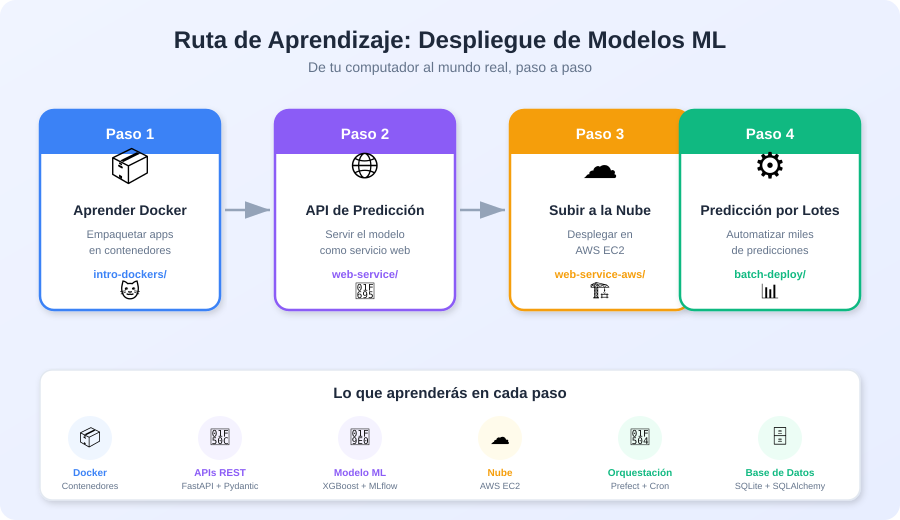

**Orden del curso:**

| Paso | Carpeta | Concepto nuevo |
|------|---------|---------------|
| 1 | `intro-dockers/` | Docker: empaquetar una app en un contenedor |
| 2 | `batch-deploy/` | Ciclo de vida MLOps: jobs, persistencia, artefactos |
| 3 | `web-service/` | API en tiempo real con FastAPI + Docker |
| 4 | `web-service-aws/` | Llevar la API a la nube |

**Idea clave:** nunca se enfrenta a mas de un concepto nuevo a la vez. Empezamos por Docker como herramienta base, luego aprendemos MLOps puro con batch (sin infraestructura compleja), y recien ahi agregamos APIs y nube.

---

## Paso 1: Aprender Docker (`intro-dockers/`)

### Por que necesitamos Docker?

El problema mas comun en el mundo del software (y del Machine Learning) es: *"En mi computador funciona, pero en el tuyo no"*. Esto pasa porque cada maquina tiene versiones diferentes de Python, librerias, y sistema operativo.

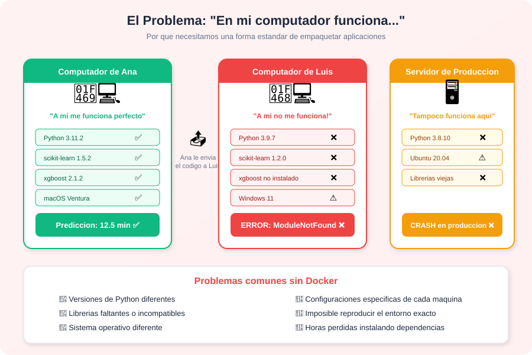

**En resumen:** Sin Docker, cada persona tiene un entorno diferente. Instalar dependencias manualmente es lento, fragil, y casi imposible de reproducir exactamente.

---

### Que es Docker? (explicado con una analogia)

Docker resuelve este problema con tres conceptos fundamentales. Piensa en ellos como un sistema de envio de comida:

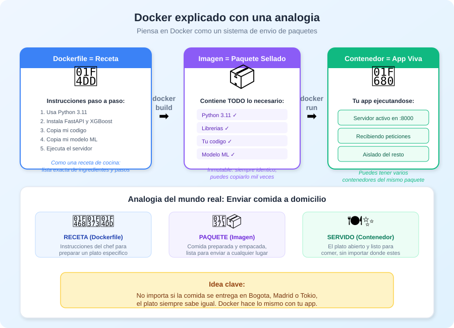

| Concepto | Analogia | Que es |
|----------|----------|--------|
| **Dockerfile** | La receta del chef | Archivo de texto con instrucciones paso a paso |
| **Imagen** | El plato empacado y sellado | Paquete inmutable con todo lo necesario |
| **Contenedor** | El plato servido y listo | La app ejecutandose en un entorno aislado |

**Lo mas importante:** una vez que tienes la imagen, funciona IGUAL en cualquier computador: Windows, Mac, Linux, un servidor en la nube... no importa.

---

### Como se usa Docker en la practica?

Solo necesitas 3 comandos para empezar:

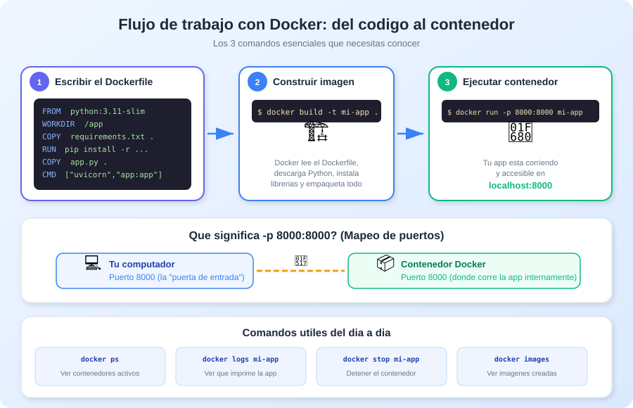

**Resumen de los 3 comandos:**

```bash
# 1. Construir la imagen (leer la receta y empacar todo)
docker build -t mi-app .

# 2. Ejecutar un contenedor (abrir el paquete y servir)
docker run -p 8000:8000 mi-app

# 3. Verificar que esta corriendo
docker ps
```

> **Ejercicio practico:** En `intro-dockers/` hay una app de gatitos para practicar estos comandos sin tocar nada de ML. Primero la corres sin Docker (local), luego con Docker, y comparas la experiencia.

---

## Paso 2: Prediccion por lotes (`batch-deploy/`)

> **Por que este es el segundo paso:** antes de meter APIs y nube, `batch-deploy/` te ensena el **ciclo de vida de un modelo en produccion** (jobs programados, persistencia en base de datos, artefactos trazables) sin que Docker ni infraestructura distraigan. Cuando llegues a `web-service/` ya vas a tener claro el "que" de MLOps, y solo agregaras el "como exponerlo al mundo".

### Tiempo real vs. por lotes

Cuando piensas en desplegar un modelo, probablemente imaginas una API que responde instantaneamente. Pero en la realidad, la mayoria de casos de uso son por **lotes (batch)**: procesar muchos datos a la vez, de forma automatizada y programada.

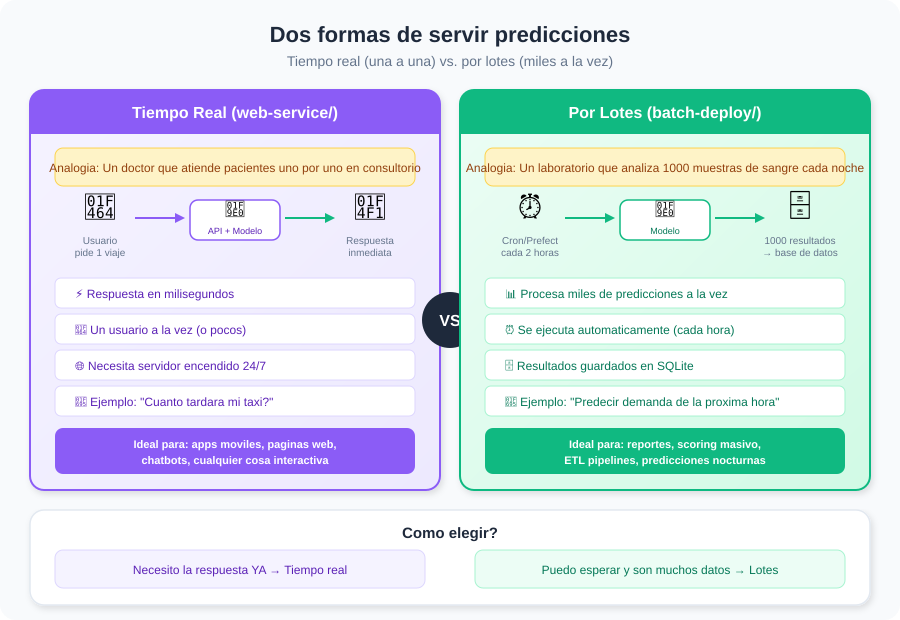

### Como decidir cual usar?

Preguntate: **"Necesito la respuesta ahora mismo?"**

- **Si** → Usa un servicio web (tiempo real). Lo veras en el Paso 3. Ejemplo: una app que le dice al usuario cuanto tarda su taxi.
- **No** → Usa procesamiento por lotes. Ejemplo: predecir la demanda de la proxima hora para planificar cuantos taxis enviar a cada zona.

### Como funciona el sistema de lotes por dentro?

El sistema en `batch-deploy/` tiene 5 componentes que se ejecutan automaticamente:

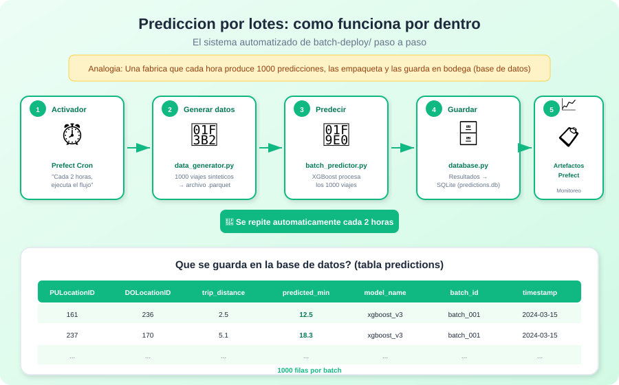

| Componente | Archivo | Que hace |
|-----------|---------|----------|
| Activador | `deploy_batch.py` | Programa la ejecucion cada hora con Prefect |
| Generador | `data_generator.py` | Crea 1000 viajes sinteticos de prueba |
| Predictor | `batch_predictor.py` | Carga el modelo XGBoost y predice los 1000 viajes |
| Base de datos | `database.py` | Guarda cada prediccion en SQLite con metadatos |
| Orquestador | `prefect_flows.py` | Conecta todo como un flujo (flow) con tareas (tasks) |

---

### Que conceptos nuevos introduce este modulo?

Esta es la razon pedagogica de ponerlo segundo: `batch-deploy/` introduce **los conceptos mas importantes de MLOps** en un entorno aislado.

| Concepto | En batch-deploy | Por que importa |
|----------|----------------|------------------|
| **Job / Flow** | `scheduled_batch_flow` en `prefect_flows.py` | Define el trabajo completo que se ejecuta end-to-end |
| **Task** | `generate_data_task`, `process_predictions_task`, `create_summary_artifact` | Cada paso del flow es una unidad reintentable y observable |
| **Schedule (cron)** | `"0 * * * *"` en `deploy_batch.py` | Convierte un script en un proceso automatico recurrente |
| **Persistencia** | SQLite en `data/database/predictions.db` | Las predicciones quedan guardadas para consulta posterior |
| **Batch ID** | Timestamp unico por corrida | Permite rastrear "que predicciones salieron de que ejecucion" |
| **Artefactos** | `create_markdown_artifact`, `create_table_artifact` | Cada corrida deja un reporte visible en Prefect UI |
| **Configuracion externa** | `config/settings.py` | Separa "que ejecutar" de "como ejecutarlo" |

### Analogia: la panaderia automatica

Piensa en `batch-deploy/` como una **panaderia que hornea pan cada hora automaticamente**:

- **El horno** = el modelo XGBoost
- **La receta** = `batch_predictor.py`
- **El timer que enciende el horno** = cron `0 * * * *`
- **El cuaderno donde anotas cuantos panes salieron cada hora** = SQLite con `batch_id`
- **El reporte diario para el dueño** = Prefect artifacts
- **La voz que dice "primero amasar, luego hornear, luego empacar"** = el Flow de Prefect
- **Cada instruccion individual** = Tasks (`generate_data_task`, `process_predictions_task`...)

Lo bonito: este sistema **no necesita Docker ni AWS para funcionar**. Funciona en tu laptop. Esa es la razon de verlo antes que APIs: **aislas el concepto "MLOps" del concepto "infraestructura"**.

---

### Anatomia de un Flow de Prefect

Un "flow" es una funcion Python decorada con `@flow`. Un "task" es una funcion decorada con `@task`. El flow orquesta tasks:

```python
from prefect import flow, task, get_run_logger

@task(name="generate-taxi-data")
def generate_data_task(num_trips: int):
    # 1. Crea datos sinteticos
    return filepath

@task(name="process-batch-predictions")
def process_predictions_task(input_file):
    # 2. Corre el modelo sobre esos datos
    return result

@task(name="create-prediction-summary")
def create_summary_artifact(result: dict):
    # 3. Genera reportes visuales
    create_markdown_artifact(markdown="# Resumen\n...")

@flow(name="scheduled-batch-flow")
def scheduled_batch_flow():
    filepath = generate_data_task(num_trips=1000)
    result = process_predictions_task(filepath)
    create_summary_artifact(result)
```

**Por que separar en tasks y no hacer una sola funcion gigante?**

| Sin tasks (script monolitico) | Con tasks (flow con Prefect) |
|-------------------------------|------------------------------|
| Si falla a la mitad, pierdes todo el trabajo | Prefect reintenta solo la task que fallo |
| No sabes cuanto tardo cada paso | Prefect mide cada task individualmente |
| Logs mezclados de todo | Logs separados por task |
| Sin UI para monitorear | Prefect UI muestra estado en tiempo real |
| Sin historial | Cada corrida queda registrada |

---

### Persistencia: por que una base de datos y no un CSV?

En `batch_predictor.py` cada prediccion se guarda en SQLite con esta estructura aproximada:

```
predictions table:
├── id (autoincrement)
├── batch_id          ← timestamp de la corrida (ej: 20260420_1400)
├── PULocationID
├── DOLocationID
├── trip_distance
├── predicted_duration_minutes
├── model_name
├── model_version
└── created_at
```

**Por que esto importa?**

| Necesidad de negocio | Como lo resuelve la BD |
|----------------------|------------------------|
| "Que predijo el modelo el martes 14 a las 3pm?" | `WHERE batch_id = '20260414_1500'` |
| "Cuanto ha variado el promedio de predicciones en el ultimo mes?" | Agrupacion por fecha |
| "Detectamos un dia con predicciones anormales?" | Query de outliers |
| "Que version del modelo uso cada prediccion?" | Columna `model_version` |

Un CSV no permite nada de esto de forma eficiente. Una base de datos si.

---

### El cron: como programar algo cada X tiempo

En `deploy_batch.py` ves esta linea:

```python
scheduled_batch_flow.serve(
    name="batch-prediction-hourly",
    cron="0 * * * *",
    description="Predicciones batch automaticas cada hora con 1000 viajes"
)
```

**Que significa `"0 * * * *"`?** Es una expresion cron. Cinco campos:

```
┌────────── minuto (0-59)
│ ┌──────── hora (0-23)
│ │ ┌────── dia del mes (1-31)
│ │ │ ┌──── mes (1-12)
│ │ │ │ ┌── dia semana (0-6)
│ │ │ │ │
0 * * * *   ← "en el minuto 0 de cada hora"
```

| Expresion | Significado |
|-----------|-------------|
| `0 * * * *` | Cada hora en punto |
| `0 */2 * * *` | Cada 2 horas |
| `0 3 * * *` | Todos los dias a las 3 AM |
| `0 9 * * 1` | Cada lunes a las 9 AM |
| `*/15 * * * *` | Cada 15 minutos |

---

### Artefactos: dejar trazabilidad de cada corrida

Prefect permite que cada corrida del flow **deje reportes visuales** que se pueden revisar despues en la UI:

```python
from prefect.artifacts import create_markdown_artifact, create_table_artifact

create_markdown_artifact(
    key="batch-summary",
    markdown=f"""
    # Batch {batch_id}
    - Viajes procesados: {trips_processed}
    - Duracion promedio: {avg_duration} min
    - Modelo: {model_name} v{model_version}
    """
)

create_table_artifact(
    key="top-10-predictions",
    table=[{"viaje": i, "duracion": d} for i, d in top_predictions]
)
```

**Para que sirve esto en produccion real?**

- **Auditoria**: "Muestrame que hizo el modelo el 15 de marzo" → abres la corrida, ves el artefacto
- **Debugging**: si algo sale raro, puedes comparar la corrida buena vs. la mala
- **Comunicacion**: al negocio le mandas el link del artefacto, no un CSV por email
- **Governance**: cumples requisitos de trazabilidad en industrias reguladas (finanzas, salud)

---

### Que NO tiene este modulo todavia? (y por que esta bien)

`batch-deploy/` deliberadamente NO tiene:

- ❌ Dockerfile (el codigo corre directo en Python local)
- ❌ API HTTP (no hay endpoints, no hay Uvicorn)
- ❌ Despliegue en la nube (todo corre en tu laptop)
- ❌ Orquestacion multi-servicio (no hay docker-compose)

**Esto es intencional.** Aqui te enfocas 100% en MLOps (jobs, persistencia, artefactos, scheduling, trazabilidad). En los Pasos 3 y 4 agregaremos las capas de infraestructura sobre una base conceptual ya solida.

---

### Como esto se ve en produccion real

En una empresa real, `batch-deploy/` se traduce a:

| En `batch-deploy/` | En la nube real |
|--------------------|-----------------|
| `deploy_batch.py` corriendo en tu laptop | **AWS Step Functions** o **Airflow** o **Databricks Workflows** |
| SQLite en `data/database/` | **Snowflake**, **BigQuery**, **Redshift** o **Delta Lake** |
| Modelo copiado en `model/` | **S3 bucket** + **MLflow Model Registry** |
| Prefect artifacts | **Prefect Cloud**, **Datadog**, o **CloudWatch** |
| Cron `0 * * * *` | **EventBridge** (AWS) o **Cloud Scheduler** (GCP) |
| Logs en terminal | **CloudWatch Logs** / **Stackdriver** |

**Lo importante:** los conceptos son los MISMOS. Lo que cambia es donde corren. Por eso aprenderlo local te prepara para cualquier plataforma.

> **Ejercicio practico:** Ejecuta manualmente un batch de 100 predicciones, luego abre la base de datos SQLite para ver los resultados almacenados.
>
> **Ejercicio avanzado:** Modifica `config/settings.py` para que el cron sea `*/5 * * * *` (cada 5 minutos) y deja corriendo el deployment 30 minutos. Despues abre la UI de Prefect (`prefect server start` en otra terminal) y navega por las corridas, los logs, y los artifacts generados.

---

## Paso 3: API de prediccion (`web-service/`)

### Como funciona una API que sirve predicciones?

Ya sabes empaquetar apps con Docker (Paso 1) y ya entendiste el ciclo de vida de un modelo con batch (Paso 2). Ahora toca el otro patron de despliegue: **tiempo real**. En vez de correr el modelo cada hora sobre miles de filas, lo ponemos detras de una API para que cualquier programa pida predicciones individuales **en el momento que las necesite**.

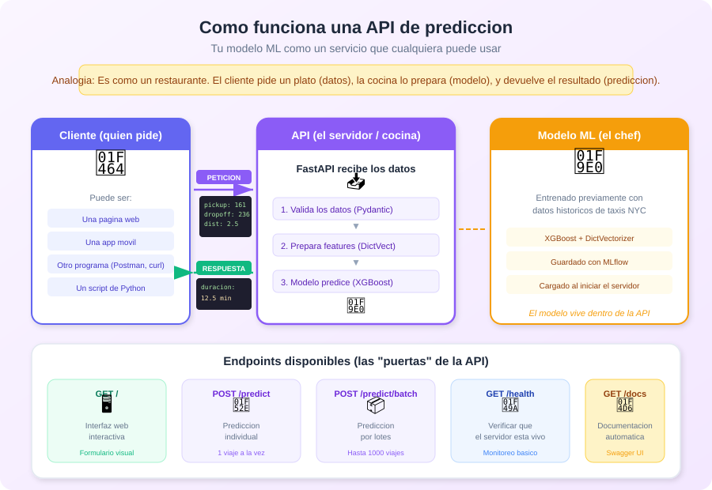

**Flujo simplificado:**

1. Un **cliente** (pagina web, app movil, Postman) envia datos de un viaje en taxi
2. La **API** (FastAPI) recibe los datos, los valida y se los pasa al modelo
3. El **modelo** (XGBoost) calcula cuanto tardara el viaje
4. La API devuelve la **prediccion** al cliente

### FastAPI y Uvicorn: las dos piezas clave

Para crear una API en Python necesitas dos herramientas que trabajan juntas. Piensa en un restaurante: **Uvicorn** es el mesero (recibe los pedidos y entrega los platos) y **FastAPI** es el chef (decide que hacer con cada pedido).

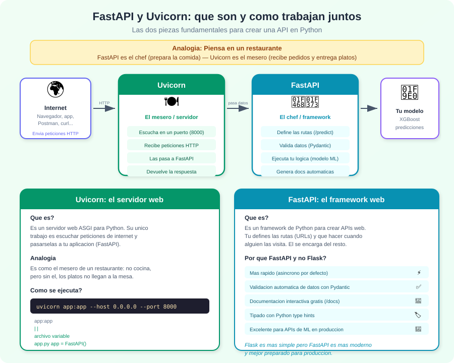

| Herramienta | Que es | Que hace |
|-------------|--------|----------|
| **Uvicorn** | Servidor web (ASGI) | Escucha en un puerto (ej: 8000), recibe las peticiones HTTP de internet y se las pasa a FastAPI |
| **FastAPI** | Framework web | Define las rutas (`/predict`, `/health`), valida datos, ejecuta tu logica (el modelo ML), y genera documentacion automatica |

**Por que FastAPI y no Flask?** Flask es mas conocido y simple, pero FastAPI es mas moderno: es mas rapido (asincrono), valida datos automaticamente con Pydantic, genera documentacion interactiva gratis (`/docs`), y usa tipado de Python. Para APIs de ML en produccion, FastAPI es la mejor opcion actual.

**Como se ejecutan juntos?**

```bash
# Uvicorn arranca y carga tu app de FastAPI
uvicorn app:app --host 0.0.0.0 --port 8000
#        |   |
#     archivo |
#     app.py  variable app = FastAPI()
```

Uvicorn lee el archivo `app.py`, busca la variable `app` (que es tu aplicacion FastAPI), y empieza a escuchar peticiones en el puerto 8000.

---

### Que es un decorador? (el simbolo @)

Para entender la sintaxis de FastAPI, primero necesitas saber que es un **decorador**. Es el simbolo `@` que aparece encima de las funciones.

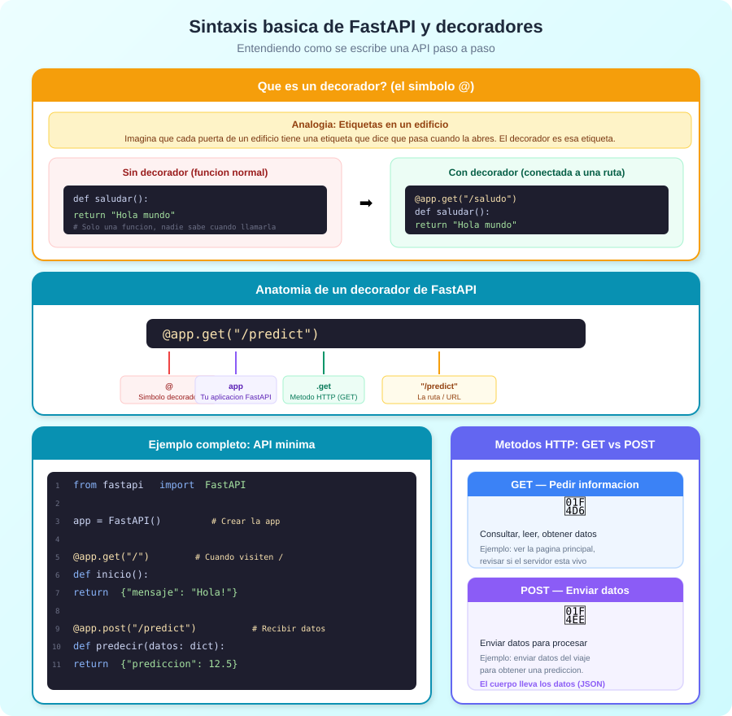

**Explicacion simple:** Un decorador es una "etiqueta" que le pones a una funcion para darle un superpoder. En FastAPI, el decorador le dice a tu funcion: *"Cuando alguien visite esta URL, ejecutate"*.

```python
# SIN decorador: una funcion normal que nadie llama automaticamente
def saludar():
    return "Hola mundo"

# CON decorador: FastAPI la ejecuta cuando alguien visita /saludo
@app.get("/saludo")
def saludar():
    return "Hola mundo"
```

**Anatomia del decorador de FastAPI:**

```
@app.get("/predict")
 |   |       |
 |   |       └── La ruta/URL que activa esta funcion
 |   └── El metodo HTTP (GET = pedir datos, POST = enviar datos)
 └── Tu aplicacion FastAPI
```

**Ejemplo minimo completo:**

```python
from fastapi import FastAPI

app = FastAPI()                    # 1. Crear la aplicacion

@app.get("/")                      # 2. Cuando visiten la raiz...
def inicio():
    return {"mensaje": "Hola!"}    #    ...devolver este JSON

@app.post("/predict")              # 3. Cuando envien datos a /predict...
def predecir(datos: dict):
    return {"prediccion": 12.5}    #    ...devolver la prediccion
```

**GET vs POST: cuando usar cada uno?**

| Metodo | Cuando usarlo | Ejemplo |
|--------|--------------|---------|
| `GET` | Para **pedir** informacion (solo lectura) | Ver la pagina principal, verificar si el servidor esta vivo |
| `POST` | Para **enviar** datos y recibir un resultado | Enviar datos del viaje y recibir la prediccion de duracion |

---

### Otras tecnologias que se usan

| Tecnologia | Para que sirve |
|-----------|---------------|
| **FastAPI** | Framework web que crea la API (rapido y con documentacion automatica) |
| **Uvicorn** | Servidor web que escucha peticiones y las pasa a FastAPI |
| **Pydantic** | Valida que los datos de entrada sean correctos (que la zona sea entre 1-265, etc.) |
| **XGBoost** | El modelo ML entrenado que hace la prediccion |
| **MLflow** | Formato en que se guardo el modelo durante el entrenamiento |
| **Docker** | Empaquetar todo (API + modelo) en un contenedor |
| **Docker Compose** | Levantar todo con un solo comando: `docker-compose up` |

### Endpoints disponibles

La API expone varias "puertas" (endpoints) que puedes usar:

| Endpoint | Metodo | Que hace |
|----------|--------|----------|
| `/` | GET | Interfaz web con formulario visual |
| `/predict` | POST | Prediccion de un solo viaje |
| `/predict/batch` | POST | Prediccion de hasta 1000 viajes |
| `/health` | GET | Verificar que el servidor esta vivo |
| `/docs` | GET | Documentacion interactiva (Swagger) |

> **Ejercicio practico:** Levanta el servicio con `docker-compose up`, abre `localhost:8000` en tu navegador, y usa el formulario web para predecir cuanto tarda un taxi.

---

## Paso 4: Subir a la nube - AWS EC2 (`web-service-aws/`)

### De local a la nube

Hasta ahora, tu API solo es accesible desde tu propio computador (`localhost`). Para que otras personas la usen, necesitas ponerla en un servidor en la nube.

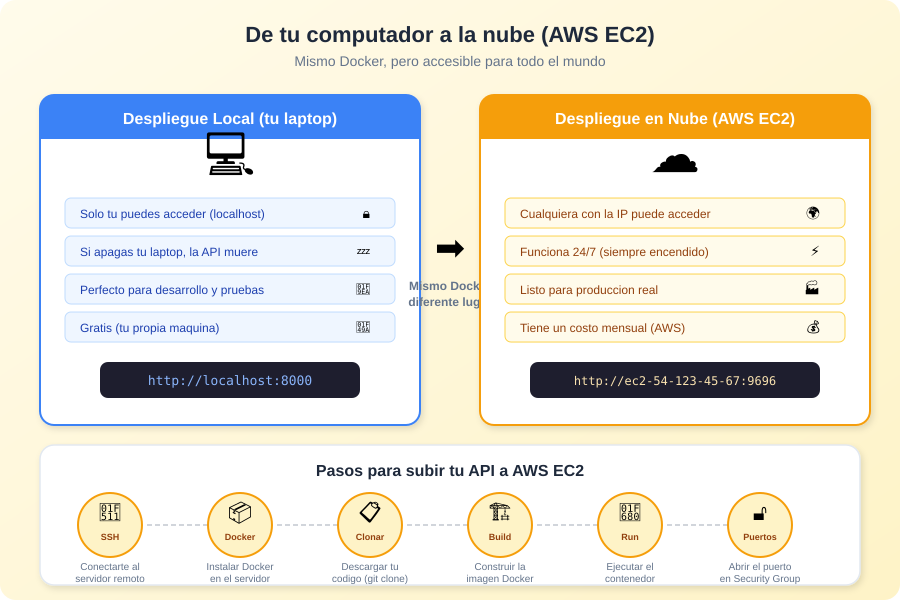

### Que cambia al ir a la nube?

| Aspecto | Local | Nube (AWS EC2) |
|---------|-------|----------------|
| Acceso | Solo tu (`localhost`) | Cualquiera con la IP publica |
| Disponibilidad | Se apaga con tu laptop | Funciona 24/7 |
| Uso | Desarrollo y pruebas | Produccion real |
| Costo | Gratis | Pago mensual (AWS) |
| Docker | Mismo proceso | Exactamente igual |

**Lo mas importante:** el proceso con Docker es identico. Solo cambia *donde* lo ejecutas. Lo que aprendiste en los pasos 1 y 3 se aplica directamente aqui.

### Pasos para desplegar en EC2

1. **Conectarte** al servidor con SSH (como un control remoto)
2. **Instalar Docker** en el servidor
3. **Clonar** tu codigo con `git clone`
4. **Construir** la imagen: `docker build -t taxi-prediction .`
5. **Ejecutar** el contenedor: `docker run -d -p 9696:9696 taxi-prediction`
6. **Abrir el puerto** en el Security Group de AWS para que sea accesible

> **Ejercicio practico:** Sigue la guia `GUIA_AWS_EC2.md` paso a paso. Al final, envia la IP publica a un compañero para que haga una prediccion desde su maquina.

---

## Panorama completo

Finalmente, asi es como todo lo que has aprendido en el curso se conecta:

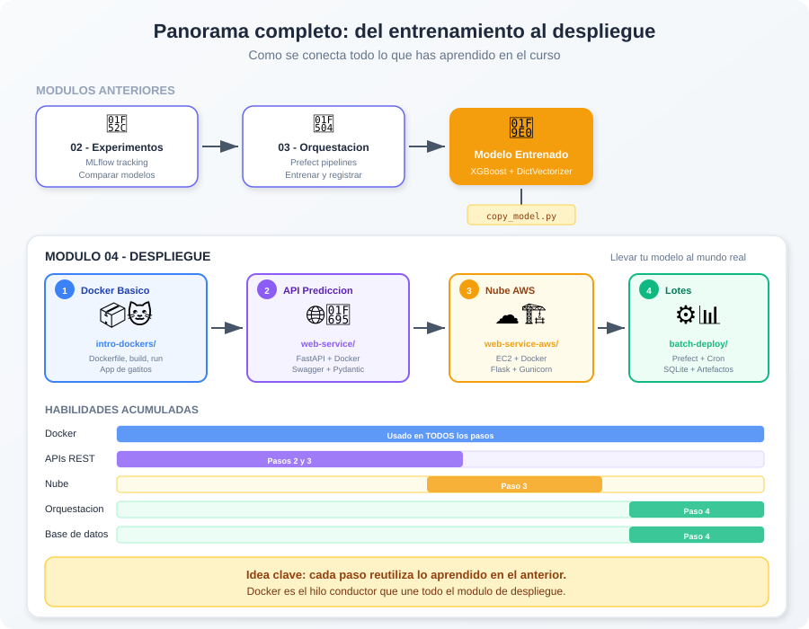

### Resumen del modulo

| Paso | Carpeta | Concepto nuevo | Sobre que construye |
|------|---------|---------------|-------------------|
| 1 | `intro-dockers/` | Docker (contenedores) | - |
| 2 | `batch-deploy/` | Jobs, persistencia, artefactos (MLOps puro) | Docker |
| 3 | `web-service/` | APIs REST + Modelo ML en tiempo real | Docker + conceptos MLOps |
| 4 | `web-service-aws/` | Despliegue en la nube | Docker + API + ML |

---

## Glosario rapido

Para estudiantes que encuentren terminos nuevos:

| Termino | Explicacion simple |
|---------|-------------------|
| **Docker** | Herramienta que empaqueta tu app con todo lo que necesita para funcionar en cualquier lugar |
| **Contenedor** | Tu app corriendo dentro de un "paquete" aislado |
| **Imagen** | El "paquete" listo para ejecutar (como un .zip con todo incluido) |
| **Dockerfile** | Las instrucciones para crear la imagen (como una receta) |
| **API** | Una "ventanilla" donde otros programas pueden pedir predicciones |
| **Endpoint** | Cada "puerta" de la API (ej: `/predict`, `/health`) |
| **Puerto** | El numero de "puerta" que usa tu app para comunicarse (ej: 8000, 9696) |
| **EC2** | Un computador virtual en la nube de Amazon (AWS) |
| **SSH** | Un "control remoto" para conectarte a un servidor |
| **Cron** | Un reloj que ejecuta tareas automaticamente a intervalos fijos |
| **Batch** | Procesar muchos datos de una vez, en lugar de uno por uno |
| **SQLite** | Una base de datos simple que vive en un solo archivo |
| **FastAPI** | Framework de Python para crear APIs web rapidas |
| **Prefect** | Herramienta para orquestar (organizar y automatizar) flujos de trabajo |
| **Flow** | El trabajo completo que se ejecuta de principio a fin (en Prefect) |
| **Task** | Cada paso individual dentro de un flow (en Prefect) |
| **Artefacto** | Reporte visual que una corrida deja para consulta posterior |
| **Batch ID** | Identificador unico de cada ejecucion programada (normalmente un timestamp) |
