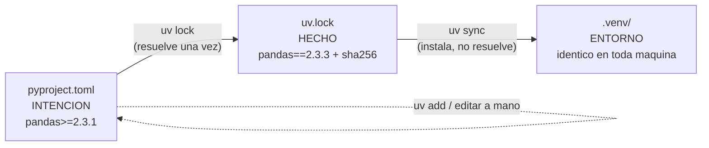

# Entorno reproducible con `uv`

> **Bloque A de la sesión 1** (40-95 min).
> **Fecha de revisión:** agosto de 2026. Todos los comandos de este documento se
> ejecutaron con `uv 0.8.17` sobre Python 3.11 antes de publicarlo. Donde hay una
> salida transcrita, es la salida real.
> Referencia oficial: [docs.astral.sh/uv](https://docs.astral.sh/uv/).

Este documento reemplaza a `02-python-envs.md`, `02.1-uv-conda-venv.md`,
`03-dependency-management.md`, `Resumen.md` y `referencia-uv/README.md` del
material anterior. Los cinco explicaban `uv`; ninguno explicaba **qué garantiza**
cada archivo, que es lo único que hay que entender de verdad.

---

## 1. El problema, antes de la herramienta

"Funciona en mi máquina" no es una broma de programadores: es la descripción exacta
de un `pipeline` de ML que no se puede auditar. Si tu RMSE se calculó con
`scikit-learn 1.6.1` y el mío con `1.9.0`, tenemos dos números y ninguna forma de
saber cuál es comparable. En un curso eso es una molestia. En un sistema donde el
modelo decide algo sobre una persona, es un problema de gobernanza.

Un entorno reproducible tiene que responder tres preguntas, y son distintas:

| Pregunta | Quién la responde |
|---|---|
| ¿Qué **intérprete** de Python? | `.python-version` + `requires-python` en `pyproject.toml` |
| ¿Qué **dependencias directas** quiero, y con qué margen? | `[project.dependencies]` de `pyproject.toml` |
| ¿Qué **versión exacta** de cada paquete, directo o transitivo, se instaló? | `uv.lock` |

Las tres se commitean. Ninguna sustituye a las otras.

---

## 2. `pyproject.toml` vs `uv.lock`: qué garantiza cada uno

Es la distinción central del bloque, y la que más se confunde.



| | `pyproject.toml` | `uv.lock` |
|---|---|---|
| Lo escribe | una persona | la herramienta |
| Qué contiene | tus dependencias **directas**, con rangos | **todas** las dependencias, directas y transitivas, con versión exacta y hash |
| Qué garantiza | que declares qué necesitas y por qué | que dos máquinas instalen **exactamente** lo mismo |
| Es multiplataforma | sí | **sí** — y esto es lo que lo diferencia de `pip freeze`, que congela lo que hay instalado en *tu* sistema operativo |
| ¿Se commitea? | siempre | **siempre**, para una aplicación o un `pipeline`. Para una **librería** que otros instalan, se commitea igual pero el consumidor no lo usa: se resuelve contra los rangos |
| ¿Se edita a mano? | sí | nunca. Se regenera con `uv lock` |

Míralo en este repositorio:

```bash
grep -A3 '^dependencies' pyproject.toml | head -6   # rangos: "pandas>=2.3.1"
grep -c '^\[\[package\]\]' uv.lock                  # cuántos paquetes resolvió de verdad
uv run python -c "import pandas; print(pandas.__version__)"
```

El número del segundo comando es siempre mucho mayor que el de dependencias que
declaraste. Ese delta es tu superficie de riesgo real, y es exactamente lo que el
`lockfile` fija.

> **Anti-patrón que este repositorio corrige.** El `Dockerfile` anterior de la API
> copiaba `pyproject.toml` a la imagen y acto seguido lo ignoraba, instalando a mano
> `pip install mlflow==2.17.2 xgboost==2.1.2 scikit-learn==1.5.2`. El artefacto que
> servía esa imagen se había generado con `mlflow 3.x`, `xgboost 3.2` y
> `scikit-learn 1.6.1`. Resultado: un `pickle` deserializado por otra versión de la
> librería, predicciones que podían diferir de las validadas por el `gate` de
> promoción, y un modelo aprobado en CI con una imagen que servía otra cosa. La
> regla que lo corrige: **las versiones se resuelven una vez, en `uv.lock`, y todos
> los entornos —local, CI, entrenamiento, `serving`— instalan de ahí.**

---

## 3. `uv add` vs `uv pip install` vs `uv sync` — el experimento

Los tres "instalan un paquete". Solo uno lo deja registrado. En vez de creerlo,
mídelo. **Hazlo tú, en una carpeta temporal, no en el repo del curso.**

```bash
# Un proyecto de juguete, fuera del repositorio del curso
cd /tmp && rm -rf demo-uv && mkdir demo-uv && cd demo-uv
uv init --no-workspace

# Instalamos DOS paquetes, de DOS maneras distintas
uv add rich                # (a) queda declarado en pyproject.toml y en uv.lock
uv pip install tabulate    # (b) se instala en .venv y NO se declara en ningún sitio

# Comprobación 1: ¿aparecen los dos en pyproject.toml?
grep -A4 '^dependencies' pyproject.toml
# -> solo "rich>=..."

# Comprobación 2: ¿aparece tabulate en el lockfile?
grep -c 'name = "tabulate"' uv.lock
# -> 0

# Comprobación 3: ahora mismo, ¿importan los dos?
uv run python -c "import rich, tabulate; print('ambos importan')"
# -> ambos importan          <-- por eso el problema es invisible

# EL EXPERIMENTO: borramos el entorno y lo reconstruimos desde el lockfile
rm -rf .venv
uv sync
uv run python -c "
import importlib
for m in ('rich', 'tabulate'):
    try:
        importlib.import_module(m); print(m, 'OK')
    except ImportError:
        print(m, 'DESAPARECIO')
"
```

Salida real (`uv 0.8.17`, agosto de 2026):

```
rich OK
tabulate DESAPARECIO
```

**La lección.** `uv pip install` funcionó perfectamente… hasta que alguien
reconstruyó el entorno. Ese alguien es el CI, el `Dockerfile`, tu compañero de
proyecto o tú mismo dentro de tres semanas. El paquete no estaba "instalado mal":
estaba instalado **sin declararse**, que es un estado del que no se puede volver.

Segundo acto, más incómodo todavía, y no hace falta borrar nada:

```bash
uv pip install tabulate      # lo volvemos a instalar
uv run python -c "import tabulate; print('instalado de nuevo')"
uv sync                      # sin borrar .venv
uv run python -c "
try:
    import tabulate; print('tabulate SIGUE')
except ImportError:
    print('tabulate ELIMINADO por uv sync')
"
```

Salida real: `tabulate ELIMINADO por uv sync`.

`uv sync` no es "instalar lo que falta": es **hacer que el entorno sea exactamente
el `lockfile`**, lo que incluye *quitar* lo que sobra. Eso es una virtud, no un
bug — es lo que hace que "mi entorno" y "el entorno" signifiquen lo mismo — pero
sorprende la primera vez.

### La tabla que hay que recordar

| Comando | ¿Toca `pyproject.toml`? | ¿Toca `uv.lock`? | ¿Sobrevive a `uv sync`? | Cuándo usarlo |
|---|---|---|---|---|
| `uv add <pkg>` | sí | sí | **sí** | siempre que la dependencia sea del proyecto |
| `uv add --group dev <pkg>` | sí (grupo `dev`) | sí | sí | `pytest`, `ruff`, `mypy`: lo que no va a producción |
| `uv remove <pkg>` | sí | sí | — | quitar una dependencia de verdad |
| `uv pip install <pkg>` | **no** | **no** | **no** | exploración de 5 minutos que vas a tirar. Nunca en un proyecto |
| `uv sync` | no | no | — | reconstruir el entorno tal cual el `lockfile`. **Este es el comando del CI** |
| `uv sync --locked` | no | **falla si está desfasado** | — | CI: garantiza que nadie olvidó commitear el `lock` |
| `uv lock` | no | sí (lo regenera) | — | después de editar `pyproject.toml` a mano |
| `uv lock --upgrade-package <pkg>` | no | sí (sube solo ese) | — | actualizar una dependencia de forma controlada |
| `uv run <cmd>` | no | no | — | ejecutar cualquier cosa en el entorno del proyecto |

> **`uv update` no existe.** El material anterior del curso lo documentaba dos
> veces, incluida su tabla resumen. Compruébalo: `uv update pandas` responde
> `error: unrecognized subcommand 'update'`. Lo correcto es
> `uv lock --upgrade-package pandas && uv sync`. Es un buen ejemplo de por qué este
> material declara fecha y versión: un comando inventado en un documento sin fecha
> es indistinguible de uno que existía y se quitó.

---

## 4. El flujo del curso, de principio a fin

### Primera vez

```bash
git clone git@github.com:<tu-usuario>/<tu-fork>.git
cd <tu-fork>
make setup      # uv sync --group dev + hooks de git + pre-commit + git lfs pull
make smoke      # el diagnóstico. Empieza aquí SIEMPRE
```

`make setup` es la interfaz única del repositorio y el CI corre exactamente los
mismos `targets`. Abre el [`Makefile`](../../Makefile) y léelo: son veinte líneas
por sección y no hay magia.

En Windows `make` no viene instalado. Las alternativas, en orden de preferencia:
usar el [`devcontainer`](../../.devcontainer/), instalarlo con
`winget install ezwinports.make`, o ejecutar a mano los comandos que el `target`
contiene (están listados en el [Quick Start](README.md#5-quick-start)).

### Cada día

```bash
uv run pytest -q              # tests
uv run ruff check .           # lint
uv run python -m taxi.cli --help
```

### Agregar una dependencia

```bash
uv add plotly                 # produccion
uv add --group dev pytest-mock # solo desarrollo
git add pyproject.toml uv.lock
git commit -m "chore: add plotly for the S02 notebooks"
```

**Los dos archivos van en el mismo commit.** Un `pyproject.toml` sin su `uv.lock`
es un PR que rompe el CI de todo el mundo: `uv sync --locked` detecta la
discrepancia y falla, que es justo lo que se le pide.

Y eso responde la autoverificación nº 2 del README: si el CI falla con
`The lockfile ... is not up to date`, no quites `--locked`; corre `uv lock` en local
y commitea el `lock`. Quitar `--locked` no arregla el problema, **oculta** la única
comprobación que te avisaba de él.

### Actualizar dependencias

```bash
uv lock --upgrade-package scikit-learn   # una, controlada
uv lock --upgrade                        # todas: solo con tiempo para probar
uv sync
uv run pytest                            # SIEMPRE. La suite es lo que autoriza el bump
```

Recuerda qué significa el número de versión antes de subirlo
([semver](https://semver.org/lang/es/)): `PATCH` suele ser seguro, `MINOR` puede
cambiar comportamiento, `MAJOR` rompe a propósito. Y en ML hay un cuarto caso que
`semver` no cubre: una versión `PATCH` de `scikit-learn` puede cambiar el resultado
numérico de un estimador. Por eso el modelo se sirve desde el `registry` con su
entorno declarado y no desde un `pickle` suelto (sesión 3).

### `uv run` frente a activar el entorno

```bash
# Opción A — la del curso
uv run python scripts/smoke_test.py

# Opción B — activación manual
source .venv/bin/activate          # macOS / Linux
.\.venv\Scripts\Activate.ps1       # Windows PowerShell  <-- ojo al punto inicial
python scripts/smoke_test.py
deactivate
```

Las dos son correctas. `uv run` se prefiere por un motivo que no es de comodidad:
en un `cron`, en un `task` de Prefect, en un `entrypoint` de Docker o en un `step`
de GitHub Actions **nadie activa nada**. Si tu código solo funciona con el entorno
activado, no funciona en producción. `uv run` además sincroniza antes de ejecutar,
así que no puedes correr con un entorno desfasado sin enterarte.

---

## 5. Versión de Python: `uv python` antes que `pyenv`

```bash
uv python install 3.11     # descarga el intérprete, sin tocar el PATH del sistema
uv python list             # qué versiones conoce
uv python pin 3.11         # escribe .python-version en el proyecto
```

Este repositorio ya trae `.python-version` con `3.11`, así que `uv` usa esa versión
sin que hagas nada.

**Por qué `uv python install` y no `pyenv`, como decía el material anterior.**
`pyenv` y `pyenv-win` funcionan y son buenas herramientas; el problema es el costo
de instalación en un aula. La ruta de `pyenv-win` era: descargar un `.ps1` crudo de
GitHub con `Invoke-WebRequest`, ejecutarlo contra una `ExecutionPolicy` que por
defecto lo bloquea, dejar que edite el `PATH` del usuario, cerrar la terminal,
abrirla de nuevo y compilar/descargar el intérprete. Son seis pasos y cuatro de
ellos fallan en alguien. `uv python install 3.11` es uno.

`pyenv` sigue teniendo su sitio: si administras un servidor con quince proyectos
que no usan `uv`, o si necesitas compilar Python con `--enable-optimizations` o con
una `openssl` concreta. Queda documentado como alternativa en
[`troubleshooting-so.md`](troubleshooting-so.md) §5.

---

## 6. Alternativas, con lo que cuestan

La tabla comparativa con criterio, fecha y enlaces está en el
[README §7](README.md#7-alternativas-y-trade-offs). Aquí va el razonamiento, que es
lo que se evalúa en el ADR del taller.

### Poetry — **no es legado**

Conviene decirlo claro porque el material anterior lo trataba como "la alternativa
que también incluimos" y hoy circula la idea contraria, de que está abandonado. No
lo está: la línea 2.x está activa (2.4.1, 9 de mayo de 2026). Poetry 2.0 adoptó
`[project]` de PEP 621, así que la diferencia sintáctica con `uv` se redujo mucho.

- **Elige Poetry** si ya lo tienes en producción, si publicas paquetes a PyPI
  (`poetry publish` está integrado y pulido) o si tu equipo lo conoce. Migrar
  cuesta tiempo y no compra nada que hoy te falte.
- **Elige `uv`** si empiezas de cero, si el CI es un cuello de botella o si quieres
  una sola herramienta para intérprete + entorno + dependencias + `tools`.
- **No uses las dos en el mismo proyecto.** Dos `lockfiles` describiendo el mismo
  entorno es peor que ninguno: cuando discrepan, no hay forma de saber cuál se
  instaló.

La plantilla de Poetry está en
[`templates/pyproject.poetry.toml`](templates/pyproject.poetry.toml) y su CI de
ejemplo en [`calidad.md`](calidad.md) §6.

### `pip-tools`

`pip-compile` toma un `requirements.in` con rangos y produce un `requirements.txt`
fijado y **con hashes**. Es la respuesta correcta cuando estás obligado a
`requirements.txt`: una imagen base heredada, una plataforma de despliegue que solo
entiende `pip install -r`, o una política interna. No gestiona intérpretes ni
entornos; hace una cosa y la hace bien.

### conda / mamba — donde sigue ganando

Aquí es importante no ser dogmático. `uv` resuelve paquetes **de Python**. Conda
resuelve un grafo de paquetes **binarios de cualquier lenguaje**, y por eso sigue
siendo la mejor opción —a veces la única razonable— cuando aparecen:

- **CUDA y `cudatoolkit`** con una versión concreta de `driver` y de `cuDNN`;
- **geoespacial**: GDAL, PROJ, GEOS, que arrastran librerías de sistema en C++;
- **compiladores y BLAS/MKL** gestionados dentro del entorno;
- **R o Julia** en el mismo entorno que Python;
- entornos científicos donde el `channel` `conda-forge` es la distribución de
  referencia de tu comunidad.

Lo que cuesta: entornos más pesados, resolución más lenta (mitigable con `mamba` o
con `micromamba`), el entorno vive **fuera** de la carpeta del proyecto —en
`envs/<nombre>`— y `conda env export` no es un `lockfile` real: incluye `builds`
específicos de la plataforma. Si necesitas un `lock` de verdad en conda, la
herramienta es `conda-lock`.

Patrón híbrido que se usa en la práctica y que conviene conocer: **conda para las
dependencias no-Python, `uv` (o `pip`) dentro de ese entorno para las de Python.**
Funciona, siempre que quede escrito quién manda sobre qué.

---

## 7. Datos, secretos y `.env`

Va aquí porque forma parte de "el entorno", aunque no sea una dependencia.

```bash
cp .env.example .env      # y edita .env, que está gitignorado
```

```python
import os

from dotenv import load_dotenv

load_dotenv()
uri = os.getenv("MLFLOW_TRACKING_URI", "http://127.0.0.1:5001")
```

Cuatro reglas, cada una con su razón:

1. **`.env` nunca se commitea; `.env.example` sí.** El ejemplo documenta qué
   variables existen y con qué forma, sin filtrar valores. Es el contrato de
   configuración del proyecto.
2. **Si un secreto entró al historial, rotarlo es obligatorio.** Borrar el archivo
   en un commit posterior no lo borra del historial: sigue ahí, recuperable con
   `git log -p`. El `hook` de `gitleaks` de este repositorio existe para que ese
   escenario no ocurra ([`calidad.md`](calidad.md) §5).
3. **En CI los secretos van en GitHub → Settings → Secrets and variables → Actions**
   y se referencian como `${{ secrets.MI_SECRETO }}`. No se imprimen en logs, y se
   pasan como variable de entorno al `step`, no como argumento de línea de comandos
   (los argumentos son visibles en la lista de procesos de la máquina).
4. **Los datos grandes no van en Git.** En este repositorio `data/raw/` y
   `data/processed/` están gitignorados y se reconstruyen con `make data`, que
   descarga las particiones fijas y **verifica su SHA-256** contra
   `data/raw/metadata.json`. Lo que se versiona es el **hash y la procedencia**, no
   los bytes. La discusión completa —hash + partición inmutable, DVC, lakeFS,
   Delta/Iceberg y cuándo cada una— es de la
   [sesión 2](../s02-datos/versionado-de-datos.md).

Detalle no obvio del `.gitignore` de este repositorio, que documenta un bug real:
el `.gitignore` anterior ignoraba globalmente `*.json`, y eso hacía **invisible**
a `data/raw/metadata.json`. La buena práctica existía y no se veía. De ahí las
excepciones explícitas al final del archivo.

---

## 8. Verificar que funcionó

```bash
make smoke
```

No `python -V`. `make smoke` comprueba, con exit code distinto de cero si algo
falla: versión de Python, entorno virtual activo, las 17 dependencias que el curso
usa **importándolas de verdad**, que el paquete `taxi` sea importable, que el
contrato de datos valide un `dataframe` correcto **y rechace uno roto**, que los
punteros de Git LFS estén resueltos, que los puertos 5001/4200/8000 estén libres y
que Docker responda. Léelo:
[`scripts/smoke_test.py`](../../scripts/smoke_test.py).

El mismo script corre en el CI (`job` `smoke`), con `--rapido`. Eso es lo que
significa "el CI corre lo mismo que tú".

---

## 9. Errores frecuentes de este bloque

| Síntoma | Causa | Arreglo |
|---|---|---|
| `ModuleNotFoundError` de un paquete que "sí instalaste" | lo instalaste con `uv pip install`, o estás usando el Python del sistema en lugar del `.venv` | `uv add <pkg>`; y ejecuta con `uv run` |
| `The lockfile ... is not up to date` en CI | commiteaste `pyproject.toml` sin `uv.lock` | `uv lock` y commitea los dos juntos |
| `uv sync` borró un paquete que necesitabas | no estaba declarado; `sync` deja el entorno igual al `lock` | `uv add <pkg>` |
| `python` apunta a 3.14 y el proyecto pide 3.11 | `python -m venv` usa el primer Python del `PATH`, sin preguntar | `uv python install 3.11 && uv python pin 3.11 && uv sync` |
| En Windows: `UnauthorizedAccess` al activar o al correr un `.ps1` | `ExecutionPolicy` `Restricted`, que es el valor por defecto | `Set-ExecutionPolicy -Scope CurrentUser -ExecutionPolicy RemoteSigned`. Ver [`troubleshooting-so.md`](troubleshooting-so.md) §2 |
| En Windows: `Activate.ps1` "no existe" | escribiste `\.venv\Scripts\...` sin el punto inicial: eso apunta a la raíz del disco | `.\.venv\Scripts\Activate.ps1` |
| El notebook no ve las dependencias del proyecto | el kernel de Jupyter apunta a otro intérprete | lánzalo con `uv run jupyter lab`, o registra el kernel del `.venv` |
| `make: command not found` en Windows | `make` no viene con Windows | `devcontainer`, `winget install ezwinports.make`, o ejecuta los comandos del `target` a mano |

Siguiente: [`git.md`](git.md) · Volver: [README](README.md)
