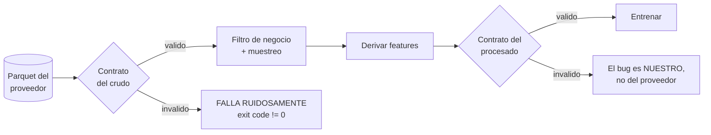

# Sesión 2 — Datos como código: contratos, versionado y `leakage`

> **Fecha de revisión del material:** agosto de 2026.
> Versiones verificadas ejecutando código en esta máquina: `pandera 0.32.1`,
> `pandas 2.3.3`, `scikit-learn 1.9.0`, `pyarrow 25.0.1`, `scipy 1.17.x`.
> Todas las cifras de datos de este documento están **medidas** sobre el parquet real
> de la NYC TLC, no estimadas. Los comandos para reproducirlas están en el
> [notebook 01](notebooks/01-el-dolor-de-los-datos.ipynb).

La sesión 1 consiguió que el **código** dé siempre el mismo resultado dado el mismo
dato. Esta sesión ataca la otra mitad, y es la que rompe los sistemas de ML de
verdad: **qué pasa cuando el dato cambia y nadie se da cuenta.**

La pregunta de la sesión: **¿cómo se entera tu sistema de que el dato que le llega ya
no es el dato con el que se construyó?**

---

## Objetivos

Al terminar la sesión debes poder:

1. **Reproducir** un fallo silencioso de datos: cambiar `trip_distance` de millas a
   kilómetros y **demostrar** que el `pipeline` entrena, registra una métrica creíble
   y sirve predicciones sin lanzar ninguna excepción.
2. **Escribir** un contrato de datos ejecutable con Pandera que distinga los **tres
   niveles de check** —por fila, por distribución y entre columnas— y **justificar**
   por qué hacen falta los tres.
3. **Explicar** el límite honesto de un contrato estático: por qué un factor de
   escala de 1,6 sobre un solo lote está en el borde de lo detectable, y **qué
   instrumento sí lo detecta** (puente a la sesión 7).
4. **Distinguir** qué va en el contrato y qué va en el test, y **escribir** tres
   `fixtures` rotos con los tests que verifican que el contrato los rechaza,
   incluido el **control negativo**.
5. **Elegir** una estrategia de versionado de datos entre las cuatro disponibles
   —hash + partición inmutable, DVC, lakeFS, Delta/Iceberg— y **argumentar** por qué
   no son sustitutos.
6. **Construir** un `split` temporal correcto y **medir** la diferencia contra
   `KFold(shuffle=True)` sobre los mismos datos.
7. **Identificar** las tres formas de `leakage` (preprocesar antes del `split`,
   features del futuro, `target` dentro de una feature) y **detectarlas sin entrenar
   un modelo**.
8. **Documentar** un `dataset` en una ficha con procedencia, licencia, sesgos
   conocidos, población representada y limitaciones.

Criterio de logro: los ocho son verificables con un comando o con un documento
entregable. El [taller](taller.md) los evalúa uno por uno.

---

## Cómo está organizada la sesión

Arrancamos con el problema en vivo, en el
[notebook 01](notebooks/01-el-dolor-de-los-datos.ipynb): dos fallos de datos que
no lanzan ningún error. De ahí pasamos a los contratos de datos y los tres
niveles de check (secciones 2 a 4), y en la segunda mitad, versionado de datos
(sección 6) y `split` temporal con las tres formas de `leakage` (sección 7). El
[taller](taller.md) se puede terminar en clase y es, casi tal cual, la primera
fase del proyecto del curso.

---

## 0. El dataset con el que trabaja todo el curso

Antes de romper nada, conozcamos lo que vamos a romper.

Todas las sesiones usan el mismo dataset: los **viajes de los taxis verdes de
Nueva York**, publicados por la Taxi and Limousine Commission (TLC), la entidad
que regula los taxis de la ciudad. Cada fila es **un viaje real**: dónde empezó
(`PULocationID`, una de las 265 zonas de la ciudad), dónde terminó
(`DOLocationID`), cuándo (`lpep_pickup_datetime` y `lpep_dropoff_datetime`) y
cuánto recorrió (`trip_distance`, **en millas** — ese detalle nos va a doler hoy
mismo). Los taxis verdes son los que operan fuera del centro de Manhattan; un
mes trae entre 60 y 70 mil viajes, un tamaño con el que se puede entrenar en
segundos.

De ese registro derivamos las dos variables que modelamos en el curso:
`duration` (minutos entre recogida y llegada — regresión) y `viaje_largo`
(¿duró más de 30 minutos? — clasificación).

**¿Por qué este dataset y no otro?** Cuatro razones, y las cuatro son razones
de MLOps más que de ML:

1. **Es público y sin registro.** Cualquiera lo descarga con un comando, hoy y
   dentro de cinco años. Nada del curso depende de una cuenta o una API key.
2. **Llega por particiones mensuales**, como llegan los datos en una empresa.
   Eso nos da gratis lo que otros cursos tienen que simular: un motivo real
   para reentrenar (llegó el mes nuevo) y drift real (compararemos enero contra
   julio en la sesión 7, y la diferencia existe de verdad: verano, tarifas,
   tráfico).
3. **Es lo bastante sucio para ser honesto.** Tiene registros corruptos (en
   enero de 2023 hay un viaje de 120.098 millas), nulos y colas raras. Los
   contratos de hoy se calibraron contra ese ruido real.
4. **Es lo bastante pequeño para iterar en clase.** Muestreamos cada mes a
   60.000 filas y un entrenamiento tarda segundos, no minutos.

Los meses que usa el curso están **fijos** en
[`src/taxi/config.py`](../../src/taxi/config.py) — nunca "el mes actual",
porque la TLC publica con retraso y el curso no puede depender de eso:

| Para qué | Meses |
|---|---|
| Entrenar | 2023-01, 2023-02, 2023-03 |
| Validar | 2023-04 |
| Holdout (el juez del `gate` de la sesión 6) | 2023-05 |
| "Producción" simulada (monitoreo, sesión 7) | 2023-07 y 2024-01 |

Se descargan con `make data`, quedan en `data/raw/` y su procedencia (URL, hash
SHA-256, tamaño) queda registrada en `data/raw/metadata.json`. En la sección 8
volvemos sobre por qué ese registro importa.

---

## 1. El dolor: todo verde, todo mal

Se abre [`notebooks/01-el-dolor-de-los-datos.ipynb`](notebooks/01-el-dolor-de-los-datos.ipynb)
y se recorre en vivo. **No se menciona Pandera hasta el bloque A.**

### Acto 1 — Una columna cambia de unidad

Un proveedor cambia `trip_distance` de millas a kilómetros. Una columna. Nada más.
Medido con los `fixtures` del repositorio:

| | millas (correcto) | "km" (el dato roto) |
|---|---|---|
| `dtype` | `float64` | `float64` — **igual** |
| nulos nuevos | — | **0** |
| filas | *n* | *n* — **igual** |
| mediana | ~3,4 | ~5,5 — **las dos son plausibles para un taxi** |
| RMSE del modelo entrenado con ella | 8,51 min | 9,35 min |

**Ninguna excepción. Ningún aviso. Dos números creíbles.** El modelo entrenado con la
columna equivocada predice minutos, tiene un RMSE del mismo orden que el correcto, se
registra bien en MLflow y su API responde `200` en 8 ms.

Es una degradación del ~10 %. **Mide y compara** la tuya en el notebook, y después
responde a la pregunta incómoda: *¿cuánta degradación haría falta para que alguien lo
notase, sin nada con lo que comparar?* Con un 10 % y sin referencia, la respuesta
honesta es que nadie.

> **La asimetría que define esta sesión.** Un fallo ruidoso cuesta una tarde de
> `debugging`. Un fallo silencioso cuesta meses de decisiones tomadas con predicciones
> malas, más el tiempo de descubrir que el problema estaba en los datos y no en el
> modelo. El contrato convierte lo segundo en lo primero.

Y la pregunta que cierra el acto, que es la que quedó abierta al final de la sesión 1:
**¿qué de todo lo que montamos la semana pasada —`ruff`, `mypy`, los tests, el CI—
habría detectado esto?** Ninguno. `mypy` ve `float64` y `float64`; un `float` no lleva
sus unidades encima. Los tests pasan porque el código es correcto: es el **dato** el
que cambió de significado.

### Acto 2 — La categoría nueva que el `encoder` descarta en silencio

El caso guía usa `DictVectorizer` para las categóricas, y lo hace a propósito
([`src/taxi/features/contract.py`](../../src/taxi/features/contract.py) lo explica):
el par origen-destino `PU_DO` tiene miles de valores y varios aparecen **solo** en
producción. `DictVectorizer` ignora las claves que no vio en `fit`.

Llega un viaje con `PULocationID = 999`, una zona que no existía en entrenamiento:

```
valores no cero de la fila transformada: [('dia_semana_pickup', 2.0), ('hora_pickup', 9.0), ('trip_distance', 4.2)]
```

Las **tres** features categóricas valen cero. El modelo devuelve un número razonable
calculado ignorando la mitad de la información del viaje, y no lo dice.

`OneHotEncoder(handle_unknown="ignore")` hace exactamente lo mismo — por eso existe
ese parámetro. Con `handle_unknown="error"` la API se cae con la primera ruta nueva.
**Ninguna de las dos opciones es gratis: o degradas en silencio, o rompes en voz
alta.** Lo que no vale es no haber elegido, ni no haber instrumentado la elección.

Hay tres formas de enterarse, y las tres tienen su sitio en el curso:

| Cómo | Cuándo te enteras | Sesión |
|---|---|---|
| El **contrato** rechaza el lote si la zona está fuera de `1-265` | en la frontera, antes de entrenar | esta (sección 3) |
| Una **métrica** que cuenta categorías no vistas por `request` | en producción, en tiempo real | S07 (Prometheus) |
| El **`drift`** de la distribución de `PU_DO` contra la referencia | por lotes, comparando periodos | S07 (Evidently) |

---

## 2. Contratos de datos: qué son y dónde viven

Un **contrato de datos** es un esquema **ejecutable y versionado junto al código** que
describe cómo se ve un dato válido. Se valida en la **frontera** del `pipeline`: donde
el dato entra, no donde se usa.



La herramienta con la que escribimos esos contratos en el curso es **Pandera**
(ojo: Pand**e**ra, no Pandora — el nombre viene de *pandas*). Es una librería de
Python para validar DataFrames: en lugar de confiar en que el DataFrame trae lo
que esperas, lo **declaras como una clase** —qué columnas, qué tipos, qué
rangos— y Pandera lo verifica cada vez que un dato cruza la frontera. Si algo
no cumple, lanza un error que dice exactamente qué columna y qué filas fallaron.
No es la única opción (en la sección 5 la comparamos con Great Expectations y
con Pydantic), pero es la de mejor relación costo-beneficio para un pipeline en
Python.

Los dos contratos del caso guía están en
[`src/taxi/data/contract.py`](../../src/taxi/data/contract.py), y la diferencia entre
ellos es una decisión, no una repetición:

| | `ViajesCrudos` | `ViajesProcesados` |
|---|---|---|
| Valida | el parquet tal como llega del proveedor | el `dataframe` listo para entrenar |
| Rangos | **anchos** (el mundo real trae basura) | **duros** |
| Si falla | el problema es del **proveedor** o de la descarga | el problema es de **nuestro** `pipeline` |
| `strict` | `False` | `False` |

**Por qué `strict = False` en los dos.** El parquet de la TLC trae ~20 columnas y solo
nos importan cinco. Un contrato que exija ausencia de columnas extra se rompe cada vez
que la TLC agrega un campo, y eso **entrena al equipo a ignorarlo**. Es el mismo
razonamiento que la cota ancha de sección 3: un contrato que grita por cosas que no importan
acaba desactivado.

### El contrato describe, el test verifica

Se confunden constantemente:

- **El contrato describe el dato válido.** Es una afirmación sobre el mundo:
  *"`PULocationID` está entre 1 y 265"*. Vive en `src/`, se versiona con el código y
  se ejecuta **en producción**, en la frontera del `pipeline`.
- **El test verifica cómo se comporta el `pipeline` ante el dato inválido.** Es una
  afirmación sobre tu código: *"si llega la zona 999, la validación **falla**"*. Vive
  en `tests/`, corre en el CI y **nunca** en producción.

El contrato es la regla; el test es la prueba de que la regla está encendida.

**Por qué hacen falta los dos.** Un contrato sin tests se degrada: basta que alguien
relaje un rango un viernes por la tarde para desbloquear un `pipeline`, y nadie lo
nota. Con tests, esa relajación rompe un test con nombre explícito. Es literalmente el
encabezado de
[`tests/data/test_contrato_datos.py`](../../tests/data/test_contrato_datos.py).

Y el test que casi nadie escribe, el **control negativo**: que el contrato **acepte**
varios lotes independientes de datos buenos.

```python
def test_el_contrato_no_inventa_fallos() -> None:
    """Tres lotes independientes del fixture valido pasan los tres niveles.

    Un contrato que falla con datos buenos se desactiva en la primera semana.
    """
    for semilla in (1, 2, 3):
        dc.validar_crudos(generar_crudos(semilla=semilla))
```

Sin él, *"mi contrato detecta el fallo"* no demuestra nada: un contrato que rechaza
**todo** también detecta el fallo.

### Los `fixtures` se generan en código, no se commitean como CSV

[`tests/conftest.py`](../../tests/conftest.py) genera los datos de prueba con semilla
fija en lugar de leerlos de un CSV, por tres razones que están escritas ahí:

1. un CSV de mil filas es **opaco**: nadie sabe qué propiedad tiene;
2. se desactualiza en silencio cuando el contrato cambia;
3. no explica **por qué** cada `fixture` roto está roto.

Los tres `fixtures` rotos del repositorio no son ruido aleatorio: cada uno reproduce
un fallo real.

| `Fixture` | Qué rompe | De dónde viene |
|---|---|---|
| `df_crudo_en_kilometros` | `trip_distance` en km | el generador sintético del repo anterior documentaba km y alimentaba un modelo entrenado en millas |
| `df_crudo_zona_invalida` | zona fuera de `1-265` | aparece cuando alguien inventa datos de prueba sin leer el diccionario de datos |
| `df_crudo_con_nulos` | nulos en columna obligatoria | una descarga cortada, o un `join` que no encontró pareja |

**Ninguno de los tres lanza una excepción por sí mismo.** Los tres entrenan un modelo
y producen un RMSE plausible. Ese es exactamente el punto del contrato.

Y un cuarto, que enseña la frontera entre contrato y filtro:
`df_crudo_con_duraciones_extremas` añade viajes de 0,5 y 90 minutos. El contrato del
crudo los **acepta** (solo exige que el `dropoff` sea posterior al `pickup`); es el
filtro de negocio de
[`loaders.preparar_particion`](../../src/taxi/data/loaders.py) el que los elimina.
**El contrato dice qué es un dato bien formado; el filtro dice qué es un viaje.**

---

## 3. Los tres niveles de check

Está implementado, calibrado con datos reales y documentado en
[`src/taxi/data/contract.py`](../../src/taxi/data/contract.py). Esta sección **explica
lo que ya está ahí**; el [notebook 01](notebooks/01-el-dolor-de-los-datos.ipynb) sección 3 lo
ejercita.

| Nivel | Cómo se escribe | Qué atrapa | Qué **no** puede ver |
|---|---|---|---|
| **1. Por fila** | `pa.Field(ge=..., le=..., nullable=...)` | registros corruptos individuales | nada sistemático: si *todas* las filas se desplazan a la vez, cada una sigue siendo válida |
| **2. Por distribución** | `@pa.dataframe_check` sobre una **fracción** o un agregado | problemas sistemáticos: cambio de unidades, ingesta cortada, inflación de una categoría | qué fila concreta está mal |
| **3. Entre columnas** | `@pa.dataframe_check` con dos o más columnas | incoherencias que no se ven mirando una columna sola | un desplazamiento que respete la relación entre columnas |

### Nivel 1 — por fila, con la cota **ancha a propósito**

```python
PULocationID: Series[int] = pa.Field(ge=1, le=265, nullable=False)
trip_distance: Series[float] = pa.Field(ge=0.0, lt=1e6, nullable=False)
```

Ese `lt=1e6` sorprende, y es la decisión más importante del contrato. Viene de un bug
real: el contrato original exigía `trip_distance <= 100` **por fila**, y el parquet
real de 2023-01 trae **37 viajes de más de 100 millas** (uno de **120.098,84**) en
**68.211** filas — un **0,054 %**. Resultado: `taxi data` fallaba con `SchemaErrors`
en la primera partición y bloqueaba el curso entero.

> **Un contrato que rechaza el lote completo por 37 filas de 68.211 es un contrato que
> el equipo aprende a desactivar. Y un contrato desactivado protege exactamente
> cero.**

Así que la cota por fila se queda en lo que **ninguna fila válida puede violar** (no
negativa, no absurda por órdenes de magnitud), y la señal de "esto es sistemático" se
mueve al nivel 2, que es donde pertenece.

Los outliers no se ignoran: se **filtran y se cuentan** en
[`loaders.preparar_particion`](../../src/taxi/data/loaders.py), que registra cuántas
filas descartó y **avisa si descarta más del 35 %**. Un filtro silencioso es tan
peligroso como no tener filtro: si mañana se descarta el 40 % de los datos, alguien
tiene que enterarse.

### Nivel 2 — por distribución: la fracción, que es lo que atrapa el cambio de unidades

```python
#: Fraccion maxima de viajes que puede superar las 100 millas antes de considerar
#: que el problema es sistematico y no ruido de captura.
MAX_FRACCION_OUTLIERS: float = 0.003
```

**Calibración, con los dos números que la justifican:**

| Cantidad | Valor | Medido sobre |
|---|---|---|
| Fracción real de viajes > 100 millas | **0,054 %** (37 de 68.211) | `green_tripdata_2023-01.parquet` |
| Umbral del contrato | **0,3 %** | decisión, con 5x de margen sobre lo medido |
| Fracción que dispararía la alerta | ≥ 0,3 % | p. ej. el 1 % o el 2 % de las filas |

El margen de 5x no es arbitrario: absorbe la variación normal entre meses y sigue
atrapando una inflación sistemática. Y hay un test que **protege el umbral por los dos
lados** ([`tests/data/test_niveles_de_check.py`](../../tests/data/test_niveles_de_check.py)):

```python
proporcion_real_medida = 0.00054
assert proporcion_real_medida * 3 < dc.MAX_FRACCION_OUTLIERS, (
    "el umbral quedo demasiado cerca del ruido real de la TLC"
)
assert dc.MAX_FRACCION_OUTLIERS < 0.01, "un umbral tan alto ya no detecta un cambio de unidades"
```

Si alguien baja el umbral, el `pipeline` vuelve a romperse con datos reales y **el
test lo dice antes de que pase en clase**. Si alguien lo sube, deja de detectar el
cambio de unidades. El umbral está atrapado entre dos aserciones con su razón escrita:
eso es lo que distingue un umbral **calibrado** de un número puesto a ojo.

El otro check de nivel 2 es `volumen_minimo` (≥ 1.000 filas): *"una partición con 50
filas normalmente significa que la descarga se cortó, no que hubo 50 viajes en un
mes"*. **Este check no protege el modelo: protege contra silenciar un fallo de
ingesta**, que es una categoría de problema distinta y que se olvida siempre.

### Nivel 3 — entre columnas: la velocidad implícita

```python
mph = df.loc[validos, "trip_distance"] / (minutos[validos] / 60)
return bool(2.0 <= float(mph.median()) <= 45.0)
```

Es un check de coherencia entre dos columnas. Si una de las dos cambia de unidad o de
escala, **la relación entre ambas se rompe aunque cada columna por separado siga
pareciendo razonable**.

El rango 2-45 mph es ancho a propósito: la señal que se busca es *"algo se rompió"*, no
*"el tráfico estuvo raro"*. En Manhattan la mediana ronda las 10-15 mph; medido sobre
2023-01, **10,63 mph**.

Y el otro check de nivel 3, `dropoff_posterior_a_pickup`: un viaje no puede terminar
antes de empezar. Es trivial y aparece en datos reales más de lo que nadie espera.

### La tabla que resume el bloque (medida, no estimada)

Salida real del notebook 01 sección 3 con el `fixture` sintético:

| Caso | Veredicto | Check que lo atrapa |
|---|---|---|
| crudo válido (control positivo) | **PASA** | — |
| distancia negativa | FALLA | `greater_than_or_equal_to(0.0)` — nivel 1 |
| zona 999 (fuera de `1-265`) | FALLA | `less_than_or_equal_to(265)` — nivel 1 |
| **1 outlier de 120.098 millas** | **PASA** | — *(y es lo correcto: ver arriba)* |
| el 2 % supera las 100 millas | FALLA | `outliers_de_distancia_son_marginales` — nivel 2 |
| millas → km | FALLA | `outliers_de_distancia_son_marginales` — nivel 2 |
| solo 50 filas | FALLA | `volumen_minimo` — nivel 2 |
| velocidad implícita ~300 mph | FALLA | `velocidad_implicita_plausible` — nivel 3 |
| el viaje termina antes de empezar | FALLA | `dropoff_posterior_a_pickup` — nivel 3 |

---

## 4. El límite honesto, y el puente a la sesión 7

**Esta es la sección que separa este material de la mayoría de los tutoriales de
contratos de datos.** Todo lo anterior funcionó sobre un `fixture` **sintético**.
Repetimos el experimento sobre el parquet **real**:

| | parquet real, millas | parquet real, "km" |
|---|---|---|
| filas | 68.211 | 68.211 |
| mediana `trip_distance` | 1,85 | **2,98** |
| fracción > 100 | 0,000542 (37 viajes) | **0,000557 (38 viajes)** |
| umbral del contrato | 0,003 | 0,003 |
| mediana de velocidad implícita | 10,63 mph | **17,10 mph** (dentro de 2-45) |
| **veredicto del contrato** | **PASA** | **PASA** |

**El contrato no atrapa el cambio de unidades sobre el lote real.** La razón es exacta
y está escrita en el propio test del repositorio
([`tests/data/test_contrato_datos.py`](../../tests/data/test_contrato_datos.py)):

> *"El contrato no compara unidades (no puede: el número no las lleva). Lo que detecta
> es que los viajes largos legítimos, al convertirse a km, se salen del límite de 100.
> **Si el dataset no tuviera cola larga, este contrato NO atraparía el cambio de
> unidades**, y conviene que eso quede escrito."*

El `fixture` sintético tiene una cola diseñada de viajes de 70-95 millas, así que en
km se sale de rango. El parquet real de green taxi es abrumadoramente urbano: mediana
1,85 millas, p99 por debajo de 15. Al pasar a km, la mediana va a 2,98 y sigue siendo
perfectamente plausible para un taxi. Y la velocidad implícita pasa de 10,63 a 17,10
mph, que **también** cae dentro del rango aceptado.

> **Un factor de 1,6 está en el borde de lo que un contrato estático puede detectar
> sobre un solo lote.** Eso no es un defecto del contrato: es su definición. Un
> contrato mira **un** lote, aislado, y decide si está bien formado. Para detectar un
> cambio de escala moderado hace falta lo único que el contrato no tiene por diseño:
> **una referencia con la que comparar.**

### Lo que sí lo detecta

Comparar la distribución contra una referencia histórica. Es decir, `drift`:

```
KS entre la referencia (millas) y el lote actual (km):
  D = 0.2513      <- tamaño de efecto, acotado en [0, 1]
  p = 0

Control negativo, dos muestras del MISMO dato:
  D = 0.0069      <- el ruido del instrumento
```

Un `D` de 0,25 frente a un ruido de 0,007 no deja lugar a dudas. El contrato no lo
vio; el `drift` no tiene ninguna duda.

Y fíjate en el **control negativo**: sin él, "mi detector marcó `drift`" no significa
nada. Es la misma disciplina que el control negativo del contrato de sección 2, aplicada al
otro instrumento. La sesión 7 lo llama *calibrar contra el ruido bajo el nulo* y es
donde se demuestra que un umbral por debajo de su propio ruido garantiza falsos
positivos.

### El puente S02 → S07

| | Contrato de datos (S02) | Monitoreo de `drift` (S07) |
|---|---|---|
| Qué mira | **un** lote, aislado | **dos** distribuciones: referencia vs actual |
| Qué pregunta responde | ¿este dato está bien formado? | ¿este dato se parece al que usé para entrenar? |
| Cuándo actúa | en la **frontera**, antes de entrenar o servir | por lotes, después, de forma continua |
| Qué hace al fallar | detiene el `pipeline` (rápido y ruidoso) | alerta, y alguien **investiga** |
| Necesita | nada más que el lote | una **referencia** versionada |
| Qué **no** puede ver | un cambio de escala moderado; una categoría que dejó de existir en el mundo | un registro individual corrupto |

**No compiten. Se complementan.** Un curso que enseñe solo una de las dos deja
justamente el hueco por el que se cuelan los incidentes reales: si te quedas solo con
el contrato, un factor de 1,6 se te pasa; si te quedas solo con el `drift`, entrenas
con nulos y con zonas inexistentes mientras esperas a acumular un lote para comparar.

Y hay una consecuencia operativa que se paga en la S07: **el `drift` necesita una
referencia versionada**. Si no puedes decir con exactitud qué dato usó tu `champion`
para entrenar, no puedes calcular `drift` contra nada. Eso es sección 6.

---

## 5. Pandera, Great Expectations o Pydantic

**Criterio de evaluación:** valida `DataFrames` completos (no registro a registro);
se integra con `pytest` y con el `pipeline` en proceso; `open source` sin cuenta;
mantenimiento activo (release en los últimos 12 meses).
**Fecha de evaluación: 19 de agosto de 2026.** La columna "última release" se consultó
ese día en el índice de PyPI. Cada fila enlaza a su documentación oficial.

| Herramienta | Última release | ¿Cumple el criterio? | Cuándo la elegirías | Documentación |
|---|---|---|---|---|
| **Pandera** | 0.32.1 (29-jun-2026) | Sí | **la del curso.** `in-process`, tipado, esquema como clase Python, se integra con `pytest` en tres líneas. Costo de entrada bajo, y el contrato vive junto al código que lo usa | [pandera.readthedocs.io](https://pandera.readthedocs.io/) |
| **Great Expectations Core** | 1.20.0 (7-ago-2026) | Sí, con reserva (ver abajo) | `data warehouse` y `reporting`: cuando el consumidor del contrato es un **analista** y no un `pipeline`. Data Docs, catálogo de `expectations`, `Checkpoints` con `Actions` | [docs.greatexpectations.io](https://docs.greatexpectations.io/) |
| **Pydantic** | 2.13.4 (6-may-2026) | **No para `DataFrames`** | I/O de una **API**: un registro a la vez, con `FastAPI`. Es lo que usa el curso en la S05, y es la herramienta correcta ahí | [docs.pydantic.dev](https://docs.pydantic.dev/) |
| **`assert` a mano** | — | Parcial | un `script` de un archivo. Deja de escalar en cuanto el esquema tiene que documentarse, reutilizarse o versionarse | — |

### La reserva sobre Great Expectations, que es importante decirla

**La API de GX Core 1.x cambió por completo respecto a 0.18.** El modelo actual gira
en torno a: `Data Context` → `Data Source` → `Data Asset` → `Batch Definition` →
`Expectation Suite` → **`Validation Definition`** → `Checkpoint` → `Actions`. Los
`Validation Definition` no existían en 0.18, y el flujo antiguo basado en
`great_expectations init`, los archivos YAML de `great_expectations/` y los
`checkpoints` declarados en disco ya no es el camino recomendado.

Consecuencia práctica, y es la razón por la que esto está en el README y no en una
nota al pie: **la mayoría de los tutoriales de GX que hay en la web están obsoletos y
no ejecutan.** Si copias un `snippet` de un blog de 2023 con `great_expectations` 1.x
instalado, no te va a funcionar, y el error no dirá "esto es de otra versión".

Es la misma lección que la sesión 7 aprende con Evidently 0.7, y la razón por la que
este material declara **versión y fecha** en cada tabla: una tabla de herramientas sin
fecha de evaluación es desinformación con retardo.

### Cuándo Pandera y cuándo GX, sin dogma

| Señal | Elige |
|---|---|
| El contrato lo consume un `pipeline` de Python | Pandera |
| El contrato lo consume un analista o un auditor que necesita ver un informe | GX (Data Docs) |
| Quieres el esquema como **tipo** (`Series[int]`, integración con `mypy`) | Pandera |
| Validas 40 tablas de un `warehouse` con `expectations` reutilizables | GX |
| Necesitas que el `check` sea un paso de `pipeline` con `exit code` | las dos sirven; Pandera es menos código |
| Tu equipo ya usa una de las dos y funciona | **la que ya usas.** Migrar por migrar no compra nada |

Las dos son compatibles con el taller. Lo que se evalúa es que el contrato tenga los
tres niveles y que existan los tests, no la marca.

---

## 6. Versionado de datos: cuatro estrategias, y no son sustitutas

El error habitual es preguntar *"¿cuál uso?"* cuando la pregunta correcta es *"¿qué
problema tengo?"*. Cada una resuelve uno distinto, y **la primera es obligatoria
siempre**.

| Estrategia | Qué problema resuelve | Qué **no** resuelve | Coste de adopción | Última release | Documentación |
|---|---|---|---|---|---|
| **Hash + partición inmutable** | *"¿es este el mismo dato con el que medí?"* Procedencia y detección de re-publicación | ramas, `rollback`, `diff` de contenido, datos que cambian | **casi cero.** Es el mínimo no negociable | parte de tu código | — |
| **DVC** | *"reproducir el experimento de marzo con su dato exacto"*. `Pipelines` con dependencias declaradas y caché | transacciones concurrentes, aislamiento a nivel de `lake` | bajo-medio: un remoto y `dvc.yaml` | 3.67.1 (31-mar-2026) | [dvc.org/doc](https://dvc.org/doc) |
| **lakeFS** | *"aislar y revertir un `lake` entero"*. Ramas y `commits` sobre `object storage`, `merge`, `rollback` atómico | `diff` semántico de filas, `time travel` a nivel de tabla | medio-alto: es un servicio que hay que operar | 0.16.0 (10-abr-2026, cliente Python) | [docs.lakefs.io](https://docs.lakefs.io/) |
| **Delta Lake / Apache Iceberg** | *"una tabla transaccional con `time travel`"*. ACID, `schema evolution`, consultar el estado de una fecha | versionar un `.pkl` o un CSV suelto; reproducir un experimento completo | medio-alto: cambia tu formato de almacenamiento | `deltalake` 1.6.2 (8-jul-2026) · `pyiceberg` 0.11.1 (3-mar-2026) | [docs.delta.io](https://docs.delta.io/) · [iceberg.apache.org/docs](https://iceberg.apache.org/docs/latest/) |

**Fecha de evaluación: 19 de agosto de 2026.** Versiones consultadas en PyPI ese día.

**Criterio de evaluación** de la tabla: `open source` usable sin cuenta; funciona con
almacenamiento local para poder demostrarse en clase; mantenimiento activo (release en
los últimos 12 meses).

### Lo que hace el caso guía, y por qué es el mínimo

El curso usa la **estrategia 1** en
[`src/taxi/data/loaders.py`](../../src/taxi/data/loaders.py), y son 30 líneas:

```python
meta[particion.nombre_archivo] = {
    "url": particion.url,
    "sha256": _sha256(destino),
    "bytes": destino.stat().st_size,
    "particion": particion.etiqueta,
    "fuente": "NYC Taxi and Limousine Commission (TLC) Trip Record Data",
    "licencia": "Datos publicos de la NYC TLC — uso libre con atribucion",
}
```

Tres propiedades, cada una con su consecuencia:

1. **Particiones fijas y del pasado.** Nunca `datetime.now()`. El `pipeline` anterior
   del curso calculaba el periodo con el reloj y pedía `green_tripdata_2025-01.parquet`,
   un archivo que la TLC puede no haber publicado
   ([ADR 001](../../docs/adr/001-caso-guia-y-particiones.md)).
2. **SHA-256 registrado.** Si el proveedor **republica** el archivo, el `loader` avisa
   fuerte: *"las métricas calculadas con la versión anterior ya no son comparables"*.
   Sin esto, una re-publicación silenciosa invalida todo tu histórico de experimentos
   y nadie se entera.
3. **Lo que se versiona es el hash y la procedencia, no los bytes.** `data/raw/` está
   gitignorado; `data/raw/metadata.json` **no**. Y ese es un detalle que documenta un
   bug real del repositorio: el `.gitignore` anterior ignoraba globalmente `*.json`, y
   eso hacía **invisible** el `metadata.json`. La buena práctica existía y no se veía.

> **Git LFS no es versionado de datos.** LFS resuelve *el tamaño del `blob` en Git*.
> No da `diff` de tablas, ni `time travel`, ni ramas de datos, ni `lineage`. Es la
> confusión más común al salir de la sesión 1
> ([`git.md`](../s01-reproducibilidad/git.md) sección 5).

La guía práctica, con los comandos de DVC y las advertencias de entorno, está en
**[`versionado-de-datos.md`](versionado-de-datos.md)**.

---

## 7. `Split` temporal y las tres formas de `leakage`

Se trabaja en [`notebooks/02-validacion-temporal-y-leakage.ipynb`](notebooks/02-validacion-temporal-y-leakage.ipynb).

**Por qué está en la sesión de datos y no en una de modelado.** El `leakage` no es un
error de modelado: es un error de **construcción del `dataset`**. Se comete al decidir
qué columna es una feature y cómo se calcula. Es un problema de datos como código.

### La regla

> **En producción, el modelo siempre predice sobre el futuro.** Cualquier validación
> que no respete eso mide algo que no va a ocurrir.

Medido en el notebook, sobre una serie diaria de demanda construida con las
particiones del caso guía (144 días útiles, mismo modelo, mismas features):

| Esquema de validación | RMSE medio |
|---|---|
| `TimeSeriesSplit(n_splits=5)` | **184,6** |
| `KFold(n_splits=5, shuffle=True)` | 166,0 |

El `KFold` aleatorio reporta un RMSE un **10,1 % mejor**, y ese es el número que no
vas a ver en producción. **Mide y compara** los tuyos.

Dos precisiones, porque es fácil sacar la lección equivocada:

1. **La dirección del sesgo no es casual.** Al mezclar días, cada `fold` de `test`
   queda rodeado de días vecinos que están en `train`. Con lags autocorrelacionados,
   eso es casi tener la respuesta. En producción no tienes vecinos futuros.
2. **La magnitud depende del `dataset`.** Aquí es moderada. Con series muy
   autocorrelacionadas o con tendencia fuerte es mucho mayor. Si encuentras un
   tutorial donde la diferencia es un factor 3, probablemente el dato esté construido
   para que lo sea.

Y el matiz que casi todo el material omite: **`TimeSeriesSplit` tampoco es
automáticamente correcto.** Si tu feature usa una ventana de 30 días, el `fold` de
`test` puede contener información derivada de días que están en `train`. La solución
es `TimeSeriesSplit(n_splits=5, gap=30)`.

### Las tres formas de `leakage`

**1. Escalar o imputar antes del `split`.**

```python
# MAL — el fit del scaler ve test
X_esc = StandardScaler().fit_transform(X)
X_tr, X_te = X_esc[:corte], X_esc[corte:]

# BIEN — el fit ocurre dentro de cada fold, solo con train
pipe = Pipeline([("escala", StandardScaler()), ("modelo", Ridge())])
```

Lo mismo con `SimpleImputer` (la media que rellena viene del futuro), `SelectKBest`
(las features se eligen mirando `test`) y `PCA`.

Medido en el notebook sección 3, con un 12 % de nulos inyectados: los dos RMSE salen
**casi iguales** (146,4 frente a 146,6), pero las medias del `imputer` son
**distintas** (2255,3 con `fit` sobre todo, 2267,6 con `fit` solo en `train`).

> **El `leakage` que no mueve tu métrica es el que sobrevive al `code review`.** Si te
> regalara un RMSE espectacular lo detectarías; nadie se cree un RMSE de 0,01. El
> peligroso es este.

Por eso la defensa **no es medir**: es **estructural**. Toda transformación que
*aprende* algo del dato va dentro de un `Pipeline`. No es estilo: es lo único que hace
la validación válida.

**2. Features con información del futuro.**

```python
d["viajes"].shift(1).rolling(7).mean()  # CORRECTO: los 7 dias ANTERIORES
d["viajes"].rolling(7).mean()  # LEAKAGE: la ventana incluye HOY
```

Ocho caracteres de diferencia. Medido: 184,6 (correcto) frente a **167,6** (con
`leakage`) — una "mejora" gratis en validación e imposible en producción, porque la
mañana en que hay que predecir hoy, el conteo de hoy no existe.

La comprobación que no necesita ningún modelo: mirar las dos columnas en una fila
concreta. La ventana con `leakage` contiene el `target` dividido entre 7; el modelo
solo tiene que multiplicar por 7 y restar los otros seis.

**3. El `target` codificado dentro de una feature.**

El más difícil de ver, porque la feature parece razonable y tiene nombre de negocio.
En este dominio, el clásico:

```python
df["velocidad_media"] = df["trip_distance"] / (df["duration"] / 60)
```

`duration` es **el `target`**. Medido sobre el problema real del caso guía (entrenar
en 2023-01, evaluar en 2023-04): RMSE **5,20 → 3,96 min**, un 24 % de "mejora"
imposible de reproducir.

**Y aquí está el hallazgo que desmonta el atajo más popular:** la correlación de
Pearson entre `velocidad_media` y `duration` es **0,113**. Baja. Porque la relación es
`duration = distancia / velocidad`, es decir **inversa y no lineal**, y Pearson mide
relación lineal. Un modelo la explota; un coeficiente de correlación no la ve.

Conclusión: **una correlación baja no es evidencia de ausencia de `leakage`.**

### La pregunta que sí funciona

Para **cada** feature, una sola pregunta, y se responde sin ejecutar nada:

> **¿Este valor estaba disponible en el momento en que hay que hacer la predicción?**

Su versión operativa, que es la que se lleva al proyecto: **anota, junto a cada
feature, el instante en que su valor queda disponible.** Con eso la pregunta se
responde comparando dos `timestamps` en lugar de discutiéndola en un PR. Va en la
[`dataset-card.md`](dataset-card.md).

| Feature del caso guía | ¿Disponible al predecir? | Por qué |
|---|---|---|
| `hora_pickup`, `dia_semana_pickup` | **sí** | se derivan del momento de la recogida, que ya ocurrió |
| `PULocationID`, `DOLocationID` | **sí** | el destino se declara al subir |
| `trip_distance` | **sí, con matiz** | es la distancia *registrada*. Para predecir antes de arrancar habría que usar la distancia *estimada* de la ruta. Es el tipo de matiz que va escrito en la `dataset card` |
| `lpep_dropoff_datetime` | **no** | es el `target`, disfrazado |
| `total_amount`, `fare_amount` | **no** | la tarifa se calcula **con** la duración |
| `velocidad_media` | **no** | divide por el `target` |

### El `baseline` tonto, que es la comprobación más rentable

Medido en el notebook sección 6:

| | RMSE |
|---|---|
| `baseline`: predecir la media de `train` | 277,8 |
| `baseline`: predecir "lo mismo que ayer" | 266,8 |
| modelo (XGBoost + lags, `split` temporal) | **215,7** |

Si tu modelo no le gana a *"como ayer"*, no tienes un modelo: tienes un problema más
fácil de lo que creías, o un bug. Y si le gana por un factor de 5, **sospecha de
`leakage` antes de celebrar**.

---

## 8. Procedencia, licencia y ficha del `dataset`

La ficha del caso guía, que sirve de plantilla, está en
**[`dataset-card.md`](dataset-card.md)**.

Los datos del caso guía son **NYC TLC Trip Record Data**: datos públicos de la New
York City Taxi and Limousine Commission, de uso libre con atribución. El `loader`
registra la fuente y la licencia en `data/raw/metadata.json` **en cada descarga**, no
en un documento aparte que se desactualiza.

**Por qué esto no es burocracia.** Tres razones, en orden de urgencia práctica:

1. **Sin unidades declaradas, el incidente de sección 1 es inevitable.** La `dataset card`
   del caso guía dice que `trip_distance` viene en **millas**. Ese es el único sitio
   donde esa información existe: el `float` no la lleva.
2. **Sin licencia declarada, no sabes si puedes usar el dato.** Es requisito del
   proyecto y de la vida profesional.
3. **El AI Act exige documentación técnica del dato** para sistemas de alto riesgo
   (gobernanza de datos, art. 10). Aun cuando tu proyecto no lo sea —el caso guía no
   lo es— la ficha es honestidad intelectual básica. La discusión completa de
   clasificación y fechas está en
   [`sesiones/s07-monitoreo/gobernanza.md`](../s07-monitoreo/gobernanza.md).

Y la parte que casi nadie escribe: **sesgos conocidos y población representada.** El
green taxi no es "los viajes de Nueva York": es una flota con restricciones
geográficas de recogida, distinta del yellow taxi y de los `for-hire vehicles`. Un
modelo entrenado con esto no generaliza a Uber ni a Manhattan sur. Está desarrollado
en la [`dataset-card.md`](dataset-card.md) sección 5.

---

## 9. Autoverificación

Respóndelas sin mirar arriba. Entre paréntesis, dónde está la respuesta.

1. `trip_distance` pasa de millas a kilómetros y tu `pipeline` no falla. Enumera qué
   de tu `stack` de la sesión 1 —`ruff`, `mypy`, los tests, el CI— lo habría
   detectado, y explica por qué. (sección 1)
2. ¿Por qué el contrato **acepta** un viaje de 120.098 millas y **rechaza** que el
   2 % de los viajes pase de 100? Explícalo en términos de las dos preguntas distintas
   que responden esos dos checks. (sección 3)
3. Tu contrato tiene ocho reglas y todas pasan sobre el lote de hoy. Un proveedor
   multiplicó una columna por 1,6. ¿Lo detectas? ¿Y qué **sí** lo detectaría, en qué
   momento del ciclo de vida y a costa de qué? (sección 4)
4. Tienes hash + partición inmutable. ¿Qué te falta todavía para poder decir *"este
   experimento de marzo usó exactamente este dato"*? ¿Y para poder revertir un `lake`
   entero después de una carga mala? (sección 6)
5. Añades una feature nueva y tu AUC sube de 0,72 a 0,97, pero su correlación con el
   `target` es 0,08. ¿Descartas el `leakage`? Justifícalo con lo medido en sección 7. (sección 7)

---

## 10. Qué NO usar

| No usar | Por qué | En su lugar |
|---|---|---|
| `train_test_split(..., shuffle=True)` sobre series temporales | pone el futuro en `train` y el pasado en `test`. Medido: 10,1 % de RMSE optimista sobre los mismos datos | corte temporal + `TimeSeriesSplit`, con `gap` si tus ventanas son largas (sección 7) |
| `KFold(shuffle=True)` para validar un modelo temporal | ídem | `TimeSeriesSplit` |
| `df.fillna(0)` por defecto | no es una estrategia, es una decisión oculta: sesga la media e **inventa ceros que el modelo aprende como reales**. Un `0` en `trip_distance` significa "viaje de distancia nula", que es otra cosa que "no lo sé" | decidir **por columna**, distinguiendo el nulo **estructural** (el campo no aplica) del nulo por **fallo de captura**; imputar dentro de un `Pipeline`; y **dejarlo escrito** en la `dataset card` |
| `mean_squared_error(y, y_pred, squared=False)` | el parámetro `squared` fue deprecado en `scikit-learn` 1.4 y **eliminado** en 1.6. No existe en la 1.9.0 de este curso: lanza `TypeError` | `root_mean_squared_error(y, y_pred)` |
| `import pandera as pa` para clases de `pandas` | emite `FutureWarning`: *"Importing pandas-specific classes and functions from the top-level pandera module will be **removed in a future version**"*. Verificado con `pandera 0.32.1` | `import pandera.pandas as pa`, que es lo que usa [`src/taxi/data/contract.py`](../../src/taxi/data/contract.py) |
| `pandera.SchemaModel` | **eliminado**. Fue renombrado a `DataFrameModel` | `pa.DataFrameModel` |
| Las APIs de Great Expectations 0.18 (`great_expectations init`, `BatchRequest` del flujo antiguo, los YAML de `great_expectations/`) | GX Core 1.x reorganizó el modelo por completo (`Validation Definition`, `Batch Definition`). La mayoría de los tutoriales de la web son de 0.18 y **no ejecutan** | la API 1.x: `Data Context` → `Data Source` → `Batch Definition` → `Expectation Suite` → `Validation Definition` → `Checkpoint`. Ver la [doc oficial](https://docs.greatexpectations.io/) |
| `ColumnMapping` de Evidently | reemplazado en Evidently 0.7 y **eliminado**. Se adelanta aquí porque aparece en tutoriales de contratos de datos | `DataDefinition` + `Dataset.from_pandas`. Detalle en [S07](../s07-monitoreo/README.md) |
| Pydantic para validar `DataFrames` | está diseñado para un registro a la vez; validar 60.000 filas creando 60.000 objetos es lento y no expresa checks de distribución | Pandera o GX. Pydantic **sí** para el I/O de la API (S05) |
| Cotas por fila estrictas como único check | rechazan el lote completo por 37 filas de 68.211 y el equipo aprende a desactivar el contrato | cota ancha por fila + check de **fracción** por distribución (sección 3) |
| Un contrato sin control negativo | "detecta el fallo" no demuestra nada: un contrato que rechaza todo también lo detecta | un test que valide varios lotes independientes de datos **buenos** (sección 2) |
| Filtrar filas en silencio | si mañana se descarta el 40 % de los datos, nadie se entera | contar y **registrar** cuántas se descartaron, con un aviso por encima de un umbral, como [`loaders.preparar_particion`](../../src/taxi/data/loaders.py) |
| Git LFS como versionado de datos | resuelve el tamaño del `blob` en Git; no da `diff`, ni `time travel`, ni ramas, ni `lineage` | la estrategia 1 siempre, y DVC / lakeFS / Delta según el problema (sección 6) |
| `datetime.now()` para elegir la partición de datos | acopla el `pipeline` al reloj y rompe la reproducibilidad entre cohortes. Era el bug que impedía arrancar el `pipeline` estrella del curso anterior | particiones **fijas** en `config.py` ([ADR 001](../../docs/adr/001-caso-guia-y-particiones.md)) |

---

## La anatomía de un proyecto de ML

Ya que el proyecto del curso arranca en esta sesión, vale la pena parar un
momento en algo que casi nunca se enseña: **cómo se organizan las carpetas de un
proyecto de ML serio**, y por qué cada una existe. Esta es la estructura que van
a encontrar en la industria, con variaciones menores:

```
mi-proyecto/
├── pyproject.toml        que necesita el proyecto (lo vimos en la sesión 1)
├── uv.lock               exactamente qué quedó instalado
├── Makefile              los comandos del proyecto, con nombre corto
├── README.md             qué es esto y cómo se corre
├── .gitignore            qué NO se versiona
├── .github/workflows/    el CI: lo que se verifica en cada push
├── src/mi_paquete/       el código de verdad, como paquete instalable
│   ├── config.py           las decisiones en un solo lugar
│   ├── data/               cargar y VALIDAR datos (lo de hoy)
│   ├── features/           construir variables
│   ├── models/             entrenar y evaluar
│   ├── api/                servir el modelo (sesión 5)
│   └── monitoring/         vigilarlo (sesión 7)
├── notebooks/            exploración y narrativa — importa de src/, no define lógica
├── tests/                lo que protege a src/ de nosotros mismos
├── data/                 los datos NO se versionan; la carpeta sí existe
│   ├── raw/                tal como llegaron, intocables
│   └── processed/          lo que produce el pipeline
├── configs/              parámetros por entorno, si los hay
├── models/               artefactos locales — tampoco se versionan
└── docs/                 decisiones, fichas de datos y del modelo
```

Tres reglas mandan sobre cualquier variante:

1. **La lógica vive en `src/`, no en `notebooks/`.** Un notebook importa
   funciones del paquete y las usa para explorar; en el momento en que define
   una función que alguien más necesita, esa función se muda a `src/`. Es la
   lección completa de la sesión 1 en una frase.
2. **`data/` y `models/` existen pero no se versionan.** Se versiona el *cómo
   obtenerlos* (el código, los hashes, el `metadata.json`), no los bytes. Git
   guarda recetas, no ingredientes.
3. **La separación `raw/` / `processed/` es sagrada.** Lo que llegó del
   proveedor no se toca nunca; todo lo derivado se puede borrar y regenerar. Si
   un archivo de `raw/` cambió, no fue el pipeline: fue el proveedor, y eso es
   una alerta (sección 8).

Este repositorio sigue esa misma estructura (con `taxi` como nombre del
paquete), y el [starter template del proyecto](../../proyecto/starter-template/)
también, así que la van a recorrer dos veces antes de armar la suya.

---

## 11. Taller, proyecto y puente a S03

**Taller:** [`taller.md`](taller.md), se puede terminar en clase, sobre **tu propio**
repositorio.

**Esta sesión es el arranque natural del proyecto del curso.** Es el primero de
los pasos del proyecto. El enunciado completo está
en [`proyecto/README.md`](../../proyecto/README.md). Lo que pide, y que coincide casi
punto por punto con el taller de hoy:

- el `dataset` elegido, justificado contra la tabla de requisitos duros;
- `docs/dataset-card.md` completa: procedencia, licencia, esquema **con unidades**,
  nulos y por qué los hay, particiones, población representada, limitaciones;
- contrato de datos con **≥ 6 reglas no triviales** + **3 `fixtures` rotos** y sus
  tests;
- descarga con verificación de **hash** y particiones **fijas** en `config.py`;
- `split` temporal, o justificación escrita si tu `dataset` no tiene eje temporal;
- métrica de negocio y métrica técnica, y la relación entre las dos.

Si haces el taller bien, ya tienes adelantada la primera fase del proyecto: el taller más la ficha y la propuesta del
problema. Plantillas útiles:
[`dataset-card.md`](dataset-card.md) de esta sesión y
[`proyecto/starter-template/`](../../proyecto/starter-template/).

**Puente a S03:** hoy el dato tiene contrato, procedencia y un `split` honesto. La
semana que viene entrenamos, y aparece el problema siguiente: **entrenaste doce
modelos y no sabes cuál produjo el número que le enseñaste a alguien.** Ni con qué
parámetros, ni con qué versión del código, ni con qué partición de datos. Y hay una
consecuencia directa de hoy: sin el hash de la partición, ese experimento no es
reproducible **aunque tengas el `run` guardado**.

---

## Material de la sesión

```
sesiones/s02-datos/
├── README.md                                    este archivo
├── versionado-de-datos.md                       las cuatro estrategias, con los comandos de DVC
├── dataset-card.md                              la ficha del caso guia, como plantilla
├── taller.md                                    el taller, con criterios medibles
├── notebooks/
│   ├── 01-el-dolor-de-los-datos.ipynb           el fallo silencioso y los tres niveles de check
│   ├── 02-validacion-temporal-y-leakage.ipynb   TimeSeriesSplit vs KFold, y los tres leakages
│   └── _generar_notebooks.py                    fuente de los dos notebooks
└── _soluciones/                                 NO abrir antes del taller

Ya implementado en el repositorio, y que esta sesión explica:
src/taxi/data/contract.py          los dos contratos y los tres niveles de check
src/taxi/data/loaders.py           descarga con hash, filtro contabilizado, orden de validación
src/taxi/features/contract.py      la definición única de features
tests/conftest.py                  los fixtures, incluidos los tres rotos
tests/data/test_contrato_datos.py  el contrato acepta lo válido y rechaza lo roto
tests/data/test_niveles_de_check.py los tres niveles, y la calibración del umbral
```

Relacionado: [ADR 001 — caso guía y particiones](../../docs/adr/001-caso-guia-y-particiones.md) ·
[ADR 005 — contratos de datos](../../docs/adr/005-contratos-de-datos.md) ·
[S01 — reproducibilidad](../s01-reproducibilidad/README.md) ·
[S07 — monitoreo y `drift`](../s07-monitoreo/README.md) ·
[`proyecto/README.md`](../../proyecto/README.md)
