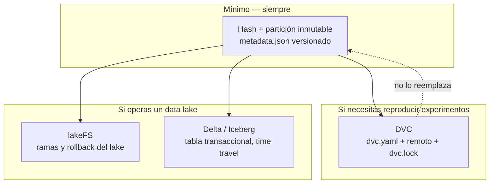

# Versionado de datos: cuatro estrategias y cuándo cada una

> **Bloque B de la sesión 2**, primera mitad (110-140 min).
> **Fecha de revisión:** agosto de 2026. Versiones consultadas en PyPI el 19 de agosto
> de 2026.
>
> ### Aviso de verificación, y hay que leerlo
>
> **DVC no está instalado en el entorno de este repositorio** y no forma parte de
> `pyproject.toml` ni de `uv.lock`. Se comprueba así:
>
> ```bash
> uv run python -c "import dvc" ; command -v dvc
> # ModuleNotFoundError: No module named 'dvc'
> ```
>
> En consecuencia, **los comandos de DVC de la §3 de este documento no se han
> ejecutado en este entorno**: están tomados de la [documentación
> oficial](https://dvc.org/doc) y descritos con el comportamiento que esa
> documentación declara para la línea 3.x. Lo que **sí** está verificado ejecutando
> código es todo lo de la §2 (hash + partición inmutable), porque está implementado
> en [`src/taxi/data/loaders.py`](../../src/taxi/data/loaders.py) y cubierto por la
> suite de tests.
>
> **Cómo usar esto en clase:** la §2 se demuestra en vivo. La §3 se recorre como guía,
> y si el instructor quiere demostrarla, la §3.1 explica cómo instalar DVC en un
> proyecto de usar y tirar **sin tocar el entorno del curso**. Preferimos declarar
> esto a fingir una demostración: es exactamente la disciplina que esta sesión pide.

---

## 1. La pregunta correcta

El error habitual es preguntar *"¿qué herramienta uso para versionar datos?"*. La
pregunta correcta es **"¿qué problema tengo?"**, porque las cuatro estrategias
resuelven problemas distintos y **no son sustitutas**.

| Si tu problema es… | La estrategia es… |
|---|---|
| *"¿es este el mismo dato con el que medí en marzo?"* | **hash + partición inmutable** (§2). Obligatoria siempre |
| *"quiero reproducir el experimento de marzo con su dato exacto y su `pipeline`"* | **DVC** (§3) |
| *"cargué mal 300 GB en el `lake` y necesito revertirlo, sin que nadie lo haya visto"* | **lakeFS** (§4) |
| *"quiero consultar cómo estaba esta tabla el 1 de marzo, con ACID y `schema evolution`"* | **Delta Lake / Iceberg** (§5) |

Y la regla que ordena el documento: **la estrategia 1 es el mínimo no negociable y las
otras tres se apilan encima**, no la reemplazan. Un `dataset` en DVC sin hash de
procedencia sigue sin poder responder si el proveedor republicó el archivo.

### Tabla comparativa

**Criterio de evaluación:** `open source` usable sin cuenta; funciona con
almacenamiento local para poder demostrarse en clase; mantenimiento activo (release en
los últimos 12 meses); resuelve un problema que las otras filas no resuelven.
**Fecha de evaluación: 19 de agosto de 2026.** La columna "última release" se consultó
ese día en el índice de PyPI.

| Estrategia | Qué garantiza | Qué **no** resuelve | Coste de adopción | Última release | Documentación |
|---|---|---|---|---|---|
| **Hash + partición inmutable** | procedencia y detección de re-publicación | ramas, `rollback`, `diff`, datos mutables | **casi cero**: 30 líneas de tu código | es tu código | — |
| **DVC** | reproducibilidad de un experimento: dato + código + `pipeline` con caché | transacciones concurrentes, aislamiento de un `lake` completo | bajo-medio: un remoto y un `dvc.yaml` | 3.67.1 (31-mar-2026) | [dvc.org/doc](https://dvc.org/doc) |
| **lakeFS** | ramas, `commits` y `rollback` atómico sobre `object storage` | `diff` semántico de filas, `time travel` por tabla | medio-alto: es un **servicio** que hay que operar | 0.16.0 (10-abr-2026, cliente Python) | [docs.lakefs.io](https://docs.lakefs.io/) |
| **Delta Lake / Iceberg** | tabla transaccional: ACID, `time travel`, `schema evolution` | versionar un `.pkl` o un CSV suelto; reproducir un experimento completo | medio-alto: cambia tu formato de almacenamiento | `deltalake` 1.6.2 (8-jul-2026) · `pyiceberg` 0.11.1 (3-mar-2026) | [docs.delta.io](https://docs.delta.io/) · [iceberg.apache.org/docs](https://iceberg.apache.org/docs/latest/) |



---

## 2. Hash + partición inmutable — el mínimo, y está implementado

**Esto es lo único que este documento demuestra ejecutando código**, porque es lo que
el caso guía usa. Está en
[`src/taxi/data/loaders.py`](../../src/taxi/data/loaders.py) y son unas 30 líneas.

### Las tres propiedades

**1. Particiones fijas y del pasado.** Nunca `datetime.now()`.

```python
PARTICIONES_TRAIN: Final[tuple[Particion, ...]] = (
    Particion(2023, 1),
    Particion(2023, 2),
    Particion(2023, 3),
)
```

El `pipeline` anterior del curso calculaba el periodo con el reloj y pedía
`green_tripdata_2025-01.parquet`, un archivo que la NYC TLC puede no haber publicado
todavía. Un curso —y un sistema en producción— no puede depender del calendario de
publicación de un tercero. Razonamiento completo en el
[ADR 001](../../docs/adr/001-caso-guia-y-particiones.md).

**2. SHA-256 registrado, y comprobado en cada descarga.**

```python
if destino.exists() and not forzar:
    actual = _sha256(destino)
    esperado = registrado.get("sha256")
    if esperado and actual != esperado:
        logger.warning(
            "HASH DISTINTO para %s.\n"
            "  registrado: %s\n  actual:     %s\n"
            "El proveedor republico el archivo. Las metricas calculadas con "
            "la version anterior ya no son comparables.",
            ...
        )
```

**Este es el punto de la estrategia.** Los proveedores **republican** archivos: la TLC
lo ha hecho, corrigiendo meses ya publicados. Sin este `check`, una re-publicación
silenciosa invalida tu histórico completo de experimentos y nadie se entera. El RMSE de
marzo y el de agosto dejan de ser comparables, y la comparación de modelos es el
centro de MLOps.

**3. Lo que se versiona es el hash y la procedencia, no los bytes.**

```json
{
  "green_tripdata_2023-01.parquet": {
    "url": "https://d37ci6vzurychx.cloudfront.net/trip-data/green_tripdata_2023-01.parquet",
    "sha256": "...",
    "bytes": 1427002,
    "particion": "2023-01",
    "fuente": "NYC Taxi and Limousine Commission (TLC) Trip Record Data",
    "licencia": "Datos publicos de la NYC TLC — uso libre con atribucion"
  }
}
```

`data/raw/` está gitignorado. `data/raw/metadata.json` **no**, y es una excepción
explícita del `.gitignore`:

```
!**/metadata.json          # procedencia y checksums de datasets y modelos
```

Detalle que documenta un bug real: el `.gitignore` anterior del repositorio ignoraba
globalmente `*.json`, y eso hacía **invisible** al `metadata.json`. La buena práctica
existía y no se veía. Un `.gitignore` demasiado amplio no es "más seguro": es una forma
de perder archivos sin enterarse.

### Demostración en clase

```bash
# 1) Descargar y registrar
uv run taxi data

# 2) Ver la procedencia registrada
cat data/raw/metadata.json | head -20

# 3) Simular que el proveedor republico el archivo
uv run python - <<'PY'
import json
from pathlib import Path

ruta = Path("data/raw/metadata.json")
meta = json.loads(ruta.read_text(encoding="utf-8"))
clave = "green_tripdata_2023-01.parquet"
meta[clave]["sha256"] = "0" * 64          # un hash que no coincide con nada
ruta.write_text(json.dumps(meta, indent=2, ensure_ascii=False) + "\n", encoding="utf-8")
print("hash falseado a proposito para la demostracion")
PY

# 4) El loader avisa: "HASH DISTINTO ... El proveedor republico el archivo"
uv run python -c "
import logging
logging.basicConfig(level=logging.INFO)
from taxi.config import PARTICIONES_TRAIN
from taxi.data.loaders import descargar_particion
descargar_particion(PARTICIONES_TRAIN[0])
"

# 5) Restaurar (vuelve a calcular el hash correcto)
uv run python -c "
from taxi.config import PARTICIONES_TRAIN
from taxi.data.loaders import descargar_particion
descargar_particion(PARTICIONES_TRAIN[0], forzar=True)
"
```

**Salida esperada del paso 4:** un `WARNING` con las dos líneas de hash y la frase
sobre comparabilidad. Ojo: el paso 4 **vuelve a descargar** el archivo, así que
necesita red. Si el aula no la tiene, haz solo los pasos 1 y 2 y muestra el código del
`if` en el editor.

### Lo que **no** te da

- **Nada de ramas ni `rollback`.** Si el dato cambia y quieres el anterior, tienes que
  haberlo guardado tú.
- **Nada de `diff`.** Sabes *que* cambió, no *qué* cambió.
- **No sirve para datos mutables.** Si tu tabla se actualiza cada hora, "el hash del
  archivo" no es un concepto útil.

Y esas tres carencias son, respectivamente, lakeFS, Delta/Iceberg y las dos.

---

## 3. DVC — reproducibilidad de un experimento

> **Recordatorio:** DVC **no está instalado en este repositorio**. Lo que sigue está
> tomado de la [documentación oficial](https://dvc.org/doc) para la línea 3.x y **no
> se ha ejecutado en este entorno.** Verifica los comandos contra la doc de la versión
> que instales antes de usarlos en tu proyecto.

### Qué problema resuelve, y qué es realmente

DVC es **Git para archivos grandes, más un motor de `pipelines` con caché**. La idea
central: en Git se commitea un archivo `.dvc` de unas pocas líneas con el hash del
dato; el dato real vive en un **remoto** (S3, GCS, MinIO, una carpeta compartida) y se
recupera con `dvc pull`.

Con eso, `git checkout <commit-de-marzo> && dvc pull` te devuelve **el código y el dato
de marzo a la vez**. Eso es lo que la estrategia 1 no puede hacer.

### Instalación aislada, sin tocar el entorno del curso

Esto es importante: **no añadas DVC al `pyproject.toml` del repositorio del curso** si
solo quieres probarlo. Rompería el `uv.lock` para todo el mundo por un experimento.

```bash
# Opción A — herramienta global, aislada (como pipx)
uv tool install "dvc[s3]"       # el extra depende de tu remoto: s3, gs, azure, ssh
dvc --version

# Opción B — en un proyecto de usar y tirar
cd /tmp && mkdir demo-dvc && cd demo-dvc
uv init --no-workspace
uv add "dvc"
uv run dvc --version
```

En **tu** proyecto sí va como dependencia declarada, en el grupo que corresponda.

### Flujo básico

```bash
# 1) Inicializar (dentro de un repositorio git)
dvc init
git add .dvc .dvcignore && git commit -m "chore: init dvc"

# 2) Empezar a versionar un dato
dvc add data/raw/mi-dataset.parquet
#    Crea data/raw/mi-dataset.parquet.dvc (texto, ~5 lineas, con el hash md5)
#    y anade el parquet a .gitignore automaticamente.

git add data/raw/mi-dataset.parquet.dvc data/raw/.gitignore
git commit -m "data: add raw dataset v1"

# 3) Configurar un remoto y subir el dato
dvc remote add -d almacen s3://mi-bucket/dvc
#    Para clase, un remoto local sirve perfectamente:
#    dvc remote add -d almacen /tmp/dvc-almacen
dvc push

# 4) En otra maquina, o despues de un checkout
git clone <url> && cd <repo>
dvc pull                          # trae los datos que el commit declara

# 5) Volver al dato de marzo
git checkout <commit-de-marzo>
dvc checkout                      # sincroniza el workspace con los .dvc de ese commit
```

### `Pipelines`, que es donde DVC aporta lo que Git no

```yaml
# dvc.yaml
stages:
  preparar:
    cmd: python -m miproyecto.data.preparar
    deps:
      - src/miproyecto/data/preparar.py
      - data/raw/mi-dataset.parquet
    outs:
      - data/processed/entrenamiento.parquet

  entrenar:
    cmd: python -m miproyecto.models.train
    deps:
      - src/miproyecto/models/train.py
      - data/processed/entrenamiento.parquet
    params:
      - train.max_depth
      - train.learning_rate
    outs:
      - models/modelo.pkl
    metrics:
      - reports/metricas.json:
          cache: false
```

```bash
dvc repro                 # ejecuta solo las etapas cuyas dependencias cambiaron
dvc dag                   # dibuja el grafo
dvc metrics show          # las metricas declaradas
dvc metrics diff          # como cambiaron respecto a HEAD
dvc params diff
```

`dvc repro` **salta las etapas cuyas entradas no cambiaron**, comparando hashes. Es la
misma idea que el `caching` de tasks de Prefect que se ve en la sesión 4, y conviene
señalar el parentesco cuando llegue.

`dvc.lock` es el archivo que registra qué hashes produjeron ese resultado. **Se
commitea**, igual que `uv.lock`, y por la misma razón.

### DVC frente al orquestador (S04), sin confundirlos

Es la pregunta que sale siempre en clase:

| | DVC `pipelines` | Prefect / Airflow (S04) |
|---|---|---|
| Dispara la ejecución | tú, con `dvc repro` | un `schedule`, un evento, una API |
| Estado | archivos en disco + hashes | un servicio con base de datos |
| Reintentos, alertas, concurrencia | no | sí |
| Reproducir el experimento de marzo | **sí, es su especialidad** | no directamente |
| Observabilidad de una corrida programada | mínima | es su razón de existir |

**No compiten.** Un patrón habitual: DVC para versionar el dato y los `stages` de
experimentación, y el orquestador para ejecutar `dvc repro` con un `schedule` y
vigilarlo.

### Lo que cuesta DVC, dicho sin adornos

- **Un remoto que alguien tiene que administrar**, con sus credenciales y su coste.
- **`dvc pull` en el CI** añade tiempo y, si el remoto es de pago, dinero por `run`.
- **El `cache` local crece.** `dvc gc` existe y hay que usarlo conscientemente.
- **No hay `merge` de datos.** Si dos ramas modifican el mismo `dataset`, el conflicto
  del `.dvc` lo resuelves eligiendo un lado, no fusionando contenido.
- **No es transaccional ni concurrente.** Dos procesos escribiendo el mismo `output` a
  la vez es un problema tuyo.

### Cuándo DVC es exagerado

Si tu dato es un parquet inmutable descargado de una URL pública con hash registrado
—exactamente el caso guía— DVC **añade una capa sin resolver un problema que tengas**.
Por eso el curso usa la estrategia 1 en su caso guía y enseña DVC como la herramienta
del problema siguiente. Decirlo así es más útil que presentarlo como obligatorio.

---

## 4. lakeFS — ramas y `rollback` de un `lake`

**El problema que resuelve, en una frase:** un `job` cargó datos malos en tu `lake` y
necesitas volver atrás **atómicamente**, sin que ningún consumidor haya visto el estado
intermedio.

La idea: lakeFS pone una capa tipo Git **sobre** el `object storage`. Los conceptos son
los de Git, aplicados a un `bucket`:

```
main                                     el lake que los consumidores leen
  └── ingesta-2026-08-19                 una rama: escribes aqui, aislado
        (validas, corres tus checks)
        merge --> main                   atomico. O borras la rama y no pasó nada
```

Qué te da que DVC no:

- **aislamiento real** de escrituras concurrentes a escala de `lake`;
- **`merge` y `rollback` atómicos** de miles de objetos a la vez;
- **`hooks` pre-`merge`**: puedes exigir que el contrato de datos pase **antes** de que
  el `merge` sea visible. Es, literalmente, un `gate` de calidad de datos, y es la
  conexión más interesante con esta sesión.

Qué cuesta: **es un servicio.** Hay que desplegarlo, operarlo, respaldar su metadata y
autenticar contra él. Para un proyecto de curso es desproporcionado; para una
plataforma de datos de una empresa con varios equipos escribiendo en el mismo `lake`,
es exactamente la pieza que falta.

**El marco mental que hay que llevarse:** lakeFS es control de versiones a nivel de
**repositorio de datos**. DVC es control de versiones a nivel de **experimento**.

---

## 5. Delta Lake / Apache Iceberg — la tabla transaccional

**El problema que resuelven:** tu tabla **cambia** —se le añaden filas cada hora, se
corrigen registros— y necesitas ACID, `schema evolution` y poder consultar cómo estaba
en una fecha.

```python
# Delta Lake, con deltalake (sin Spark)
from deltalake import DeltaTable, write_deltalake

write_deltalake("data/viajes", df, mode="append")

dt = DeltaTable("data/viajes")
print(dt.history())               # cada version, con su timestamp y operacion

# time travel: como estaba la tabla en la version 3
antigua = DeltaTable("data/viajes", version=3).to_pandas()
```

Lo que aportan:

- **ACID** sobre `object storage`: un `write` que falla a medias no deja la tabla en un
  estado inconsistente;
- **`time travel`** por versión o por `timestamp`. Es lo que hace posible decir *"la
  referencia de `drift` es la tabla tal como estaba el 1 de marzo"*, y eso conecta
  directamente con la sesión 7;
- **`schema evolution`** controlada: añadir una columna sin reescribir la tabla, y
  **rechazar** un cambio de tipo incompatible;
- **`upsert` / `MERGE`**, que con parquet plano no existe.

Diferencias prácticas entre los dos, a agosto de 2026: Delta nació en el ecosistema
Spark/Databricks y tiene `delta-rs`/`deltalake` para usarlo sin Spark; Iceberg es un
estándar de la Apache Software Foundation con más motores de consulta detrás (Trino,
Flink, Spark, DuckDB) y `pyiceberg` como cliente Python. **Para el propósito de este
curso, la elección entre los dos no cambia nada**: lo que importa es entender que
"tabla versionada y transaccional" es una categoría distinta de "archivo versionado".

Lo que cuesta: **cambias tu formato de almacenamiento**, con todo lo que arrastra
(compactación de archivos pequeños, `vacuum` de versiones antiguas, un catálogo que
alguien mantiene). No es un `pip install` y ya.

---

## 6. Cómo elegir, en cinco preguntas

Respóndelas en orden y para cuando llegues a un "sí":

1. **¿Puedo decir con exactitud qué bytes usó mi último entrenamiento?**
   Si no → implementa la **estrategia 1** hoy. Es media tarde y no hay excusa.
2. **¿Necesito volver al dato exacto de un experimento pasado, junto con su código?**
   Si sí → **DVC**.
3. **¿Escriben varios equipos o `jobs` en el mismo almacenamiento, y una carga mala
   sería visible para los consumidores?**
   Si sí → **lakeFS**.
4. **¿Mis tablas se actualizan, y necesito ACID, `upsert` o consultar el pasado?**
   Si sí → **Delta o Iceberg**.
5. **¿Mi dato es un archivo inmutable de una URL pública?**
   Entonces la estrategia 1 puede ser **todo lo que necesitas**, y añadir más es
   complejidad sin beneficio. Escríbelo en tu ADR y defiéndelo.

Y una advertencia sobre el error inverso, que en un curso es más común que el de
quedarse corto: **elegir la herramienta más sofisticada para que el proyecto parezca
avanzado.** Un `lake` con lakeFS y tres tablas Iceberg para un `dataset` de 40 MB
descargado de Kaggle no demuestra criterio; demuestra lo contrario. La rúbrica del
proyecto premia decisiones justificadas, no `stacks` grandes.

---

## 7. Qué se pide en el taller y en el proyecto

El [taller](taller.md) exige **la estrategia 1**, no más: descarga con verificación de
hash y particiones fijas declaradas en tu `config.py`. Es el criterio 3 de los
criterios de aceptación.

Si tu proyecto necesita alguna de las otras tres, **justifícalo en un ADR** con la
forma de las cinco preguntas de §6: qué problema tienes, por qué la estrategia 1 no lo
resuelve, y qué te cuesta la que elegiste. Un ADR que diga *"usamos DVC porque es el
estándar"* no cuenta.

Y para el [hito 1](../../proyecto/README.md), que se entrega 5 días después de esta
sesión: la procedencia y el hash van en tu
[`dataset-card.md`](dataset-card.md), no en un `README` suelto.

---

Volver: [README de la sesión](README.md) · [`taller.md`](taller.md) ·
[`dataset-card.md`](dataset-card.md) ·
[ADR 005 — contratos de datos](../../docs/adr/005-contratos-de-datos.md)
