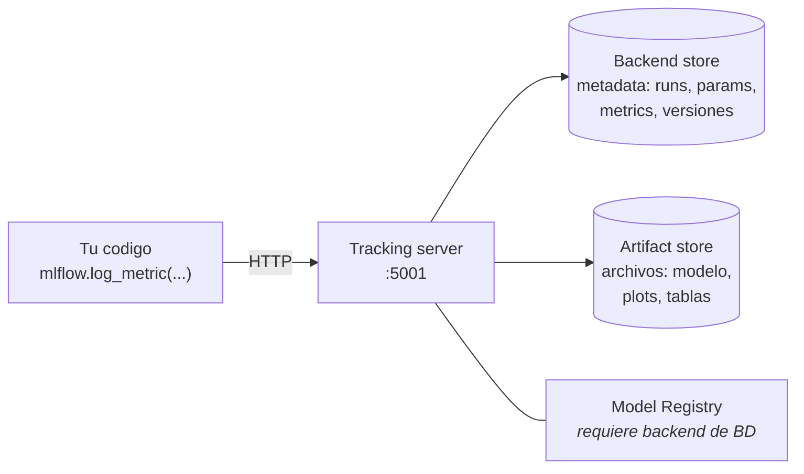
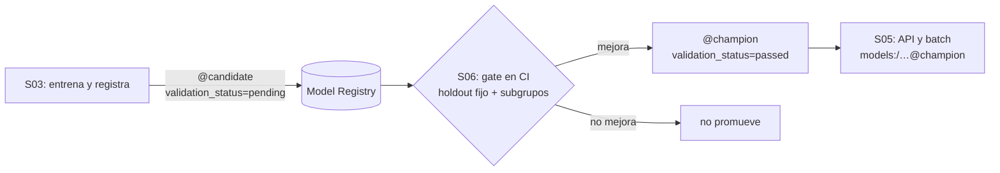

# Sesión 3 — Experiment tracking y model registry

> Pregunta que responde la sesión: **¿cómo sé cuál de mis 200 experimentos está en
> producción, y cómo lo cambio sin tocar el código?**

## Objetivos

Al terminar la sesión, cada estudiante puede:

1. **Instrumentar** un entrenamiento con tracking de params, métricas, tags,
   artifacts, `signature` e `input_example`, y **explicar** qué pregunta responde
   cada uno de los cinco.
2. **Ejecutar** una búsqueda de hiperparámetros con runs anidados y **comparar** las
   configuraciones con `mlflow.search_runs()` en lugar de a ojo en la UI.
3. **Registrar** un modelo y **gobernar** su ciclo de vida con aliases y tags, y
   **argumentar** por qué los stages no se usan.
4. **Cargar** el modelo por alias y **reproducir** la métrica que reportó su run,
   declarando la tolerancia aceptada.
5. **Elegir** una arquitectura de tracking (individual / equipo / producción) según
   criterios declarados, y decir qué se pierde en cada escalón.
6. **Generar** una model card desde los metadatos del registry y **explicar** por
   qué escribirla a mano es un anti-patrón.
7. **Distinguir** `skops` de `cloudpickle` como formatos de serialización y decidir
   cuál usar con un argumento de seguridad, no de costumbre.

## Contenidos

| Carpeta / archivo | Qué hay |
|---|---|
| [`notebooks/`](notebooks/) | La progresión de la sesión: sin tracking → tracking → HPO y registry |
| [`scripts/`](scripts/) | La misma progresión en scripts ejecutables: `sin-mlflow` → `basico` → `completo` |
| [`scenarios/`](scenarios/) | Las tres topologías de despliegue de MLflow: file store, servidor local, AWS |
| [`exercises/`](exercises/) | Dos ejercicios guiados con TODO y criterios de completitud medibles |
| [`taller.md`](taller.md) | El taller, sobre el proyecto propio, con criterios de aceptación |
| [`_soluciones/`](_soluciones/) | Soluciones de referencia de los dos ejercicios y del taller |

El entrenamiento **no vive aquí**: vive en
[`../../src/taxi/models/`](../../src/taxi/models/) y esta carpeta lo importa. Los
notebooks exploran y narran; la lógica está en el paquete, que es lo que corre en
CI y lo que S04 orquesta.

| Notebook | Tramo | Qué se hace |
|---|---|---|
| [`01-sin-tracking.ipynb`](notebooks/01-sin-tracking.ipynb) | el dolor | tres entrenamientos, tres `print`, cinco preguntas sin respuesta |
| [`02-tracking-con-mlflow.ipynb`](notebooks/02-tracking-con-mlflow.ipynb) | bloque A | params, métricas, tags, artifacts, autolog, `signature` y su enforcement |
| [`03-hpo-y-registry.ipynb`](notebooks/03-hpo-y-registry.ipynb) | bloque B | Optuna con runs anidados, aliases, carga por alias, model card |

### Antes de clase

```bash
make data      # materializa las particiones del caso guia
make mlflow    # tracking server en http://127.0.0.1:5001
```

> **Puerto 5001 en todo el curso, y esta es la única vez que se explica:** en macOS,
> AirPlay Receiver ocupa el puerto por defecto de `mlflow server` y responde un
> HTTP 403 que no dice nada útil. El valor vive en `taxi.config.MLFLOW_PORT` y lo
> leen los scripts, los notebooks, el `docker-compose.yml` y el `.env.example`.
> Antes del rediseño los scripts y los notebooks de este módulo usaban puertos
> distintos, y el estudiante acababa con el servidor en uno y el cliente en el otro.

---

## 1. El dolor: qué se rompe sin tracking

Antes de abrir la herramienta, el problema. Se ejecuta el mismo script cinco veces
con hiperparámetros distintos:

```bash
python sesiones/s03-tracking/scripts/train-sin-mlflow.py --max-depth 5
python sesiones/s03-tracking/scripts/train-sin-mlflow.py --max-depth 10
python sesiones/s03-tracking/scripts/train-sin-mlflow.py --max-depth 20
python sesiones/s03-tracking/scripts/train-sin-mlflow.py --max-depth 20 --n-estimators 300
python sesiones/s03-tracking/scripts/train-sin-mlflow.py --max-depth 30
```

Cinco `print` en la terminal. Y cinco preguntas:

1. ¿Cuál fue la mejor, y por cuánto?
2. ¿Con qué datos se entrenó la tercera?
3. ¿Con qué versión del código? ¿Había cambios sin commitear?
4. ¿Dónde está ese modelo? ¿Se puede cargar hoy?
5. ¿Se puede repetir la corrida 2 exactamente dentro de tres meses?

La primera se responde a duras penas. Las otras cuatro, no. Y hay un agravante que
conviene ver en vivo: cerrar la terminal.

Lo que falta, pieza por pieza:

| Pregunta | Qué hace falta registrar |
|---|---|
| ¿cuál fue mejor? | **métricas** comparables |
| ¿con qué configuración? | **params** |
| ¿con qué datos? | **tags** con particiones y hash |
| ¿dónde está el modelo? | **artifacts**: el modelo con su `signature` |
| ¿se puede repetir? | todo lo anterior más la semilla y la versión del código |

Un aviso desde el principio: **el tracking no mejora tu modelo**. Un experimento
bien registrado con un modelo malo sigue siendo un modelo malo — pero es uno que se
puede comparar, reproducir y descartar con evidencia.

---

## 2. Anatomía de MLflow: cuatro piezas, no una

La confusión más común de la sesión sale de tratar "MLflow" como una sola cosa.



| Pieza | Qué guarda | En clase | En producción |
|---|---|---|---|
| Tracking server | nada: es la API | `mlflow server` en `:5001` | contenedor detrás de un proxy con auth |
| Backend store | metadata | SQLite (`mlflow.db`) | Postgres gestionado (RDS) |
| Artifact store | archivos | carpeta local (`./mlartifacts`) | S3 o MinIO |
| Model Registry | nombres, versiones, aliases, tags | lo habilita SQLite | el mismo, con permisos |

**La regla que hay que recordar:** el Model Registry **necesita** un backend de
base de datos. Con un file store (`file://mlruns`) no existe. Eso es exactamente
lo que separa al escenario 1 del escenario 2.

### Las tres topologías

En [`scenarios/`](scenarios/), del más simple al más parecido a producción. Los
tres usan el **mismo código de entrenamiento**: lo único que cambia es el valor de
`MLFLOW_TRACKING_URI`.

| Escenario | Tracking server | Backend | Artifacts | Registry | Cuándo |
|---|---|---|---|---|---|
| [1 · file store](scenarios/scenario-1-file-store.ipynb) | no | archivos (`mlruns/`) | local | **no disponible** | una persona, exploración |
| [2 · servidor local](scenarios/scenario-2-server-local.ipynb) | sí (`127.0.0.1:5001`) | SQLite | local | disponible | clase, prototipo, equipo pequeño |
| [3 · AWS](scenarios/scenario-3-aws.ipynb) | EC2 | RDS PostgreSQL | S3 | disponible | producción (se **lee**, no se ejecuta) |

En clase se ejecutan el 1 y el 2; el 3 se lee y se conecta con S06.

---

## 3. La decisión de diseño de la sesión: aliases y tags, no stages

**Aliases para enrutar, tags para documentar.** El ADR completo está en
[`../../docs/adr/002-aliases-en-vez-de-stages.md`](../../docs/adr/002-aliases-en-vez-de-stages.md).

```python
# El ciclo de vida, en tres lineas
client.set_model_version_tag("nyc-taxi-duration", "7", "validation_status", "passed")
client.set_registered_model_alias("nyc-taxi-duration", "champion", "7")
modelo = mlflow.pyfunc.load_model("models:/nyc-taxi-duration@champion")
```

Por qué no stages (`None/Staging/Production/Archived`):

1. Están **deprecados desde MLflow 2.9.0**. El método del cliente todavía existe
   (verificado en 3.15.1) y la documentación oficial anuncia su eliminación.
2. Eran un vocabulario **cerrado** de cuatro palabras. Un equipo real necesita
   `champion`, `challenger`, `shadow`, `canary`, `champion-eu`.
3. Mezclaban dos cosas: qué versión sirve (*routing*) y en qué estado de validación
   está (*metadato*).
4. **Dos versiones podían quedar en `Production` a la vez** y nadie sabía cuál
   respondía. Un alias apunta a una sola versión, siempre.
5. El rollback con aliases es una escritura de metadatos, no un redeploy: las
   versiones son inmutables, así que la anterior sigue ahí.

Y el corolario que ordena el resto del curso: **registrar no es promover.**



Esta sesión promueve **a mano** para ver el mecanismo. El criterio —holdout fijo,
mejora mínima exigida, chequeo por subgrupos— es el gate de S06 en
[`../../scripts/promote.py`](../../scripts/promote.py). Promover porque la métrica
subió, sin holdout y sin poder rechazar, es cómo se degradan los sistemas de ML.

---

## 4. El default de serialización cambió, y es una decisión de seguridad

En MLflow 3, `mlflow.sklearn.log_model` usa **`serialization_format='skops'`** por
defecto (antes era `cloudpickle`). Verificado contra **mlflow 3.15.1**.

| | `skops` (default) | `cloudpickle` |
|---|---|---|
| Al cargar | reconstruye solo tipos de una *allowlist* | **ejecuta el código** del archivo |
| Tipos no-sklearn | hay que declararlos en `skops_trusted_types` | funcionan sin declarar nada |
| Si falta un tipo | falla ruidosamente **al guardar** | no falla nunca |
| Riesgo | acotado | ejecución arbitraria de código al deserializar |
| Coste | mantener la lista de tipos | confiar en el origen de cada artefacto |

Por qué importa: un artefacto de modelo es un archivo que **baja de un bucket** y
se carga en un proceso de producción. Con `cloudpickle`, cargar es ejecutar.

Lo verificado en este repositorio:

- Un `Pipeline` con la clase `ADiccionarios` **falla** al loguearse sin declarar
  `skops_trusted_types=["taxi.models.train.ADiccionarios"]`, con el mensaje
  *"The saved sklearn model references untrusted types"*.
- Si además hay un `XGBRegressor` dentro, hacen falta tres tipos:
  `ADiccionarios`, `xgboost.core.Booster` y `xgboost.sklearn.XGBRegressor`. Con los
  tres, skops funciona.
- El repositorio tiene las **dos** decisiones, a propósito:
  [`../../src/taxi/models/train.py`](../../src/taxi/models/train.py) declara los
  tipos y se queda con skops;
  [`../../src/taxi/flows/training.py`](../../src/taxi/flows/training.py) elige
  `serialization_format="cloudpickle"` y lo justifica en un comentario. Compara las
  dos en clase: no hay una respuesta única, hay un trade-off que se declara.

Un efecto colateral que conviene ver: con skops, un pipeline que arrastra sin querer
un objeto de Optuna dentro del estimador **falla al guardarse**. Con cloudpickle
habría funcionado en silencio, dejando un artefacto inflado que solo se puede
cargar donde Optuna esté instalado y con la misma versión. El fallo ruidoso es la
característica, no el defecto.

---

## 5. Panorama de herramientas de tracking

**Criterios de esta comparación**, declarados para que se pueda discutir:
(a) *licencia y self-hosting* — ¿puedo correrlo en mi infraestructura sin pagar?;
(b) *registry y ciclo de vida* — ¿gestiona versiones y despliegue, o solo
experimentos?; (c) *UX de comparación* — ¿cuánto cuesta comparar 200 runs?;
(d) *encaje con el resto del stack* — orquestación, serving, CI.

**Fecha de evaluación: 19 de agosto de 2026.** El panorama comercial envejece más
rápido que los conceptos: **verifica la columna de estado antes de cada cohorte**.

| Herramienta | Modelo | Licencia / self-host | Registry | Sweet spot | Punto débil | Doc oficial |
|---|---|---|---|---|---|---|
| **MLflow** | librería + servidor propio | **Apache-2.0**, self-host completo | sí, con aliases y tags | estándar de facto; cualquier stack, cloud o on-premise | UX de comparación pobre frente a W&B; la UI no ayuda a explorar cientos de runs | [mlflow.org/docs](https://mlflow.org/docs/latest/index.html) |
| **Weights & Biases** | SaaS | cliente open source; **el servidor no**. Self-managed solo en planes de pago | sí (Model Registry / Artifacts) | comparación y colaboración: la mejor UX del grupo, *sweeps* y *reports* | dependencia de un proveedor; el dato de tus experimentos vive fuera | [docs.wandb.ai](https://docs.wandb.ai/) |
| **Comet** | SaaS | servidor propietario (on-premise de pago); tier gratuito individual | sí | paneles y comparación potentes; `Opik` para evals de LLM | mismo acoplamiento a proveedor | [comet.com/docs](https://www.comet.com/docs/v2/) |
| **Neptune** | SaaS | propietario | sí | miles de runs largos; entrenamientos de gran escala | menos ecosistema alrededor del despliegue | [docs.neptune.ai](https://docs.neptune.ai/) |
| **DVC experiments** | Git-native, sin servidor | **Apache-2.0**, no hay servidor que hostear | no como tal: versiona datos y experimentos, no despliegue | equipos que ya viven en Git y quieren datos versionados junto al experimento | sin UI propia (Studio es SaaS); no gobierna el ciclo de vida del modelo | [dvc.org/doc](https://dvc.org/doc/start/experiments) |

Menciones honestas para no dar una foto incompleta: **TensorBoard** es
visualización, no tracking (no tiene registry ni comparación entre proyectos);
**ClearML** y **Aim** son alternativas open source y self-hostables con menos
adopción; los proveedores cloud traen la suya (**SageMaker Experiments**,
**Vertex AI Experiments**), atadas a su plataforma.

### Por qué MLflow en este curso

Tres razones, en orden:

1. **Es open source y self-hostable de verdad** (Apache-2.0, servidor incluido). Un
   curso no puede depender de una cuenta SaaS que caduca, ni pedir que los datos de
   los estudiantes salgan de su máquina.
2. **Es el estándar de facto**: quien aprenda esto va a reconocer la mitad del
   código de MLOps que se encuentre, y Databricks, Azure ML y SageMaker lo aceptan
   como formato de modelo.
3. **Cubre tracking y registry con la misma API**, lo que permite enseñar el ciclo
   de vida completo sin cambiar de herramienta a mitad de curso.

**Lo que se pierde, dicho sin adornos:** la UX de comparación de W&B es mejor.
Comparar cincuenta runs por cuatro métricas y dos hiperparámetros es cómodo allí e
incómodo en MLflow. Por eso en esta sesión se enseña `mlflow.search_runs()`: la
comparación se hace con un DataFrame, no con la vista. Si tu equipo tiene
presupuesto y no tiene requisitos de dónde vive el dato, W&B es una elección
defendible — y lo que aprendes aquí se traduce casi línea por línea.

---

## 6. Autoverificación

Cinco preguntas. Si alguna no se puede responder sin volver al material, ahí está el
vacío.

1. Tu compañero te pasa un `run_id` con un RMSE excelente. **¿Qué tienes que
   encontrar en ese run para poder afirmar que el número es comparable con el
   tuyo?** Nombra tres cosas, y di qué pasa si falta cada una.
2. `mlflow.autolog()` registró 30 parámetros y cinco métricas sin que escribieras
   nada. **¿Qué es lo que sigue faltando, y por qué autolog no puede saberlo?**
3. Tu modelo funciona en el notebook y falla en la API con
   `Can not safely convert int64 to int32`. **¿Dónde está el error: en el cliente, en
   el modelo o en la firma?** ¿Cómo se corrige, y por qué la regla es "declarar el
   tipo más permisivo"?
4. Alguien propone `client.transition_model_version_stage(..., stage="Production")`
   porque "es lo que aparece en todos los tutoriales". **Da dos argumentos que no
   sean "está deprecado"**, y escribe el equivalente vigente.
5. Cargas el modelo desde `@champion` y su RMSE no coincide con el del run que lo
   generó. **Nombra cuatro causas posibles**, en el orden en que las revisarías.

---

## 7. Qué NO usar

| No usar | Usar | Motivo |
|---|---|---|
| `client.transition_model_version_stage(...)` | `client.set_registered_model_alias(...)` | los stages están **deprecados desde MLflow 2.9.0**; el método existe pero la doc oficial anuncia su eliminación |
| `client.get_latest_versions(...)` | `client.get_model_version_by_alias(...)` o `search_model_versions(...)` | deprecado: su semántica era "la última de cada *stage*", y los stages ya no existen |
| `models:/<nombre>/Production` | `models:/<nombre>@champion` | referencia por stage; además dos versiones podían estar en `Production` a la vez |
| `archive_existing_versions=True` | nada: el alias apunta a una sola versión | es propio de la API de stages, y archivar automáticamente complica el rollback |
| `log_model(..., artifact_path="model")` | `log_model(..., name="model")` | `artifact_path` está **deprecado** en los flavors de MLflow 3 |
| `mlflow.evaluate` como nombre canónico | `mlflow.models.evaluate` | `mlflow.evaluate` es un alias histórico. Y **`mlflow.genai.evaluate` es otra API** (LLM, S08): **no son interoperables** — distinta firma, distinto dataset, distintas métricas |
| `mean_squared_error(..., squared=False)` | `root_mean_squared_error(...)` | el parámetro `squared` fue **eliminado** de scikit-learn (verificado en 1.9.0): el código que lo usa ya no corre |
| `try/except` alrededor de `log_model` | dejar que falle | degradar el fallo a warning deja el run "en verde" y sin modelo; el problema aparece al desplegar |
| Un `run_id` hardcodeado en el notebook | `mlflow.search_runs(...)` | el `run_id` de otra máquina produce un `RestException` para todo el mundo. Estaba así en este módulo |
| El modelo y el preprocesador como **dos** artefactos | un `Pipeline`, un artefacto | si se desincronizan, el modelo predice sobre features mal codificadas y **nada falla** |
| `mlflow ui` a secas cuando necesitas registry | `mlflow server --backend-store-uri sqlite:///…` | sin backend de base de datos no hay Model Registry |

**Y la advertencia práctica de la sesión:** verifica el `serialization_format` por
defecto de `mlflow.sklearn.log_model` en la versión que tengas instalada. En mlflow
3 es **`skops`**, no `cloudpickle`, y eso puede hacer fallar código que funcionaba —
con razón (ver sección 4).

---

## 8. Referencias

- MLflow — [tracking](https://mlflow.org/docs/latest/tracking.html), [model registry](https://mlflow.org/docs/latest/model-registry.html), [modelos y flavors](https://mlflow.org/docs/latest/models.html), [signature y enforcement](https://mlflow.org/docs/latest/model/signatures.html)
- Optuna — [documentación](https://optuna.readthedocs.io/en/stable/), [samplers y pruners](https://optuna.readthedocs.io/en/stable/reference/samplers/index.html)
- scikit-learn — [persistencia de modelos y `skops`](https://scikit-learn.org/stable/model_persistence.html)
- ADR del curso — [`002-aliases-en-vez-de-stages.md`](../../docs/adr/002-aliases-en-vez-de-stages.md), [`001-caso-guia-y-particiones.md`](../../docs/adr/001-caso-guia-y-particiones.md)
- Datos — [NYC TLC Trip Record Data](https://www.nyc.gov/site/tlc/about/tlc-trip-record-data.page)
- *Designing Machine Learning Systems*, Chip Huyen — capítulo de desarrollo de modelos y experiment tracking.
- Model cards — [Model Cards for Model Reporting (Mitchell et al.)](https://arxiv.org/abs/1810.03993)
