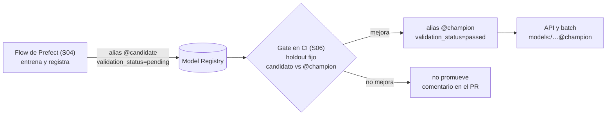

# Sesión 4 — Orquestación y Continuous Training

> Pregunta que responde la sesión: **¿cómo paso de "ejecuté el script" a "el
> sistema se reentrena solo, y sé qué pasó cuando falle"?**

## Objetivos

Al terminar la sesión, cada estudiante puede:

1. **Modelar** un pipeline de entrenamiento como un grafo de tasks con
   dependencias explícitas, reintentos con backoff y caching, y **explicar** qué
   garantiza cada uno de los tres.
2. **Desplegar** ese pipeline con un schedule y **distinguir** cuándo usar
   `serve` y cuándo `deploy` con work pool, en términos de infraestructura y
   aislamiento.
3. **Medir** la diferencia de tiempo entre la primera y la segunda ejecución de un
   flow con caching, y **diagnosticar** el caso en que no haya diferencia.
4. **Diseñar** un trigger de reentrenamiento para su propio proyecto y
   **argumentar por escrito** por qué reentrenar el modelo completo cada dos
   minutos es un anti-patrón.
5. **Verificar** que su pipeline registra un candidato en el registry y **no lo
   promueve**, y explicar por qué la promoción pertenece al gate de CI.
6. **Comparar** orquestadores según criterios declarados, en lugar de por
   preferencia o popularidad.

## Contenidos

Las carpetas van en el orden en que se abren:

| Carpeta | Qué hay |
|---|---|
| [`00-escalera/`](00-escalera/) | **Se abre primero.** Los tres peldaños ejecutables: script → cron → orquestador, con el mismo pipeline en los tres y la medición de qué se repite en cada uno |
| [`00-intro-prefect/`](00-intro-prefect/) | Progresión escalonada de Prefect: `@flow` → `@task` → retries → `serve` → cron → parámetros → varios flows → `deploy` → `prefect.yaml` |
| [`01-pipeline-ml/`](01-pipeline-ml/) | Ejecución y análisis del pipeline del caso guía, medición del caching, consultas SQL sobre las predicciones y el ejercicio de clasificación |
| [`_soluciones/`](_soluciones/) | Soluciones de referencia del ejercicio y del taller |
| [`diagrams/`](diagrams/) | 12 diagramas, en cinco fases pedagógicas |
| [`taller.md`](taller.md) | Enunciado del taller, con criterios de aceptación medibles |

El pipeline **no vive aquí**: vive en `src/taxi/flows/` y esta carpeta lo importa.
Esa es la corrección estructural de la sesión — antes el mismo pipeline estaba
implementado tres veces, con features distintas en cada copia.

| Fase | Diagramas | Pregunta |
|---|---|---|
| 1. Motivación | [01](diagrams/01_el_problema.png), [02](diagrams/02_cinco_pilares.png) | ¿por qué necesito orquestación? |
| 2. Conceptos | [03](diagrams/03_flow_y_task.png), [04](diagrams/04_grafo_dependencias.png), [05](diagrams/05_estados_ejecucion.png) | ¿qué es un flow y cómo se ejecuta? |
| 3. Resiliencia | [06](diagrams/06_reintentos.png), [07](diagrams/07_caching.png) | ¿cómo lo hago robusto? |
| 4. Deployment | [08](diagrams/08_deployment.png), [09](diagrams/09_arquitectura.png) | ¿cómo corre sin mí? |
| 5. Aplicación | [10](diagrams/10_pipeline_ml_completo.png), [11](diagrams/11_prefect_mlflow.png), [12](diagrams/12_panorama_orquestadores.png) | ¿cómo se ve esto en un sistema real? |

## El recorrido

Las carpetas van en el orden de la tabla de arriba, y dentro de
[`00-intro-prefect/`](00-intro-prefect/) el orden está en su propio README, en una
tabla de nueve pasos. Lo que no es obvio es dónde entran los diagramas y cuándo hace
falta la segunda terminal:

| # | Se abre | Para qué |
|---|---|---|
| 1 | sección 1 de este README y [`00-escalera/`](00-escalera/), con los diagramas [01](diagrams/01_el_problema.png) y [02](diagrams/02_cinco_pilares.png) | tres formas de romper un pipeline hecho a mano, y los tres peldaños corriendo: script, cron y orquestador sobre el mismo código |
| 2 | [`00-intro-prefect/`](00-intro-prefect/), pasos 1 a 3 | `@flow`, `@task`, el grafo por dependencias de datos, y reintentos con backoff |
| 3 | [`00-intro-prefect/`](00-intro-prefect/), workflows de artifacts, contexto, variables y secretos | qué le queda al orquestador después de correr, y dónde **no** va un secreto |
| 4 | [`00-intro-prefect/`](00-intro-prefect/), pasos 4 a 7 | `serve()`, el dashboard, los schedules y los parámetros editables. **Aquí empieza la segunda terminal** |
| 5 | [`01-pipeline-ml/`](01-pipeline-ml/) | el pipeline del caso guía: caching medido, no afirmado, y trazabilidad de las predicciones en SQL |
| 6 | [`00-intro-prefect/`](00-intro-prefect/), pasos 8 y 9 | `deploy()` con work pool y los deployments declarativos del `prefect.yaml` |
| 7 | sección 4 de este README | el trigger de Continuous Training, que es una decisión de diseño y no un cron |
| 8 | [`taller.md`](taller.md), y el [`ejercicio/`](01-pipeline-ml/ejercicio/) para quien acabe antes | el entregable |

**Los pasos 4 a 7 de `00-intro-prefect/` bloquean la terminal**, y eso está marcado en
la tabla de esa carpeta. Un `serve()` se queda corriendo en primer plano a propósito:
es la diferencia entre ejecutar un flow y **servirlo**. La primera terminal se queda
con el servidor de Prefect, la segunda es la de trabajo, y una tercera si quieres
tener la UI de MLflow a la vista en el paso 5.

## Antes de clase

```bash
git lfs pull   # sin esto los 12 diagramas son archivos de texto de tres lineas
make data      # las particiones del caso guia
make mlflow    # el tracking server de S03, para el paso 5
```

El servidor de Prefect y su UI se levantan en el paso 4, no antes:
`prefect server start` deja la UI en <http://127.0.0.1:4200>, y esa terminal queda
ocupada. Los comandos exactos están en
[`00-intro-prefect/README.md`](00-intro-prefect/README.md).

---

## 1. El dolor: qué se rompe sin orquestación

Antes de abrir la herramienta, el problema. Tres actos, en vivo:

1. **El pipeline falla en el paso 3** por un timeout de red. Se relanza desde
   cero: se vuelven a descargar los datos que ya estaban en disco. Ocho minutos
   perdidos por un fallo de dos segundos.
2. **"¿Quién ejecutó el entrenamiento el martes pasado, y con qué parámetros?"**
   Nadie lo sabe. El modelo que está sirviendo salió de un `python train.py` en
   la máquina de alguien.
3. **"Hay que correrlo cada lunes a las 3 a.m."** ¿Quién se levanta? ¿Y quién se
   entera si falla?

La primera respuesta al tercer acto es siempre `cron`, y es una buena respuesta.
[`00-escalera/`](00-escalera/) la lleva hasta el final: el mismo pipeline de tres
pasos ejecutado como script pelado, como línea de crontab y como flow, para ver
con números en pantalla dónde se acaba cada peldaño. Ahí está también la parte
que no se suele decir —el orquestador cuesta overhead— y las cuatro condiciones
bajo las cuales quedarse en `cron` es lo correcto.

Los tres problemas son de **operación**, no de modelado. La orquestación es la
capa que los resuelve, y sus cinco piezas aplican a cualquier herramienta:

| Pieza | Qué resuelve | En Prefect |
|---|---|---|
| Pasos declarados | saber *cuál* paso falló | `@task` |
| Grafo de dependencias | orden y paralelismo sin escribirlos | pasar resultados entre tasks |
| Programación | que corra sin nadie delante | deployment + `schedules` |
| Observabilidad | reconstruir qué pasó y cuándo | logs del run, artifacts, UI |
| Manejo de fallos | que un fallo transitorio no cueste una corrida | `retries`, backoff, caching |

Sobre lo que la orquestación **no** resuelve: no mejora tu modelo, no valida tus
datos (eso es el contrato de S02) y no decide si un modelo va a producción (eso es
el gate de S06). Un pipeline orquestado que entrena sobre datos malos entrena
sobre datos malos, con más puntualidad.

---

## 2. Prefect y MLflow responden preguntas distintas

Es la confusión más común de la sesión:

| Prefect responde | MLflow responde |
|---|---|
| cuándo corrió el pipeline | qué parámetros se usaron |
| en qué orden corrieron los pasos | qué métricas dio |
| qué hacer si un paso falla | qué artefacto se produjo |
| en qué estado terminó | qué versión del modelo existe y cuál sirve |

No compiten. En el flow del caso guía, cada corrida de Prefect produce un run de
MLflow, y el `run_id` de Prefect queda como tag de la versión registrada: eso es
lo que permite reconstruir el linaje **corrida → modelo → predicción**.

---

## 3. La decisión de diseño de la sesión: registrar no es promover

El flow de entrenamiento registra el candidato con el alias `candidate` y **no lo
promueve**.

La versión anterior de este curso hacía lo contrario: en cada corrida llamaba a
`transition_model_version_stage(stage="Production", archive_existing_versions=True)`.
Un modelo llegaba a producción por el solo hecho de que el entrenamiento terminó
sin lanzar excepciones — sin holdout, sin comparación con el modelo actual, sin
posibilidad de rechazo, archivando al anterior. Y con una API deprecada.



Separarlo tiene tres consecuencias prácticas: el reentrenamiento puede ser
automático **sin** que el despliegue lo sea; el criterio de promoción queda
escrito y versionado en un solo lugar; y el rollback es mover un alias, no
reentrenar ni reconstruir una imagen.

---

## 4. Continuous Training: el trigger es una decisión de diseño

CT no significa "reentrenar seguido". Significa "reentrenar **cuando hay una
razón**".

| Estrategia | Cuándo tiene sentido | Riesgo principal |
|---|---|---|
| Periódico (semanal, mensual) | los datos cambian de forma gradual | reentrena sin necesidad; cuesta |
| **Por llegada de datos** | llegan particiones nuevas (nuestro caso) | hay que detectar la disponibilidad |
| Por drift detectado | los cambios son impredecibles | falsos positivos → churn de modelos |
| Por caída de performance | hay labels en producción | los labels llegan tarde (*label lag*) |

**Por qué `cron="*/2 * * * *"` reentrenando el modelo completo es un
anti-patrón** — y esto estaba en el repo, documentado como buena práctica:

1. no aporta señal: entre las 14:02 y las 14:04 no hay un dato nuevo, las
   particiones son mensuales e inmutables;
2. cuesta: 720 descargas y 720 entrenamientos al día, contra un servidor público
   y gratuito;
3. ensucia el registry: con auto-promoción, 720 versiones "de producción" al día,
   y el linaje deja de poder reconstruirse;
4. rompe la noción de trigger: un cron de minutos no responde a ninguna razón;
5. enseña el hábito equivocado, que el estudiante replica en su trabajo.

La discusión completa está en el docstring de `src/taxi/flows/deploy.py`, y el
taller pide argumentar el trigger propio en un ADR.

Nada de esto es un argumento contra `cron` en general: es un argumento contra usar
una frecuencia como sustituto de una razón. Las cuatro condiciones bajo las cuales
`cron` sigue siendo la herramienta adecuada están en
[`00-escalera/2-cron/README.md`](00-escalera/2-cron/README.md).

---

## 5. Panorama de orquestadores

**Criterios de esta comparación**, declarados para que se pueda discutir:
(a) *modelo mental* — qué es la unidad de trabajo; (b) *encaje con ML* — soporte
de parámetros, artifacts, reintentos y linaje; (c) *costo de entrada* — qué hay
que levantar y aprender para la primera corrida en producción; (d) *estado del
proyecto* — versión vigente y actividad de releases.

**Fecha de evaluación: 19 de agosto de 2026.** Las versiones envejecen; el
criterio, menos. Verifica la columna de estado antes de cada cohorte.

> Esta tabla es la **única** fuente de la comparación en todo el repositorio. El
> diagrama [12](diagrams/12_panorama_orquestadores.png) la refleja: si cambias una
> fila aquí, regenera el diagrama con
> `python diagrams/generate_diagrams.py` (o solo `diagram_12_ecosystem()`). La
> versión anterior del diagrama había divergido —presentaba a Mage como opción
> recomendada para enseñar, mostraba cuatro de las ocho herramientas y las
> ordenaba por estrellas de GitHub, que no es uno de los criterios.

| Herramienta | Modelo mental | Sweet spot | Costo de entrada | Estado (ago-2026) | Doc oficial |
|---|---|---|---|---|---|
| **Prefect** | flows y tasks en Python puro; el grafo se deriva de los datos | equipos de DS, pipelines dinámicos, ML | bajo: `pip install prefect` y una función decorada | 3.8.x, releases frecuentes | [docs.prefect.io](https://docs.prefect.io/v3/get-started) |
| **Apache Airflow** | DAGs declarados; ecosistema enorme de operadores | data engineering en empresa, ETL con muchas integraciones | alto: scheduler, API server, base de datos, workers | 3.3.x. En Airflow 3 la API de autoría es `airflow.sdk`, hay **DAG versioning**, el parámetro es `schedule=` (`schedule_interval=` fue removido), la REST API es v2 y `SubDagOperator` fue eliminado (se usan TaskGroups) | [airflow.apache.org](https://airflow.apache.org/docs/apache-airflow/stable/) |
| **Dagster** | *assets* (el dato producido), no tareas; linaje de primera clase | plataformas de datos donde importa el catálogo y el linaje | medio-alto: modelo mental propio, `dg` CLI y Components | 1.13.x, activo | [docs.dagster.io](https://docs.dagster.io/) |
| **ZenML** | pipelines portables tipados, con *stacks* intercambiables | equipos ML que quieren cambiar de backend sin reescribir | medio | activo | [docs.zenml.io](https://docs.zenml.io/) |
| **Metaflow** | flows como clases con pasos; foco en experimentación reproducible | ML en AWS, escalado vertical sencillo | medio | activo (Netflix / Outerbounds) | [docs.metaflow.org](https://docs.metaflow.org/) |
| **Flyte** | tareas fuertemente tipadas y versionadas sobre Kubernetes | ML multi-equipo con requisitos de reproducibilidad estrictos | alto: requiere Kubernetes | activo (LF AI & Data) | [docs.flyte.org](https://docs.flyte.org/) |
| **Kubeflow Pipelines** | componentes en contenedores sobre Kubernetes | organizaciones que ya viven en Kubernetes | muy alto | activo | [kubeflow.org](https://www.kubeflow.org/docs/components/pipelines/) |
| **Mage** | notebook-como-pipeline, edición visual por bloques | prototipado visual | bajo, pero entorno aislado | **AVISO: la última release OSS es de enero de 2026**: no lo presentemos como un proyecto vivo sin verificarlo antes de la cohorte | [docs.mage.ai](https://docs.mage.ai/introduction/overview) |

### Por qué Prefect en este curso

No porque sea "el mejor": porque el costo de entrada es el más bajo de la lista y
eso deja las cuatro horas para los **conceptos** de orquestación en lugar de para
levantar infraestructura. Con Airflow, la primera hora se va en el scheduler y la
base de datos; con Kubeflow, en el clúster.

El compromiso, dicho explícitamente: quien vaya a trabajar en una empresa con
Airflow tendrá que traducir. La traducción es directa —`@flow` es un DAG, `@task`
es una tarea, `schedules` es `schedule=`, un work pool es una queue con un
worker— porque los cinco pilares de la sección 1 son los mismos. Lo que **no** se
transfiere es el ecosistema de operadores de Airflow, que es su ventaja real.

Una nota sobre "orquestador vs. herramienta de ML": Airflow y Dagster orquestan
datos; ZenML, Metaflow y Flyte están diseñados alrededor del ciclo de vida del
modelo. Prefect está en el medio: es un orquestador general que se lleva bien con
ML, y el pegamento con MLflow lo escribes tú (es lo que hace
`src/taxi/flows/training.py`).

---

## 6. Autoverificación

Cuatro preguntas. Si alguna no se puede responder sin volver al material, ahí está
el vacío.

1. Tu flow tiene una task que descarga datos y otra que entrena. **¿En cuál pones
   `retries` y en cuál no, y por qué?** ¿Qué diferencia hay entre
   `retry_delay_seconds=2` y `retry_delay_seconds=[10, 30, 60]` cuando el fallo es
   de red?
2. Corres el flow dos veces seguidas y la segunda tarda lo mismo que la primera,
   aunque la task de preparación tiene `cache_key_fn`. **Nombra tres causas
   posibles**, en el orden en que las revisarías.
3. Tu entrenamiento programado corre todos los lunes y siempre termina en
   `Completed`. **¿Qué garantiza eso sobre el modelo que está sirviendo en
   producción?** (La respuesta correcta es incómoda.)
4. Tu equipo quiere reentrenar "en cuanto lleguen datos nuevos". **¿Qué necesitas
   para implementar ese trigger** y qué harías mientras no lo tengas?

---

## 7. Qué NO usar

APIs de Prefect 2 que aparecen en la mayoría de los tutoriales de la web y que ya
no son válidas o no son la forma canónica:

| No usar | Usar | Motivo |
|---|---|---|
| `prefect agent start` | `prefect worker start --pool <pool>` | los agents fueron **eliminados** en Prefect 3 |
| `Deployment.build_from_flow(...)` | `flow.deploy(...)`, `flow.serve(...)` o `prefect.yaml` | ya no es el mecanismo de despliegue |
| `prefect deployment build` | `prefect deploy` | idem |
| Bloques de infraestructura (`DockerContainer`, `KubernetesJob`) | work pools tipados (`docker`, `kubernetes`) | dejaron de ser el mecanismo de despliegue |
| `schedule=` singular estilo Prefect 2 (dict `cron`/`timezone`), y `schedule:` en `prefect.yaml` | `schedules=[Cron(...)]` y `schedules:` (lista) | la clave canónica es plural; si en `prefect.yaml` están las dos, el deploy falla |
| `.deploy()` sin `work_pool_name` | `.deploy(..., work_pool_name="curso-mlops")` | es obligatorio: sin work pool no hay quién ejecute |
| Rutas absolutas en `prefect.yaml` | rutas relativas al archivo | un `set_working_directory: /Users/<alguien>/…` es la ruta del disco de quien lo escribió: rompe el deploy en cualquier otra máquina |

Y del lado de MLflow, lo que esta sesión no vuelve a hacer:
`transition_model_version_stage`, URIs de modelo por stage, `artifact_path=` en
`log_model` (hoy es `name=`) y `try/except` alrededor del logging del modelo.

Si alguien menciona Airflow: `schedule_interval=` y `SubDagOperator` ya no
existen en Airflow 3, y la forma canónica de autoría es `airflow.sdk`.

---

## 8. Referencias

- Prefect 3 — [conceptos](https://docs.prefect.io/v3/concepts), [caching](https://docs.prefect.io/v3/concepts/caching), [deployments](https://docs.prefect.io/v3/concepts/deployments), [work pools](https://docs.prefect.io/v3/concepts/work-pools), [artifacts](https://docs.prefect.io/v3/concepts/artifacts)
- Migración Prefect 2 → 3: <https://docs.prefect.io/v3/how-to-guides/migrate/upgrade-to-prefect-3>
- Airflow 3.3 — [release notes](https://airflow.apache.org/docs/apache-airflow/stable/release_notes.html), [novedades de Airflow 3](https://airflow.apache.org/blog/airflow-three-point-oh-is-here/)
- Dagster 1.13 — [anuncio](https://dagster.io/blog/dagster-1-13-octopuss-garden)
- Datos: [NYC TLC Trip Record Data](https://www.nyc.gov/site/tlc/about/tlc-trip-record-data.page)
- *Designing Machine Learning Systems*, Chip Huyen — capítulo de pipelines y CT.
- *Fundamentals of Data Engineering*, Reis & Housley — capítulo de orquestación.
