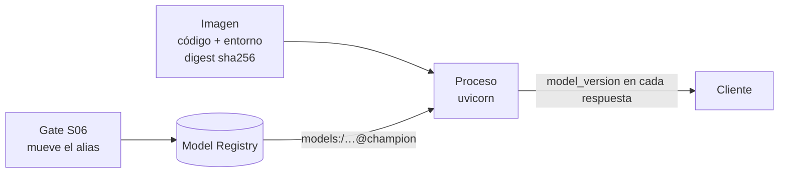

# Sesión 5 — Deployment: del modelo registrado al servicio que responde

> Pregunta que responde la sesión: **¿cómo convierto un modelo del registry en algo
> que otro sistema pueda consumir, y cómo sé qué versión está respondiendo?**

## Objetivos

Al terminar la sesión, cada estudiante puede:

1. **Elegir** entre *batch*, *online* y *streaming* para un caso concreto usando
   cinco criterios declarados (latencia tolerada, volumen, frescura de features,
   costo, complejidad operativa), y **defender** la elección con esos criterios en
   lugar de por preferencia.
2. **Implementar** un servicio HTTP de inferencia con FastAPI y Pydantic v2 que
   valide su entrada, separe request de response y **cargue el modelo desde el
   Model Registry por alias**, no desde un archivo copiado.
3. **Explicar** qué responde cada endpoint operativo (`/health`, `/modelo`,
   `/metrics`) y a quién: el orquestador, una persona o Prometheus.
4. **Construir** una imagen que instala desde el lockfile, no corre como `root` y
   tiene un `HEALTHCHECK` que de verdad funciona, y **verificarlo** con tres
   comandos.
5. **Distinguir** un tag mutable (`imagen:latest`) de un digest inmutable
   (`imagen@sha256:…`) y **argumentar** por qué la unidad de despliegue es el
   segundo.
6. **Consultar en SQL** las predicciones de un pipeline batch y **atribuir** cada
   fila a la versión de modelo que la produjo.
7. **Diagnosticar** un `InconsistentVersionWarning` al cargar un artefacto y
   **nombrar** la causa estructural (dos resoluciones de dependencias distintas).

## Contenidos

| Ruta | Qué hay |
|---|---|
| [`intro-dockers/`](intro-dockers/) | Primer contacto con contenedores: la misma app en local y en Docker. 15 min |
| [`api-contract.md`](api-contract.md) | El contrato de la API: endpoints, códigos, errores y ejemplos |
| [`postman/`](postman/) | Colección y entorno de Postman para el taller |
| [`taller.md`](taller.md) | Enunciado del taller, con criterios de aceptación medibles |
| [`_soluciones/`](_soluciones/) | Soluciones de referencia. No publicar antes del taller |

El servicio **no vive aquí**: vive en [`src/taxi/api/`](../../src/taxi/api/) y esta
carpeta lo ejecuta, lo prueba y lo empaqueta.

| Archivo del paquete | Responsabilidad |
|---|---|
| [`src/taxi/api/schemas.py`](../../src/taxi/api/schemas.py) | El contrato: qué es un request válido y qué forma tiene la respuesta |
| [`src/taxi/api/modelo.py`](../../src/taxi/api/modelo.py) | Carga desde el registry, adaptación request → features, inferencia |
| [`src/taxi/api/metricas.py`](../../src/taxi/api/metricas.py) | Instrumentación Prometheus (se usa a fondo en S07) |
| [`src/taxi/api/main.py`](../../src/taxi/api/main.py) | Solo *wiring*: rutas, ciclo de vida y traducción de errores |
| [`src/taxi/flows/batch.py`](../../src/taxi/flows/batch.py) | La misma inferencia, en modo batch, con trazabilidad por fila |
| [`Dockerfile`](../../Dockerfile) · [`.dockerignore`](../../.dockerignore) · [`docker-compose.yml`](../../docker-compose.yml) | El empaquetado y el stack local |
| [`tests/api/`](../../tests/api/) | 4 archivos de tests que corren sin MLflow y sin red |

---

## 1. El dolor: dos formas de romper un despliegue sin que nada avise

No se abre FastAPI hasta el final de este bloque.

### Acto 1 — La imagen que sirve otra cosa

El `Dockerfile` anterior de esta API copiaba `pyproject.toml` a la imagen y acto
seguido lo ignoraba:

```dockerfile
COPY pyproject.toml .
RUN pip install --no-cache-dir mlflow==2.17.2 xgboost==2.1.2 scikit-learn==1.5.2
```

El artefacto que esa imagen tenía que servir se había entrenado con las versiones
que resuelve `uv.lock` — mlflow 3.x, xgboost 3.x, scikit-learn 1.9.x en agosto de
2026; compruébalo en tu entorno:

```bash
uv run python -c "import importlib.metadata as m; print({p: m.version(p) for p in ('mlflow','xgboost','scikit-learn')})"
```

Al cargar ese artefacto en un entorno con las versiones pinneadas a mano, sklearn
emite `InconsistentVersionWarning`: está deserializando un estimador *pickled* por
otra versión de la librería. El resultado, en orden de gravedad creciente:

1. si el formato interno cambió de forma incompatible, la carga falla y el
   contenedor arranca degradado — **el caso bueno**, porque es ruidoso;
2. si cambió de forma tolerable, el modelo carga y **predice distinto** de lo que
   el gate de promoción validó. Un modelo aprobado en CI y una imagen que sirve
   otra cosa, sin un solo error en los logs.

**Este es un caso real de este repositorio.** El anti-patrón lo cometió el propio
curso, y por eso se conserva documentado en la cabecera del
[`Dockerfile`](../../Dockerfile) actual en lugar de borrarse en silencio.

La causa no es "faltó actualizar un número". Es estructural: **había dos
resoluciones de dependencias**, una en `uv.lock` (con la que se entrenó) y otra
escrita a mano en el `Dockerfile` (con la que se sirve). La regla que lo corrige:

> Las versiones se resuelven **una** vez, en `uv.lock`, y todos los entornos
> —local, CI, entrenamiento, serving— instalan desde ahí. Ningún pin a mano en un
> `Dockerfile`.

### Acto 2 — `pickle.load` de un binario descargado

El contraejemplo de la sesión 6 empieza así:

```python
with open("lin_reg.bin", "rb") as f_in:
    (dv, model) = pickle.load(f_in)
```

Pregunta para la clase: **¿qué código se ejecuta al deserializar ese archivo?**

La respuesta es incómoda: cualquiera. `pickle` no es un formato de datos, es un
*programa* — el opcode `REDUCE` invoca un callable con argumentos que vienen del
propio archivo. Deserializar un pickle es equivalente a ejecutar un script que
alguien te mandó. La documentación de Python lo dice sin rodeos: *"the pickle
module is not secure. Only unpickle data you trust."*

En un pipeline de ML eso significa que **el artefacto es un ejecutable** y su
procedencia importa igual que la del código. Por eso el modelo se resuelve del
registry —donde hay versión, run de origen y quién lo registró— y no se descarga
de una URL. No elimina el riesgo (MLflow también usa pickle por debajo en varios
flavors); lo acota a artefactos con linaje. Alternativas cuando el riesgo no es
aceptable: formatos sin ejecución de código (ONNX, `skops`, el formato nativo de
XGBoost/LightGBM), firma de artefactos y `sandboxing` del proceso que carga.

Ver el contraejemplo completo y comentado:
[`../s06-cloud-cicd/_contraejemplo-insegure-aws/`](../s06-cloud-cicd/_contraejemplo-insegure-aws/).

---

## 2. Batch, online o streaming: la decisión antes de la herramienta

Servir un modelo no es una sola cosa. La pregunta correcta no es "¿API o batch?"
sino **"¿cuándo se necesita la predicción, y respecto a qué dato?"**.

| Criterio | Batch | Online (síncrono) | Streaming |
|---|---|---|---|
| Latencia tolerada | horas o días | milisegundos a segundos | segundos |
| Volumen por ejecución | millones de filas | 1 a cientos por request | flujo continuo |
| Frescura de features | la del último corte | la del momento del request | la del evento, con estado en ventana |
| Costo | el más bajo: cómputo puntual, sin servicio arriba | pagas por tener el servicio disponible | el más alto: broker + procesamiento con estado |
| Complejidad operativa | baja: si falla, se re-corre | media: hay que vigilar disponibilidad y p95 | alta: *offsets*, orden, reprocesamiento, estado |
| Falla típica | el job no corrió y nadie lo notó | el servicio está arriba pero sirve un modelo viejo | el estado de la ventana se corrompe y nadie lo ve |

El caso guía —predecir la duración de un viaje— **admite las tres formas**, y eso
es justo lo que lo hace útil como ejemplo:

| Forma | Cómo se ve en el caso guía | Consumidor plausible |
|---|---|---|
| **Batch** | `make batch` predice sobre una partición mensual completa y escribe una fila por viaje con su `model_version` ([`flows/batch.py`](../../src/taxi/flows/batch.py)) | un reporte de planeación de flota que se lee cada mañana |
| **Online** | `POST /predict` con un viaje, respuesta en un request ([`api/main.py`](../../src/taxi/api/main.py)) | la app que le muestra al pasajero el tiempo estimado antes de aceptar |
| **Streaming** | el mismo modelo consumiendo eventos de pickup de un tópico y publicando la predicción en otro | tablero de operación en vivo, reasignación dinámica de vehículos |

Streaming **no se implementa** en esta sesión. La razón es explícita: la parte
difícil no es llamar al modelo, es el estado, el orden y el reprocesamiento — y
eso es un curso aparte. Se nombra para que nadie crea que "servir un modelo" es
sinónimo de "levantar una API". Si tu caso lo necesita, el punto de entrada son
Kafka + Faust/Flink o Kinesis + Managed Flink, y el modelo se carga igual: por
alias del registry.

Regla práctica para el taller: **empieza en batch**. Si el consumidor puede esperar
hasta el próximo corte, un job programado es más barato de operar y más fácil de
auditar que un servicio. Elegir online cuando el batch alcanzaba es la forma más
común de comprarse un problema de disponibilidad sin recibir nada a cambio.

El razonamiento completo está en
[`docs/adr/006-serving-online-vs-batch.md`](../../docs/adr/006-serving-online-vs-batch.md).

---

## 3. El servicio online: FastAPI + Pydantic v2

### 3.1 El contrato es código ejecutable

Una API de ML es una **frontera de confianza**. Del otro lado hay clientes que no
conocen el modelo, no leyeron el contrato de features y mandarán lo que sea. Sin
validación, un `PULocationID` de 9999 o una distancia negativa no producen un
error: producen una predicción silenciosamente absurda que el cliente consume como
válida.

En [`schemas.py`](../../src/taxi/api/schemas.py) el contrato se declara una vez y
FastAPI deriva de él **la validación en runtime y el esquema OpenAPI**. No pueden
divergir porque son el mismo objeto.

Cuatro decisiones que conviene mirar en el archivo:

1. **`extra="forbid"`.** Un cliente que manda `PULocationId` (i minúscula) recibe
   un 422, no una predicción calculada con el default silencioso. Enumerar lo
   permitido es más barato de auditar que enumerar lo prohibido.
2. **Rangos que coinciden con el contrato de datos de S02** (zonas 1-265,
   distancia 0-100 millas). Si el modelo nunca vio un valor, la API tampoco debe
   aceptarlo.
3. **Request y response separados.** El repo anterior devolvía los datos de
   entrada más la predicción. La respuesta de aquí lleva `model_name` y
   `model_version`: es lo que hace **auditable** una predicción tres semanas
   después.
4. **`@field_validator` (Pydantic v2), no `@validator` (v1).** El validador de
   `pickup_datetime` rechaza los timestamps con zona horaria en lugar de
   convertirlos: un cliente que manda `2023-05-15T08:30:00Z` cree hablar de las
   08:30 y el modelo entendería 04:30. Mejor un 422 hoy que un reporte de drift el
   mes que viene.

### 3.2 El ciclo de vida: `lifespan`, no `@app.on_event`

```python
@asynccontextmanager
async def lifespan(app: FastAPI) -> AsyncIterator[None]:
    cargador = obtener_cargador()
    cargador.cargar()  # el primer request no paga la descarga del artefacto
    ...
    yield
    logger.info("Apagando API")
```

`@app.on_event("startup")` está deprecado desde FastAPI 0.93. `lifespan` además
permite liberar recursos al apagar y es lo único que se comporta igual bajo
`TestClient` y bajo `uvicorn`.

Dos decisiones deliberadas del arranque:

- **Cargar en el arranque, no en el primer request.** Ese *cold start* puede ser de
  varios segundos y se manifiesta como un timeout aparentemente aleatorio en el
  primer request después de cada despliegue.
- **No abortar si la carga falla.** Un contenedor que muere al arrancar entra en
  `CrashLoopBackOff` y nadie puede consultar `/health`, que es justo donde está
  escrito el motivo del fallo. Con `TAXI_MODELO_URI=ninguno` el servicio levanta a
  propósito sin modelo: es lo que permite verificar la imagen en CI sin levantar el
  registry.

### 3.3 La decisión central: cargar del registry, no de un archivo

El repo anterior obtenía el modelo con un script `copy_model.py` que hacía
`shutil.copytree` del directorio de un run hacia `deploy/web-service/model/`, y el
`Dockerfile` hacía `COPY model/`. Había **dos** de esos scripts, encadenados entre
módulos, y uno apuntaba a un directorio que ya no existe.

Las consecuencias no eran teóricas:

- el artefacto quedaba versionado por el sistema de archivos, no por el registry:
  nadie podía decir qué versión servía un contenedor;
- cambiar de modelo exigía **reconstruir la imagen**;
- el `run_id` de origen acabó *hardcodeado*, así que el paso solo funcionaba en la
  máquina donde se generó ese run;
- se perdía todo el linaje que la sesión 3 enseña a construir.

La forma correcta es referirse al modelo por **alias del registry**:

```python
modelo = mlflow.pyfunc.load_model("models:/nyc-taxi-duration@champion")
```

Una referencia **mutable** a una versión **inmutable**. La imagen no contiene el
modelo: contiene el código que sabe pedirlo.



Consecuencia operativa que vale la sesión entera: **cambiar de modelo es mover un
alias y reiniciar el proceso; no hay rebuild, no hay redeploy de imagen.** Y el
rollback es mover el alias de vuelta.

Detalle que hay que resolver, y `modelo.py` lo resuelve: el alias es mutable, así
que hay que **preguntarle al registry qué versión resolvía en el momento de la
carga** y guardarla. Si no, en los logs queda `champion` y no se sabe qué artefacto
respondió.

### 3.4 Los endpoints que un servicio de modelo necesita

| Endpoint | Quién lo consulta | Qué responde | Por qué existe |
|---|---|---|---|
| `POST /predict` | la aplicación cliente | una predicción + `model_version` + latencia | el caso de uso |
| `POST /predict/batch` | la aplicación cliente | N predicciones en una llamada de inferencia | amortiza el costo fijo por request; en inferencia sklearn ese costo suele dominar |
| `GET /health` | el orquestador | 200 mientras el proceso viva, con `model_loaded` | *liveness*: decide si reiniciar el contenedor |
| `GET /modelo` | una persona | nombre, versión, URI y **la lista de features** | responde "¿qué está respondiendo y con qué features?" sin abrir el código |
| `GET /metrics` | Prometheus | latencia, throughput, errores, versión | sin esto, "está lento" es una opinión (S07) |

**`/health` responde 200 incluso sin modelo, a propósito.** Es un *liveness* check:
si devolviera 503 al no haber modelo, el orquestador reiniciaría el contenedor en
bucle y nadie podría leer el diagnóstico. Quien necesite un *readiness* check —no
mandar tráfico hasta que haya modelo— lo construye sobre el campo `model_loaded`.
Confundir *liveness* con *readiness* es el error más caro de esta lista.

**El tope del lote (500) vive en el schema, no en el endpoint.** Un límite
declarado en el contrato aparece en OpenAPI y el cliente lo ve antes de escribir el
request. Y existe por dos razones operativas, no estéticas: acota la memoria por
request (un lote sin límite es un vector de DoS) y acota la latencia de cola,
porque un lote gigante bloquea al worker que lo atiende.

Contrato completo, con códigos de respuesta y ejemplos:
[`api-contract.md`](api-contract.md).

### 3.5 Errores que no filtran el interior del servicio

Tres endpoints del repo anterior devolvían al cliente `detail=f"Error: {str(e)}"`.
Eso filtra rutas del filesystem, cadenas de conexión, nombres de columnas y trazas
del ORM a cualquiera que sepa mandar un request malformado.

La regla, implementada en [`main.py`](../../src/taxi/api/main.py):

| Al cliente | Al log del servidor |
|---|---|
| un mensaje estable, apto para mostrar a un usuario | la traza completa, con `logger.exception` |
| un `id_correlacion` corto | el mismo `id_correlacion` |
| en 422 **sí** el detalle de validación | — |

El 422 es la excepción y tiene su razón: ese detalle describe **el request del
cliente**, no el interior del servidor. Es información que el cliente necesita para
corregirse.

Y un cambio de una palabra con efecto medible: los endpoints de predicción son
`def`, **no** `async def`. `model.predict` es CPU-bound y bloqueante; en una
corrutina congelaría el event loop y el servidor atendería un request a la vez.
Declarados síncronos, Starlette los ejecuta en su threadpool.

### 3.6 Levantarlo

```bash
# 1. Sin modelo, para ver el modo degradado (no requiere MLflow)
TAXI_MODELO_URI=ninguno uv run uvicorn taxi.api.main:app --port 8000
curl -s http://127.0.0.1:8000/health | jq

# 2. Con el modelo del registry (requiere MLflow arriba y un @champion)
make serve
curl -s http://127.0.0.1:8000/modelo | jq
curl -sX POST http://127.0.0.1:8000/predict \
  -H 'Content-Type: application/json' \
  -d '{"PULocationID": 43, "DOLocationID": 238, "trip_distance": 2.4, "pickup_datetime": "2023-05-15T08:30:00"}' | jq
```

Documentación interactiva en <http://127.0.0.1:8000/docs>; la raíz redirige ahí.

---

## 4. Empaquetar: del contenedor al digest

### 4.1 Las siete decisiones del `Dockerfile`

Lee [`Dockerfile`](../../Dockerfile) con esta tabla al lado. Cada fila corrige algo
que estaba mal en la versión anterior.

| Decisión | Por qué | Cómo se verifica |
|---|---|---|
| Base `python:3.11-slim-bookworm`, versión fija | `latest` cambia bajo tus pies y el build deja de ser reproducible | el `FROM` y el `ARG PYTHON_VERSION` |
| `uv sync --locked`, **cero** pines a mano | una sola resolución de dependencias para todos los entornos; ver sección 1 | `--locked` falla si el lock no coincide con `pyproject.toml` |
| Multi-stage (`builder` → `runtime`) | `uv`, el cache de compilación y las dev-deps no viajan a la imagen final: menos peso y menos superficie de ataque | `docker history` y el tamaño final |
| Orden de capas: lock antes que código | editar `main.py` no reinstala 300 MB de paquetes | `docker build` dos veces y mirar los `CACHED` |
| `.dockerignore` | `data/` y `mlruns/` son cientos de MB que se envían al demonio para nada, e invalidan el cache; y un `.env` copiado por un `COPY . .` **queda en la capa para siempre** | comparar el tamaño del contexto que reporta el build |
| Usuario no-root (UID 1001) | si alguien logra ejecución de código, root dentro del contenedor da mucho más margen | **el CI lo verifica**: el job `imagen` de [`ci.yml`](../../.github/workflows/ci.yml) falla si el UID es 0 |
| `HEALTHCHECK` con el intérprete, no con `curl` | `curl` **no existe** en `python:*-slim`: el healthcheck anterior fallaba siempre y el contenedor quedaba permanentemente `unhealthy`, colgando cualquier `depends_on: service_healthy` | `docker ps` debe decir `(healthy)` |

Nota sobre el orden de las etapas: `runtime` va **al final** a propósito.
`docker build` sin `--target` construye la última etapa, y el job `imagen` del CI
depende de eso. Mover `runtime` hacia arriba haría que el CI verificara la imagen
equivocada.

### 4.2 El stack local con Compose

```bash
make up      # MLflow + MinIO + Postgres + API + Prometheus + Grafana
make logs
make down
```

Dos cosas de [`docker-compose.yml`](../../docker-compose.yml) que son la
preparación directa de la sesión 6:

- **MinIO habla el protocolo S3.** El código que sube artefactos no cambia entre
  local y AWS: cambia una variable de entorno. Es lo que hace que la sesión 6 sea
  transferible en lugar de ser un tutorial de AWS.
- **La clave `version:` no existe.** Compose v2 la ignora y emite un aviso de
  obsolescencia; el `docker-compose.yml` anterior empezaba con `version: '3.8'`.

### 4.3 Del tag mutable al digest inmutable

Esta es la idea que hay que llevarse a la sesión 6.

```bash
# Un tag es un puntero MUTABLE. Esto reescribe a dónde apunta `latest`:
docker build -t mi-api:latest . && docker push mi-api:latest

# Un digest es el CONTENIDO. Es una referencia inmutable:
docker inspect --format='{{index .RepoDigests 0}}' mi-api:latest
# -> mi-api@sha256:...
```

| | `imagen:latest` | `imagen@sha256:…` |
|---|---|---|
| Qué es | un nombre que alguien puede repuntar | el hash del contenido |
| ¿La que probé es la que corre? | no se puede afirmar | sí, por construcción |
| Rollback | "vuelve al tag anterior" (¿cuál?) | desplegar el digest previo |
| En los logs del incidente | los dos despliegues dicen `latest` | cada uno dice qué bytes eran |

El fallo concreto: pruebas `latest` en staging, alguien empuja un `latest` nuevo,
producción arranca **otros bytes** con el mismo nombre. El diagnóstico es horrible
porque los logs de las dos corridas son idénticos.

Es exactamente la misma estructura que los aliases del Model Registry: una
**referencia mutable** (`@champion`, `:latest`) sobre **contenido inmutable**
(versión 7, `sha256:…`). Para *routing* usas la referencia; para desplegar y
auditar usas el contenido.

Por eso [`cd.yml`](../../.github/workflows/cd.yml) despliega por digest y no publica
`latest`. Se detalla en la [sesión 6](../s06-cloud-cicd/README.md).

---

## 5. Batch: la misma inferencia, con trazabilidad por fila

```bash
make batch      # equivale a: uv run python -m taxi.flows.batch
sqlite3 -header -column data/predicciones.db \
  "SELECT batch_id, model_version, COUNT(*) FROM predicciones GROUP BY 1,2;"
```

Cada fila que escribe [`flows/batch.py`](../../src/taxi/flows/batch.py) lleva
`model_name`, `model_version`, `model_alias`, `model_uri`, `batch_id` y
`prediction_timestamp`.

**Por qué eso es el punto central y no un detalle de esquema.** Sin la versión en
la fila no se puede responder ninguna de las preguntas que importan cuando algo
sale mal: qué predicciones hay que revisar tras un rollback, si la degradación
empezó con la versión 7 o con el cambio de datos, o qué se le respondió a un
cliente en una fecha dada. La trazabilidad datos → modelo → predicción es lo que
hace auditable el sistema; sin ella hay un modelo, no un sistema.

Nótese qué se persiste: **el alias consultado y la versión que ese alias resolvía
en el momento de la corrida**. El batch anterior escribía `'stage': 'Production'`,
un literal que miente en cuanto el modelo cambia de estado y que además viene del
vocabulario de stages, deprecado en MLflow (ver
[ADR 002](../../docs/adr/002-aliases-en-vez-de-stages.md)).

Consultas listas para usar:
[`../s04-orquestacion/01-pipeline-ml/consultas-predicciones.sql`](../s04-orquestacion/01-pipeline-ml/consultas-predicciones.sql).

Límites honestos de SQLite, porque se van a encontrar con ellos: un solo escritor a
la vez, sin concurrencia real y sin acceso remoto. Alcanza para clase y para el
laboratorio. En cuanto el batch corre en otra máquina que el consumidor del dato,
el destino correcto es Postgres — y `batch.py` ya lo soporta con `DATABASE_URL`.

---

## 6. Alternativas: qué más hay y cuándo conviene

**Criterios de esta comparación**, declarados para que se pueda discutir:
(a) *qué escribes tú* — cuánto código de servicio queda a tu cargo; (b) *qué te da
gratis* — batching, versionado, autoescalado; (c) *qué infraestructura exige*;
(d) *estado del proyecto* — última versión y actividad.

**Fecha de evaluación: 19 de agosto de 2026.** Las versiones envejecen; el
criterio, menos. Verifica la última columna antes de cada cohorte.

| Herramienta | Qué escribes tú | Qué te da gratis | Exige | Estado (ago-2026) | Doc oficial |
|---|---|---|---|---|---|
| **FastAPI + uvicorn** (lo de esta sesión) | la API completa: contrato, endpoints, errores | nada de ML; todo el control | un contenedor | FastAPI 0.141.x, muy activo | [fastapi.tiangolo.com](https://fastapi.tiangolo.com/) |
| **BentoML** | un `Service` con un método `@api`; no escribes HTTP | empaquetado (*Bento*), **adaptive batching**, versionado del servicio, imagen generada | un contenedor | 1.4.39 (2026-05-07), releases frecuentes | [docs.bentoml.com](https://docs.bentoml.com/en/latest/) |
| **KServe** | un `InferenceService` en YAML | autoescalado a cero, canary por porcentaje, protocolo de inferencia estándar (Open Inference Protocol) | **Kubernetes** (+ Knative para serverless) | 0.20.0 (2026-08-06) | [kserve.github.io](https://kserve.github.io/website/) |
| **Ray Serve** | *deployments* en Python, composables | escalado por réplica, composición de varios modelos, *fractional GPUs* | un clúster de Ray | Ray 2.57.0 (2026-08-11) | [docs.ray.io](https://docs.ray.io/en/latest/serve/index.html) |
| **`mlflow models serve`** | nada | un endpoint `/invocations` en un comando | solo mlflow | vigente en 3.15.x | [mlflow.org](https://mlflow.org/docs/latest/ml/deployment/deploy-model-locally/) |
| **MLServer** (Seldon) | un `model-settings.json` | multi-modelo, adaptive batching, Open Inference Protocol | un contenedor | **AVISO: última release estable 1.7.1, de junio de 2025** (hay un `1.7.2rc1` de diciembre de 2025 sin promover). No lo presentemos como proyecto vivo sin verificarlo antes de la cohorte | [mlserver.readthedocs.io](https://mlserver.readthedocs.io/en/stable/) |

### Cómo leer esa tabla

- **`mlflow models serve` es para demos, no para producción.** La propia
  documentación lo enmarca como *"lightweight applications or testing your model
  locally"*. No tiene validación de entrada propia, ni `/health` con la versión del
  modelo, ni métricas, ni control sobre el manejo de errores. Es perfecto para
  mostrar en 30 segundos que un modelo del registry se puede servir; usarlo como
  servicio de producción es entregar una API sin contrato.
- **BentoML es el paso 2 natural de esta sesión.** Resuelve, sin que escribas la
  API a mano, dos cosas que aquí cuestan trabajo: el empaquetado del servicio como
  artefacto versionado y el *adaptive batching* (agrupar requests concurrentes en
  una sola llamada de inferencia, que es de donde sale la mayor parte del
  throughput en modelos de CPU). El precio es un modelo mental más y menos control
  sobre el HTTP.
- **KServe y Ray Serve solo si ya tienes el clúster.** Si la organización vive en
  Kubernetes, KServe te da autoescalado a cero y *canary* declarativo que aquí
  tendrías que construir. Si no lo tienes, montarlo para servir un modelo es una
  decisión de infraestructura disfrazada de decisión de serving.

### Por qué FastAPI en este curso

No porque sea mejor: porque **es la capa donde se ven los conceptos**. Escribir el
contrato, el `lifespan`, la carga por alias y el manejo de errores a mano es lo que
hace que después se entienda qué está automatizando BentoML o KServe. Con un
framework que genera la API, la sesión enseñaría a usar una herramienta en lugar de
a diseñar un servicio.

El compromiso, dicho explícitamente: en un equipo con volumen real, escribir la API
a mano deja *adaptive batching*, versionado del servicio y autoescalado como
trabajo tuyo. Ahí el orden correcto es empezar por BentoML.

---

## 7. Autoverificación

Cinco preguntas. Si alguna no se puede responder sin volver al material, ahí está
el vacío.

1. Tu imagen fija `scikit-learn==1.5.2` y el modelo del registry se entrenó con
   1.9. **¿Qué ves en los logs, en el mejor y en el peor caso**, y por qué el peor
   caso es el silencioso? ¿Cuál es la corrección estructural, no el parche?
2. `/health` devuelve `200` con `"model_loaded": false`. **¿Debe el orquestador
   reiniciar el contenedor? ¿Debe el balanceador mandarle tráfico?** Justifica cada
   respuesta por separado y nombra los dos tipos de check.
3. Cambias el modelo de producción de la versión 7 a la 8. **¿Qué tienes que
   reconstruir, qué tienes que reiniciar y qué no se toca?** Responde con la
   arquitectura de esta sesión y después con la del `copy_model.py` que se eliminó.
4. Un cliente reporta una predicción absurda de hace tres semanas y solo tiene la
   respuesta JSON. **¿Qué campos necesitas para reconstruir qué artefacto la
   produjo?** ¿Y si hubiera sido una fila del batch en lugar de una respuesta HTTP?
5. Desplegaste `mi-api:latest` en staging, lo probaste y lo desplegaste en
   producción. **¿Puedes afirmar que producción corre los mismos bytes?** Si no,
   ¿qué referencia tendrías que haber usado y qué cambia en el rollback?

---

## 8. Qué NO usar

| No usar | Usar | Motivo |
|---|---|---|
| `app.run(debug=True, host="0.0.0.0")` | un servidor ASGI/WSGI real (`uvicorn`, `gunicorn`) sin debug | el debugger de Werkzeug expuesto es **ejecución remota de código**. Ver el [contraejemplo](../s06-cloud-cicd/_contraejemplo-insegure-aws/) |
| `@app.on_event("startup")` / `"shutdown"` | `lifespan` como context manager | deprecado desde FastAPI 0.93; `lifespan` además libera recursos al apagar |
| Pydantic v1: `@validator`, `class Config`, `.dict()`, `.json()` | `@field_validator`, `model_config = ConfigDict(...)`, `.model_dump()`, `.model_dump_json()` | son las APIs de v2; las de v1 están deprecadas y desaparecen |
| `allow_origins=["*"]` con `allow_credentials=True` | orígenes explícitos por variable de entorno | combinación **inválida**: el navegador rechaza la respuesta. Y si funcionara, cualquier sitio podría hacer requests autenticados |
| `HTTPException(detail=f"...{e}")` | mensaje estable + `id_correlacion` + `logger.exception` | filtra rutas, cadenas de conexión y trazas a cualquiera |
| `async def` en un endpoint que llama a `model.predict` | `def` (Starlette lo manda a su threadpool) | una llamada bloqueante en el event loop reduce la concurrencia a 1 |
| `pickle.load` de un artefacto descargado o no confiable | el registry (linaje) o un formato sin ejecución de código (ONNX, `skops`) | deserializar un pickle ejecuta código arbitrario |
| `shutil.copytree` del modelo a la imagen | `models:/<nombre>@champion` | rompe la trazabilidad y obliga a reconstruir la imagen para cambiar de modelo |
| `RUN pip install libreria==X` en el `Dockerfile` | `uv sync --locked` desde `uv.lock` | dos resoluciones de dependencias = la imagen sirve algo distinto de lo que se validó |
| `FROM python:latest` · imagen que corre como `root` | base con versión fija · `USER` sin privilegios | reproducibilidad y superficie de ataque |
| `HEALTHCHECK CMD curl -f ...` sobre `python:*-slim` | el intérprete que ya está en la imagen | `curl` no existe ahí: el contenedor queda `unhealthy` para siempre |
| `version: "3.8"` en `docker-compose.yml` | omitir la clave | obsoleta en Compose v2, que la ignora y avisa |
| `imagen:latest` como unidad de despliegue | `imagen@sha256:…` | un tag es mutable: lo que probaste puede no ser lo que corre |

Y del lado de MLflow, lo que esta sesión no vuelve a hacer:
`transition_model_version_stage`, URIs de modelo por stage
(`models:/<nombre>/Production`) y `artifact_path=` en `log_model` (hoy es `name=`).

---

## 9. Referencias

- FastAPI — [lifespan](https://fastapi.tiangolo.com/advanced/events/), [response model](https://fastapi.tiangolo.com/tutorial/response-model/), [manejo de errores](https://fastapi.tiangolo.com/tutorial/handling-errors/)
- Pydantic v2 — [validadores](https://docs.pydantic.dev/latest/concepts/validators/), [guía de migración desde v1](https://docs.pydantic.dev/latest/migration/)
- Docker — [buenas prácticas de `Dockerfile`](https://docs.docker.com/build/building/best-practices/), [multi-stage](https://docs.docker.com/build/building/multi-stage/), [`.dockerignore`](https://docs.docker.com/build/concepts/context/#dockerignore-files)
- uv — [uso en Docker](https://docs.astral.sh/uv/guides/integration/docker/), [lockfile](https://docs.astral.sh/uv/concepts/projects/sync/)
- MLflow — [Model Registry](https://mlflow.org/docs/latest/ml/model-registry/), [servir modelos localmente](https://mlflow.org/docs/latest/ml/deployment/deploy-model-locally/)
- Seguridad de `pickle` — [documentación de Python](https://docs.python.org/3/library/pickle.html)
- Material opcional (heredado, **no es la ruta crítica**):
  [`referencia/deployment-guia-uso.md`](../../referencia/deployment-guia-uso.md) y
  [`referencia/docker-comandos.md`](../../referencia/docker-comandos.md). Cuidado:
  describen la API anterior (paso de `copy_model.py`, endpoints sin
  `model_version`) y algunas rutas ya no existen. Se conservan como catálogo de
  comandos, no como guía a seguir.
- *Designing Machine Learning Systems*, Chip Huyen — capítulo de *model deployment*
  y la distinción batch / online / streaming.
