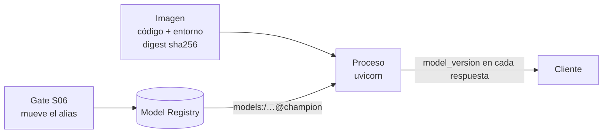

# Sesión 5 — Deployment: del modelo registrado al servicio que responde

> Pregunta que responde la sesión: **¿cómo convierto un modelo del registry en algo
> que otro sistema pueda consumir, y cómo sé qué versión está respondiendo?**

## Objetivos

Al terminar la sesión, cada estudiante puede:

1. **Elegir** entre *batch*, *online* y *streaming* para un caso concreto usando
   cinco criterios declarados (latencia tolerada, volumen, frescura de features,
   costo, complejidad operativa), y **defender** la elección con esos criterios en
   lugar de por preferencia.
2. **Implementar** un servicio HTTP de inferencia con FastAPI y Pydantic v2 que
   valide su entrada, separe request de response y **cargue el modelo desde el
   Model Registry por alias**, no desde un archivo copiado.
3. **Explicar** qué responde cada endpoint operativo (`/health`, `/modelo`,
   `/metrics`) y a quién: el orquestador, una persona o Prometheus.
4. **Construir** una imagen que instala desde el lockfile, no corre como `root` y
   tiene un `HEALTHCHECK` que de verdad funciona, y **verificarlo** con tres
   comandos.
5. **Distinguir** un tag mutable (`imagen:latest`) de un digest inmutable
   (`imagen@sha256:…`) y **argumentar** por qué la unidad de despliegue es el
   segundo.
6. **Consultar en SQL** las predicciones de un pipeline batch y **atribuir** cada
   fila a la versión de modelo que la produjo.
7. **Diagnosticar** un `InconsistentVersionWarning` al cargar un artefacto y
   **nombrar** la causa estructural (dos resoluciones de dependencias distintas).

## Contenidos

Los archivos de esta carpeta **no tienen orden entre sí**: el orden de la clase
está en [El recorrido](#el-recorrido), y va por secciones de este README.

| Ruta | Qué hay |
|---|---|
| [`intro-dockers/`](intro-dockers/) | Primer contacto con contenedores: la misma app en local y en Docker |
| [`api-contract.md`](api-contract.md) | El contrato de la API: endpoints, códigos, errores y ejemplos |
| [`postman/`](postman/) | Colección y entorno de Postman para el taller |
| [`taller.md`](taller.md) | Enunciado del taller, con criterios de aceptación medibles |
| [`_soluciones/`](_soluciones/) | Soluciones de referencia. No publicar antes del taller |

El servicio **no vive aquí**: vive en [`src/taxi/api/`](../../src/taxi/api/) y esta
carpeta lo ejecuta, lo prueba y lo empaqueta. Una copia por sesión serían dos
servicios distintos con dos definiciones de features, y ninguna fuente de verdad.

| Archivo del paquete | Responsabilidad |
|---|---|
| [`src/taxi/api/schemas.py`](../../src/taxi/api/schemas.py) | El contrato: qué es un request válido y qué forma tiene la respuesta |
| [`src/taxi/api/modelo.py`](../../src/taxi/api/modelo.py) | Carga desde el registry, adaptación request → features, inferencia |
| [`src/taxi/api/metricas.py`](../../src/taxi/api/metricas.py) | Instrumentación Prometheus (se usa a fondo en S07) |
| [`src/taxi/api/main.py`](../../src/taxi/api/main.py) | Solo *wiring*: rutas, ciclo de vida y traducción de errores |
| [`src/taxi/flows/batch.py`](../../src/taxi/flows/batch.py) | La misma inferencia, en modo batch, con trazabilidad por fila |
| [`Dockerfile`](../../Dockerfile) · [`.dockerignore`](../../.dockerignore) · [`docker-compose.yml`](../../docker-compose.yml) | El empaquetado y el stack local |
| [`tests/api/`](../../tests/api/) | 4 archivos de tests que corren sin MLflow y sin red |

---

## El recorrido

Las secciones de este README están **en el orden en que se dictan**. El contenedor
va antes que la API a propósito: empaquetar algo que ya funciona enseña más que
empaquetar algo que todavía no existe. Y la decisión batch / online / streaming
va casi al final, también a propósito: elegir antes de haber desplegado las dos
primeras es elegir con una tabla en vez de con experiencia.

| Paso | Se abre | Para qué | ¿Bloquea la terminal? |
|---|---|---|---|
| 1 | [sección 1](#1-el-dolor-dos-formas-de-romper-un-despliegue-sin-que-nada-avise) | las dos formas de romper un despliegue sin que nada avise | no: solo se lee y se corre un comando corto |
| 2 | [`intro-dockers/`](intro-dockers/) (sección 2) | la misma app en local y en un contenedor, para ver qué cambia y qué no | `uv run app.py` **sí** (Ctrl+C para salir); `docker run -d` no |
| 3 | [sección 3](#3-empaquetar-del-contenedor-al-digest), con el [`Dockerfile`](../../Dockerfile) de la raíz al lado del de `intro-dockers` | el Dockerfile real, el tag mutable contra el digest inmutable, el stack de Compose | `docker build` no bloquea pero tarda minutos la primera vez; `make up` no |
| 4 | [sección 4](#4-el-servicio-online-fastapi--pydantic-v2), [`api-contract.md`](api-contract.md) y [`src/taxi/api/`](../../src/taxi/api/) | el contrato, la carga por alias, los endpoints operativos, la traducción de errores | `make serve` **sí**: va en su propia terminal |
| 5 | [sección 5](#5-batch-la-misma-inferencia-con-trazabilidad-por-fila) | la misma inferencia en batch, con trazabilidad por fila | `make batch` **sí**, hasta que termina (segundos con los datos ya descargados) |
| 6 | [secciones 6](#6-batch-online-o-streaming-la-decisión-antes-de-la-herramienta) [y 7](#7-alternativas-qué-más-hay-y-cuándo-conviene) | recién ahora la decisión batch / online / streaming, y qué alternativas había | no |
| 7 | [`taller.md`](taller.md), con la colección de [`postman/`](postman/) | el entregable | no |

Las secciones 8 a 13 (qué se gana y qué cuesta, autoverificación, qué no usar,
errores esperables, limpieza, referencias) no son pasos de la clase: se consultan
cuando hacen falta.

## Antes de clase

Hacen falta **tres terminales** a partir del paso 4: una para el servidor de
MLflow, una para la API y una para mandar requests.

```bash
make data      # las particiones del caso guía (una vez; tarda varios minutos)
make mlflow    # terminal 1: el registry de S03. Bloquea; déjala abierta
```

La API carga el modelo **por alias** desde ese registry, así que tiene que existir
un `nyc-taxi-duration@champion`. Compruébalo desde otra terminal:

```bash
uv run python -c "
from taxi.models import registry
mv = registry.version_por_alias('nyc-taxi-duration', 'champion')
print('champion ->', mv.version if mv else 'NO HAY')
"
```

Si imprime `NO HAY`, se crea con dos comandos que tardan menos de un minuto:

```bash
uv run taxi train --registrar   # entrena el baseline (~15 s) y lo registra como @candidate
uv run taxi promote             # el gate de S06 lo promueve a @champion
```

(`taxi train --hpo` registra un candidato mejor, pero cada trial tarda minutos;
para esta sesión el baseline alcanza: lo que se enseña es cómo se sirve, no
cuánto acierta.)

Docker Desktop tiene que estar abierto desde el paso 2.

**Dos registries, un solo puerto.** `make mlflow` levanta un MLflow con SQLite
en el puerto 5001. El stack de Compose (`make up`, paso 3) levanta **otro**
MLflow, con Postgres y MinIO, **en el mismo puerto**. No pueden correr a la vez:
el segundo falla con `address already in use`. Y son dos registries distintos:
el `@champion` que existe en uno no existe en el otro. En esta sesión el camino
principal es `make mlflow` + `make serve` (sin contenedor para la API); el stack
de Compose se usa en el paso 3 para verificar la imagen, y se apaga con
`make down` antes de volver a `make mlflow`.

---

## 1. El dolor: dos formas de romper un despliegue sin que nada avise

No se abre FastAPI hasta el final de este bloque.

### Acto 1 — La imagen que sirve otra cosa

El atajo tentador al escribir el `Dockerfile` de una API de ML se ve así: se copia
`pyproject.toml` a la imagen, y como "no compila" o "tarda mucho", se instala a
mano lo que hace falta:

```dockerfile
COPY pyproject.toml .
RUN pip install --no-cache-dir mlflow==2.17.2 xgboost==2.1.2 scikit-learn==1.5.2
```

Funciona el primer día. El problema es que el artefacto que esa imagen tiene que
servir se entrenó con **otras** versiones: las que resuelve `uv.lock`. Compruébalo
en tu entorno:

```bash
uv run python -c "import importlib.metadata as m; print({p: m.version(p) for p in ('mlflow','xgboost','scikit-learn')})"
```

```
{'mlflow': '3.15.1', 'xgboost': '3.2.0', 'scikit-learn': '1.9.0'}
```

Un modelo de scikit-learn se guarda con `pickle`, que serializa **los atributos
internos del objeto** tal como estaban en la versión que lo entrenó. Al cargarlo
con otra versión, sklearn detecta que los atributos no coinciden con lo que espera
y emite `InconsistentVersionWarning`. El resultado, en orden de gravedad
creciente:

1. si el formato interno cambió de forma incompatible, la carga falla y el
   contenedor arranca degradado. **Es el caso bueno**, porque es ruidoso;
2. si cambió de forma tolerable, el modelo carga y **predice distinto** de lo que
   el gate de promoción validó. Un modelo aprobado en CI y una imagen que sirve
   otra cosa, sin un solo error en los logs. ¿Quién lee los *warnings* de un
   contenedor en producción?

La causa no es "faltó actualizar un número". Es estructural: **hay dos
resoluciones de dependencias**, una en `uv.lock` (con la que se entrena) y otra
escrita a mano en el `Dockerfile` (con la que se sirve). La regla que lo evita:

> Las versiones se resuelven **una** vez, en `uv.lock`, y todos los entornos
> —local, CI, entrenamiento, serving— instalan desde ahí. Ningún pin a mano en un
> `Dockerfile`.

La cabecera del [`Dockerfile`](../../Dockerfile) conserva el atajo escrito, para
que se reconozca cuando aparezca en otro repositorio.

### Acto 2 — `pickle.load` de un binario descargado

El contraejemplo de la sesión 6 empieza así:

```python
with open("lin_reg.bin", "rb") as f_in:
    (dv, model) = pickle.load(f_in)
```

Pregunta para la clase: **¿qué código se ejecuta al deserializar ese archivo?**

La respuesta es incómoda: cualquiera. `pickle` no es un formato de datos, es un
*programa*: una secuencia de instrucciones, y una de ellas (`REDUCE`) invoca una
función con argumentos que vienen del propio archivo. Deserializar un pickle es
equivalente a ejecutar un script que alguien te mandó. La documentación de Python
lo dice sin rodeos: *"the pickle module is not secure. Only unpickle data you
trust."*

En un pipeline de ML eso significa que **el artefacto es un ejecutable** y su
procedencia importa igual que la del código. Por eso el modelo se resuelve del
registry, donde hay versión, run de origen y quién lo registró, y no se descarga
de una URL. No elimina el riesgo (MLflow también usa pickle por debajo en varios
*flavors*); lo acota a artefactos con linaje. Alternativas cuando el riesgo no es
aceptable: formatos sin ejecución de código (ONNX, `skops`, el formato nativo de
XGBoost/LightGBM), firma de artefactos y aislamiento del proceso que carga.

Ver el contraejemplo completo y comentado:
[`../s06-cloud-cicd/_contraejemplo-insegure-aws/`](../s06-cloud-cicd/_contraejemplo-insegure-aws/).

Cierre del bloque: las dos cosas que rompen un despliegue sin que nada avise son
**el entorno** y **la procedencia del artefacto**. Las dos se resuelven con lo
mismo: una sola fuente de verdad. `uv.lock` para el entorno, el Model Registry
para el artefacto.

---

## 2. Primer contacto con contenedores

Se abre [`intro-dockers/`](intro-dockers/) y se sigue su README de arriba a abajo
(15 minutos). Ahí no hay modelo ni registry: una app web que muestra un gato,
primero en local con `uv run app.py` y después dentro de un contenedor. Es la
misma app, el mismo archivo; lo único que cambia es una variable de entorno.

Lo que hay que traerse de ahí a la sección 3:

- qué es una **imagen** (código + dependencias + intérprete, congelados) y qué es
  un **contenedor** (un proceso corriendo a partir de esa imagen, aislado);
- por qué las dependencias se copian **antes** que el código (cache de capas);
- las **tres verificaciones**: no corre como `root`, `docker ps` dice
  `(healthy)`, `docker logs` no sale vacío;
- por qué `0.0.0.0` es correcto dentro del contenedor y peligroso fuera.

---

## 3. Empaquetar: del contenedor al digest

### 3.1 Las siete decisiones del `Dockerfile`

Lee el [`Dockerfile`](../../Dockerfile) de la raíz con esta tabla al lado, y con el
de `intro-dockers` en otro panel. Cada fila es un atajo tentador y lo que se hace
en su lugar.

| Decisión | Por qué | Cómo se verifica |
|---|---|---|
| Base `python:3.11-slim-bookworm`, versión fija | `latest` cambia bajo tus pies y el build deja de ser reproducible | el `FROM` y el `ARG PYTHON_VERSION` |
| `uv sync --locked`, **cero** pines a mano | una sola resolución de dependencias para todos los entornos; ver sección 1 | `--locked` falla si el lock no coincide con `pyproject.toml` |
| Multi-stage (`builder` → `runtime`) | `uv`, el cache de compilación y las dependencias de desarrollo no viajan a la imagen final: menos peso y menos superficie de ataque | `docker history` y el tamaño final |
| Orden de capas: lock antes que código | editar `main.py` no reinstala los paquetes | `docker build` dos veces y mirar los `CACHED` |
| `.dockerignore` | `data/` y `mlruns/` son cientos de MB que se envían al demonio para nada, e invalidan el cache; y un `.env` copiado por un `COPY . .` **queda en la capa para siempre** | comparar el tamaño del contexto que reporta el build |
| Usuario no-root (UID 1001) | si alguien logra ejecución de código, root dentro del contenedor da mucho más margen | **el CI lo verifica**: el job `imagen` de [`ci.yml`](../../.github/workflows/ci.yml) falla si el UID es 0 |
| `HEALTHCHECK` con el intérprete, no con `curl` | `curl` **no existe** en `python:*-slim`: un healthcheck con `curl` falla siempre, el contenedor queda permanentemente `unhealthy` y cualquier `depends_on: service_healthy` se cuelga esperando | `docker ps` debe decir `(healthy)` |

**Multi-stage, el mecanismo.** Un `Dockerfile` puede tener varios `FROM`, y cada
uno abre una etapa con su propio sistema de archivos. La etapa `builder` instala
todo con `uv`; la etapa `runtime` empieza de cero desde la imagen base y copia
**solo** el entorno virtual ya resuelto (`COPY --from=builder /opt/venv /opt/venv`).
Es como una cocina y un comedor: se cocina en la cocina, al comedor llega solo el
plato. Lo que se gana: la imagen final no lleva `uv`, ni el cache de descargas, ni
`pytest` ni `ruff`. Lo que cuesta: dos etapas que leer, y un build algo más largo.

Nota sobre el orden de las etapas: `runtime` va **al final** a propósito.
`docker build` sin `--target` construye la última etapa, y el job `imagen` del CI
depende de eso. Mover `runtime` hacia arriba haría que el CI verificara la imagen
equivocada.

### 3.2 Construir la imagen real y verificarla

Desde la raíz del repositorio:

```bash
docker build -t mlops-curso/api:local .
```

La primera vez tarda varios minutos: instala el proyecto completo (mlflow, xgboost,
prefect, evidently…). Termina con `naming to docker.io/mlops-curso/api:local`. Las
tres verificaciones de `intro-dockers`, ahora sobre la imagen que va a producción:

```bash
# 1. No corre como root
docker run --rm --entrypoint sh mlops-curso/api:local -c 'id -u'

# 2. Arranca sin registry (modo degradado) y responde /health
docker run -d --name api-local -p 8001:8000 -e TAXI_MODELO_URI=ninguno mlops-curso/api:local
sleep 5
curl -s http://127.0.0.1:8001/health | jq

# 3. Healthcheck y logs
docker ps --filter name=api-local
docker logs api-local
```

**Qué debes ver:**

```
1001
```

```json
{
  "status": "degradado",
  "model_loaded": false,
  "model_name": null,
  "model_version": null,
  "model_uri": "ninguno",
  "version_api": "1.0.0"
}
```

```
NAMES       IMAGE                   STATUS                    PORTS
api-local   mlops-curso/api:local   Up 8 seconds (healthy)    0.0.0.0:8001->8000/tcp
```

En los logs, dos líneas `WARNING` dicen exactamente lo que pasa: `Arranque SIN
modelo (TAXI_MODELO_URI=ninguno)` y `API arrancada en modo degradado`. Ese modo
**no es un truco de demo**: es lo que permite que el CI verifique la imagen sin
levantar un registry. Y `/health` devuelve **200**, no 503, porque es un
*liveness check*; se explica en la sección 4.4.

Se publica en el 8001 y no en el 8000 para que no choque con `make serve` más
adelante. Dato honesto sobre el tamaño: `docker images mlops-curso/api:local`
reporta unos **3.3 GB**. Es el precio de instalar el lockfile completo del curso en
la imagen de la API; un servicio real instalaría solo lo que la API importa.

Limpieza de este paso: `docker rm -f api-local`.

### 3.3 El stack local con Compose

Docker Compose es un archivo YAML que describe **varios contenedores y cómo se
conectan** (red, volúmenes, orden de arranque), y un comando que los levanta
todos. Lo que cuesta: seis servicios corriendo en tu equipo, con sus imágenes en
disco y sus volúmenes de datos, que no se van solos (ver sección 12).

```bash
make down 2>/dev/null; true   # por si quedó algo
# El MLflow de `make mlflow` tiene que estar apagado: usan el mismo puerto 5001
make up      # MLflow + MinIO + Postgres + API + Prometheus + Grafana
docker compose ps
make logs    # Ctrl+C para salir; los contenedores siguen corriendo
make down
```

**Qué debes ver** en `docker compose ps`:

```
SERVICE      STATUS
api          Up 5 seconds (healthy)
grafana      Up 20 seconds (healthy)
minio        Up 32 seconds (healthy)
mlflow       Up 26 seconds (healthy)
postgres     Up 32 seconds (healthy)
prometheus   Up 20 seconds (healthy)
```

`grafana` tarda unos segundos más en pasar de `(health: starting)` a `(healthy)`.
`minio-init` no aparece: crea el bucket y termina; con `docker compose ps -a` se ve
como `Exited (0)`. La API de este stack arranca **degradada** (`model_loaded:
false`) salvo que hayas entrenado y promovido contra el registry de Compose, que
es distinto del de `make mlflow` (ver [Antes de clase](#antes-de-clase)). No es
un error: es la consecuencia de que el modelo no viaje dentro de la imagen. Para
poblarlo, con el stack arriba:

```bash
uv run taxi train --registrar && uv run taxi promote
docker compose restart api
curl -s http://127.0.0.1:8000/health | jq -c '{model_loaded, model_version}'
```

Dos cosas de [`docker-compose.yml`](../../docker-compose.yml) que son la
preparación directa de la sesión 6:

- **MinIO habla el protocolo S3.** El código que sube artefactos no cambia entre
  local y AWS: cambia una variable de entorno. Es lo que hace que la sesión 6 sea
  transferible en lugar de ser un tutorial de AWS.
- **La clave `version:` no existe.** Muchos archivos de Compose empiezan con
  `version: '3.8'`; Compose v2 la ignora y emite un aviso de obsolescencia.

### 3.4 Del tag mutable al digest inmutable

Esta es la idea que hay que llevarse a la sesión 6. Un **tag** (`:latest`,
`:v2`) es un nombre que apunta a una imagen, y se puede volver a apuntar a otra. Un
**digest** es el hash SHA-256 del contenido de la imagen: la huella digital de
esos bytes exactos. Si cambia un byte, cambia el digest.

```bash
docker inspect --format='{{.Id}}' mlops-curso/api:local
docker tag mlops-curso/api:local mlops-curso/api:latest
docker inspect --format='{{.Id}}' mlops-curso/api:latest    # el MISMO id: dos nombres, una imagen

# Cambia cualquier archivo de src/ y reconstruye con el MISMO tag
docker build -t mlops-curso/api:latest .
docker inspect --format='{{.Id}}' mlops-curso/api:latest    # OTRO id, mismo nombre
```

```
sha256:eaa26257bff2871dd2e47ecd9a9eeb2988d6c63849165ba211d2ababd48f42ba
```

| | `imagen:latest` | `imagen@sha256:…` |
|---|---|---|
| Qué es | un nombre que alguien puede repuntar | el hash del contenido |
| ¿La que probé es la que corre? | no se puede afirmar | sí, por construcción |
| Rollback | "vuelve al tag de antes" (¿cuál?) | desplegar el digest previo |
| En los logs del incidente | los dos despliegues dicen `latest` | cada uno dice qué bytes eran |

El fallo concreto: pruebas `latest` en staging, alguien empuja un `latest` nuevo,
producción arranca **otros bytes** con el mismo nombre. El diagnóstico es horrible
porque los logs de las dos corridas son idénticos.

Es exactamente la misma estructura que los aliases del Model Registry: una
**referencia mutable** (`@champion`, `:latest`) sobre **contenido inmutable**
(versión 7, `sha256:…`). Para *routing* usas la referencia; para desplegar y
auditar usas el contenido. Después de un `docker push`, el digest del registro
remoto se ve con `docker inspect --format='{{index .RepoDigests 0}}' <imagen>`.

Por eso [`cd.yml`](../../.github/workflows/cd.yml) despliega por digest y no publica
`latest`. Se detalla en la [sesión 6](../s06-cloud-cicd/README.md).

---

## 4. El servicio online: FastAPI + Pydantic v2

Tres nombres antes de empezar, dichos por lo que hacen:

- **FastAPI** convierte funciones de Python en endpoints HTTP: le pones una ruta
  (`@app.post("/predict")`) a una función y él se encarga de leer el JSON, validar,
  llamar a la función y devolver la respuesta.
- **Pydantic** valida datos a partir de anotaciones de tipo. Declaras una clase con
  `PULocationID: int` y un rango, y cualquier cosa que no cumpla se rechaza con un
  error que dice qué campo y por qué. FastAPI lo usa para validar lo que entra.
- **uvicorn** es el servidor: el proceso que abre el puerto, recibe conexiones y le
  pasa cada request a la app. FastAPI sin uvicorn es una librería; con uvicorn es un
  servicio.

### 4.1 El contrato es código ejecutable

Una API de ML es una **frontera de confianza**. Del otro lado hay clientes que no
conocen el modelo, no leyeron el contrato de features y mandarán lo que sea. Sin
validación, un `PULocationID` de 9999 o una distancia negativa no producen un
error: producen una predicción silenciosamente absurda que el cliente consume como
válida.

En [`schemas.py`](../../src/taxi/api/schemas.py) el contrato se declara una vez y
FastAPI deriva de él **la validación en runtime y el esquema OpenAPI** (la
documentación interactiva de `/docs`). No pueden divergir porque son el mismo
objeto.

Cuatro decisiones que conviene mirar en el archivo:

1. **`extra="forbid"`.** Un cliente que manda `PULocationId` (i minúscula) recibe
   un 422, no una predicción calculada con el default silencioso. Enumerar lo
   permitido es más barato de auditar que enumerar lo prohibido.
2. **Rangos que coinciden con el contrato de datos de S02** (zonas 1-265,
   distancia 0-100 millas). Si el modelo nunca vio un valor, la API tampoco debe
   aceptarlo.
3. **Request y response separados.** Lo fácil es devolver los datos de entrada
   más la predicción; la respuesta de aquí lleva además `model_name` y
   `model_version`, que es lo que hace **auditable** una predicción tres semanas
   después.
4. **`@field_validator` (Pydantic v2), no `@validator` (v1).** El validador de
   `pickup_datetime` rechaza los timestamps con zona horaria en lugar de
   convertirlos: un cliente que manda `2023-05-15T08:30:00Z` cree hablar de las
   08:30 y el modelo entendería 04:30. Mejor un 422 hoy que un reporte de drift el
   mes que viene.

### 4.2 El ciclo de vida: `lifespan`, no `@app.on_event`

Un servicio tiene cosas que hacer **antes** de atender el primer request (cargar el
modelo) y **después** del último (liberar recursos). FastAPI lo resuelve con una
función `lifespan`: lo que va antes del `yield` corre al arrancar, lo que va después
corre al apagar, y el servidor atiende requests mientras está detenido en el
`yield`.

```python
@asynccontextmanager
async def lifespan(app: FastAPI) -> AsyncIterator[None]:
    cargador = obtener_cargador()
    cargador.cargar()  # el primer request no paga la descarga del artefacto
    ...
    yield              # aquí el servidor atiende requests
    logger.info("Apagando API")
```

La alternativa `@app.on_event("startup")` está deprecada desde FastAPI 0.93 (marzo
de 2023) y la documentación oficial la marca como tal. `lifespan` además permite
liberar recursos al apagar y es lo único que se comporta igual bajo `TestClient` y
bajo `uvicorn`.

Dos decisiones deliberadas del arranque:

- **Cargar en el arranque, no en el primer request.** Ese *cold start* puede ser de
  varios segundos y se manifiesta como un timeout aparentemente aleatorio en el
  primer request después de cada despliegue.
- **No abortar si la carga falla.** Un contenedor que muere al arrancar entra en
  `CrashLoopBackOff` (el orquestador lo reinicia en bucle) y nadie puede consultar
  `/health`, que es justo donde está escrito el motivo del fallo. Con
  `TAXI_MODELO_URI=ninguno` el servicio levanta a propósito sin modelo: es lo que
  permite verificar la imagen en CI sin levantar el registry.

### 4.3 La decisión central: cargar del registry, no de un archivo

El atajo tentador es un script `copy_model.py` que haga `shutil.copytree` del
directorio de un run hacia `deploy/model/`, y un `Dockerfile` con `COPY model/`.
Es fácil de escribir y funciona el primer día. Las consecuencias aparecen después:

- el artefacto queda versionado por el sistema de archivos, no por el registry:
  nadie puede decir qué versión sirve un contenedor;
- cambiar de modelo exige **reconstruir la imagen**;
- el `run_id` de origen acaba escrito en el código, así que el paso solo funciona
  en la máquina donde se generó ese run;
- se pierde todo el linaje que la sesión 3 enseña a construir.

La forma correcta es referirse al modelo por **alias del registry**:

```python
modelo = mlflow.pyfunc.load_model("models:/nyc-taxi-duration@champion")
```

Una referencia **mutable** a una versión **inmutable**. La imagen no contiene el
modelo: contiene el código que sabe pedirlo.



Consecuencia operativa que vale la sesión entera: **cambiar de modelo es mover un
alias y reiniciar el proceso; no hay rebuild, no hay redeploy de imagen.** Y el
rollback es mover el alias de vuelta. Se demuestra en vivo en la sección 4.6.

Detalle que hay que resolver, y `modelo.py` lo resuelve: el alias es mutable, así
que hay que **preguntarle al registry qué versión resolvía en el momento de la
carga** y guardarla. Si no, en los logs queda `champion` y no se sabe qué artefacto
respondió.

### 4.4 Los endpoints que un servicio de modelo necesita

| Endpoint | Quién lo consulta | Qué responde | Por qué existe |
|---|---|---|---|
| `POST /predict` | la aplicación cliente | una predicción + `model_version` + latencia | el caso de uso |
| `POST /predict/batch` | la aplicación cliente | N predicciones en una llamada de inferencia | amortiza el costo fijo por request; en inferencia sklearn ese costo suele dominar |
| `GET /health` | el orquestador | 200 mientras el proceso viva, con `model_loaded` | *liveness*: decide si reiniciar el contenedor |
| `GET /modelo` | una persona | nombre, versión, URI y **la lista de features** | responde "¿qué está respondiendo y con qué features?" sin abrir el código |
| `GET /metrics` | Prometheus | latencia, throughput, errores, versión | sin esto, "está lento" es una opinión (S07) |

**Liveness y readiness son dos preguntas distintas.** *Liveness*: ¿el proceso
está vivo? Si no, reinícialo. *Readiness*: ¿puede atender tráfico? Si no, no le
mandes requests, pero tampoco lo reinicies. La analogía: un médico de guardia
puede estar despierto (vivo) y aun así no poder atender porque le falta el
historial del paciente (no listo). Reiniciarlo no le trae el historial.

**`/health` responde 200 incluso sin modelo, a propósito.** Es el *liveness*: si
devolviera 503 al no haber modelo, el orquestador reiniciaría el contenedor en
bucle y nadie podría leer el diagnóstico. Quien necesite el *readiness* lo
construye sobre el campo `model_loaded`. Confundir los dos es el error más caro de
esta lista.

**El tope del lote (500) vive en el schema, no en el endpoint.** Un límite
declarado en el contrato aparece en OpenAPI y el cliente lo ve antes de escribir el
request. Y existe por dos razones operativas, no estéticas: acota la memoria por
request (un lote sin límite es un vector de denegación de servicio) y acota la
latencia de cola, porque un lote gigante bloquea al worker que lo atiende.

Contrato completo, con códigos de respuesta y ejemplos:
[`api-contract.md`](api-contract.md).

### 4.5 Errores que no filtran el interior del servicio

El handler que se escribe sin pensar es `detail=f"Error: {str(e)}"`. Eso filtra
rutas del filesystem, cadenas de conexión con credenciales, nombres de columnas y
trazas del ORM a cualquiera que sepa mandar un request malformado.

La regla, implementada en [`main.py`](../../src/taxi/api/main.py):

| Al cliente | Al log del servidor |
|---|---|
| un mensaje estable, apto para mostrar a un usuario | la traza completa, con `logger.exception` |
| un `id_correlacion` corto | el mismo `id_correlacion` |
| en 422 **sí** el detalle de validación | — |

El 422 es la excepción y tiene su razón: ese detalle describe **el request del
cliente**, no el interior del servidor. Es información que el cliente necesita para
corregirse.

**`def`, no `async def`, en los endpoints de predicción.** Un servidor asíncrono
tiene un solo hilo principal (el *event loop*) que va rotando entre miles de
conexiones; funciona porque cada una lo ocupa un instante y lo suelta. Es un solo
mesero atendiendo todas las mesas: si se pone a cocinar un plato de 200 ms, nadie
toma pedidos mientras tanto. `model.predict` es ese plato: usa CPU y no suelta el
hilo. Declarado con `def`, FastAPI lo manda a un grupo de hilos aparte y el mesero
sigue libre. Es un cambio de una palabra con efecto medible en el throughput.

### 4.6 Levantarlo

Tres terminales. La 1 ya tiene `make mlflow` (bloqueada, con logs del servidor de
MLflow). En la 2 va la API, y también se bloquea: ahí aparecen los logs del
servidor. En la 3 se mandan los requests, y ahí aparecen las respuestas.

**Paso 1, sin modelo** (no requiere MLflow; sirve para ver el modo degradado):

```bash
# terminal 2
TAXI_MODELO_URI=ninguno uv run uvicorn taxi.api.main:app --port 8000
```

En la terminal 2 debe aparecer, entre otras líneas, `WARNING taxi.api.modelo
Arranque SIN modelo (TAXI_MODELO_URI=ninguno)` y al final `Uvicorn running on
http://127.0.0.1:8000`. El proceso se queda esperando: es lo correcto.

```bash
# terminal 3
curl -s http://127.0.0.1:8000/health | jq
curl -sX POST http://127.0.0.1:8000/predict -H 'Content-Type: application/json' \
  -d '{"PULocationID": 43, "DOLocationID": 238, "trip_distance": 2.4, "pickup_datetime": "2023-05-15T08:30:00"}'
```

```json
{"status": "degradado", "model_loaded": false, "model_name": null, "model_version": null, "model_uri": "ninguno", "version_api": "1.0.0"}
{"error":"El servicio no tiene un modelo cargado y no puede predecir. Consulta /health para ver el estado.","id_correlacion":null,"detalle_validacion":null}
```

El segundo es un **503**, no un 500: "vuelve a intentar, el servicio no puede
atenderte todavía", que es lo que un cliente con reintentos sabe interpretar.
`Ctrl+C` en la terminal 2 para pasar al siguiente paso.

**Paso 2, con el modelo del registry** (requiere `make mlflow` arriba y un
`@champion`):

```bash
# terminal 2
make serve
```

En la terminal 2, la línea que importa es `INFO taxi.api.modelo Modelo cargado:
uri=models:/nyc-taxi-duration@champion nombre=nyc-taxi-duration version=1`. Si en
su lugar aparece un `ERROR ... Fallo la carga del modelo ... se arranca degradado`
seguido de un *traceback*, ve a la sección 11: la API sigue arriba, pero `/predict`
va a devolver 503.

```bash
# terminal 3
curl -s http://127.0.0.1:8000/modelo | jq
curl -sX POST http://127.0.0.1:8000/predict \
  -H 'Content-Type: application/json' \
  -d '{"PULocationID": 43, "DOLocationID": 238, "trip_distance": 2.4, "pickup_datetime": "2023-05-15T08:30:00"}' | jq
```

```json
{
  "model_name": "nyc-taxi-duration",
  "model_version": "1",
  "model_uri": "models:/nyc-taxi-duration@champion",
  "features": ["PU_DO", "PULocationID", "DOLocationID", "trip_distance", "hora_pickup", "dia_semana_pickup"],
  "umbral_viaje_largo_min": 30.0
}
```

```json
{
  "duration_min": 9.44,
  "viaje_largo": false,
  "model_name": "nyc-taxi-duration",
  "model_version": "1",
  "latencia_ms": 5.952
}
```

Los números de `duration_min` y `latencia_ms` van a diferir en tu equipo: dependen
de qué modelo ganó el gate y de tu CPU. Lo que **no** debe faltar es
`model_version`: es el campo que hace auditable la respuesta.

Los dos 422 que más se ven en clase, y qué dicen:

```bash
# terminal 3
curl -sX POST http://127.0.0.1:8000/predict -H 'Content-Type: application/json' \
  -d '{"PULocationID": 9999, "DOLocationID": 238, "trip_distance": 2.4}' | jq -c '.detalle_validacion[0] | {loc, msg}'
curl -sX POST http://127.0.0.1:8000/predict -H 'Content-Type: application/json' \
  -d '{"PULocationId": 43, "DOLocationID": 238, "trip_distance": 2.4}' | jq -c '[.detalle_validacion[] | .msg]'
```

```
{"loc":["body","PULocationID"],"msg":"Input should be less than or equal to 265"}
["Field required","Extra inputs are not permitted"]
```

El segundo es `extra="forbid"` trabajando: la `i` minúscula no pasa como default,
y el mensaje dice las dos cosas, que falta `PULocationID` y que sobra
`PULocationId`.

**La demostración que hay que hacer en vivo: cambiar de modelo sin reconstruir
nada.** Hace falta una segunda versión en el registry (otro `uv run taxi train
--registrar` la crea como candidata en 15 segundos, sin promoverla).

```bash
# terminal 3
curl -s http://127.0.0.1:8000/health | jq -c '{model_version, model_uri}'
uv run python -c "from taxi.models import registry; registry.asignar_alias('nyc-taxi-duration', 'champion', '2')"
# terminal 2: Ctrl+C y otra vez `make serve` (en el contenedor sería `docker compose restart api`)
# terminal 3
curl -s http://127.0.0.1:8000/health | jq -c '{model_version, model_uri}'
```

```
{"model_version":"1","model_uri":"models:/nyc-taxi-duration@champion"}
{"model_version":"2","model_uri":"models:/nyc-taxi-duration@champion"}
```

`model_version` cambia; `model_uri` es el mismo; no se reconstruyó nada. Para
volver: `registry.asignar_alias('nyc-taxi-duration', 'champion', '1')` y reiniciar.

Por último, `/metrics` es texto plano para Prometheus, no JSON:

```bash
curl -s http://127.0.0.1:8000/metrics | grep -E "^taxi_" | head
```

```
taxi_predicciones_total{clase="largo",model_version="1"} 0.0
taxi_predicciones_total{clase="corto",model_version="1"} 1.0
taxi_inferencia_duracion_segundos_bucket{le="0.001",model_version="1"} 0.0
...
taxi_errores_total{tipo="validacion"} 2.0
taxi_modelo_info{model_name="nyc-taxi-duration",model_uri="models:/nyc-taxi-duration@champion",model_version="1"} 1.0
```

El label `model_version` en cada serie es el puente con la sesión 7: sin él, un
cambio de modelo es invisible en Grafana.

Documentación interactiva en <http://127.0.0.1:8000/docs>; la raíz redirige ahí.

---

## 5. Batch: la misma inferencia, con trazabilidad por fila

```bash
make batch      # equivale a: uv run python -m taxi.flows.batch
```

Bloquea hasta terminar: lee una partición mensual real, valida el contrato de
datos, carga el `@champion` y predice sobre las filas completas de una vez.
**Requiere `make mlflow` arriba** y `make data` hecho. La salida son los logs de
Prefect en esta terminal (aparece `Finished in state Completed()`), y la última
línea la escribe el propio módulo:

```
... | INFO | Task run 'cargar_modelo-310' - Cargado models:/nyc-taxi-duration@champion -> version 1
... | INFO | Task run 'predecir-558' - Generadas 58671 predicciones
... | INFO | Task run 'persistir-d49' - Escritas 58671 filas en sqlite:///.../data/predicciones.db (batch 2023-07-38eca451)
... | INFO | Flow run 'opalescent-mule' - Finished in state Completed()
batch=2023-07-38eca451 filas=58671 version=1 destino=sqlite:///.../data/predicciones.db
```

Con los datos ya descargados tarda menos de diez segundos; la primera vez, `make
data` es lo que tarda. El nombre del flow run (`opalescent-mule`) lo inventa
Prefect y cambia en cada corrida.

Cada fila que escribe [`flows/batch.py`](../../src/taxi/flows/batch.py) lleva
`model_name`, `model_version`, `model_alias`, `model_uri`, `batch_id` y
`prediction_timestamp`. Se consulta con SQL:

```bash
sqlite3 -header -column data/predicciones.db \
  "SELECT batch_id, particion, model_version, model_alias, COUNT(*) AS n,
          ROUND(AVG(prediccion_minutos), 2) AS media_min
     FROM predicciones GROUP BY 1,2,3,4 ORDER BY 1;"
```

```
batch_id          particion  model_version  model_alias  n      media_min
----------------  ---------  -------------  -----------  -----  ---------
2023-07-38eca451  2023-07    1              champion     58671  14.68
```

**Por qué eso es el punto central y no un detalle de esquema.** Sin la versión en
la fila no se puede responder ninguna de las preguntas que importan cuando algo
sale mal: qué predicciones hay que revisar tras un rollback, si la degradación
empezó con la versión 7 o con el cambio de datos, o qué se le respondió a un
cliente en una fecha dada. La trazabilidad datos → modelo → predicción es lo que
hace auditable el sistema; sin ella hay un modelo, no un sistema.

Nótese qué se persiste: **el alias consultado y la versión que ese alias resolvía
en el momento de la corrida**. El atajo tentador es escribir `'stage':
'Production'` como literal en la fila: miente en cuanto el modelo cambia de estado,
y además viene del vocabulario de *stages*, deprecado en MLflow (ver
[ADR 002](../../docs/adr/002-aliases-en-vez-de-stages.md)).

Consultas listas para usar:
[`../s04-orquestacion/01-pipeline-ml/consultas-predicciones.sql`](../s04-orquestacion/01-pipeline-ml/consultas-predicciones.sql).

Límites honestos de SQLite, porque se van a encontrar con ellos: un solo escritor a
la vez, sin concurrencia real y sin acceso remoto. Alcanza para clase y para el
laboratorio. En cuanto el batch corre en otra máquina que el consumidor del dato,
el destino correcto es Postgres, y `batch.py` ya lo soporta con `DATABASE_URL`.

---

## 6. Batch, online o streaming: la decisión antes de la herramienta

Servir un modelo no es una sola cosa. La pregunta correcta no es "¿API o batch?"
sino **"¿cuándo se necesita la predicción, y respecto a qué dato?"**.

| Criterio | Batch | Online (síncrono) | Streaming |
|---|---|---|---|
| Latencia tolerada | horas o días | milisegundos a segundos | segundos |
| Volumen por ejecución | millones de filas | 1 a cientos por request | flujo continuo |
| Frescura de features | la del último corte | la del momento del request | la del evento, con estado en ventana |
| Costo | el más bajo: cómputo puntual, sin servicio arriba | pagas por tener el servicio disponible | el más alto: *broker* + procesamiento con estado |
| Complejidad operativa | baja: si falla, se re-corre | media: hay que vigilar disponibilidad y p95 | alta: *offsets*, orden, reprocesamiento, estado |
| Falla típica | el job no corrió y nadie lo notó | el servicio está arriba pero sirve un modelo viejo | el estado de la ventana se corrompe y nadie lo ve |

El caso guía, predecir la duración de un viaje, **admite las tres formas**, y eso
es justo lo que lo hace útil como ejemplo:

| Forma | Cómo se ve en el caso guía | Consumidor plausible |
|---|---|---|
| **Batch** | `make batch` predice sobre una partición mensual completa y escribe una fila por viaje con su `model_version` ([`flows/batch.py`](../../src/taxi/flows/batch.py)) | un reporte de planeación de flota que se lee cada mañana |
| **Online** | `POST /predict` con un viaje, respuesta en un request ([`api/main.py`](../../src/taxi/api/main.py)) | la app que le muestra al pasajero el tiempo estimado antes de aceptar |
| **Streaming** | el mismo modelo consumiendo eventos de pickup de un tópico y publicando la predicción en otro | tablero de operación en vivo, reasignación dinámica de vehículos |

Streaming **no se implementa** en esta sesión. La razón es explícita: la parte
difícil no es llamar al modelo, es el estado, el orden y el reprocesamiento, y
eso es un curso aparte. Se nombra para que nadie crea que "servir un modelo" es
sinónimo de "levantar una API". Si tu caso lo necesita, el punto de entrada son
Kafka + Faust/Flink o Kinesis + Managed Flink, y el modelo se carga igual: por
alias del registry.

Regla práctica para el taller: **empieza en batch**. Si el consumidor puede esperar
hasta el próximo corte, un job programado es más barato de operar y más fácil de
auditar que un servicio. Elegir online cuando el batch alcanzaba es la forma más
común de comprarse un problema de disponibilidad sin recibir nada a cambio.

El razonamiento completo está en
[`docs/adr/006-serving-online-vs-batch.md`](../../docs/adr/006-serving-online-vs-batch.md).

---

## 7. Alternativas: qué más hay y cuándo conviene

**Criterios de esta comparación**, declarados para que se pueda discutir:
(a) *qué escribes tú*: cuánto código de servicio queda a tu cargo; (b) *qué te da
gratis*: batching, versionado, autoescalado; (c) *qué infraestructura exige*;
(d) *estado del proyecto*: última versión y actividad.

**Fecha de evaluación: 2 de septiembre de 2026.** Las versiones envejecen; el
criterio, menos. Verifica la columna de estado antes de cada cohorte.

| Herramienta | Qué escribes tú | Qué te da gratis | Exige | Estado (sep-2026) | Doc oficial |
|---|---|---|---|---|---|
| **FastAPI + uvicorn** (lo de esta sesión) | la API completa: contrato, endpoints, errores | nada de ML; todo el control | un contenedor | FastAPI 0.141.x, releases frecuentes | [fastapi.tiangolo.com](https://fastapi.tiangolo.com/) |
| **BentoML** | un `Service` con un método `@api`; no escribes HTTP | empaquetado (*Bento*), **adaptive batching**, versionado del servicio, imagen generada | un contenedor | 1.4.39 (2026-05-07) | [docs.bentoml.com](https://docs.bentoml.com/en/latest/) |
| **KServe** | un `InferenceService` en YAML | autoescalado a cero, canary por porcentaje, protocolo de inferencia estándar (Open Inference Protocol) | **Kubernetes** (+ Knative para serverless) | 0.20.0 (2026-08-06) | [kserve.github.io](https://kserve.github.io/website/) |
| **Ray Serve** | *deployments* en Python, composables | escalado por réplica, composición de varios modelos, *fractional GPUs* | un clúster de Ray | Ray 2.58.0 (2026-08-23) | [docs.ray.io](https://docs.ray.io/en/latest/serve/index.html) |
| **`mlflow models serve`** | nada | un endpoint `/invocations` en un comando | solo mlflow | vigente en 3.15.x | [mlflow.org](https://mlflow.org/docs/latest/ml/deployment/deploy-model-locally/) |
| **MLServer** (Seldon) | un `model-settings.json` | multi-modelo, adaptive batching, Open Inference Protocol | un contenedor | **AVISO: última release estable 1.7.1, de junio de 2025**; solo un `1.7.2rc1` (diciembre de 2025) sin promover desde entonces. No presentarlo como proyecto vivo sin verificarlo antes de la cohorte | [mlserver.readthedocs.io](https://mlserver.readthedocs.io/en/stable/) |

### Cómo leer esa tabla

- **`mlflow models serve` es para demos, no para producción.** La propia
  documentación lo enmarca como *"lightweight applications or testing your model
  locally"*. No tiene validación de entrada propia, ni `/health` con la versión del
  modelo, ni métricas, ni control sobre el manejo de errores. Es perfecto para
  mostrar en 30 segundos que un modelo del registry se puede servir; usarlo como
  servicio de producción es entregar una API sin contrato.
- **BentoML es el paso 2 natural de esta sesión.** Resuelve, sin que escribas la
  API a mano, dos cosas que aquí cuestan trabajo: el empaquetado del servicio como
  artefacto versionado y el *adaptive batching* (agrupar requests concurrentes en
  una sola llamada de inferencia, que es de donde sale la mayor parte del
  throughput en modelos de CPU). El precio es un modelo mental más y menos control
  sobre el HTTP.
- **KServe y Ray Serve solo si ya tienes el clúster.** Si la organización vive en
  Kubernetes, KServe te da autoescalado a cero y *canary* declarativo que aquí
  tendrías que construir. Si no lo tienes, montarlo para servir un modelo es una
  decisión de infraestructura disfrazada de decisión de serving.

### Por qué FastAPI en este curso

No porque sea mejor: porque **es la capa donde se ven los conceptos**. Escribir el
contrato, el `lifespan`, la carga por alias y el manejo de errores a mano es lo que
hace que después se entienda qué está automatizando BentoML o KServe. Con un
framework que genera la API, la sesión enseñaría a usar una herramienta en lugar de
a diseñar un servicio.

El compromiso, dicho explícitamente: en un equipo con volumen real, escribir la API
a mano deja *adaptive batching*, versionado del servicio y autoescalado como
trabajo tuyo. Ahí el orden correcto es empezar por BentoML.

---

## 8. Qué se gana y qué cuesta

| Ganamos | Nos costó |
|---|---|
| contrato explícito y validado | hay que escribirlo y mantenerlo |
| carga por alias: cambiar de modelo sin rebuild | dependencia de que el registry esté arriba al arrancar |
| imagen reproducible desde el lock | builds más lentos que un `pip install` sin lock, y una imagen de 3 GB |
| dos formas de servir | dos caminos que mantener (comparten features, eso sí) |
| todo escrito a mano en FastAPI | sin *adaptive batching*, sin versionado del servicio, sin autoescalado |

**Cuándo nada de esto hace falta.** Si el modelo lo consume una persona, una vez
al mes, desde un notebook, un `mlflow.pyfunc.load_model` en ese notebook es el
despliegue correcto. Si el consumidor es un reporte diario, el batch de la sección
5 alcanza y sobra: no montes una API para eso. La API se justifica cuando hay
**otro sistema** esperando una respuesta **ahora**; el contenedor, cuando ese
sistema corre en una máquina que no controlas.

---

## 9. Autoverificación

Cinco preguntas. Si alguna no se puede responder sin volver al material, ahí está
el vacío.

1. Tu imagen fija `scikit-learn==1.5.2` y el modelo del registry se entrenó con
   1.9. **¿Qué ves en los logs, en el mejor y en el peor caso**, y por qué el peor
   caso es el silencioso? ¿Cuál es la corrección estructural, no el parche?
2. `/health` devuelve `200` con `"model_loaded": false`. **¿Debe el orquestador
   reiniciar el contenedor? ¿Debe el balanceador mandarle tráfico?** Justifica cada
   respuesta por separado y nombra los dos tipos de check.
3. Cambias el modelo de producción de la versión 7 a la 8. **¿Qué tienes que
   reconstruir, qué tienes que reiniciar y qué no se toca?** Responde con la
   arquitectura de esta sesión y después con la de un `copy_model.py` que copia el
   modelo dentro de la imagen.
4. Un cliente reporta una predicción absurda de hace tres semanas y solo tiene la
   respuesta JSON. **¿Qué campos necesitas para reconstruir qué artefacto la
   produjo?** ¿Y si hubiera sido una fila del batch en lugar de una respuesta HTTP?
5. Desplegaste `mi-api:latest` en staging, lo probaste y lo desplegaste en
   producción. **¿Puedes afirmar que producción corre los mismos bytes?** Si no,
   ¿qué referencia tendrías que haber usado y qué cambia en el rollback?

---

## 10. Qué NO usar

| No usar | Usar | Motivo |
|---|---|---|
| `app.run(debug=True, host="0.0.0.0")` | un servidor ASGI/WSGI real (`uvicorn`, `gunicorn`) sin debug | el debugger de Werkzeug expuesto es **ejecución remota de código**. Ver el [contraejemplo](../s06-cloud-cicd/_contraejemplo-insegure-aws/) |
| `@app.on_event("startup")` / `"shutdown"` | `lifespan` como context manager | deprecado desde FastAPI 0.93; `lifespan` además libera recursos al apagar |
| Pydantic v1: `@validator`, `class Config`, `.dict()`, `.json()` | `@field_validator`, `model_config = ConfigDict(...)`, `.model_dump()`, `.model_dump_json()` | son las APIs de v2; las de v1 están deprecadas y desaparecen |
| `allow_origins=["*"]` con `allow_credentials=True` | orígenes explícitos por variable de entorno | combinación **inválida**: el navegador rechaza la respuesta. Y si funcionara, cualquier sitio podría hacer requests autenticados |
| `HTTPException(detail=f"...{e}")` | mensaje estable + `id_correlacion` + `logger.exception` | filtra rutas, cadenas de conexión y trazas a cualquiera |
| `async def` en un endpoint que llama a `model.predict` | `def` (Starlette lo manda a su threadpool) | una llamada bloqueante en el event loop reduce la concurrencia a 1 |
| `pickle.load` de un artefacto descargado o no confiable | el registry (linaje) o un formato sin ejecución de código (ONNX, `skops`) | deserializar un pickle ejecuta código arbitrario |
| `shutil.copytree` del modelo a la imagen | `models:/<nombre>@champion` | rompe la trazabilidad y obliga a reconstruir la imagen para cambiar de modelo |
| `RUN pip install libreria==X` en el `Dockerfile` | `uv sync --locked` desde `uv.lock` | dos resoluciones de dependencias = la imagen sirve algo distinto de lo que se validó |
| `FROM python:latest` · imagen que corre como `root` | base con versión fija · `USER` sin privilegios | reproducibilidad y superficie de ataque |
| `HEALTHCHECK CMD curl -f ...` sobre `python:*-slim` | el intérprete que ya está en la imagen | `curl` no existe ahí: el contenedor queda `unhealthy` para siempre |
| `version: "3.8"` en `docker-compose.yml` | omitir la clave | obsoleta en Compose v2, que la ignora y avisa |
| `imagen:latest` como unidad de despliegue | `imagen@sha256:…` | un tag es mutable: lo que probaste puede no ser lo que corre |

Y del lado de MLflow, lo que esta sesión no hace: `transition_model_version_stage`,
URIs de modelo por stage (`models:/<nombre>/Production`) y `artifact_path=` en
`log_model` (hoy es `name=`).

---

## 11. Errores esperables, con su mensaje literal

Primero, cómo leer un *traceback*: **la última línea es la útil**. Las cuarenta
anteriores son el camino que recorrió Python hasta llegar al error, y sirven
después, para saber desde dónde se llamó. Se lee de abajo hacia arriba.

| Dónde aparece | Mensaje literal (última línea) | Causa | Arreglo |
|---|---|---|---|
| terminal de la API, al arrancar | `mlflow.exceptions.MlflowException: No such artifact: ''` y, arriba, `Fallo la carga del modelo ... se arranca degradado` | el registry sabe de la versión pero los archivos del modelo no están donde el registry cree (se borró `mlartifacts/`, se movió el repositorio, o el servidor se levantó desde otra carpeta) | con `make mlflow` apagado, `make reset-clase` y luego los dos comandos de [Antes de clase](#antes-de-clase) |
| terminal de la API, al arrancar | `ConnectionError: ... Connection refused` hacia `127.0.0.1:5001` | no hay servidor de MLflow, o está en otro puerto | `make mlflow` en su terminal; el curso usa **5001** siempre |
| terminal de la API, al arrancar | `RestException: RESOURCE_DOES_NOT_EXIST: Registered model alias champion not found` | hay servidor, pero nadie promovió un modelo en **ese** registry | `uv run taxi train --registrar && uv run taxi promote` |
| terminal 3 (cliente) | `{"error":"El servicio no tiene un modelo cargado..."}` con HTTP 503 | la API arrancó degradada por cualquiera de las tres causas anteriores | mirar la terminal 2, donde está la traza |
| terminal 3 (cliente) | `curl: (7) Failed to connect to 127.0.0.1 port 8000` | la API no está arriba, o `make serve` todavía está cargando el modelo | esperar a `Uvicorn running on` en la terminal 2 |
| `make mlflow` o `make up` | `[Errno 48] Address already in use` / `Bind for 0.0.0.0:5001 failed: port is already allocated` | los dos MLflow usan el 5001 | apaga uno: Ctrl+C en `make mlflow`, o `make down` |
| cualquier `docker ...` | `Cannot connect to the Docker daemon at unix:///.../docker.sock` | Docker Desktop no está abierto | ábrelo y espera a que el ícono deje de animarse |
| `make batch` | `FileNotFoundError: ... data/processed/2023-07.parquet` | falta `make data` | `make data` (tarda) |
| `curl .../metrics \| grep taxi_` | no imprime nada | la API acaba de arrancar sin modelo: las series de predicción existen solo cuando hay modelo cargado; las de errores sí deben aparecer siempre | `curl -s .../metrics \| head` para ver el texto completo |

---

## 12. Limpieza: desmontar lo que se montó

Nada de lo que se levantó en esta sesión se apaga solo. Al terminar:

```bash
# Los procesos que bloquean una terminal: Ctrl+C en cada una (make mlflow, make serve)

# El stack de Compose. `down` para los contenedores; `-v` borra también los
# volúmenes (los datos de Postgres, MinIO, Prometheus y Grafana). Sin `-v`, el
# registry de Compose sobrevive al próximo `make up`.
make down
docker compose down -v

# Los contenedores sueltos de la sección 3 y de intro-dockers
docker rm -f api-local gatitos 2>/dev/null || true

# Las imágenes, si quieres recuperar el disco (~3.3 GB la API, ~370 MB gatitos)
docker rmi mlops-curso/api:local mlops-curso/api:latest gatitos-app 2>/dev/null || true
```

Lo que queda en disco y es deliberado: `mlflow.db` y `mlartifacts/` (el registry
local, que se borra con `make reset-clase`) y `data/predicciones.db` (la tabla del
batch; se borra con `rm data/predicciones.db`).

---

## 13. Referencias

- FastAPI — [lifespan](https://fastapi.tiangolo.com/advanced/events/), [response model](https://fastapi.tiangolo.com/tutorial/response-model/), [manejo de errores](https://fastapi.tiangolo.com/tutorial/handling-errors/)
- Pydantic v2 — [validadores](https://docs.pydantic.dev/latest/concepts/validators/), [guía de migración desde v1](https://docs.pydantic.dev/latest/migration/)
- Docker — [buenas prácticas de `Dockerfile`](https://docs.docker.com/build/building/best-practices/), [multi-stage](https://docs.docker.com/build/building/multi-stage/), [`.dockerignore`](https://docs.docker.com/build/concepts/context/#dockerignore-files), [`version` en Compose (obsoleta)](https://docs.docker.com/reference/compose-file/version-and-name/)
- uv — [uso en Docker](https://docs.astral.sh/uv/guides/integration/docker/), [lockfile](https://docs.astral.sh/uv/concepts/projects/sync/)
- MLflow — [Model Registry](https://mlflow.org/docs/latest/ml/model-registry/), [servir modelos localmente](https://mlflow.org/docs/latest/ml/deployment/deploy-model-locally/)
- Seguridad de `pickle` — [documentación de Python](https://docs.python.org/3/library/pickle.html)
- Catálogo opcional de comandos de Docker:
  [`referencia/docker-comandos.md`](../../referencia/docker-comandos.md).
- *Designing Machine Learning Systems*, Chip Huyen — capítulo de *model deployment*
  y la distinción batch / online / streaming.
