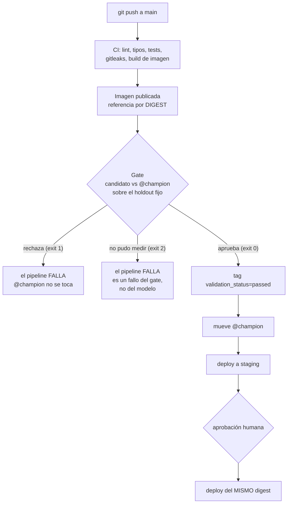

# 01 — El gate de promoción: el punto donde el pipeline puede decir "no"

> Paso 1 de 4 del recorrido de la sesión. Antes de leer los workflows conviene
> entender esto, porque un workflow es la mecánica y el gate es la decisión.
> Enseñar primero el YAML produce estudiantes que saben automatizar una promoción
> que no deberían estar haciendo.

**Prerrequisitos para correr lo que hay aquí:** el tracking server de MLflow
levantado en el puerto 5001 (`make mlflow`, o `make up` si prefieres el stack de
Compose), las particiones preparadas (`make data`) y un modelo con alias `champion`
en el registry (si terminaste la sesión 3 o la 4, ya lo tienes). Todo se ejecuta
desde la raíz del repositorio.

---

## 1. Qué es un gate, dicho sin la palabra

Un **gate** es un paso del pipeline que compara el modelo nuevo con el que ya está
sirviendo y cuya respuesta **puede ser "no"**. Si la respuesta es "no", el pipeline
falla ahí y el modelo que estaba sirviendo no se toca.

La analogía es el examen práctico de conducir: haber terminado las clases no te da la
licencia. Hay una prueba, con criterios escritos de antemano, que se puede perder. Y
perderla no significa que el curso estuvo mal, significa que hoy no conduces.

Lo que el gate corrige es un atajo que se ve inocente:

> *"El modelo nuevo tiene mejor RMSE en validación. Subámoslo."*

Esa frase no responde tres preguntas, y las tres importan antes de mover tráfico:

1. **Los datos con los que se midió, ¿son válidos?** Si el holdout viola el contrato
   de datos, la métrica no significa nada.
2. **¿La mejora es real, o cabe dentro del ruido de muestreo?** Dos modelos
   equivalentes dan números distintos en dos muestras distintas.
3. **¿Mejoró en promedio a costa de empeorar en algún segmento?** El promedio
   esconde a la minoría.

### Vocabulario de esta sesión

| Término | Qué es aquí |
|---|---|
| **candidato** | la versión del modelo que acaba de registrarse y se quiere promover. `taxi train --registrar` la deja con el alias `@candidate` |
| **champion** | la versión que está sirviendo tráfico. Es la que resuelve la API con `models:/nyc-taxi-duration@champion` |
| **alias** | un nombre que apunta a una versión y que se puede mover. Una referencia mutable sobre versiones inmutables (sesión 3) |
| **holdout fijo** | la partición 2023-05 del caso guía. Nunca se usa para elegir hiperparámetros; solo para que el gate compare. Está en `PARTICION_TEST` de `src/taxi/config.py` |

---

## 2. Los cinco pasos

Tres son **criterios que se evalúan**; dos son **escrituras** que se hacen en un
orden que importa.

| # | Paso | Qué exige exactamente | Dónde vive |
|---|---|---|---|
| 1 | **Tests de datos verdes** | el holdout pasa el contrato de Pandera `ViajesProcesados`, **el mismo** que usa la ingesta, no una copia | `criterio_contrato_datos` en `src/taxi/models/evaluate.py` |
| 2 | **Métrica global mejor por un margen** | `rmse_candidato <= rmse_champion * (1 - 0.01)`. El 1% es `MEJORA_MINIMA_RELATIVA` en `config.py` | `criterio_mejora_global` |
| 3 | **Ningún subgrupo se degrada** | para cada subgrupo con al menos 50 filas, `(rmse_cand - rmse_champ) / rmse_champ <= 0.05` | `criterio_subgrupos` |
| 4 | **Escribir el tag `validation_status`** | `passed` o `failed` en la versión del candidato, **antes** de tocar el alias | `registry.marcar_validacion` |
| 5 | **Y solo entonces, mover el alias** | `set_registered_model_alias(nombre, "champion", version)` | `registry.asignar_alias` |

El código que orquesta los cinco pasos es [`scripts/promote.py`](../../scripts/promote.py).
La política (qué se compara y con qué umbral) está en
[`src/taxi/models/evaluate.py`](../../src/taxi/models/evaluate.py) como funciones que
reciben números y devuelven un veredicto. Esa separación es deliberada y se explica en
la sección 4.

### Paso 1: el dato primero, y corto circuito

Se valida el holdout **antes** de mirar cualquier métrica. Si falla, los criterios 2
y 3 quedan marcados `NO EVALUADO` en lugar de `FALLA`. La distinción no es cosmética:
*"no lo revisé"* y *"lo revisé y falló"* son diagnósticos distintos para quien lee el
log a las tres de la mañana.

Por qué el corto circuito: un RMSE calculado sobre datos que violan el contrato no
significa nada, y reportarlo invita a discutir el número equivocado. Promover con base
en él es peor que no promover, porque el gate habría dado una garantía falsa.

### Paso 2: por qué un margen y no un "menor que"

`rmse_candidato < rmse_champion` parece suficiente y no lo es. Con ruido de muestreo,
dos modelos equivalentes se alternan indefinidamente: cada rotación cuesta un
despliegue, invalida la comparabilidad de las métricas de negocio y llena el registry
de versiones. Es el **churn de modelos**.

Exigir un 1% de mejora relativa es un umbral **elegido, no derivado**, y hay que
decirlo así. Lo riguroso sería un test estadístico con el tamaño del holdout; el 1% es
una aproximación defendible que evita el churn sin bloquear mejoras reales. Vive en un
solo lugar (`config.py`) para que se pueda discutir y cambiar.

Y un detalle que hace que muchos gates reales no sirvan: **el champion se reevalúa
sobre el holdout actual**, en lugar de leer las métricas guardadas en su run.

```python
# scripts/promote.py
modelo_champion = _cargar_modelo(config.uri_modelo(nombre_modelo, config.ALIAS_PRODUCCION))
metricas_champion, subgrupos_champion = evaluate.evaluar_modelo(modelo_champion, holdout)
```

Si el holdout o el código de la métrica cambiaron desde que se entrenó el champion,
los números guardados no son comparables. Un gate que compara números incomparables es
peor que no tener gate.

### Paso 3: la regresión silenciosa

El RMSE global puede bajar porque el modelo mejora en el segmento mayoritario (viajes
cortos en hora valle) mientras se degrada en uno minoritario (viajes largos de
madrugada). El promedio dice "mejor"; el usuario del segmento afectado dice "peor".

Los subgrupos del caso guía son de **negocio, no estadísticos**: franjas horarias
(madrugada, mañana, tarde, noche) y rangos de distancia (corta, media, larga, muy
larga). Se definen en un solo lugar para que entrenamiento y gate midan lo mismo.

Tres decisiones de este criterio, con su porqué:

- **El umbral por subgrupo (5%) es más laxo que la mejora global exigida (1%).** Un
  subgrupo tiene menos datos y más varianza; pedirle lo mismo bloquearía promociones
  legítimas por ruido.
- **`MIN_FILAS_SUBGRUPO = 50`.** Por debajo de ese tamaño el RMSE está dominado por el
  ruido; el subgrupo se reporta pero no decide. Un gate con falsos positivos entrena al
  equipo a ignorarlo.
- **Si no hay subgrupos comparables, el criterio FALLA.** El gate no aprueba lo que no
  puede verificar.

El argumento que hay que decir en voz alta: **esta es la misma técnica que detecta
inequidad.** Cuando el segmento que se degrada corresponde a un grupo de personas en
lugar de a un rango de millas, el mecanismo es idéntico; lo que cambia es la
consecuencia.

### Pasos 4 y 5: el orden de las escrituras

```python
registry.marcar_validacion(nombre, version, decision.estado_validacion)  # primero
if decision.promover:
    registry.asignar_alias(nombre, ALIAS_PRODUCCION, version)  # despues
```

Si el proceso muere entre las dos operaciones, el estado resultante es *"validada
pero no promovida"*, que es seguro. El orden inverso dejaría un modelo sirviendo
tráfico **sin registro de haber sido validado**, que es exactamente el incidente que se
quiere evitar.

Regla transferible, sirve fuera de MLOps: **cuando dos escrituras no son atómicas, se
ordenan para que el estado intermedio sea el seguro.**

---

## 3. Los exit codes, y por qué son tres

Un *exit code* es el número con el que termina un proceso: `0` significa "terminé
bien" y cualquier otro valor, "algo pasó". Es lo único que el workflow de CD mira
para decidir si sigue.

| Código | Significado | Qué hace el CD |
|---|---|---|
| `0` | promovido (o el candidato ya era el champion) | continúa al deploy |
| `1` | **rechazado** por los criterios | falla el job. `@champion` no se toca |
| `2` | **no pudo medir** (MLflow no responde, falta el holdout, no hay candidato) | falla el job, con un mensaje distinto |

La distinción entre 1 y 2 es la parte fina: **"el modelo no es lo bastante bueno" es un
resultado exitoso del gate; "no pude medir" es una falla del gate.** Confundirlos hace
que un MLflow caído se lea como un modelo malo, y alguien acabe reentrenando para
arreglar un problema de red.

Los dos hacen fallar el pipeline, eso sí: no se despliega un modelo cuyo gate no corrió.

Para que el 2 llegue en segundos y no en minutos, `registry.fallar_rapido()` baja el
timeout HTTP de MLflow a 3 s y los reintentos a 1 mientras se consultan **metadatos**.
Con los defaults de MLflow (7 reintentos con espera creciente y 120 s de timeout) el
job de CD quedaría colgado varios minutos antes de devolver el 2. **Un fallback que
tarda cuatro minutos en activarse no es un fallback.**

---

## 4. La política es una función pura

`decidir_promocion(...)` recibe métricas y devuelve un `DecisionGate`. No toca MLflow,
no escribe tags, no mueve aliases. `promote.py` es solo la capa de presentación: tablas,
banderas de línea de comandos y exit code.

Por qué importa, y es un argumento de ingeniería de software, no de ML:

```bash
uv run pytest tests/unit/test_gate.py -q
```

Salida esperada, en unos segundos y **sin MLflow levantado**:

```text
.....................                                                    [100%]
21 passed in 1.77s
```

Cada punto es un test que pasó. Esos tests cubren los tres escenarios que importan (champion peor, champion mejor,
sin champion) y el orden de las escrituras. Si la política y la infraestructura
estuvieran mezcladas, los tests necesitarían un registry, alguien los marcaría `skip`
y **el criterio de promoción quedaría sin cobertura**. Es lo que pasa en la mayoría de
los repositorios.

---

## 5. Correrlo a mano

Todo desde la raíz del repositorio, con MLflow arriba y un `@champion` en el registry.

```bash
uv run taxi promote --dry-run                        # evalúa, no escribe nada
uv run taxi promote --candidato-version 8            # una versión concreta
uv run taxi promote --mejora-minima 0.05             # exigir 5% en lugar de 1%
uv run taxi promote --umbral-subgrupo 0.02           # más estricto por subgrupo
echo "exit code: $?"
```

**Qué debes ver.** Dos tablas y un veredicto. Esta es la salida real de un `--dry-run`
con un candidato lineal (versión 5) contra un champion XGBoost (versión 1); tus números
serán otros, la estructura es la misma:

```text
Candidato: nyc-taxi-duration version 5
Holdout: particion fija 2023-05 con 60000 filas. No se uso para seleccionar hiperparametros.
Champion actual: version 1

                   Candidato vs @champion en el holdout fijo
┃ metrica                       ┃ candidato ┃ champion ┃ delta rel. ┃         ┃
│ rmse                          │    5.0521 │   4.9104 │     +2.89% │ empeora │
│ mae                           │    3.1493 │   3.0349 │     +3.77% │ empeora │
│ r2                            │    0.7422 │   0.7564 │     -1.88% │ empeora │
│ rmse_dist_corta  (n=10334)    │    5.9275 │   5.6926 │     +4.13% │ empeora │
│ ...                           │           │          │            │         │
│ rmse_hora_tarde  (n=23400)    │    5.2842 │   5.1379 │     +2.85% │ empeora │

                               Criterios del gate
┃ # ┃ criterio                   ┃ estado ┃ detalle                            ┃
│ 1 │ contrato_de_datos          │ PASA   │ 60000 filas del holdout cumplen ViajesProcesados │
│ 2 │ mejora_global              │ FALLA  │ rmse candidato=5.0521 vs champion=4.9104 (+2.89%); objetivo <= 4.8613 (mejora minima 1.0%) │
│ 3 │ sin_regresion_por_subgrupo │ PASA   │ 8 subgrupos comparados, ninguno se degrada mas de 5.0%; el peor es rmse_hora_manana (+4.14%) │

--dry-run: no se escribio el tag ni se movio el alias.
Habria escrito validation_status=failed y NO movido @champion a la version 5.
RECHAZADO — criterios no superados: mejora_global
@champion sigue en version 1. El modelo que ya estaba sirviendo no se toco.
exit code: 1
```

Tarda unos 10 segundos: carga dos modelos y evalúa 60 000 filas con cada uno. Cómo
leerlo: la columna `delta rel.` es *negativo es mejor* para `rmse` y `mae` (son errores)
y *positivo es mejor* para `r2`. La tabla de criterios dice **qué falló y con qué
número**, que es lo que se pega en un PR para discutir.

### Demostrar que rechaza

Un gate que solo se ha visto aprobar es indistinguible de un `echo "todo bien"`. Dos
formas de verlo rechazar, y la segunda es la que pide el taller:

```bash
# a) Endurecer el umbral hasta que ningún candidato lo alcance. Mecánica, 10 segundos.
uv run taxi promote --mejora-minima 0.99 --dry-run
echo "exit code: $?"                                  # 1

# b) Registrar un candidato deliberadamente PEOR y dejar que el gate lo rechace de verdad.
#    El baseline de la media predice siempre el promedio: es peor que cualquier modelo
#    que haya llegado a @champion, así que el rechazo es limpio y determinista.
uv run taxi train --modelo media --registrar          # ~7 s
uv run taxi promote
echo "exit code: $?"                                  # 1
```

Salida real de la (b), criterios y veredicto:

```text
Candidato: nyc-taxi-duration version 6
Champion actual: version 1
│ 1 │ contrato_de_datos          │ PASA   │ 60000 filas del holdout cumplen ViajesProcesados │
│ 2 │ mejora_global              │ FALLA  │ rmse candidato=9.9962 vs champion=4.9104 (+103.57%); objetivo <= 4.8613 │
│ 3 │ sin_regresion_por_subgrupo │ FALLA  │ 8 de 8 subgrupos se degradan mas de 5.0%: rmse_dist_corta 5.6926->10.9019 (+91.51%); ... │

RECHAZADO — criterios no superados: mejora_global, sin_regresion_por_subgrupo
@champion sigue en version 1. El modelo que ya estaba sirviendo no se toco.
exit code: 1
```

Y la comprobación que cierra el criterio, que es la mitad que se olvida:

```bash
uv run python -c "
from taxi.models import registry
mv = registry.version_por_alias('nyc-taxi-duration', 'champion')
print('champion sigue en la version', mv.version if mv else 'ninguna')
"
```

```text
champion sigue en la version 1
```

Y en la UI de MLflow (<http://127.0.0.1:5001>, **Models → nyc-taxi-duration**), la
versión 6 quedó con el tag `validation_status = failed`. Eso es el paso 4 funcionando
aunque el paso 5 no se ejecutó: hay registro de que el gate corrió y de qué decidió.

### Demostrar que distingue "rechazado" de "no pude medir"

Con MLflow **apagado** (`Ctrl-C` en la terminal de `make mlflow`, o
`docker compose stop mlflow`):

```bash
uv run taxi promote
echo "exit code: $?"                                  # 2
```

```text
No se pudo hablar con MLflow en http://127.0.0.1:5001 (MlflowException).
No es un problema del modelo: es infraestructura. Levanta el tracking server (make mlflow, o make up) y vuelve a correr el gate.
exit code: 2
```

Tarda menos de 2 segundos gracias a `fallar_rapido()`. Fíjate en que **no hay tabla de
criterios**: no se midió nada, y el mensaje lo dice. Vuelve a levantar MLflow antes de
seguir.

### Demostrar que acepta

```bash
uv run taxi train --hpo --trials 10                   # minutos; entrena y registra
uv run taxi promote
echo "exit code: $?"                                  # 0 si mejora al menos 1%
```

Salida esperada: los tres criterios en `PASA`, la palabra `PROMOVIDO`, el alias
movido, y una última línea que imprime **el comando exacto de rollback** con la
versión anterior. Es una decisión de diseño: el momento de escribir el procedimiento
de vuelta atrás es cuando despliegas, no durante el incidente.

Honestidad sobre este caso: **no es determinista.** Si tu `@champion` ya es un modelo
bien afinado, diez trials de Optuna pueden no superarlo en un 1% y el gate,
correctamente, rechaza. Eso no es un fallo de la demo, es el gate haciendo su trabajo.
El caso que sí es determinista es el del **primer modelo**: si no hay `@champion`, el
criterio 2 aprueba y el veredicto dice que es el primero en producción.

---

## 6. El rollback es mover el alias de vuelta

```bash
uv run python -c "from taxi.models import registry; registry.asignar_alias('nyc-taxi-duration', 'champion', '1')"
```

Es una escritura de metadatos: menos de un segundo, sin reentrenar, sin reconstruir la
imagen, sin redesplegar. Funciona porque **las versiones del registry son inmutables**:
la versión anterior sigue intacta y el artefacto es bit a bit el que estaba sirviendo.
Por eso el modelo se referencia por alias y no se copia a un directorio, y por eso el
gate **no archiva** al champion anterior: archivar destruye el camino de vuelta.

Hay **dos rollbacks independientes**, porque hay dos artefactos independientes:

| Artefacto | Rollback | Cuánto tarda |
|---|---|---|
| el modelo | mover `@champion` a la versión anterior | menos de un segundo |
| la imagen (el código) | volver a desplegar el digest anterior | lo que tarde la plataforma en arrancar un contenedor |

---

## 7. El gate en una imagen



---

## 8. Errores esperables

| Lo que ves | Causa | Arreglo |
|---|---|---|
| `No se pudo hablar con MLflow en http://127.0.0.1:5001 (...)`, exit 2 | el tracking server no está levantado, o está en otro puerto | `make mlflow` en otra terminal; si usas Compose, `make up` |
| `No hay ninguna version registrada de 'nyc-taxi-duration'`, exit 2 | MLflow responde pero el registry está vacío. `taxi train` sin banderas **no registra** | `uv run taxi train --registrar` |
| `No se pudo cargar el holdout: ...`, exit 2 | falta `data/processed/2023-05.parquet` | `make data` |
| `La version N ya es @champion. Nada que promover.`, exit 0 | el candidato por defecto (la última versión) es el champion | registra un candidato nuevo o pasa `--candidato-version` |
| criterio 2 en `FALLA` con un delta de +0.5% | el candidato mejora, pero menos del margen exigido | es el gate evitando el churn. Si crees que el margen es excesivo, discútelo en `config.py`, no lo esquives con `--mejora-minima 0` |
| criterio 3 `FALLA` con "no hay subgrupos comparables" | el holdout es muy pequeño o los cortes no existen en él | revisa `MIN_FILAS_SUBGRUPO` y los cortes de negocio en `evaluate.py` |

Cómo leer un traceback de Python si aparece uno: **la última línea es la útil**; las
cuarenta anteriores dicen por dónde pasó el error, no cuál es.

---

## 9. Qué se gana, qué cuesta, y cuándo no hace falta

| Se gana | Cuesta |
|---|---|
| un modelo peor no llega a producción por inercia | el gate es el paso más largo del CD: carga dos modelos y evalúa el holdout completo |
| el criterio está escrito, versionado y en un solo lugar | tres umbrales elegidos, no derivados, que hay que defender |
| rollback en una escritura de metadatos | hay que resistir la tentación de archivar la versión anterior |
| cada versión tiene un estado de validación explícito | el holdout fijo envejece: un día deja de representar la producción |

**Cuándo un gate automático NO hace falta:**

- Si no hay nada sirviendo, no hay contra qué comparar. El gate degenera a
  "validación de datos" y eso ya lo hace el contrato de la sesión 2.
- Si el modelo se reentrena una vez al trimestre y una persona mira los números antes
  de desplegar, una lista de verificación escrita cumple la misma función con menos
  código. El gate paga cuando el reentrenamiento es frecuente o automático (sesión 4).
- Si la métrica de negocio no se puede medir en un holdout (por ejemplo, un sistema
  de recomendación cuya calidad solo se ve con usuarios reales), el gate offline es
  necesario pero no suficiente: hace falta un despliegue progresivo, que esta sesión
  nombra pero no implementa.

La justificación completa del diseño, con las alternativas descartadas, está en
[`docs/adr/007-gate-de-promocion.md`](../../docs/adr/007-gate-de-promocion.md).

**Siguiente paso:** [`02-los-tres-workflows.md`](02-los-tres-workflows.md), donde el
gate deja de correrse a mano y pasa a ser un job del pipeline.
