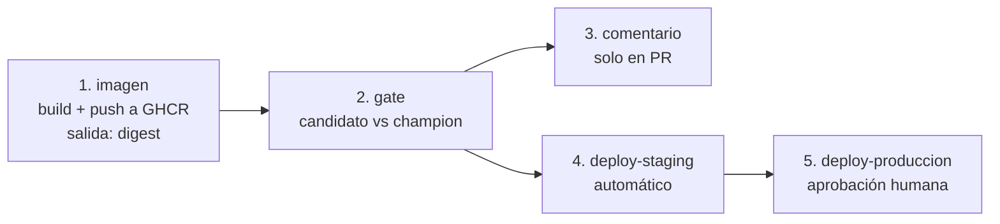

# 02 — Los tres workflows: qué corre, cuándo y por qué

> Paso 2 de 4 del recorrido. Los workflows **ya existen** en
> [`.github/workflows/`](../../.github/workflows/). Este documento los explica; no
> los reescribe. Ábrelos en un panel y lee esto en el otro.

**Qué es un workflow, antes del nombre.** Es un archivo YAML que GitHub ejecuta en una
máquina virtual limpia cada vez que ocurre algo en el repositorio (un push, un pull
request, una hora del día). Cada workflow tiene *jobs* (que corren en paralelo salvo
que uno declare `needs:` de otro) y cada job tiene *steps* (que corren en orden). Si un
step termina con un exit code distinto de cero, el job falla y se ve en rojo. Eso es
todo el mecanismo; el resto es decidir qué se ejecuta.

| Workflow | Pregunta que responde | Cuándo corre |
|---|---|---|
| [`ci.yml`](../../.github/workflows/ci.yml) | *¿el código está bien?* | cada push a `main`, cada PR, o a mano |
| [`cd.yml`](../../.github/workflows/cd.yml) | *¿esto debe atender tráfico?* | push a `main`, PR, o a mano con una versión de candidato |
| [`nightly-smoke.yml`](../../.github/workflows/nightly-smoke.yml) | *¿el caso guía sigue funcionando de punta a punta?* | todas las noches a las 02:00 de Bogotá |

Las tres preguntas son distintas y por eso son tres archivos. Meterlas en uno hace que
un fallo de lint bloquee un despliegue urgente, y que el pipeline tarde lo mismo
siempre.

**CI y CD, para quien llega sin el vocabulario.** *Integración continua* (CI) es
verificar cada cambio en cuanto se propone: lint, tipos, tests, que la imagen compile.
*Entrega continua* (CD) es llevar lo que pasó la verificación hasta un entorno donde
atiende tráfico, con un punto de decisión antes de producción. La diferencia práctica:
el CI puede fallar sin consecuencias para nadie; el CD, si falla a medias, deja
producción en un estado intermedio.

---

## 1. `ci.yml` — ¿el código está bien?

Cinco jobs, y el orden importa solo en uno.

| Job | Qué hace | Por qué está |
|---|---|---|
| `calidad` | `ruff check`, `ruff format --check`, `mypy` | el estilo y los tipos se discuten una vez, en el pipeline, no en cada revisión de PR |
| `tests` | `pytest -m "not slow and not integration"` con cobertura, en **Ubuntu y Windows** | buena parte de los estudiantes trabaja en Windows, y hay fallos que solo aparecen ahí (rutas, encoding, fin de línea) |
| `smoke` | `scripts/smoke_test.py --rapido`, con `lfs: true` | verifica que el **entorno** se puede reconstruir y que los punteros de Git LFS se resuelven |
| `secretos` | `gitleaks` con `fetch-depth: 0` | escanea **el historial completo**, no el diff |
| `imagen` | construye la imagen y la verifica. `needs: [calidad]` | es el job más caro; no se paga si el lint ya falló |

Lo mismo que corre el CI se corre en local con un comando: `make check`. Si pasa en tu
máquina, pasa en GitHub; si divergen, el hook deja de servir y la gente lo desactiva.

### El job `imagen` es el que hay que leer con cuidado

Hace tres cosas, y las dos últimas son criterios de aceptación del taller de la
sesión 5:

```yaml
- name: La imagen NO debe correr como root
  run: |
    uid=$(docker run --rm --entrypoint sh mlops-curso/api:ci -c 'id -u')
    if [ "$uid" = "0" ]; then
      echo "::error::la imagen corre como root"
      exit 1
    fi
```

```yaml
- name: La imagen debe responder /health
  run: |
    docker run -d --name api -p 8000:8000 -e TAXI_MODELO_URI=ninguno mlops-curso/api:ci
    for i in $(seq 1 40); do
      if curl -sf http://127.0.0.1:8000/health > /dev/null; then ... exit 0; fi
      sleep 1
    done
    docker logs api
    exit 1
```

Tres decisiones de diseño que conviene notar:

1. **`TAXI_MODELO_URI=ninguno`.** El CI verifica la imagen **sin** levantar MLflow. Por
   eso el servicio permite arrancar degradado: si `/health` exigiera un modelo, este job
   necesitaría un registry y dejaría de correr en un runner limpio.
2. **`docker logs api` antes del `exit 1`.** Un job que falla sin dejar el log obliga a
   reproducir el fallo en local. Cuesta dos líneas y ahorra media hora.
3. **El bucle con `sleep 1`, no un `sleep 30` fijo.** Con el sleep fijo, o se espera de
   más en cada corrida o se falla de forma intermitente cuando el runner está lento.

`push: false` y `load: true`: el CI **no publica** la imagen. Publicar es trabajo del
CD, y un PR de un fork no debe poder empujar imágenes al registro de la organización.

### El atajo tentador: un paso que no puede fallar

Cuando un paso falla y no hay tiempo de arreglarlo, la tentación es esta:

```yaml
- run: uv run pytest -q || echo "No tests configured yet"
```

Se ve inofensivo y es lo peor que le puede pasar a un pipeline: el `||` convierte
cualquier fallo en éxito, el job queda verde para siempre, y el lint puede acumular
decenas de errores sin que nadie lo note, porque nadie mira un pipeline verde. **Un
pipeline que no puede fallar es peor que no tener pipeline**: produce confianza
injustificada. En este repositorio no hay un solo `|| true` ni `|| echo`, y el taller
lo prohíbe.

---

## 2. `cd.yml` — ¿esto debe atender tráfico?

Cinco jobs. El segundo es el corazón de la sesión.



### Job 1: `imagen` — build y push por digest

GHCR es el registro de contenedores de GitHub (`ghcr.io`), el equivalente a ECR dentro
de GitHub. Publicar ahí no cuesta nada para un repositorio público y el token del
workflow ya tiene permiso.

```yaml
tags: |
  type=sha,format=long
  type=ref,event=pr
  type=ref,event=branch
```

**`latest` no aparece a propósito.** Los tags que sí se publican son legibles para
humanos, pero el deploy no los usa: usa el `digest` que `docker/build-push-action`
devuelve como salida.

```bash
referencia="${REGISTRY}/${IMAGEN}@${digest}"    # ghcr.io/org/repo/api@sha256:...
```

Ese string es la **unidad de despliegue** y viaja como salida del job hasta los dos
jobs de deploy. El de producción despliega el mismo digest que se verificó en staging,
**por construcción y no por disciplina**.

También activa `provenance: true` y `sbom: true` al publicar: una atestación de cómo se
construyó la imagen y una lista de materiales de software. Es lo que permite responder
"¿esta imagen contiene la versión vulnerable de la librería X?" sin reconstruirla. En
un PR (`push: false`) se apagan: la imagen se construye para verificar que compila y se
descarta.

### Job 2: `gate` — el paso 01, como job

Es [`scripts/promote.py`](../../scripts/promote.py) ejecutado en el runner, con el
holdout restaurado desde cache (`actions/cache` con `key: particiones-fijas-v1`: el
holdout es una partición fija, así que su cache vale entre corridas y el gate no
descarga 300 MB de la TLC en cada ejecución).

```bash
set +e
uv run taxi promote "${argumentos[@]}" 2>&1 | tee gate.log
codigo=${PIPESTATUS[0]}
set -e
case "$codigo" in
  0) echo "promovido=true"  >> "$GITHUB_OUTPUT" ;;
  1) echo "promovido=false" >> "$GITHUB_OUTPUT" ;;
  *) echo "::error::el gate no pudo medir (exit $codigo)"; echo "promovido=error" >> "$GITHUB_OUTPUT" ;;
esac
exit "$codigo"
```

Los tres exit codes del paso 01 se traducen a una salida del job (`promovido`) que
los jobs de deploy consultan, **y el exit code se propaga**: 1 y 2 hacen fallar el job.

**En un PR el gate es informativo.** Corre con `--dry-run`: evalúa, comenta el
resultado y **no escribe el tag ni mueve el alias**. Mover `@champion` desde un PR sin
aprobación es exactamente el fallo que este workflow evita.

**Lo que hay que saber de este repositorio, dicho sin adornos.** El job del gate solo
puede decidir si hay un tracking server con un `@champion` al que preguntarle, y los
runners de GitHub no pueden llegar al MLflow de tu computador. Por eso el job está
detrás de una condición:

```yaml
if: ${{ needs.imagen.result == 'success' && vars.GATE_ACTIVO == 'true' }}
env:
  MLFLOW_TRACKING_URI: ${{ secrets.MLFLOW_TRACKING_URI }}
```

Sin la variable `GATE_ACTIVO` en *Settings → Secrets and variables → Actions*, el job
se **salta** (no falla: un gate que "falla" por falta de infraestructura no distingue
"el modelo es peor" de "no pude medir"). En el repositorio del curso esa variable **no
está puesta**, así que en las corridas de `cd.yml` que ves en GitHub el gate aparece
como `skipped` y los deploys también. Lo que sí corre el gate de verdad, cada noche, es
el `nightly-smoke.yml`: levanta un MLflow **dentro del runner**, entrena, registra y
ejecuta `taxi promote`. Ese es el log donde ves el gate funcionando en Actions.

Para el taller, la consecuencia es concreta: si tu proyecto no tiene un MLflow
alcanzable desde internet (lo normal), la forma de tener el gate en un log de Actions
es la del nightly: MLflow dentro del runner, dos candidatos registrados en el mismo job
y el gate entre ambos. El [`taller.md`](taller.md) lo detalla.

### Job 3: `comentario` — métricas en el PR, sin CML

El resultado del gate se publica como comentario del PR con
[`actions/github-script`](https://github.com/actions/github-script), que ejecuta unas
veinte líneas de JavaScript contra la API de GitHub.

**Por qué no CML** (`iterative/setup-cml`), que es lo que aparece en casi todos los
tutoriales de MLOps: su última release es la **0.20.6, de octubre de 2024** (verificado
el 3 de septiembre de 2026 en su página de releases). Una acción sin mantenimiento en
el camino crítico del despliegue es deuda con fecha de vencimiento: cuando GitHub retira
un runtime de Node, la acción deja de ejecutarse y nadie la va a arreglar.

Dos detalles del job que son buenas prácticas generales:

**1. El comentario se actualiza, no se acumula.**

```js
const marcador = '<!-- gate-de-promocion -->';
const previo = comentarios.find(c => c.body && c.body.includes(marcador));
if (previo) { await github.rest.issues.updateComment({...}); }
else        { await github.rest.issues.createComment({...}); }
```

Sin el marcador, un PR con quince pushes acumula quince comentarios y nadie sabe cuál
es el vigente.

**2. Los valores entran por `env:`, nunca interpolados en el cuerpo del script.**

```yaml
env:
  GATE_PROMOVIDO: ${{ needs.gate.outputs.promovido }}
with:
  script: |
    const titulo = {...}[process.env.GATE_PROMOVIDO] || '...';
```

Interpolar `${{ ... }}` dentro de un script es la vía clásica de *script injection* en
Actions. Basta que el valor contenga una comilla o un acento grave para romper el
JavaScript; y si el valor viene del título de un PR (que cualquiera puede escribir),
para **ejecutar código con el token del workflow**. Con `env` el dato es dato y nunca
se interpreta como código. El mismo patrón se aplica al input `candidato_version` en el
job del gate.

También: el log del gate se pasa entre jobs **por un artifact**, no por una salida de
job. Las salidas tienen límite de tamaño y el log de las tablas lo pasa.

### Jobs 4 y 5: staging automático, producción aprobada

```yaml
deploy-staging:
  if: github.event_name != 'pull_request' && needs.gate.outputs.promovido == 'true'
  environment:
    name: staging
```

```yaml
deploy-produccion:
  needs: [imagen, gate, deploy-staging]
  if: github.ref == 'refs/heads/main' && needs.gate.outputs.promovido == 'true'
  environment:
    name: production
```

Los pasos de deploy son `echo`s en este repositorio, y está dicho en sus comentarios:
el comando real depende del entorno (`aws ecs run-task` con la revisión nueva, `kubectl
set image`, `docker compose up -d`). Lo que **no** es un placeholder es la estructura:
el orden de los jobs, las condiciones y de dónde sale la referencia de la imagen. El
paso 04 de esta sesión hace a mano, contra AWS, lo que aquí es un `echo`.

El paso final registra el despliegue en el resumen del job: imagen, commit, quién
aprobó y las dos instrucciones de rollback. Eso responde la pregunta que abre la
sesión (*¿qué imagen está corriendo y quién aprobó que estuviera ahí?*) con un enlace
en lugar de con una conjetura.

---

## 3. Ambientes: `dev`, `staging`, `prod`

| Ambiente | Quién despliega | Cuándo | Qué se aprueba | Datos |
|---|---|---|---|---|
| `dev` | cada estudiante, en local | continuamente | nada | muestra local |
| `staging` | el pipeline, **automático** | cada push a `main` que pase el gate | nada | copia de datos reales o sintéticos |
| `production` | el pipeline, con **aprobación humana** | tras staging, solo desde `main` | el despliegue | datos reales |

### Por qué producción se aprueba y el resto no

No porque el humano vaya a revisar el diff (no lo va a revisar). Por tres razones
concretas:

1. **Alguien asume la decisión.** El registro de aprobación es lo que convierte un
   incidente en algo revisable: hay una persona que puede explicar qué se sabía.
2. **Introduce una ventana.** Los despliegues automáticos encadenados son la forma más
   rápida de propagar un error a producción. Dos minutos de pausa alcanzan para que
   alguien diga "espera, staging está raro".
3. **Obliga a que staging signifique algo.** Si nadie mira staging, el aprobador de
   producción está firmando en blanco.

Lo que **no** justifica una aprobación manual: usarla como sustituto de tests. Si el
único filtro real es que alguien haga clic, el pipeline no tiene calidad, tiene
ceremonia.

### La barrera vive en el Environment, no en el YAML

En GitHub, un *Environment* es un objeto de configuración del repositorio (*Settings →
Environments*) al que un job se asocia con `environment: production`. Ahí se configura
quién tiene que aprobar (*Required reviewers*), cuánto esperar (*wait timer*), desde
qué ramas se puede desplegar y qué secretos ve ese job.

> La protección se configura en **Settings → Environments → production → Required
> reviewers**, no con un `if:` en el workflow.

Por qué: un `if:` en el workflow lo puede cambiar **cualquiera con permiso de push**,
en el mismo PR que introduce el cambio que debía revisarse. La configuración del
environment la controla quien administra el repositorio. **La barrera no debe estar en
el archivo que la barrera protege.**

Dos cosas que hay que saber para que esto no sea teoría:

- **Si el environment no existe, GitHub lo crea vacío al primer uso** y el job corre
  sin frenos. Declarar `environment: production` en el YAML no protege nada por sí
  solo. En el repositorio del curso, los environments los crea el instructor antes de
  la clase (está en su lista de verificación); revísalo en *Settings → Environments*.
- **Disponibilidad por plan** (verificado el 3 de septiembre de 2026 en la
  documentación de GitHub): con el plan gratuito, los environments con reglas de
  protección solo están disponibles en **repositorios públicos**. Si tu proyecto es
  privado y no tienes GitHub Pro o una organización con Team, el criterio del taller
  sobre ambientes se cumple explicando la configuración, no aplicándola.

---

## 4. `nightly-smoke.yml` — ¿el caso guía sigue funcionando?

Corre el caso guía completo todas las noches en un runner limpio: descarga datos
reales de la TLC, verifica la procedencia con hashes SHA-256, levanta MLflow con
SQLite dentro del propio runner, entrena, registra, corre el gate, genera el reporte de
drift y la model card.

Por qué existe: el material de un curso se escribe, funciona una vez en la máquina de
quien lo escribió y se degrada en silencio. Una fuente de datos que republica un
archivo, una librería que renombra una función, una ruta que solo existía en un disco.
**Nada de eso lo detecta un CI de lint y tests unitarios**, porque el fallo está en la
integración con datos y servicios reales.

Dos piezas que hacen que el nightly sirva:

- **Abre un issue si falla**, con las tres causas frecuentes ya listadas, y **no
  duplica** el issue si ya hay uno abierto con la etiqueta `nightly`. Requiere que el
  repositorio tenga los Issues activados; si no, ese paso falla y está marcado
  `continue-on-error` para que su fallo no tape al fallo real.
- **`timeout-minutes: 30`.** Un job de integración sin timeout se cuelga seis horas
  consumiendo minutos de Actions.

Un nightly que nadie mira es peor que no tenerlo: crea la sensación de estar cubierto.
El issue automático es lo que lo convierte en una señal.

Y un detalle que es una lección de la sesión 1 aplicada: `taxi train` sin banderas
**entrena pero no registra**. El nightly llama `taxi train --registrar` a propósito;
sin eso, el gate del paso siguiente responde "no hay ninguna versión registrada" con
exit 2 y el pipeline falla por una razón que no tiene nada que ver con el modelo.

---

## 5. Las versiones de las actions envejecen

Cada `uses: owner/action@vN` fija una **versión mayor** de una acción que corre sobre
un runtime de Node. GitHub retira los runtimes viejos: **Node 20 sale de los runners el 23
de septiembre de 2026**, y desde esa fecha toda action que no haya publicado una
versión sobre Node 24 deja de funcionar. Es la misma lección del lockfile de la sesión 1, en la
otra dirección: fijar la versión te protege de cambios sorpresa, pero **obliga a
actualizarla a propósito** cuando el suelo se mueve.

Versiones usadas en los tres workflows, verificadas contra las releases de cada
repositorio el **3 de septiembre de 2026**:

| Action | Versión | Para qué |
|---|---|---|
| `actions/checkout` | v7 | clonar el repositorio en el runner |
| `astral-sh/setup-uv` | v10 | instalar `uv` con cache |
| `actions/cache` | v6 | cache de las particiones fijas |
| `actions/upload-artifact` · `actions/download-artifact` | v7 · v8 | pasar el log del gate entre jobs |
| `actions/github-script` | v9 | el comentario del PR y el issue del nightly |
| `docker/setup-buildx-action` · `docker/build-push-action` · `docker/login-action` · `docker/metadata-action` | v4 · v7 · v4 · v6 | construir, etiquetar y publicar la imagen |
| `gitleaks/gitleaks-action` | v3 | escaneo de secretos |

Cómo se ve el problema cuando aparece, para reconocerlo en tu propio repositorio:
un aviso `Node.js 20 is deprecated. The following actions target Node.js 20...` al pie
del log del job, y después de la fecha de retiro, el job directamente no arranca. El
arreglo es subir la versión mayor; la variable de entorno que GitHub ofrece para
"seguir usando Node 20" es un parche con fecha de caducidad.

---

## 6. Qué haría falta para un CD completo, y no está

Honestidad sobre los límites de este repositorio:

| Falta | Por qué importa | Dónde se aprende |
|---|---|---|
| El comando real de deploy | los pasos son `echo`s; la estructura es real, la ejecución no | el paso [04](04-demo-ecr-fargate/README.md) lo hace a mano |
| Un gate que corra en el CD del repositorio | no hay un MLflow alcanzable desde los runners; el gate real corre en el nightly, con MLflow dentro del runner | [`taller.md`](taller.md), criterio 3 |
| Despliegue progresivo (canary, blue/green) | mover el 100% del tráfico de golpe es la forma más cara de descubrir un problema | el balanceador de la plataforma, o KServe |
| Smoke test real contra staging | *un deploy sin verificación posterior no es un deploy, es un deseo* | el paso existe como `echo` en `cd.yml` |
| Rollback automático por métricas | hoy el rollback es manual (mover el alias) | requiere el monitoreo de la sesión 7 conectado a un disparador |
| Firma de imágenes (`cosign`) | el digest garantiza integridad, no procedencia | complemento natural de `provenance: true` |

El orden en que se agregarían, si tuvieras que elegir: primero el smoke test real (es
el que evita desplegar algo roto), después el despliegue progresivo, y el rollback
automático al final, porque un rollback automático mal calibrado revierte despliegues
buenos y es peor que el manual.

**Siguiente paso:** [`03-de-compose-a-la-nube.md`](03-de-compose-a-la-nube.md), donde
cada pieza del stack local encuentra su equivalente en AWS.
