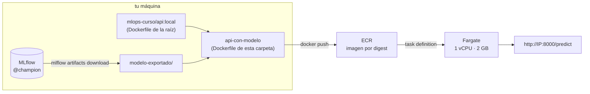

# 04 — Demo: la API con su modelo, publicada en ECR y corriendo en AWS Fargate

> Paso 4 de 4 del recorrido. **La demo la hace el instructor, grabada con
> antelación, sobre su propia cuenta.** Ningún estudiante necesita una cuenta de AWS
> para aprobar la sesión ni el taller. Este documento está escrito para que puedas
> seguirlo solo, comando por comando, el día que tengas una cuenta; hasta entonces,
> léelo con la grabación al lado. Todas las salidas marcadas como reales se obtuvieron
> ejecutando estos comandos, en este orden, en una cuenta de AWS el 3 de septiembre
> de 2026, y la cuenta quedó vacía al terminar.

**Qué vas a construir.** La misma imagen de la API de la sesión 5, con el modelo
`@champion` dentro, publicada en un registro privado de AWS y ejecutándose en un
contenedor administrado, respondiendo predicciones en una IP pública. Y después vas a
destruir todo y demostrar que no quedó nada cobrando.



**Cuánto cuesta.** Corriendo, unos 0,045 USD por hora (Fargate ARM + IP pública;
números del paso 03, leídos el 3 de septiembre de 2026). Una demo de dos horas cuesta
menos de 0,10 USD. Olvidada un mes, unos 33 USD. **El costo está en no apagarla.**

**Cuánto tarda.** Unos 20 minutos la primera vez si ya tienes la imagen de la sesión 5
construida. Los dos pasos que esperan son el push de la imagen (35 s con buena red, varios
minutos con la del salón) y el arranque de la tarea (48 s).

---

## 0. Antes de empezar

### Lo que necesitas

| Qué | Cómo se comprueba |
|---|---|
| Una cuenta de AWS y **un usuario IAM con MFA** (no root) o IAM Identity Center | `aws sts get-caller-identity` responde con tu cuenta |
| AWS CLI v2 | `aws --version` dice `aws-cli/2.x` |
| Docker corriendo | `docker version` muestra `Server:` |
| La imagen de la API construida (sesión 5) | `docker image ls mlops-curso/api:local` la lista; si no, sección 1 |
| MLflow arriba con un `@champion` (sesiones 3 y 4) | `curl -s http://127.0.0.1:5001/health` responde `OK` |
| **Un presupuesto creado** | *Billing → Budgets*: aparece uno de 5 USD con tu correo |

Sobre el presupuesto: se crea en la consola (**Billing and Cost Management → Budgets →
Create budget**, plantilla *Monthly cost budget*, 5 USD, tu correo) y tarda un minuto.
Avisa, no frena. Es el humo, no el extintor.

### Las reglas que no se negocian

- **Nunca el usuario root para la CLI.** Root no se puede acotar con políticas.
- **Ninguna credencial en un archivo de este repositorio**, ni en un `Dockerfile`, ni
  proyectada en clase. Se configuran con `aws configure` y viven en tu `~/.aws/`.
- **El teardown de la sección 11 no es opcional.** Es el último paso de la demo y el
  primero que se evalúa si alguien la hace en el taller.

### Las variables de la sesión

Todos los comandos usan estas variables. Ponlas en la terminal, no en un archivo del
repositorio. Si cierras la terminal, vuelve a exportarlas.

```bash
export AWS_REGION="us-east-1"
export AWS_ACCOUNT_ID="$(aws sts get-caller-identity --query Account --output text)"
export DEMO="taxi-demo"                    # prefijo de TODO lo que se crea: facilita encontrarlo y borrarlo
export REPO_ECR="mlops-curso/${DEMO}"
export REGISTRO="${AWS_ACCOUNT_ID}.dkr.ecr.${AWS_REGION}.amazonaws.com"

# La versión que resuelve @champion ahora mismo. Va al tag de la imagen y a su etiqueta.
export MODELO_VERSION="$(uv run python -c "from taxi.models import registry; mv = registry.version_por_alias('nyc-taxi-duration', 'champion'); print(mv.version if mv else 'desconocida')")"
export ETIQUETA="v1-modelo${MODELO_VERSION}"

# La arquitectura de la CPU de tu Docker decide la de Fargate. Un Mac con Apple Silicon
# construye imágenes arm64; una máquina Intel o AMD, amd64. Si no coinciden, la tarea
# muere al arrancar con "exec format error".
case "$(docker version --format '{{.Server.Arch}}')" in
  arm64) export ARCH_FARGATE=ARM64 ;;
  amd64) export ARCH_FARGATE=X86_64 ;;
  *) echo "arquitectura no soportada por Fargate"; ;;
esac

aws sts get-caller-identity            # ¿con qué identidad estoy operando?
echo "$MODELO_VERSION $ETIQUETA $ARCH_FARGATE"
```

**Qué debes ver:** un JSON con `UserId`, `Account` y `Arn`, y una línea como
`1 v1-modelo1 ARM64`. Si `Account` no es el que esperabas, para: estás en otra cuenta.

`aws sts get-caller-identity` es el primer comando de cualquier sesión de AWS. Operar
sin saber con qué identidad estás es la causa más común de "creé el recurso y no lo
encuentro": estaba en otra cuenta o en otra región.

---

## 1. El modelo dentro de la imagen

Por qué se hace así está en el paso 03, sección 3. En corto: en esta nube no hay un
MLflow al que el contenedor pueda pedirle el modelo, así que el modelo viaja en la
imagen. Se exporta **del registry, por alias**, y la versión queda escrita en la imagen.

### 1.1 Exportar el `@champion`

Desde la raíz del repositorio:

```bash
MLFLOW_TRACKING_URI=http://127.0.0.1:5001 uv run mlflow artifacts download \
  --artifact-uri "models:/nyc-taxi-duration@champion" \
  --dst-path sesiones/s06-cloud-cicd/04-demo-ecr-fargate/modelo-exportado

find sesiones/s06-cloud-cicd/04-demo-ecr-fargate/modelo-exportado -maxdepth 1 | sort
```

**Qué debes ver** (salida real):

```text
Downloading artifacts: 100%|██████████| 8/8 [00:00<00:00, 830.14it/s]
<raiz-del-repositorio>/sesiones/s06-cloud-cicd/04-demo-ecr-fargate/modelo-exportado
modelo-exportado/MLmodel
modelo-exportado/conda.yaml
modelo-exportado/input_example.json
modelo-exportado/model.skops
modelo-exportado/python_env.yaml
modelo-exportado/registered_model_meta
modelo-exportado/requirements.txt
modelo-exportado/serving_input_example.json
```

Son 13 MB. `MLmodel` es la descripción del modelo (con qué librería se guardó, qué
firma tiene, de qué run salió); `model.skops` es el modelo en sí. Ese directorio está en
`.gitignore`: es un artefacto, se regenera con este comando y no se versiona.

**Error esperable.** Sin `MLFLOW_TRACKING_URI`, el comando termina con un traceback
cuya última línea es:

```text
mlflow.exceptions.MlflowException: Registered Model with name=nyc-taxi-duration not found
```

Y además **crea un `mlflow.db` vacío en el directorio donde estés.** La causa: la CLI de
MLflow, sin la variable, habla con un almacén local nuevo en lugar de con tu servidor,
y ahí no hay ningún modelo. Bórralo (`rm mlflow.db`) y repite con la variable.

### 1.2 Construir la imagen de la demo

El [`Dockerfile`](Dockerfile) de esta carpeta tiene una sola instrucción de peso:
`COPY modelo-exportado /app/modelo`. Parte de la imagen de la raíz, así que esa tiene
que existir primero:

```bash
docker build -t mlops-curso/api:local .                          # la de la sesión 5, si no la tienes

docker build \
  -t "mlops-curso/api-con-modelo:${ETIQUETA}" \
  --build-arg MODELO_VERSION="${MODELO_VERSION}" \
  sesiones/s06-cloud-cicd/04-demo-ecr-fargate

docker inspect --format '{{json .Config.Labels}}' "mlops-curso/api-con-modelo:${ETIQUETA}" | jq .
docker image ls --format '{{.Repository}}:{{.Tag}}\t{{.Size}}' | grep mlops-curso
```

**Qué debes ver** (salida real):

```json
{
  "mlops-curso.modelo.nombre": "nyc-taxi-duration",
  "mlops-curso.modelo.origen": "mlflow artifacts download models:/nyc-taxi-duration@champion",
  "mlops-curso.modelo.version": "1",
  "org.opencontainers.image.title": "nyc-taxi-duration-api",
  ...
}
```

```text
mlops-curso/api-con-modelo:v1-modelo1   3.35GB
mlops-curso/api:local                   3.33GB
```

Las dos imágenes comparten todas las capas menos una: la diferencia son los 13 MB del
modelo. Eso es lo que hace barato tener una imagen por versión de modelo.

### 1.3 Probarla en local antes de subirla

Si no responde aquí, no va a responder en la nube, y en la nube depurar cuesta minutos
por intento.

```bash
docker run -d --rm --name api-modelo -p 8000:8000 "mlops-curso/api-con-modelo:${ETIQUETA}"
sleep 5
curl -s http://127.0.0.1:8000/health | jq -c .
curl -s http://127.0.0.1:8000/modelo | jq -c '{model_name, model_version, model_uri}'
curl -s -X POST http://127.0.0.1:8000/predict -H 'Content-Type: application/json' \
  -d '{"PULocationID": 43, "DOLocationID": 238, "trip_distance": 2.4, "pickup_datetime": "2023-05-15T08:30:00"}' | jq -c .
docker logs api-modelo 2>&1 | grep -i "modelo"
docker stop api-modelo
```

**Qué debes ver** (salida real):

```text
{"status":"ok","model_loaded":true,"model_name":"nyc-taxi-duration","model_version":"desconocida","model_uri":"/app/modelo","version_api":"1.0.0"}
{"model_name":"nyc-taxi-duration","model_version":"desconocida","model_uri":"/app/modelo"}
{"duration_min":14.2,"viaje_largo":false,"model_name":"nyc-taxi-duration","model_version":"desconocida","latencia_ms":5.88}
WARNING taxi.api.modelo La URI '/app/modelo' no referencia el Model Registry. Funciona, pero la prediccion no queda atribuible a una version registrada.
INFO    taxi.api.modelo Modelo cargado: uri=/app/modelo nombre=nyc-taxi-duration version=desconocida
```

Fíjate en `"model_version":"desconocida"`. **No es un bug: es el costo del patrón hecho
visible.** La API no puede preguntarle al registry qué versión es, y lo dice. La versión
está en la etiqueta de la imagen y en su tag, que es lo que auditarás en ECR. El modelo
carga en unos 4 segundos y una predicción tarda 6 milisegundos.

---

## 2. ECR: el registro de imágenes

ECR es donde AWS guarda imágenes de contenedor. Es el equivalente del registro de la
sesión 5 (GHCR) o de la caché de imágenes de tu Docker, pero dentro de tu cuenta y con
permisos de IAM.

### 2.1 Crear el repositorio

```bash
aws ecr create-repository \
  --repository-name "$REPO_ECR" \
  --region "$AWS_REGION" \
  --image-tag-mutability IMMUTABLE
```

**Qué debes ver:** un JSON con el repositorio creado. Las claves que importan (tu
cuenta será otra):

```json
{
    "repository": {
        "repositoryName": "mlops-curso/taxi-demo",
        "repositoryUri": "<cuenta>.dkr.ecr.us-east-1.amazonaws.com/mlops-curso/taxi-demo",
        "imageTagMutability": "IMMUTABLE",
        ...
    }
}
```

**`--image-tag-mutability IMMUTABLE` es la lección del paso.** Impide sobrescribir un
tag que ya existe: un `push` a un tag usado **falla** en lugar de reescribir la
historia. Es el refuerzo, a nivel de registro, de lo que la sesión 5 explicó: un tag
que se puede repuntar significa que lo que probaste puede no ser lo que corre. Valores
posibles hoy: `MUTABLE`, `IMMUTABLE`, `IMMUTABLE_WITH_EXCLUSION`,
`MUTABLE_WITH_EXCLUSION`.

Nota sobre el escaneo de vulnerabilidades: la bandera `scanOnPush` por repositorio
está **deprecada** en favor de configurarlo a nivel de registro
(`aws ecr put-registry-scanning-configuration`). No hace falta para la demo; sí para
una cuenta real.

### 2.2 Autenticarse y publicar

```bash
aws ecr get-login-password --region "$AWS_REGION" \
  | docker login --username AWS --password-stdin "$REGISTRO"

docker tag "mlops-curso/api-con-modelo:${ETIQUETA}" "${REGISTRO}/${REPO_ECR}:${ETIQUETA}"
time docker push "${REGISTRO}/${REPO_ECR}:${ETIQUETA}"
```

**Qué debes ver** (salida real): `Login Succeeded`, y después una línea por capa con
`Pushed` o `Layer already exists`, terminando con el digest:

```text
7337582cdf1b: Pushed
v1-modelo1: digest: sha256:468c198bbf705376b1100c5040472dc4f989d6f206925e26d5272918345d3f81 size: 856
push: 35 s
```

El usuario es literalmente `AWS` y el token vale **12 horas**. La contraseña entra por
`--password-stdin`: pasarla como argumento la dejaría en el historial del shell y en la
lista de procesos.

**Mide el tiempo del push y dilo en clase.** La imagen pesa 3,3 GB descomprimida; ECR
recibe las capas comprimidas, que son **892 MB** (se lee en el paso siguiente). Con una
conexión buena son 35 segundos; con la red de un salón de clase, varios minutos. Es el
primer costo real de "el modelo viaja en la imagen": cada versión de modelo es un push.
Las capas de la base ya subidas no se repiten en el segundo push, así que la segunda
versión sube en segundos.

### 2.3 El digest, que es lo que vas a desplegar

```bash
export DIGEST="$(aws ecr describe-images \
  --repository-name "$REPO_ECR" \
  --image-ids imageTag="$ETIQUETA" \
  --query 'imageDetails[0].imageDigest' --output text)"

export IMAGEN_URI="${REGISTRO}/${REPO_ECR}@${DIGEST}"
echo "$IMAGEN_URI"

aws ecr describe-images --repository-name "$REPO_ECR" \
  --query 'imageDetails[].{tag:imageTags[0],MB:imageSizeInBytes,subida:imagePushedAt}' --output table
```

**Qué debes ver** (salida real):

```text
<cuenta>.dkr.ecr.us-east-1.amazonaws.com/mlops-curso/taxi-demo@sha256:468c198bbf705376b1100c5040472dc4f989d6f206925e26d5272918345d3f81
-----------------------------------------------------------------
|    MB     |              subida                |     tag      |
+-----------+------------------------------------+--------------+
|  1639     |  2026-09-03T10:35:52.627000-05:00  |  None        |
|  892379807|  2026-09-03T10:35:52.712000-05:00  |  None        |
|  892379807|  2026-09-03T10:35:53.169000-05:00  |  v1-modelo1  |
```

Ese string, con `@sha256:…` y no con `:v1-modelo1`, es la **unidad de despliegue**. Es
exactamente lo que produce el job `imagen` de `cd.yml` como salida. El tag es para que
un humano lo lea; el digest es para que la plataforma lo ejecute.

Dos cosas de la tabla. La columna `MB` está en bytes pese al nombre: **892 MB
comprimidos** es por lo que cobra ECR. Y hay tres filas para un solo push: Docker
publica la imagen, una atestación de cómo se construyó, y un **índice** de 1,6 KB que
apunta a las dos. El tag y el digest que obtuviste señalan al índice, y eso es lo que
ECS va a resolver.

---

## 3. Permisos: el rol de ejecución

Para arrancar tu tarea, Fargate tiene que hacer dos cosas **en tu nombre**: bajar la
imagen de tu ECR privado y escribir los logs en CloudWatch. Un rol de IAM es la
identidad temporal que se lo permite. No es un rol para tu código: tu API no llama a
ninguna API de AWS, así que no lleva rol de tarea. Eso también es privilegio mínimo.

```bash
cat > "${TMPDIR:-/tmp}/${DEMO}-trust.json" <<'JSON'
{
  "Version": "2012-10-17",
  "Statement": [
    {
      "Effect": "Allow",
      "Principal": { "Service": "ecs-tasks.amazonaws.com" },
      "Action": "sts:AssumeRole"
    }
  ]
}
JSON

aws iam create-role \
  --role-name "${DEMO}-ecs-execution" \
  --assume-role-policy-document "file://${TMPDIR:-/tmp}/${DEMO}-trust.json"

aws iam attach-role-policy \
  --role-name "${DEMO}-ecs-execution" \
  --policy-arn arn:aws:iam::aws:policy/service-role/AmazonECSTaskExecutionRolePolicy

export ROL_EXEC_ARN="arn:aws:iam::${AWS_ACCOUNT_ID}:role/${DEMO}-ecs-execution"
```

**Qué debes ver:** un JSON con el rol creado (`RoleName`, `Arn`,
`AssumeRolePolicyDocument`). `attach-role-policy` no imprime nada si funciona: en la
CLI de AWS, silencio es éxito.

Dos cosas que conviene mirar:

- **La política de confianza** (*trust policy*) dice **quién puede asumir el rol**: solo
  el servicio `ecs-tasks.amazonaws.com`. Sin esto, cualquiera con permiso de `PassRole`
  podría dárselo a otra cosa.
- **La política gestionada** `AmazonECSTaskExecutionRolePolicy` dice **qué puede hacer**:
  bajar imágenes de ECR y escribir logs. Ábrela en la consola de IAM: son siete
  acciones. Es el ejemplo más limpio de privilegio mínimo de la sesión.

---

## 4. Logs: el destino de stdout

La API escribe a la salida estándar. En tu máquina eso lo lee `docker logs`; en
Fargate lo recoge CloudWatch Logs, y hay que decirle dónde guardarlo.

```bash
aws logs create-log-group --log-group-name "/ecs/${DEMO}" --region "$AWS_REGION"
aws logs put-retention-policy --log-group-name "/ecs/${DEMO}" --retention-in-days 1 --region "$AWS_REGION"
```

**Qué debes ver:** nada. Silencio es éxito. Verifícalo si quieres con
`aws logs describe-log-groups --log-group-name-prefix /ecs/`.

La retención de **un día** es deliberada: son logs de una demo. Sin política de
retención, CloudWatch guarda los logs para siempre y cobra por el almacenamiento para
siempre.

---

## 5. Red: dónde corre y quién puede entrar

Tres conceptos, y ninguno existe en Compose porque en tu máquina "la red" es
`localhost`:

| Concepto | Qué es | Análogo en Compose |
|---|---|---|
| **VPC** | tu red privada dentro de AWS. Toda cuenta trae una "por defecto" | la red interna que Compose crea para el stack |
| **Subred** | un trozo de la VPC en una zona de disponibilidad; la tarea vive en una | no hay equivalente |
| **Security group** | las reglas de qué tráfico entra y sale de la interfaz de red de la tarea | el `-p 8000:8000`, pero con "desde dónde" |

```bash
export VPC_ID="$(aws ec2 describe-vpcs --filters Name=is-default,Values=true \
  --query 'Vpcs[0].VpcId' --output text --region "$AWS_REGION")"

export SUBNET_ID="$(aws ec2 describe-subnets \
  --filters "Name=vpc-id,Values=${VPC_ID}" Name=default-for-az,Values=true \
  --query 'Subnets[0].SubnetId' --output text --region "$AWS_REGION")"

export SG_ID="$(aws ec2 create-security-group \
  --group-name "${DEMO}-sg" \
  --description "API de la demo S06: solo el puerto 8000 desde mi IP" \
  --vpc-id "$VPC_ID" --region "$AWS_REGION" \
  --query GroupId --output text)"

# Tu IP pública actual. Es lo ÚNICO que va a poder entrar.
export MI_IP="$(curl -s https://checkip.amazonaws.com)"

aws ec2 authorize-security-group-ingress \
  --group-id "$SG_ID" --protocol tcp --port 8000 --cidr "${MI_IP}/32" --region "$AWS_REGION"

echo "vpc=$VPC_ID subred=$SUBNET_ID sg=$SG_ID ip=$MI_IP"
```

**Qué debes ver:** `authorize-security-group-ingress` devuelve un JSON con
`"Return": true` y la regla creada; la última línea, algo como
`vpc=vpc-0a1b... subred=subnet-0c2d... sg=sg-0e3f... ip=190.24.x.x`.

**Por qué `/32` y no `0.0.0.0/0`.** `0.0.0.0/0` es "cualquier dirección de internet".
El [contraejemplo](../_contraejemplo-insegure-aws/) de esta sesión abre así el puerto
de una API sin autenticación con el depurador activado, y eso convierte una mala
práctica en una puerta abierta. La API de la demo no tiene autenticación, así que solo
entra **tu** IP. Si tu IP cambia (te mueves de red), la regla deja de servir y el `curl`
de la sección 8 se queda colgado: es el síntoma número uno de esta demo.

**Salida (egress)**: el security group nuevo permite todo el tráfico de salida por
defecto, y hace falta: es por donde la tarea baja la imagen de ECR.

Si `describe-vpcs` devuelve `None`, la cuenta no tiene VPC por defecto (alguien la
borró). Se recrea con `aws ec2 create-default-vpc`.

---

## 6. El cluster

Un *cluster* de ECS es un nombre bajo el que se agrupan tareas. Con Fargate no tiene
máquinas dentro y **no cuesta nada**: es un espacio de nombres.

```bash
aws ecs create-cluster --cluster-name "$DEMO" --region "$AWS_REGION" \
  --query 'cluster.{nombre:clusterName,estado:status}'
```

**Qué debes ver:** `{"nombre": "taxi-demo", "estado": "ACTIVE"}`. La primera vez que
una cuenta usa ECS, este comando además crea un *service-linked role* (un rol que ECS
necesita para gestionar interfaces de red en tu nombre). Es normal y no hay que hacer
nada.

---

## 7. La task definition: cómo correr la imagen

Una *task definition* es el documento que le dice a ECS **qué imagen ejecutar y cómo**:
cuánta CPU y memoria, qué puerto expone, qué variables de entorno lleva, dónde van los
logs, con qué rol arranca. Es el equivalente del bloque `api:` de `docker-compose.yml`.
Es **inmutable y versionada**: cada registro crea una *revisión* nueva (`taxi-demo:1`,
`taxi-demo:2`), y eso es lo que hace trivial el rollback.

```bash
cat > "${TMPDIR:-/tmp}/${DEMO}-task.json" <<JSON
{
  "family": "${DEMO}",
  "requiresCompatibilities": ["FARGATE"],
  "networkMode": "awsvpc",
  "cpu": "1024",
  "memory": "2048",
  "runtimePlatform": { "cpuArchitecture": "${ARCH_FARGATE}", "operatingSystemFamily": "LINUX" },
  "executionRoleArn": "${ROL_EXEC_ARN}",
  "containerDefinitions": [
    {
      "name": "api",
      "image": "${IMAGEN_URI}",
      "essential": true,
      "portMappings": [{ "containerPort": 8000, "protocol": "tcp" }],
      "environment": [{ "name": "TAXI_LOG_LEVEL", "value": "INFO" }],
      "logConfiguration": {
        "logDriver": "awslogs",
        "options": {
          "awslogs-group": "/ecs/${DEMO}",
          "awslogs-region": "${AWS_REGION}",
          "awslogs-stream-prefix": "api"
        }
      },
      "healthCheck": {
        "command": ["CMD-SHELL", "python -c \"import sys, urllib.request; sys.exit(0 if urllib.request.urlopen('http://127.0.0.1:8000/health', timeout=4).status == 200 else 1)\""],
        "interval": 15,
        "timeout": 5,
        "retries": 3,
        "startPeriod": 60
      }
    }
  ]
}
JSON

aws ecs register-task-definition \
  --cli-input-json "file://${TMPDIR:-/tmp}/${DEMO}-task.json" \
  --region "$AWS_REGION" \
  --query 'taskDefinition.{familia:family,revision:revision,estado:status,cpu:cpu,memoria:memory,arquitectura:runtimePlatform.cpuArchitecture}'
```

**Qué debes ver:**

```json
{
    "familia": "taxi-demo",
    "revision": 1,
    "estado": "ACTIVE",
    "cpu": "1024",
    "memoria": "2048",
    "arquitectura": "ARM64"
}
```

Cada campo, y por qué:

| Campo | Valor | Por qué |
|---|---|---|
| `image` | `…@sha256:…` | **el digest**, no un tag. La task definition acepta las dos formas; se usa la inmutable |
| `cpu` / `memory` | `1024` / `2048` (1 vCPU, 2 GB) | la API importa MLflow, XGBoost y scikit-learn: con 512 MB muere por memoria al cargar el modelo. Fargate solo acepta ciertas combinaciones; 1 vCPU admite de 2 a 8 GB |
| `networkMode` | `awsvpc` | obligatorio en Fargate: cada tarea recibe su propia interfaz de red, y por eso tiene su propia IP |
| `runtimePlatform.cpuArchitecture` | `ARM64` o `X86_64` | tiene que coincidir con la arquitectura con la que construiste la imagen. Si no, `exec format error` |
| `executionRoleArn` | el rol de la sección 3 | sin él, Fargate no puede bajar la imagen ni escribir logs |
| `portMappings.containerPort` | `8000` | el `EXPOSE` del `Dockerfile`. En `awsvpc` no hay `hostPort` distinto: el puerto del contenedor es el puerto de la IP |
| `logConfiguration` | `awslogs` al grupo de la sección 4 | sin esto, `docker logs` no existe en la nube: si la tarea muere, no sabes por qué |
| `healthCheck` | la misma comprobación en Python del `Dockerfile` | **ECS ignora el `HEALTHCHECK` del Dockerfile**: solo vigila el que está declarado aquí. Es la diferencia entre "el puerto está abierto" y "el servicio funciona": una tarea que responde 500 en todo pasaría sin este check |

Nota sobre el `healthCheck`: es Python y no `curl` por la misma razón de la sesión 5:
`curl` no existe en la imagen `python:*-slim`.

---

## 8. Lanzar la tarea y probarla

### 8.1 Lanzar

La configuración de red va en un archivo JSON, igual que la task definition. La CLI
también acepta una sintaxis abreviada en una sola línea, pero con esta estructura (un
objeto que contiene listas) el parser de la CLI la rechaza; el error está en la sección
12. JSON en un archivo es más largo y siempre funciona.

```bash
cat > "${TMPDIR:-/tmp}/${DEMO}-red.json" <<JSON
{
  "awsvpcConfiguration": {
    "subnets": ["${SUBNET_ID}"],
    "securityGroups": ["${SG_ID}"],
    "assignPublicIp": "ENABLED"
  }
}
JSON

export TASK_ARN="$(aws ecs run-task \
  --cluster "$DEMO" \
  --launch-type FARGATE \
  --task-definition "$DEMO" \
  --network-configuration "file://${TMPDIR:-/tmp}/${DEMO}-red.json" \
  --region "$AWS_REGION" \
  --query 'tasks[0].taskArn' --output text)"
echo "$TASK_ARN"

# Espera a que la tarea llegue a RUNNING. Incluye bajar la imagen: mide cuánto tarda.
time aws ecs wait tasks-running --cluster "$DEMO" --tasks "$TASK_ARN" --region "$AWS_REGION"
```

**Qué debes ver** (salida real): el ARN de la tarea y, tras unos 48 segundos, el `wait`
termina sin imprimir nada. Silencio es éxito.

```text
arn:aws:ecs:us-east-1:<cuenta>:task/taxi-demo/bbe49c2d767440c2a11afe1bf8fabbcc
wait tasks-running: 48 s
```

**Compara ese tiempo con el `docker run` local de la sección 1.3**: la diferencia es lo
que tarda Fargate en conseguir una máquina y bajar 892 MB de imagen. Es el precio de que
la imagen viaje con el modelo dentro.

`assignPublicIp=ENABLED` hace dos cosas: le da a la tarea una IP a la que puedas llegar,
y le da salida a internet para bajar la imagen de ECR (en la subred por defecto no hay
otro camino).

### 8.2 Encontrar la IP

La tarea no tiene un nombre DNS: tiene una interfaz de red con una IP pública. Se
llega en dos saltos.

```bash
export ENI_ID="$(aws ecs describe-tasks --cluster "$DEMO" --tasks "$TASK_ARN" --region "$AWS_REGION" \
  --query "tasks[0].attachments[0].details[?name=='networkInterfaceId'].value | [0]" --output text)"

export IP="$(aws ec2 describe-network-interfaces --network-interface-ids "$ENI_ID" --region "$AWS_REGION" \
  --query 'NetworkInterfaces[0].Association.PublicIp' --output text)"

echo "http://${IP}:8000"
```

**Qué debes ver:** una URL como `http://44.203.102.x:8000` (la IP es distinta en cada
lanzamiento: la tarea no tiene una dirección estable, y eso es una de las cosas que
resuelve un balanceador).

### 8.3 Probar

```bash
# La API tarda unos segundos en cargar el modelo después de que la tarea esté RUNNING.
for i in $(seq 1 30); do
  curl -sf --max-time 3 "http://${IP}:8000/health" >/dev/null && { echo "responde en ${i} intentos"; break; }
  sleep 2
done

curl -s "http://${IP}:8000/health" | jq -c .
curl -s "http://${IP}:8000/modelo" | jq -c '{model_name, model_version, model_uri}'
curl -s -X POST "http://${IP}:8000/predict" -H 'Content-Type: application/json' \
  -d '{"PULocationID": 43, "DOLocationID": 238, "trip_distance": 2.4, "pickup_datetime": "2023-05-15T08:30:00"}' | jq -c .

# El estado de salud que ve ECS (el healthCheck de la task definition)
aws ecs describe-tasks --cluster "$DEMO" --tasks "$TASK_ARN" --region "$AWS_REGION" \
  --query 'tasks[0].{estado:lastStatus,salud:healthStatus,cpu:cpu,memoria:memory}'
```

**Qué debes ver** (salida real): las mismas tres respuestas de la sección 1.3, pero
desde una IP pública, y `"salud": "HEALTHY"` en la última. Abre también
`http://IP:8000/docs` en el navegador: es la documentación interactiva de FastAPI, la
misma que en local.

```text
responde en 2 intentos, 2 s tras RUNNING
{"status":"ok","model_loaded":true,"model_name":"nyc-taxi-duration","model_version":"desconocida","model_uri":"/app/modelo","version_api":"1.0.0"}
{"model_name":"nyc-taxi-duration","model_version":"desconocida","model_uri":"/app/modelo"}
{"duration_min":14.2,"viaje_largo":false,"model_name":"nyc-taxi-duration","model_version":"desconocida","latencia_ms":3.455}
docs: HTTP 200
{
    "estado": "RUNNING",
    "salud": "HEALTHY",
    "cpu": "1024",
    "memoria": "2048"
}
```

El `healthStatus` empieza en `UNKNOWN` y pasa a `HEALTHY` cuando el primer check de la
task definition responde; puede tardar hasta un minuto después de que la API ya
contesta.

**La predicción es la misma que en tu máquina (14,2 minutos).** Es el argumento
completo de la sesión 5 comprobado en la nube: mismo digest, mismos bytes, misma
respuesta. Lo único que cambió es dónde corre.

### 8.4 Ver los logs

```bash
aws logs tail "/ecs/${DEMO}" --since 10m --region "$AWS_REGION"
```

**Qué debes ver** (salida real, recortada): las mismas líneas que `docker logs`
mostraba en local, con el prefijo del stream y la tarea delante:

```text
2026-09-03T15:38:17 api/api/bbe49c2d... WARNING taxi.api.modelo La URI '/app/modelo' no referencia el Model Registry. Funciona, pero la prediccion no queda atribuible a una version registrada.
2026-09-03T15:38:17 api/api/bbe49c2d... INFO taxi.api.modelo Modelo cargado: uri=/app/modelo nombre=nyc-taxi-duration version=desconocida
2026-09-03T15:38:18 api/api/bbe49c2d... INFO:     38.225.57.173:53054 - "POST /predict HTTP/1.1" 200 OK
```

Si la tarea hubiera muerto al arrancar, **aquí** estaría el motivo. En la consola:
*CloudWatch → Log groups → /ecs/taxi-demo*.

---

## 9. Leer el costo en la consola

**No es un anexo: es parte de la demo.** En la consola, **Billing and Cost Management →
Cost Explorer**, agrupar por servicio. El uso de hoy tarda hasta 24 horas en aparecer,
así que en clase se lee el de la grabación del día anterior.

Las preguntas que hay que responder mirando la pantalla, no el material:

1. ¿Qué servicios aparecen? (Fargate aparece como *EC2 Container Service* o *ECS*; la
   IP pública, bajo *VPC*; el almacenamiento, bajo *ECR*.)
2. **¿Qué se sigue cobrando si nadie manda un request?** La tarea y su IP, por segundo.
   El repositorio, por GB. Los logs, casi nada. El cluster y las task definitions, nada.
3. ¿Cuánto costaría dejar esto un mes? Multiplica lo que ves por hora por 730.

Los precios de lista, con fecha, están en el paso 03, sección 5. Si lo que ves en la
consola no cuadra con ellos, gana la consola.

---

## 10. Desplegar una versión nueva, y volver atrás

Supón que el gate del paso 01 promovió una versión nueva del modelo. El camino es
**exactamente el mismo** de las secciones 1 y 2 con otra etiqueta, y después una
revisión nueva de la task definition:

```bash
# 1. Exportar el nuevo @champion, construir y publicar (secciones 1 y 2, con ETIQUETA=v2-modeloN)
# 2. Obtener su digest en IMAGEN_URI_V2
# 3. La misma task definition con la imagen nueva -> revisión 2
sed "s|${IMAGEN_URI}|${IMAGEN_URI_V2}|" "${TMPDIR:-/tmp}/${DEMO}-task.json" > "${TMPDIR:-/tmp}/${DEMO}-task-v2.json"
aws ecs register-task-definition --cli-input-json "file://${TMPDIR:-/tmp}/${DEMO}-task-v2.json" \
  --region "$AWS_REGION" --query 'taskDefinition.revision'      # -> 2

# 4. Lanzar la revisión 2 (mismo run-task con --task-definition "${DEMO}:2"), esperar HEALTHY,
#    y solo entonces detener la tarea de la revisión 1:
aws ecs stop-task --cluster "$DEMO" --task "$TASK_ARN" --reason "reemplazada por la revision 2" --region "$AWS_REGION"
```

**El rollback es el mismo `run-task` con `--task-definition "${DEMO}:1"`.** La revisión 1
sigue existiendo, apunta al digest anterior, y ese digest sigue en ECR. Desplegar y
revertir son la misma operación con distinto argumento, igual que promover y revertir
un modelo son `asignar_alias` con distinta versión.

Lo que aquí es manual (esperar a que la nueva esté sana y luego apagar la vieja) es lo
que hace solo un *service* de ECS con un balanceador delante: el despliegue sin corte.
Es el paso siguiente, y no está en la demo.

---

## 11. Teardown: la última operación del día

```bash
DEMO="$DEMO" bash sesiones/s06-cloud-cicd/04-demo-ecr-fargate/teardown.sh --dry-run   # qué borraría
DEMO="$DEMO" bash sesiones/s06-cloud-cicd/04-demo-ecr-fargate/teardown.sh             # borrarlo
```

El [script](teardown.sh) está comentado sección por sección y borra en el orden
inverso al de creación: tareas, cluster, task definitions, log group, security group
(con reintentos, porque la interfaz de red tarda en soltarse), rol, y al final el
repositorio de ECR con sus imágenes. Es **idempotente** (correrlo dos veces no falla) y
**termina verificando**: la sección 8 de su salida lista lo que quedó.

**Qué debes ver** al final (salida real; el borrado completo tardó 65 segundos y el
security group se soltó al primer intento):

```text
========================================================================
8. Verificación: qué queda en la cuenta (región us-east-1)
========================================================================
-- Clusters de ECS ----------------------------------------------------
-- Task definitions activas ------------------------------------------
-- Security groups de la demo ----------------------------------------
-- Log groups /ecs/ --------------------------------------------------
-- Repositorios de ECR -----------------------------------------------
-- Roles IAM de la demo ----------------------------------------------
```

Seis listas vacías. **Esa salida es la evidencia**, no la frase "corrí el teardown".
Si la sección 5 avisa que el security group todavía tiene una interfaz asociada, espera
dos minutos y vuelve a correr el script: es idempotente. Una segunda pasada sobre la
cuenta ya vacía imprime `--  no hay ...` en cada sección y termina con exit 0.

Y al día siguiente, la verificación que de verdad cierra el ciclo: Cost Explorer con la
curva en cero. El propio script imprime el comando de `aws ce get-cost-and-usage` con
las fechas calculadas en Python, porque `date -d` no existe en macOS.

Por qué se enseña como ejercicio y no como nota al pie: en un proyecto real, el
teardown es lo que hace posible experimentar. Un equipo que no sabe destruir su
infraestructura no crea entornos de prueba, y sin entornos de prueba prueba en
producción.

---

## 12. Errores esperables

| Lo que ves | Causa | Arreglo |
|---|---|---|
| `Unable to locate credentials` | la CLI no tiene credenciales configuradas | `aws configure` con las de tu usuario IAM |
| `Error parsing parameter '--network-configuration': Expected: ',', received: ']'` | se pasó la red con la sintaxis abreviada `awsvpcConfiguration={subnets=[...],...}`; el parser de la CLI no la acepta con esta estructura | pásala en un archivo JSON con `file://`, como en la sección 8.1 |
| `denied: Your authorization token has expired` al hacer push | el token de ECR dura 12 h | repite el `get-login-password \| docker login` |
| `tag invalid: The image tag 'v1-modelo1' already exists in the 'mlops-curso/taxi-demo' repository and cannot be overwritten` | el repositorio es `IMMUTABLE` y el tag ya existe | usa otra etiqueta. **Es la protección funcionando** |
| la tarea pasa a `STOPPED` con `CannotPullContainerError` | el rol de ejecución no tiene la política, o la tarea no tiene salida a internet (`assignPublicIp=DISABLED`) | revisa la sección 3 y el `assignPublicIp` |
| `STOPPED` con `exec /opt/venv/bin/uvicorn: exec format error` en los logs | la imagen es de una arquitectura y la task definition de otra | `runtimePlatform.cpuArchitecture` debe coincidir con `docker version --format '{{.Server.Arch}}'` |
| `STOPPED` con `ResourceInitializationError: failed to validate logger args ... log group does not exist` | falta el log group de la sección 4 | créalo y vuelve a lanzar |
| `InvalidParameterException: No Fargate configuration exists for given values` | combinación de `cpu` y `memory` no válida | 1 vCPU admite 2, 3, 4, 5, 6, 7 u 8 GB |
| la tarea está `RUNNING` y `HEALTHY` pero `curl` se queda colgado | el security group no deja entrar a tu IP (cambió), o el puerto no es 8000 | `curl -s https://checkip.amazonaws.com` y compara con la regla; añade tu IP nueva |
| `RUNNING` pero `UNHEALTHY` y luego `STOPPED` | la API no respondió `/health` en el `startPeriod` (60 s): poca memoria, o el modelo no carga | `aws logs tail /ecs/taxi-demo`; sube `memory` a `3072` |
| `DependencyViolation` al borrar el security group | la interfaz de red de la tarea detenida todavía no se soltó | el teardown reintenta; si no, espera dos minutos y repítelo |
| `RepositoryNotEmptyException` al borrar el repositorio | tiene imágenes | `--force` (el teardown ya lo hace) |
| `DeleteConflict` al borrar el rol | tiene una política adjunta | desasociarla primero (el teardown ya lo hace) |

Cómo leer un fallo de tarea en general: `aws ecs describe-tasks` tiene un campo
`stoppedReason` en la tarea y otro `reason` por contenedor. Ahí está la causa, casi
siempre en una línea.

---

## 13. Lo que esta demo no es, y qué sigue

- **No es producción.** Sin HTTPS, sin dominio, sin autenticación, en la VPC por
  defecto, con una IP que cambia si la tarea se reemplaza.
- **El siguiente paso real** es un *service* de ECS con un *Application Load Balancer*
  delante: da HTTPS con certificado, una dirección estable y despliegue sin corte.
  Agrega tres recursos (target group, balanceador, listener) y unos 16 USD al mes por
  el balanceador exista o no tráfico. AWS empaqueta exactamente eso en **ECS Express
  Mode** (una llamada, dos roles), que es lo que recomienda hoy a quien venía de App
  Runner.
- **Infraestructura como código.** Todo lo de esta demo son unas 200 líneas de
  Terraform o CDK, y el teardown pasa a ser un solo comando cuyo resultado se puede
  revisar en un PR.
- **El modelo de vuelta al registry.** Cuando el servicio y MLflow viven en la misma
  red privada, la imagen vuelve a ser la de la sesión 5 (`TAXI_MODELO_URI=models:/...@champion`)
  y cambiar de modelo vuelve a ser mover un alias.

---

## 14. Referencias

Verificadas el **3 de septiembre de 2026** contra la documentación oficial. Los
comandos y los precios cambian: revisa antes de cada cohorte.

- Amazon ECS: [`register-task-definition`](https://docs.aws.amazon.com/cli/latest/reference/ecs/register-task-definition.html) · [`run-task`](https://docs.aws.amazon.com/cli/latest/reference/ecs/run-task.html) · [rol de ejecución de tareas](https://docs.aws.amazon.com/AmazonECS/latest/developerguide/task_execution_IAM_role.html) · [red de tareas en Fargate](https://docs.aws.amazon.com/AmazonECS/latest/developerguide/fargate-task-networking.html) · [precios de Fargate](https://aws.amazon.com/fargate/pricing/)
- Amazon ECR: [`create-repository`](https://docs.aws.amazon.com/cli/latest/reference/ecr/create-repository.html) · [precios](https://aws.amazon.com/ecr/pricing/)
- Amazon VPC: [precios (IP pública IPv4)](https://aws.amazon.com/vpc/pricing/)
- AWS App Runner: [aviso de disponibilidad](https://docs.aws.amazon.com/apprunner/latest/dg/apprunner-availability-change.html) (cerrado a clientes nuevos; recomienda ECS Express Mode)
- MLflow: [`mlflow artifacts download`](https://mlflow.org/docs/latest/cli.html#mlflow-artifacts-download) · [Model Registry: aliases](https://mlflow.org/docs/latest/ml/model-registry/)
- Equivalentes: [Google Cloud Run](https://cloud.google.com/run/docs) · [Azure Container Apps](https://learn.microsoft.com/en-us/azure/container-apps/)
