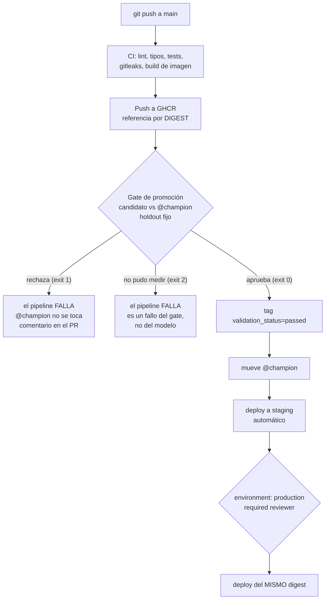

# Sesión 6 — Cloud y CI/CD: automatizar el despliegue y decidir qué se despliega

> Pregunta que responde la sesión: **¿cómo dejo de desplegar a mano, y cómo evito que
> el pipeline automatice el despliegue de un modelo peor que el que ya está
> sirviendo?**

## Cómo funciona esta sesión

Léelo antes de nada, porque cambia lo que hay que preparar:

- **Local es el default y nada evaluable depende de la nube.** El taller se aprueba
  con Docker Compose. Si AWS se cae, si la cuenta se bloquea o si alguien no quiere
  crear una cuenta, la sesión y su evaluación siguen intactas.
- **AWS es demo del instructor + laboratorio opcional guiado.** La demo la hace el
  instructor sobre una cuenta del curso. El laboratorio es voluntario, con un IAM
  user por equipo y política mínima.
- **`AWS Budgets` con alarma en 10 USD** sobre la cuenta del curso, configurado antes
  de la sesión.
- **`teardown.sh` es obligatorio** al cerrar el laboratorio. No es limpieza
  opcional: es parte del ejercicio, porque en la nube la última operación del día es
  la que decide la factura del mes.
- **La demo se graba con antelación** y se proyecta si la consola falla en vivo.

Por qué así, dicho sin adornos: una sesión que depende de que la consola de AWS
responda en el minuto 40 de una clase de cuatro horas es una sesión frágil. Y una
evaluación que exige una tarjeta de crédito excluye estudiantes.

## Objetivos

Al terminar la sesión, cada estudiante puede:

1. **Medir** cuánto tarda un despliegue manual y **enumerar** en qué pasos exactos
   puede equivocarse.
2. **Explicar** qué imagen está corriendo en un entorno y quién la aprobó, apoyándose
   en el digest y en el registro de despliegues.
3. **Traducir** una necesidad de infraestructura (registro de imágenes, cómputo,
   artifact store, backend store) a un servicio de AWS **y** a su equivalente local,
   y **justificar** por qué el código no cambia entre los dos.
4. **Leer** los tres workflows del repositorio (`ci.yml`, `cd.yml`,
   `nightly-smoke.yml`) y **decir qué pregunta responde cada job**.
5. **Enunciar los cinco pasos del gate de promoción** y **demostrar** que rechaza un
   candidato peor y acepta uno mejor, con la evidencia en el log del workflow.
6. **Ejecutar un rollback** de modelo y **explicar** por qué tarda menos de un segundo
   y no requiere reconstruir nada.
7. **Aplicar** el principio de privilegio mínimo a un rol de despliegue y **explicar**
   por qué un secreto en la imagen no se borra agregando un `RUN rm`.
8. **Destruir** todo lo que creó en la nube y **verificar** con un comando que no
   quedó nada facturando.

## Contenidos

| Ruta | Qué hay |
|---|---|
| [`cicd.md`](cicd.md) | Los tres workflows del repositorio, ambientes `dev`/`staging`/`prod`, y **el gate de promoción** |
| [`guia-aws.md`](guia-aws.md) | ECR + App Runner + S3 + RDS paso a paso, con la política IAM mínima |
| [`scripts/teardown.sh`](scripts/teardown.sh) | Destruye todo lo creado en el laboratorio. Obligatorio |
| [`scripts/politica-iam-minima.json`](scripts/politica-iam-minima.json) | Plantilla de política para el IAM user de un equipo |
| [`scripts/presupuesto.json`](scripts/presupuesto.json) · [`scripts/presupuesto-notificaciones.json`](scripts/presupuesto-notificaciones.json) | El presupuesto de 10 USD, para `aws budgets create-budget` |
| [`taller.md`](taller.md) | Enunciado del taller, con criterios de aceptación medibles |
| [`_soluciones/`](_soluciones/) | Soluciones de referencia. No publicar antes del taller |
| [`_contraejemplo-insegure-aws/`](_contraejemplo-insegure-aws/) | **Contraejemplo de seguridad documentado.** No copiar |

Los workflows **no viven aquí**: viven en
[`.github/workflows/`](../../.github/workflows/) y esta sesión los documenta. Es
deliberado — un workflow que se copia a una carpeta de sesión deja de ser el que
corre.

---

## El recorrido

El grueso de esta sesión no está en este README: está en
[`cicd.md`](cicd.md), que es donde viven los tres workflows y el gate. Este archivo
da el porqué y el contexto de la nube. El orden:

| # | Se abre | Para qué |
|---|---|---|
| 1 | sección 1 de este README | desplegar a mano, y lo que pasa al automatizar el despliegue de algo peor |
| 2 | [`cicd.md`](cicd.md), la parte del gate, con [`scripts/promote.py`](../../scripts/promote.py) | las tres preguntas del gate y por qué la política se escribe como función pura |
| 3 | [`scripts/promote.py`](../../scripts/promote.py) en vivo, y la sección 6 de este README | el gate rechazando y aceptando de verdad, con sus exit codes, el tag antes del alias, y el rollback en una imagen |
| 4 | [`cicd.md`](cicd.md), los tres workflows, con [`.github/workflows/`](../../.github/workflows/) | qué corre en cada uno, y por qué no son uno solo |
| 5 | [`cicd.md`](cicd.md), la parte de ambientes | `dev` / `staging` / `prod`, la aprobación manual y el comentario automático en el PR |
| 6 | secciones 2 y 3 de este README, y [`guia-aws.md`](guia-aws.md) | la traducción local → nube, IAM con privilegio mínimo, y la demo del instructor |
| 7 | secciones 4 y 5 de este README, con [`scripts/teardown.sh`](scripts/teardown.sh) | leer el costo en la consola, y destruir todo lo creado |
| 8 | [`taller.md`](taller.md) | el entregable, que se aprueba **sin tocar la nube** |

**El gate va antes de los workflows.** Un workflow es la mecánica; el gate es la
decisión. Enseñar primero el YAML produce estudiantes que saben automatizar una
promoción que no deberían estar haciendo.

**El paso 7 no es opcional.** En la nube la última operación del día es la que decide
la factura del mes, y `teardown.sh` es parte del ejercicio, no limpieza.

---

## 1. El dolor: desplegar a mano, y automatizar el despliegue de algo peor

No se abre la consola de AWS hasta el final de este bloque.

### Acto 1 — Los doce minutos y las tres oportunidades de error

El instructor despliega una versión nueva a mano, en vivo, cronómetro a la vista:

```bash
docker build -t mi-api:v2 .                       # 1
docker tag mi-api:v2 registro/mi-api:latest       # 2
docker push registro/mi-api:latest                # 3
# entrar al servidor, actualizar el servicio, reiniciar  # 4
curl -fsS https://.../health                      # 5
```

**Mide el tiempo real en clase.** No hay una cifra en este material a propósito:
depende de la red del salón, del tamaño de la imagen y de si la capa base está en
cache. Lo que importa no es el número, es que la clase lo vea y lo compare con lo que
tarda el `git push` del acto siguiente.

Dónde puede salir mal, en los cinco pasos:

| Paso | Error plausible | Cómo se manifiesta |
|---|---|---|
| 1 | construir con cambios sin comitear | la imagen contiene código que no está en ningún commit |
| 2 | etiquetar la imagen equivocada | se despliega la build anterior, y los logs dicen lo mismo |
| 3 | olvidar el push, o empujar a otro registro | el servidor arranca la imagen vieja sin avisar |
| 4 | actualizar un servicio y no el otro | mitad del tráfico en cada versión |
| 5 | no verificar | el despliegue "terminó" y el servicio está caído |

Y la pregunta que cierra el acto:

> **¿Qué imagen exacta está corriendo ahora en producción, y quién aprobó que
> estuviera ahí?**

Con este procedimiento no hay respuesta. `latest` es un puntero mutable: no dice qué
bytes son. Y no existe registro de la decisión, solo el historial de bash de alguien.

### Acto 2 — El pipeline "terminó bien" y promovió un modelo peor

Segundo acto, y es el que da sentido a la sesión.

El repositorio original tenía esto en `model_registry.py`, ejecutado **en cada
corrida del entrenamiento**:

```python
client.transition_model_version_stage(
    name=model_name,
    version=version,
    stage="Production",
    archive_existing_versions=True,  # y archiva al que estaba sirviendo
)
```

Léelo despacio. Un modelo llegaba a producción **por el solo hecho de que el
entrenamiento no lanzó excepciones**. Sin holdout, sin comparar con el modelo actual,
sin posibilidad de rechazo, y archivando al anterior. Con una API deprecada, además.

Demostración en vivo: entrenar con menos datos o con hiperparámetros peores a
propósito, correr el pipeline y ver que **el modelo peor llega a producción con el
pipeline en verde**.

La conclusión que hay que dejar escrita en el tablero:

> **Un pipeline verde significa "el proceso corrió", no "el resultado es bueno".**
> CI/CD automatiza la *ejecución* de una decisión. Si la decisión no está codificada
> en ninguna parte, lo que se automatiza es no decidir.

Lo que falta es un **gate**: un punto donde se comparan candidato y champion sobre un
holdout fijo y el resultado puede ser "no". Es el corazón de la sesión y está en
[`cicd.md`](cicd.md#el-gate-de-promoción).

---

## 2. Lo que la nube resuelve, y su equivalente local

Esta tabla es la que hace la sesión transferible. Las columnas de la izquierda son
**necesidades**; las de la derecha, implementaciones.

| Necesidad | AWS | Local (Compose) | Por qué el código no cambia |
|---|---|---|---|
| Registro de imágenes | **ECR** | registry local / imagen construida en el host | `docker` habla el mismo protocolo con los dos |
| Cómputo del contenedor | **App Runner** | `docker compose` | el contenedor es el contrato; la plataforma solo lo ejecuta |
| Artifact store de MLflow | **S3** | **MinIO** | MinIO habla el protocolo S3: cambia `MLFLOW_S3_ENDPOINT_URL`, no el código |
| Backend store de MLflow | **RDS Postgres** | Postgres en Compose | misma cadena de conexión `postgresql://`, distinto host |
| Secretos | **Secrets Manager** / SSM | `.env` fuera de git | el código lee variables de entorno en los dos casos |
| Métricas | CloudWatch (o Prometheus gestionado) | Prometheus + Grafana | el endpoint `/metrics` es el mismo |

**MinIO es la pieza clave del diseño de esta sesión.** Porque habla el protocolo S3,
el `docker-compose.yml` local y el despliegue en AWS ejercitan exactamente el mismo
código: la diferencia es un endpoint y unas credenciales. Eso es lo que permite que el
taller sea local y que la nube sea opcional sin que se pierda nada conceptual.

### Por qué App Runner y no ECS/Fargate ni EKS

**Criterio: cuánta ceremonia hay entre "tengo una imagen" y "hay una URL que
responde".** En cuatro horas, esa ceremonia se paga con el tiempo de los conceptos.

| Opción | Qué hay que crear antes de tener una URL | Cuándo sí conviene |
|---|---|---|
| **App Runner** | el servicio, y un rol de acceso a ECR | prototipos, servicios HTTP simples, cursos |
| ECS + Fargate | cluster, task definition, service, target group, ALB, listener, security groups, subredes | control fino de red, sidecars, varios contenedores por tarea |
| EKS | todo lo de ECS más el clúster de Kubernetes | la organización ya vive en Kubernetes |
| Lambda + API Gateway | función, permisos, API, integración | tráfico intermitente y modelos pequeños; el *cold start* y el límite de tamaño del paquete duelen con modelos de ML |

App Runner se elige por **pedagogía, no por superioridad técnica**. Sus límites hay
que decirlos: menos control de red que ECS, no está en todas las regiones, y el modelo
de costo cobra por la memoria provisionada aunque no haya tráfico (ver sección 4). En una
empresa con requisitos de red, ECS o EKS son la respuesta correcta y la traducción es
directa, porque **la unidad sigue siendo la imagen referenciada por digest**.

### GCP y Azure, para el que trabaje ahí

| Necesidad | AWS | GCP | Azure |
|---|---|---|---|
| Registro de imágenes | ECR | Artifact Registry | Azure Container Registry |
| Cómputo del contenedor | App Runner | Cloud Run | Container Apps |
| Artifact store | S3 | Cloud Storage | Blob Storage |
| Backend store | RDS Postgres | Cloud SQL | Azure Database for PostgreSQL |
| Secretos | Secrets Manager | Secret Manager | Key Vault |

La fila de cómputo es la que importa: **Cloud Run y Container Apps son el equivalente
directo de App Runner**. Si el ejercicio se hace en GCP, cambian los comandos y no
cambia ni una idea.

---

## 3. IAM y secretos: privilegio mínimo, en concreto

### Los tres principios, con su falla asociada

| Principio | Qué significa aquí | Qué pasa si se ignora |
|---|---|---|
| **Privilegio mínimo** | el rol del servicio puede *leer* de un repositorio de ECR y nada más | una credencial filtrada da acceso a toda la cuenta en lugar de a un repositorio |
| **Identidad, no llaves** | el servicio asume un **rol**; no lleva `AWS_ACCESS_KEY_ID` dentro | una llave de larga vida no expira y suele acabar en un repositorio |
| **Los secretos son referencias** | la task lee de Secrets Manager en el arranque | un secreto en la imagen es público en cuanto la imagen lo es |

### Un secreto en la imagen no se borra

Esto merece su propio párrafo porque es contraintuitivo:

```dockerfile
COPY .env .            # capa N: el secreto entra
RUN rm .env            # capa N+1: el secreto "se borra"
```

**El secreto sigue ahí.** Una imagen es una pila de capas inmutables; la capa N existe
y cualquiera con la imagen puede extraerla. Lo mismo con `--build-arg` para pasar un
token: queda en los metadatos de la imagen y lo ve `docker history`.

Las tres defensas, en orden de preferencia: (1) el secreto **no entra** al build
context — ese es el trabajo del [`.dockerignore`](../../.dockerignore); (2) si hace
falta un secreto *durante* el build, `RUN --mount=type=secret` de BuildKit, que no
deja capa; (3) en runtime, variables de entorno inyectadas por la plataforma desde
Secrets Manager.

### Lo que ya está automatizado en este repositorio

`gitleaks` corre en cada PR (job `secretos` de
[`ci.yml`](../../.github/workflows/ci.yml)) y escanea **el historial completo**
(`fetch-depth: 0`), no solo el diff. Es importante entender por qué: un secreto
comiteado y borrado en el commit siguiente **sigue en el historial de git**, y el
`git push --force` no lo saca de los forks ni de las copias que ya se clonaron.

La regla operativa: **un secreto que llegó a un repositorio remoto está comprometido y
hay que rotarlo.** Borrar el commit no es una mitigación, es una limpieza cosmética.

Plantilla de política mínima para el IAM user de un equipo:
[`scripts/politica-iam-minima.json`](scripts/politica-iam-minima.json). Cómo se aplica:
[`guia-aws.md`](guia-aws.md#2-el-iam-user-del-equipo).

---

## 4. El costo se lee en la consola

**No es un anexo: es parte del aprendizaje.** Un ingeniero de ML que no sabe qué cuesta
lo que despliega toma malas decisiones de arquitectura con total confianza.

Ejercicio del laboratorio, 8 minutos, en la consola:

1. Abrir **Billing and Cost Management → Cost Explorer**, agrupar por servicio.
2. Encontrar la línea de App Runner y la de RDS. **Anotar los números reales.**
3. Responder por escrito: **¿qué se sigue cobrando si nadie manda un request?**
4. Comparar con el costo de la alternativa local: cero, más la electricidad.

Las dos dimensiones del cobro de App Runner que hay que entender —los números
exactos se leen en la [página de precios](https://aws.amazon.com/apprunner/pricing/)
y en la consola, no en este README—:

- **Memoria provisionada**, que se cobra mientras el servicio exista, con tráfico o
  sin él. Es la trampa clásica: un servicio olvidado no está gratis por estar
  inactivo.
- **CPU y memoria activas**, mientras el servicio atiende requests.

Por eso App Runner tiene `pause-service`, y por eso el `teardown.sh` **borra** el
servicio en lugar de pausarlo: un servicio pausado sigue existiendo, y lo que hay que
aprender es a dejar la cuenta como estaba.

RDS es la sorpresa más común: una instancia `db.t3.micro` cobra por hora **de
existencia**, no de uso, más el almacenamiento y los backups automáticos. Una
instancia olvidada de un laboratorio de clase es la causa número uno de facturas
inesperadas en cursos de nube.

### El presupuesto, antes del laboratorio

`AWS Budgets` con alarma en **10 USD**, configurado por el instructor sobre la cuenta
del curso:

```bash
aws budgets create-budget \
  --account-id "$AWS_ACCOUNT_ID" \
  --budget file://sesiones/s06-cloud-cicd/scripts/presupuesto.json \
  --notifications-with-subscribers file://sesiones/s06-cloud-cicd/scripts/presupuesto-notificaciones.json
```

Detalle importante que hay que decir en clase: **un presupuesto avisa, no frena.** No
existe un "corta el gasto en 10 USD" en AWS. Por eso el teardown es obligatorio y no
se delega al presupuesto.

---

## 5. Teardown: la última operación del día

```bash
bash sesiones/s06-cloud-cicd/scripts/teardown.sh --dry-run   # qué borraría
bash sesiones/s06-cloud-cicd/scripts/teardown.sh             # borrarlo
```

El script está comentado línea por línea y borra en el orden correcto (las
dependencias primero). Dos propiedades que se piden a cualquier teardown y que este
tiene: **idempotente** (correrlo dos veces no falla) y **verificable** (termina
listando lo que quedó).

El criterio de aceptación no es "corrí el teardown". Es:

```bash
aws apprunner list-services --query 'ServiceSummaryList[].ServiceName'
aws rds describe-db-instances --query 'DBInstances[].DBInstanceIdentifier'
aws ecr describe-repositories --query 'repositories[].repositoryName'
aws s3 ls
```

Las cuatro salidas vacías, o sin ninguno de los recursos del laboratorio. **Pega esa
salida en el PR.**

Por qué se enseña como ejercicio y no como nota al pie: en un proyecto real el
teardown es lo que hace posible experimentar. Un equipo que no sabe destruir su
infraestructura no crea entornos de prueba, y sin entornos de prueba prueba en
producción.

---

## 6. El gate y el rollback, en una imagen



**El rollback es mover el alias de vuelta.** Una escritura de metadatos, sub-segundo,
sin reentrenar, sin rebuild, sin redeploy:

```bash
uv run python -c "from taxi.models import registry; registry.asignar_alias('nyc-taxi-duration', 'champion', '6')"
```

Funciona porque las versiones del registry son **inmutables**: la versión anterior
sigue intacta y el artefacto es bit a bit el que estaba sirviendo. Esa propiedad es la
razón principal por la que el modelo se referencia por alias y no se copia a un
directorio.

Y el rollback de la **imagen** es volver a desplegar el digest previo. Dos rollbacks
independientes, porque son dos artefactos independientes: el código y el modelo.

El detalle de los cinco pasos del gate está en
[`cicd.md`](cicd.md#el-gate-de-promoción); la justificación del diseño, en
[`docs/adr/007-gate-de-promocion.md`](../../docs/adr/007-gate-de-promocion.md).

---

## 7. Autoverificación

Cinco preguntas. Si alguna no se puede responder sin volver al material, ahí está el
vacío.

1. Tu pipeline terminó en verde y desplegó. **¿Qué garantiza eso sobre el modelo que
   está sirviendo?** (La respuesta correcta es incómoda.) ¿Qué tendría que existir para
   que garantizara algo?
2. El gate devuelve exit code 1 en una corrida y 2 en la siguiente. **¿Cuál de las dos
   situaciones es más grave y por qué?** ¿Deben las dos hacer fallar el job?
3. Producción exige aprobación humana y staging no. **¿Por qué la barrera se
   configura en el Environment de GitHub y no con un `if:` en el YAML?** ¿Quién puede
   cambiar cada una de las dos?
4. Desplegaste `mi-api:latest` en staging, lo probaste y lo promoviste a producción.
   Producción falla. **¿Puedes afirmar que corría los mismos bytes que probaste?** Si
   no, ¿qué referencia tendrías que haber usado?
5. Terminaste el laboratorio y corriste `teardown.sh`. **¿Con qué comando demuestras
   que ya no se factura nada?** Nombra los cuatro recursos que hay que verificar y cuál
   de ellos cobra por existir aunque nadie lo use.

---

## 8. Qué NO usar

| No usar | Usar | Motivo |
|---|---|---|
| `imagen:latest` como referencia de despliegue | `imagen@sha256:…` | un tag es mutable: lo que probaste puede no ser lo que corre |
| Auto-promoción al final del entrenamiento | el gate, con exit code, antes del deploy | "el pipeline terminó" no es "el modelo es mejor" |
| `transition_model_version_stage(..., archive_existing_versions=True)` | `set_registered_model_alias` | API deprecada desde MLflow 2.9.0, y archivar destruye el camino de rollback |
| `AWS_ACCESS_KEY_ID` en la imagen, en el repo o en un `--build-arg` | rol de la task + Secrets Manager | una llave de larga vida no expira y acaba en git |
| `RUN rm .env` para "quitar" un secreto de la imagen | que no entre: `.dockerignore`, o `RUN --mount=type=secret` | la capa anterior sigue en la imagen |
| Grupo de seguridad con el puerto abierto a `0.0.0.0/0` | solo lo que necesita entrar; TLS terminado por la plataforma | ver el [contraejemplo](_contraejemplo-insegure-aws/) |
| `iterative/setup-cml` para comentar métricas en el PR | `actions/github-script` | última release de CML: **0.20.6, octubre de 2024**. Una acción sin mantener en el camino crítico del despliegue es deuda con fecha de vencimiento |
| Interpolar `${{ ... }}` dentro del cuerpo de un script | pasar los valores por `env:` | *script injection*: basta una comilla en el título de un PR para ejecutar código con el token del workflow |
| `cancel-in-progress: true` en el workflow de despliegue | encolar (`false`) | cancelar un deploy a medias deja un rollout parcial |
| Dejar el laboratorio "pausado" al terminar | `teardown.sh` y verificar | un servicio pausado y una instancia RDS parada **siguen cobrando** por existir |
| Un CI que termina en `|| echo "no tests"` | dejar que falle | un pipeline que no puede fallar produce confianza injustificada. Así estaba este repositorio |

---

## 9. Referencias

Verificadas el **19 de agosto de 2026**. Los comandos de la CLI y los nombres de
servicio cambian; revisa antes de cada cohorte.

- AWS App Runner — [crear un servicio](https://docs.aws.amazon.com/apprunner/latest/dg/manage-create.html), [`create-service` (CLI)](https://docs.aws.amazon.com/cli/latest/reference/apprunner/create-service.html), [servicio desde una imagen](https://docs.aws.amazon.com/apprunner/latest/dg/service-source-image.html), [precios](https://aws.amazon.com/apprunner/pricing/)
- Amazon ECR — [`create-repository` (CLI)](https://docs.aws.amazon.com/cli/latest/reference/ecr/create-repository.html), [autenticación del registro](https://docs.aws.amazon.com/AmazonECR/latest/userguide/registry_auth.html)
- IAM — [política gestionada `AWSAppRunnerServicePolicyForECRAccess`](https://docs.aws.amazon.com/aws-managed-policy/latest/reference/AWSAppRunnerServicePolicyForECRAccess.html)
- AWS Budgets — [`create-budget` con la CLI](https://docs.aws.amazon.com/code-library/latest/ug/budgets_example_budgets_CreateBudget_section.html)
- Amazon RDS — [`create-db-instance`](https://docs.aws.amazon.com/cli/latest/reference/rds/create-db-instance.html), [`delete-db-instance`](https://docs.aws.amazon.com/cli/latest/reference/rds/delete-db-instance.html)
- GitHub Actions — [environments y protection rules](https://docs.github.com/en/actions/how-tos/deploy/configure-and-manage-deployments/manage-environments), [seguridad: *script injection*](https://docs.github.com/en/actions/reference/security/secure-use), [`actions/github-script`](https://github.com/actions/github-script)
- Docker — [multi-stage](https://docs.docker.com/build/building/multi-stage/), [secretos en el build](https://docs.docker.com/build/building/secrets/)
- MLflow — [Model Registry: aliases y tags](https://mlflow.org/docs/latest/ml/model-registry/)
- Equivalentes: [Google Cloud Run](https://cloud.google.com/run/docs), [Azure Container Apps](https://learn.microsoft.com/en-us/azure/container-apps/)
- *Designing Machine Learning Systems*, Chip Huyen — capítulo de infraestructura y
  el ciclo de despliegue continuo de ML.
