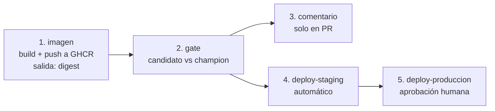

# CI/CD del repositorio: qué corre, cuándo y por qué

Los workflows **ya existen** en [`.github/workflows/`](../../.github/workflows/). Este
documento los explica; no los reescribe. Ábrelos en un panel y lee esto en el otro.

| Workflow | Pregunta que responde | Cuándo corre |
|---|---|---|
| [`ci.yml`](../../.github/workflows/ci.yml) | *¿el código está bien?* | cada push a `main`, cada PR, o a mano |
| [`cd.yml`](../../.github/workflows/cd.yml) | *¿esto debe atender tráfico?* | push a `main`, PR, o a mano con una versión de candidato |
| [`nightly-smoke.yml`](../../.github/workflows/nightly-smoke.yml) | *¿el caso guía sigue funcionando de punta a punta?* | todas las noches a las 02:00 America/Bogotá |

Las tres preguntas son distintas y por eso son tres archivos. Meterlas en uno hace que
un fallo de lint bloquee un despliegue urgente, y que el pipeline tarde lo mismo
siempre.

---

## 1. `ci.yml` — ¿el código está bien?

Cinco jobs, y el orden importa solo en uno.

| Job | Qué hace | Por qué está |
|---|---|---|
| `calidad` | `ruff check`, `ruff format --check`, `mypy` | el estilo y los tipos se discuten una vez, en el pipeline, no en cada revisión de PR |
| `tests` | `pytest -m "not slow and not integration"` con cobertura, en **Ubuntu y Windows** | buena parte de los estudiantes trabaja en Windows y varios fallos de la sesión 1 eran específicos de esa plataforma |
| `smoke` | `scripts/smoke_test.py --rapido`, con `lfs: true` | verifica que el **entorno** se puede reconstruir y que los punteros de Git LFS se resuelven |
| `secretos` | `gitleaks` con `fetch-depth: 0` | escanea **el historial completo**, no el diff |
| `imagen` | construye la imagen y la verifica. `needs: [calidad]` | es el job más caro; no se paga si el lint ya falló |

### El job `imagen` es el que hay que leer con cuidado

Hace tres cosas, y las dos últimas son criterios de aceptación del taller de la
sesión 5:

```yaml
- name: La imagen NO debe correr como root
  run: |
    uid=$(docker run --rm --entrypoint sh mlops-curso/api:ci -c 'id -u')
    if [ "$uid" = "0" ]; then
      echo "::error::la imagen corre como root"
      exit 1
    fi
```

```yaml
- name: La imagen debe responder /health
  run: |
    docker run -d --name api -p 8000:8000 -e TAXI_MODELO_URI=ninguno mlops-curso/api:ci
    for i in $(seq 1 40); do
      if curl -sf http://127.0.0.1:8000/health > /dev/null; then ... exit 0; fi
      sleep 1
    done
    docker logs api
    exit 1
```

Tres decisiones de diseño que conviene notar:

1. **`TAXI_MODELO_URI=ninguno`.** El CI verifica la imagen **sin** levantar MLflow. Es
   por eso que el servicio permite arrancar degradado: si `/health` exigiera un modelo,
   este job necesitaría un registry y dejaría de correr en un runner limpio.
2. **`docker logs api` antes del `exit 1`.** Un job que falla sin dejar el log obliga a
   reproducir el fallo en local. Cuesta dos líneas escribirlo y ahorra media hora.
3. **El bucle con `sleep 1`, no un `sleep 30` fijo.** Con el sleep fijo, o se espera de
   más en cada corrida o se falla de forma intermitente cuando el runner está lento. El
   *polling* con timeout es correcto en los dos escenarios.

`push: false` y `load: true`: el CI **no publica** la imagen. Publicar es trabajo del
CD, y un PR de un fork no debe poder empujar imágenes al registro de la organización.

### Notas históricas que valen para la clase

El CI anterior de este repositorio terminaba en:

```yaml
- run: uv run pytest -q || echo "No tests configured yet"
```

**Un pipeline que no puede fallar es peor que no tener pipeline**: produce confianza
injustificada. Además estaba rojo —50 errores de `ruff` y 67 archivos sin formatear— y
nadie lo notaba, porque el paso de tests nunca fallaba.

---

## 2. `cd.yml` — ¿esto debe atender tráfico?

Cinco jobs. El segundo es el corazón de la sesión.



### Job 1: `imagen` — build y push por digest

```yaml
tags: |
  type=sha,format=long
  type=ref,event=pr
  type=ref,event=branch
```

**`latest` no aparece a propósito.** Los tags que sí se publican son legibles para
humanos, pero el deploy no los usa: usa el `digest` que `docker/build-push-action`
devuelve como salida.

```bash
referencia="${REGISTRY}/${IMAGEN}@${digest}"    # ghcr.io/org/repo/api@sha256:...
```

Ese string es la **unidad de despliegue** y viaja como salida del job hasta los dos
jobs de deploy. El de producción despliega el mismo digest que se verificó en staging,
por construcción y no por disciplina.

También activa `provenance: true` y `sbom: true`: atestación de cómo se construyó la
imagen y lista de materiales de software. Es lo que permite responder "¿esta imagen
contiene la versión vulnerable de la librería X?" sin reconstruirla.

En un PR, `push: false`: se construye para verificar que compila, no se publica.

### Job 2: `gate` — ver la sección siguiente

### Job 3: `comentario` — métricas en el PR, sin CML

El resultado del gate se publica como comentario del PR con
[`actions/github-script`](https://github.com/actions/github-script).

**Por qué no CML** (`iterative/setup-cml`), que es lo que aparece en casi todos los
tutoriales de MLOps: su última release es la **0.20.6, de octubre de 2024**. Una acción
sin mantenimiento activo en el camino crítico del despliegue es deuda con fecha de
vencimiento — cuando GitHub cambie una API o Node deprecate una versión de runtime, el
pipeline de despliegue se rompe y nadie va a arreglar la acción. Aquí se reemplaza por
unas veinte líneas de la API de GitHub.

Dos detalles del job que son buenas prácticas generales, no trucos:

**1. El comentario se actualiza, no se acumula.**

```js
const marcador = '<!-- gate-de-promocion -->';
const previo = comentarios.find(c => c.body && c.body.includes(marcador));
if (previo) { await github.rest.issues.updateComment({...}); }
else        { await github.rest.issues.createComment({...}); }
```

Sin el marcador, un PR con quince pushes acumula quince comentarios y nadie sabe cuál
es el vigente.

**2. Los valores entran por `env:`, nunca interpolados en el cuerpo del script.**

```yaml
env:
  GATE_PROMOVIDO: ${{ needs.gate.outputs.promovido }}
with:
  script: |
    const titulo = {...}[process.env.GATE_PROMOVIDO] || '...';
```

Interpolar `${{ ... }}` dentro de un script es la vía clásica de *script injection* en
Actions. Basta que el valor contenga una comilla o un backtick para romper el
JavaScript; y si el valor viene del título de un PR —que cualquiera puede escribir—
para **ejecutar código con el token del workflow**. Con `env` el dato es dato y nunca
se parsea como código. El mismo patrón se aplica al input `candidato_version` en el
job del gate.

También: el log del gate se pasa entre jobs **por un artifact**, no por una salida de
job. Las salidas tienen límite de tamaño y el log de una tabla de criterios lo pasa.

### Jobs 4 y 5: staging automático, producción aprobada

```yaml
deploy-staging:
  if: github.event_name != 'pull_request' && needs.gate.outputs.promovido == 'true'
  environment:
    name: staging
```

```yaml
deploy-produccion:
  needs: [imagen, gate, deploy-staging]
  if: github.ref == 'refs/heads/main' && needs.gate.outputs.promovido == 'true'
  environment:
    name: production
```

Los pasos de deploy son `echo`s en este repositorio, y está dicho en los comentarios:
el comando real depende del entorno (`aws apprunner update-service`, `kubectl set
image`, `docker compose up -d`). Lo que **no** es un placeholder es la estructura: el
orden de los jobs, las condiciones y de dónde sale la referencia de la imagen.

Y el paso final registra el despliegue en el `$GITHUB_STEP_SUMMARY`: imagen, commit,
quién aprobó y las dos instrucciones de rollback. Eso es lo que contesta la pregunta
del acto 1 del dolor —*¿qué imagen está corriendo y quién la aprobó?*— con un enlace en
lugar de con una conjetura.

---

## 3. Ambientes: `dev`, `staging`, `prod`

| Ambiente | Quién despliega | Cuándo | Qué se aprueba | Datos |
|---|---|---|---|---|
| `dev` | cada estudiante, en local | continuamente | nada | muestra local |
| `staging` | el pipeline, **automático** | cada push a `main` que pase el gate | nada | copia de datos reales o sintéticos |
| `production` | el pipeline, con **aprobación humana** | tras staging, solo desde `main` | el despliegue | datos reales |

### Por qué producción se aprueba y el resto no

No porque el humano vaya a revisar el diff — no lo va a revisar. Por tres razones
concretas:

1. **Alguien asume la decisión.** El registro de aprobación es lo que convierte un
   incidente en algo revisable: hay una persona que puede explicar qué se sabía en ese
   momento.
2. **Introduce una ventana.** Los despliegues automáticos encadenados son la forma más
   rápida de propagar un error a producción. Una pausa de dos minutos alcanza para que
   alguien diga "espera, staging está raro".
3. **Obliga a que staging signifique algo.** Si producción se aprueba y staging no,
   staging tiene que estar razonablemente sano; si nadie mira staging, el aprobador de
   producción está firmando en blanco.

Lo que **no** justifica una aprobación manual: usarla como sustituto de tests. Si el
único filtro real es que alguien haga clic, el pipeline no tiene calidad, tiene
ceremonia.

### La barrera vive en el Environment, no en el YAML

Esto es lo más importante de la sección, y está comentado en el propio `cd.yml`:

> La protección se configura en **Settings → Environments → production → Required
> reviewers**, no con un `if:` en el workflow.

Por qué: un `if:` en el workflow lo puede cambiar **cualquiera con permiso de push**,
en el mismo PR que introduce el cambio que debía revisarse. La configuración del
environment la controla quien administra el repositorio. **La barrera no debe estar en
el archivo que la barrera protege.**

Qué se configura ahí, además de los revisores: un *wait timer* si se quiere una ventana
mínima, la restricción de ramas que pueden desplegar a ese environment, y los secretos
propios del environment — que solo son visibles para los jobs que declaran
`environment: production`.

---

## El gate de promoción

**Es el corazón conceptual de la sesión.** Todo lo demás —ECR, App Runner, los
workflows— es plomería. Esto es la decisión.

El problema que resuelve, en una frase: *"el modelo nuevo tiene mejor RMSE, subámoslo"*
es cómo se degradan los sistemas de ML en producción. Faltan tres preguntas antes de
mover tráfico:

1. **Los datos con los que se midió, ¿son válidos?** Si no, la métrica no significa
   nada.
2. **¿La mejora es real, o cabe dentro del ruido de muestreo?**
3. **¿Mejoró en promedio a costa de empeorar en algún segmento?**

El código está en [`scripts/promote.py`](../../scripts/promote.py) (presentación y exit
codes) y en [`src/taxi/models/evaluate.py`](../../src/taxi/models/evaluate.py) (la
política, como **funciones puras**, testeables sin levantar MLflow: ver
`tests/unit/test_gate.py`).

### Los cinco pasos

Tres son criterios que se evalúan; dos son los efectos que se escriben, en un orden que
importa.

| # | Paso | Qué exige exactamente | Dónde |
|---|---|---|---|
| 1 | **Tests de datos verdes** | el holdout pasa el contrato de Pandera `ViajesProcesados` — **el mismo** que usa la ingesta, no una copia | `criterio_contrato_datos` |
| 2 | **Métrica del candidato mejor que la del champion en el holdout fijo** | `rmse_candidato <= rmse_champion * (1 - MEJORA_MINIMA_RELATIVA)`, con `MEJORA_MINIMA_RELATIVA = 0.01` | `criterio_mejora_global` |
| 3 | **Ningún subgrupo se degrada** | para cada subgrupo comparable, `(rmse_cand - rmse_champ) / rmse_champ <= 0.05` | `criterio_subgrupos` |
| 4 | **Escribir el tag `validation_status`** | `passed` o `failed` en la versión del candidato, **antes** de tocar el alias | `registry.marcar_validacion` |
| 5 | **Y solo entonces, mover el alias** | `set_registered_model_alias(nombre, 'champion', version)` | `registry.asignar_alias` |

### Paso 1: el dato primero, y corto circuito

Se valida el dato **antes** de mirar cualquier métrica, y si falla los criterios 2 y 3
quedan marcados `NO EVALUADO` en lugar de `FALLA`. La distinción no es cosmética: *"no
lo revisé"* y *"lo revisé y falló"* son diagnósticos distintos para quien lee el log
del CI.

Por qué el corto circuito: un RMSE calculado sobre datos que violan el contrato no
significa nada, y reportar esa comparación invita a discutir el número equivocado.
Promover en base a él es peor que no promover, porque el gate habría dado una garantía
falsa.

### Paso 2: por qué un margen y no un "menor que"

`rmse_candidato < rmse_champion` parece suficiente y no lo es. Con ruido de muestreo,
dos modelos equivalentes se alternan indefinidamente en producción: cada rotación
cuesta un despliegue, invalida la comparabilidad de las métricas de negocio y llena el
registry de versiones. Es el **churn de modelos**.

Exigir un 1% de mejora relativa es un umbral **elegido, no derivado**, y hay que decir
eso en clase. Lo riguroso sería un test estadístico con el tamaño del holdout; el 1% es
una aproximación defendible que evita el churn sin bloquear mejoras reales. Está en
[`config.py`](../../src/taxi/config.py) como `MEJORA_MINIMA_RELATIVA` para que se pueda
discutir y cambiar en un solo lugar.

Y un detalle crucial: **el champion se reevalúa sobre el holdout actual** en lugar de
leer las métricas guardadas de su run.

```python
# scripts/promote.py
modelo_champion = _cargar_modelo(config.uri_modelo(nombre_modelo, config.ALIAS_PRODUCCION))
metricas_champion, subgrupos_champion = evaluate.evaluar_modelo(modelo_champion, holdout)
```

Si el holdout o el código de la métrica cambiaron desde que se entrenó, los números
guardados no son comparables — y un gate que compara números incomparables es peor que
no tener gate.

### Paso 3: la regresión silenciosa

El RMSE global puede bajar porque el modelo mejora en el segmento mayoritario (viajes
cortos en hora valle) mientras se degrada en uno minoritario (viajes largos de
madrugada). El promedio dice "mejor"; el usuario del segmento afectado dice "peor".

Los subgrupos del caso guía son de **negocio, no estadísticos**: franjas horarias
(madrugada, mañana, tarde, noche) y rangos de distancia (corta, media, larga, muy
larga). Se definen en un solo lugar para que entrenamiento y gate midan lo mismo.

Tres decisiones honestas de este criterio:

- **El umbral por subgrupo (5%) es más laxo que la mejora global exigida (1%).** No es
  incoherencia: un subgrupo tiene menos datos y más varianza; pedir lo mismo bloquearía
  promociones legítimas.
- **`MIN_FILAS_SUBGRUPO = 50`.** Por debajo de ese tamaño el RMSE está dominado por el
  ruido; el subgrupo se reporta pero no decide. Un gate que produce falsos positivos
  entrena al equipo a ignorarlo.
- **Si no hay subgrupos comparables, el criterio FALLA.** No aprueba por defecto: *el
  gate no aprueba lo que no puede verificar.*

Y el argumento que hay que decir en voz alta: **esta es la misma técnica que se usa
para detectar inequidad.** Cuando el segmento que se degrada corresponde a un grupo de
personas en lugar de a un rango de millas, el mecanismo de detección es idéntico; lo
que cambia es la consecuencia.

### Pasos 4 y 5: el orden de las escrituras

```python
registry.marcar_validacion(nombre, version, decision.estado_validacion)  # primero
if decision.promover:
    registry.asignar_alias(nombre, ALIAS_PRODUCCION, version)  # después
```

**El tag se escribe antes de mover el alias.** Si el proceso muere entre las dos
operaciones, el estado resultante es *"validada pero no promovida"*, que es seguro. El
orden inverso dejaría un modelo sirviendo tráfico **sin registro de haber sido
validado**, que es exactamente el incidente que se quiere evitar.

Es una decisión de diseño sobre fallos parciales, y es transferible: cuando dos
escrituras no son atómicas, se ordenan para que el estado intermedio sea el seguro.

### Los exit codes, y por qué son tres

| Código | Significado | Qué hace el CD |
|---|---|---|
| `0` | promovido (o ya era el champion) | continúa al deploy |
| `1` | **rechazado** | falla el job. `@champion` no se toca |
| `2` | **no pudo medir** (MLflow caído, falta el holdout) | falla el job, con un mensaje distinto |

La distinción entre 1 y 2 es la parte fina: **"el modelo no es lo bastante bueno" es un
resultado exitoso del gate; "no pude medir" es una falla del gate.** Confundirlos hace
que un MLflow caído se lea como un modelo malo, y alguien acabe reentrenando para
arreglar un problema de red.

Los dos hacen fallar el pipeline, eso sí: no se despliega un modelo cuyo gate no
corrió.

Detalle de implementación que vale la pena mirar: `registry.fallar_rapido()` reduce el
timeout y los reintentos HTTP de MLflow para las consultas de **metadatos**. Por
defecto mlflow reintenta 7 veces con backoff y 120 s de timeout — razonable para un
pipeline que quiere sobrevivir a un blip de red, terrible para un gate en CI, que
debería devolver exit 2 en segundos en lugar de colgar el job durante minutos. **Un
fallback que tarda cuatro minutos en activarse no es un fallback.**

### En un PR el gate es informativo

```bash
if [ "$EVENTO" = "pull_request" ]; then
  argumentos+=(--dry-run)
fi
```

Con `--dry-run` el gate evalúa, imprime las dos tablas, comenta el resultado en el PR y
**no escribe el tag ni mueve el alias**. Mover `@champion` desde un PR sin aprobación es
exactamente el fallo que este workflow evita.

### Correrlo a mano

```bash
uv run taxi promote --dry-run                        # evalúa, no escribe nada
uv run taxi promote --candidato-version 8            # una versión concreta
uv run taxi promote --mejora-minima 0.05             # exigir 5% en lugar de 1%
uv run taxi promote --umbral-subgrupo 0.02           # más estricto por subgrupo
echo "exit code: $?"
```

Salida: dos tablas —*candidato vs @champion* (global y por subgrupo, con el delta
relativo) y *criterios del gate* (con el número que justifica cada veredicto)— y un
veredicto `PROMOVIDO` o `RECHAZADO` con el motivo. El log completo queda como artifact
del workflow durante 14 días.

**Cómo demostrar en clase que rechaza.** Dos formas, y la segunda es mejor:

```bash
# a) Endurecer el umbral hasta que el candidato actual no lo alcance
uv run taxi promote --mejora-minima 0.99 --dry-run    # exit 1

# b) Registrar un candidato deliberadamente PEOR y dejar que el gate lo rechace.
#    El baseline de la media es, por construcción, peor que cualquier modelo que
#    haya llegado a @champion: es el rechazo más limpio de demostrar.
uv run taxi train --modelo media --registrar
uv run taxi promote                                   # exit 1, RECHAZADO
uv run taxi promote --dry-run                         # vuelve a mostrar la tabla
```

La (a) demuestra la mecánica en diez segundos y sirve para el guion. La (b) es la que se
pide en el taller, porque el rechazo es real y el log es evidencia. Después de (b),
verifica que **el champion no se movió**:

```bash
uv run python -c "
from taxi.models import registry
mv = registry.version_por_alias('nyc-taxi-duration', 'champion')
print('champion sigue en la version', mv.version if mv else 'ninguna')
"
```

### Por qué esto no es un test más

Un test responde "¿el código hace lo que dice?". El gate responde "¿este artefacto debe
atender tráfico?". Son preguntas distintas: el gate depende de **datos**, su resultado
cambia sin que el código cambie, y su salida correcta puede ser "no" sin que nada esté
roto.

La justificación completa del diseño, con las alternativas descartadas, está en
[`docs/adr/007-gate-de-promocion.md`](../../docs/adr/007-gate-de-promocion.md).

---

## 4. `nightly-smoke.yml` — ¿el caso guía sigue funcionando?

Corre el caso guía completo todas las noches en un runner limpio: descarga datos reales
de la TLC, verifica la procedencia con hashes SHA-256, levanta MLflow, entrena,
registra, corre el gate, genera el reporte de drift y la model card.

Por qué existe, escrito en el propio archivo: el diagnóstico del repositorio encontró un
patrón —el material se escribió, funcionó una vez en la máquina de quien lo escribió y
se degradó en silencio. Rutas absolutas comiteadas, artefactos de una corrida única
versionados, un `run_id` hardcodeado. **Nada de eso lo detecta un CI de lint y tests
unitarios**, porque el fallo está en la integración con datos y servicios reales.

Dos piezas que hacen que el nightly sirva:

- **Abre un issue si falla**, con las tres causas frecuentes ya listadas (la TLC
  republicó un parquet, cambió una API de mlflow/prefect/evidently, o el gate rechazó
  por una regresión real). Y **no duplica** el issue si ya hay uno abierto con la
  etiqueta `nightly`.
- **`timeout-minutes: 30`.** Un job de integración sin timeout se cuelga seis horas
  consumiendo minutos de Actions.

Un nightly que nadie mira es peor que no tenerlo: crea la sensación de estar cubierto.
El issue automático es lo que lo convierte en una señal.

---

## 5. Qué haría falta para un CD completo, y no está

Honestidad sobre los límites de este repositorio, porque conviene que la clase sepa
qué falta:

| Falta | Por qué importa | Dónde se aprende |
|---|---|---|
| El comando real de deploy | los pasos son `echo`s; la estructura es real, la ejecución no | [`guia-aws.md`](guia-aws.md) lo hace a mano |
| Despliegue progresivo (canary, blue/green) | mover el 100% del tráfico de golpe es la forma más cara de descubrir un problema | KServe o el balanceador de la plataforma |
| Smoke test real contra staging | *"un deploy sin verificación posterior no es un deploy, es un deseo"* | el paso existe como `echo` en `cd.yml` |
| Rollback automático por métricas | hoy el rollback es manual (mover el alias) | requiere el monitoreo de S07 conectado a un disparador |
| Firma de imágenes (`cosign`) | el digest garantiza integridad, no procedencia | complemento natural de `provenance: true` |

El orden en que se agregan, si tuvieras que elegir: primero el smoke test real (es el
que evita desplegar algo roto), después el despliegue progresivo, y el rollback
automático al final — porque un rollback automático mal calibrado revierte despliegues
buenos y es peor que el manual.
