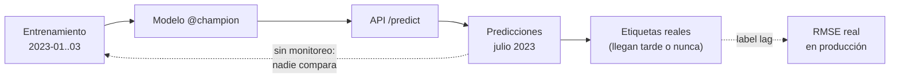
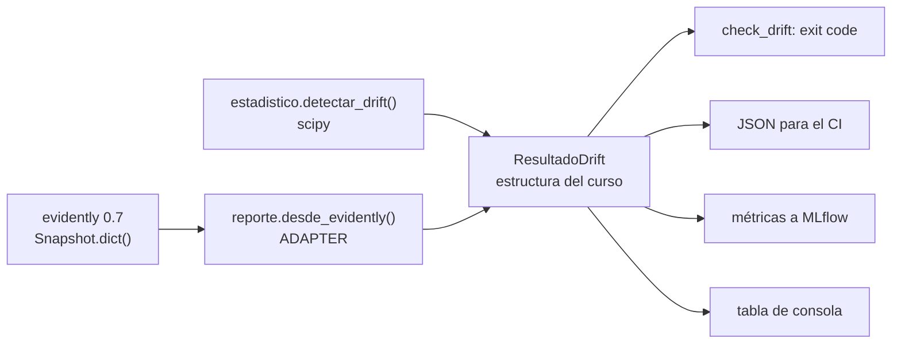
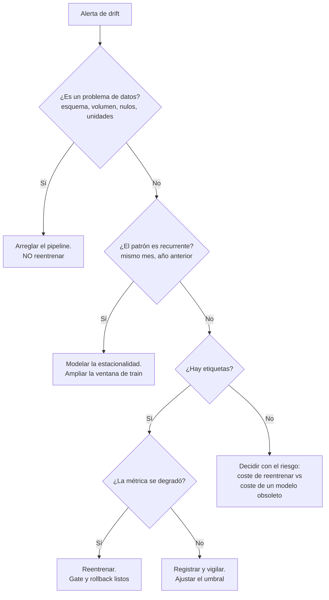

# Sesión 7 — Monitoreo, observabilidad y gobernanza

> **Fecha de revisión del material:** agosto de 2026.
> Versiones verificadas ejecutando código: `evidently 0.7.21`, `scipy 1.17.1`,
> `prometheus-client 0.26.0`, `mlflow 3.15.1`, `scikit-learn 1.9.0`.

El modelo ya está entrenado (S03), orquestado (S04), servido (S05) y desplegado con
un gate de promoción (S06). Esta sesión responde la única pregunta que queda, y es
la que no tiene final: **¿sigue siendo válido lo que desplegamos?**

---

## Objetivos

Al terminar la sesión debes poder:

1. **Distinguir** las cuatro cosas que se confunden bajo la palabra "drift" (data,
   concept, prediction, degradación de performance) y decir, para cada una, si es
   observable sin etiquetas.
2. **Calcular** drift con `scipy` a mano —KS, chi-cuadrado, PSI, Jensen-Shannon— y
   **explicar por qué `p < 0.05` no sirve como criterio** con volúmenes de
   producción.
3. **Ejecutar** el check del curso contra datos reales y leer su salida:
   `python -m taxi.monitoring.check_drift`.
4. **Justificar** por qué ese check devuelve un exit code y cómo eso lo convierte
   en un paso de pipeline en lugar de un informe.
5. **Instrumentar** un servicio con `prometheus_client` y explicar la diferencia
   entre `Counter`, `Histogram` y `Gauge`, y cómo se calcula un p95 con buckets.
6. **Decidir** ante un caso ambiguo: distinguir drift que exige reentrenar de
   estacionalidad que conviene modelar como feature.
7. **Escribir** una política de reentrenamiento con trigger, aprobador y mecanismo
   de rollback, y clasificar el sistema bajo el AI Act con las fechas vigentes
   después del Omnibus.

Criterio de logro: los siete son verificables con un comando o con un documento
entregable. El taller los evalúa uno por uno.

---

## 1. El problema: un modelo entrenado en enero sirviendo julio

El caso guía del curso entrena con **2023-01, 2023-02 y 2023-03**. Las particiones
de "producción" son **2023-07** y **2024-01** (ver `src/taxi/config.py`). No hay
drift sintético en esta sesión: el drift es el que trae el mundo.

Lo que cambia entre enero y julio en NYC no es una hipótesis: cambia el turismo,
cambia el tráfico, cambian las rutas al aeropuerto, cambia la mezcla de viajes
cortos y largos. Y entre 2023-01 y 2024-01 hay además un año de cambios de tarifa y
de patrones de demanda.

El problema no es que el modelo se degrade. **El problema es que el sistema no tenía
forma de saberlo.** Hasta esta sesión, el pipeline del curso entrena, registra,
promueve y sirve; ninguna de esas piezas mide si los datos que llegan se parecen a
los datos con los que se entrenó. Un modelo que empeora sin que nadie lo note es
peor que un modelo que falla ruidosamente: el segundo se arregla, el primero se
sigue usando.



---

## 2. Taxonomía: cuatro fenómenos, no uno

La palabra "drift" se usa para cuatro cosas distintas. Confundirlas hace que se
tomen decisiones equivocadas: reentrenar cuando el problema es un cambio de esquema,
o no reentrenar cuando la relación entre features y target sí cambió.

Formalmente, el modelo aprendió una aproximación de `P(y | X)` sobre una
distribución `P(X)`. Los cuatro fenómenos son cambios en distintas partes de eso:

| Fenómeno | Qué cambia | Ejemplo en el caso guía | ¿Observable sin etiquetas? |
|---|---|---|---|
| **Data drift** (covariate shift) | `P(X)` | `trip_distance` se alarga en verano | **Sí.** Basta comparar distribuciones de entrada |
| **Prediction drift** | `P(ŷ)` | la API empieza a predecir 25 min donde predecía 15 | **Sí.** Es la salida del modelo, la tienes siempre |
| **Concept drift** | `P(y \| X)` | se abre una vía nueva: el mismo viaje ahora dura menos | **No directamente.** Necesita etiquetas |
| **Degradación de performance** | la métrica (RMSE, MAE) | el RMSE de julio es peor que el de validación | **No.** Solo cuando llegan las etiquetas |

### 2.1 Lo que sí se puede medir hoy y lo que hay que esperar

Esta distinción es la más importante de la sesión, porque determina qué puedes poner
en un dashboard mañana y qué no.

**Observable en tiempo real, sin etiquetas:**

- distribución de cada feature de entrada vs la referencia (data drift);
- distribución de las predicciones (prediction drift);
- calidad de los datos: nulos, valores fuera de rango, categorías nuevas, volumen;
- métricas del servicio: latencia, throughput, errores.

**No observable hasta que llegan las etiquetas:**

- concept drift;
- cualquier métrica de performance real.

Consecuencia práctica: el data drift es un **proxy** de lo que importa, no lo que
importa. Se vigila porque está disponible, no porque sea suficiente. Un cambio en
`P(X)` puede no afectar la calidad en absoluto (si ocurre en una región donde el
modelo generaliza bien) y una caída de calidad puede ocurrir sin drift de entrada
visible (concept drift puro). Tenerlo claro evita las dos decisiones malas:
reentrenar por un drift inofensivo y confiarse por su ausencia.

### 2.2 Label lag

El *label lag* es el retraso entre la predicción y la disponibilidad de la etiqueta
real. Es una propiedad del **problema de negocio**, no del sistema, y determina qué
estrategia de monitoreo es siquiera posible.

| Caso | Label lag típico | Consecuencia operativa |
|---|---|---|
| Duración de un viaje de taxi | minutos | se puede medir RMSE casi en línea; es un caso afortunado |
| Fraude con tarjeta | días o semanas (hasta el contracargo) | el drift de datos es la única señal temprana |
| Riesgo de crédito a 12 meses | un año | la performance real llega cuando el modelo ya fue reemplazado |
| Churn a 90 días | tres meses | ídem, con ventana móvil |
| Diagnóstico médico | meses, y con sesgo de verificación | las etiquetas que llegan no son una muestra aleatoria |

Regla práctica: **cuanto mayor es el label lag, más peso tiene el monitoreo de
datos**, porque es la única señal disponible dentro del horizonte de decisión. Y un
corolario incómodo: con label lag alto no se puede validar el detector de drift
contra la degradación real en el momento; se valida a posteriori, meses después.

Un segundo problema, más sutil: cuando las etiquetas llegan **solo para las filas en
las que se actuó** (se aprobó el crédito, se bloqueó la transacción), la muestra
etiquetada está sesgada por la propia decisión del modelo. Medir performance sobre
ella sobreestima la calidad. Se conoce como *selective labeling* o *feedback loop*,
y la mitigación estándar es reservar un pequeño porcentaje de tráfico con decisión
aleatoria o con la política anterior.

---

## 3. Tests estadísticos y sus trampas

### 3.1 Los cuatro instrumentos

Están implementados en
[`src/taxi/monitoring/estadistico.py`](../../src/taxi/monitoring/estadistico.py),
con `scipy` y nada más.

| Método | Qué mide | Rango | Aplicable a | Trampa principal |
|---|---|---|---|---|
| **Kolmogorov-Smirnov** (`D`) | máxima distancia entre las dos CDF empíricas | `[0, 1]` | numéricas continuas | poco sensible en las colas; con muchos empates (discretas) el p-valor no es exacto |
| **Chi-cuadrado** | independencia en la tabla categoría × periodo | `[0, inf)` | categóricas | requiere frecuencias esperadas >= 5; con alta cardinalidad se infla |
| **PSI** | estabilidad de la distribución binada | `[0, inf)` | ambas | sensible al binning; **explota con categorías nuevas** (log de casi cero) |
| **Jensen-Shannon** (distancia) | divergencia simétrica normalizada | `[0, 1]` | ambas | acotada, y eso la vuelve poco sensible a cambios en colas de baja masa |

Detalle que importa y que casi nunca se dice: **el estadístico `D` del KS ya es un
tamaño de efecto**. Está en `[0,1]`, no depende de `n` y se interpreta directamente
("las CDF se separan como máximo 18 puntos porcentuales"). El p-valor que acompaña
al KS es el que hay que mirar con desconfianza, no el estadístico.

El chi-cuadrado, en cambio, **no** trae tamaño de efecto: su estadístico crece
linealmente con `n`. Por eso el módulo reporta la **V de Cramér**, que es el
chi-cuadrado normalizado por `n` y por los grados de libertad.

Y el PSI tiene una propiedad que hay que conocer antes de usarlo como métrica de
vigilancia: **no está acotado**. Con una categoría nueva, el término
`(p_act - p_ref) * ln(p_act / p_ref)` se dispara porque `p_ref` se sustituye por un
epsilon; en el caso guía se ven PSI de 14 cuando aparecen zonas nuevas. Eso es
correcto como señal ("algo cambió muchísimo") e inútil como escala comparable. Para
comparar entre features y entre periodos, la distancia de Jensen-Shannon, acotada en
`[0,1]`, es preferible.

### 3.2 La trampa: `p < 0.05` es un criterio malo con n grande

Esto es lo que hacía el material anterior de esta sesión, y es incorrecto:

```python
# ANTI-PATTERN. No usar.
stat, p_value = stats.ks_2samp(train[col], prod[col])
drift = p_value < 0.05
```

Un test de hipótesis responde *"¿es plausible que estas dos muestras vengan de la
misma distribución?"*. Con `n` grande la respuesta es **no** para cualquier
diferencia, porque el poder del test crece con `n`. El valor crítico del KS al 5% es
aproximadamente `1.36 * sqrt(2/n)`:

| n por muestra | `D` crítico al 5% | Interpretación |
|---|---|---|
| 1.000 | 0.061 | hace falta un cambio visible |
| 10.000 | 0.019 | ya alerta con cambios pequeños |
| 60.000 | 0.008 | alerta con cambios irrelevantes |
| 500.000 | 0.003 | **alerta siempre** |

Con las particiones completas de la TLC (cientos de miles de filas por mes), el
criterio por p-valor marca drift en casi todas las columnas, todos los meses. El
resultado no es "monitoreo sensible": es **alert fatigue**. El equipo aprende a
ignorar la alerta y el día del drift real nadie mira. Un detector que siempre dice
sí tiene exactamente el mismo valor informativo que uno que siempre dice no.

La corrección no es subir el alfa —eso solo mueve el problema— sino **separar
significancia de magnitud**:

```python
significativo = p_valor < 0.05  # ¿se distingue del ruido?
relevante = efecto >= umbral  # ¿es lo bastante grande para importar?
drift = significativo and relevante
```

Y guardar el motivo, porque los dos casos mixtos son informativos:

| Significativo | Relevante | Lectura | Acción |
|---|---|---|---|
| sí | sí | drift real | investigar, considerar reentrenar |
| sí | no | diferencia detectable por el tamaño de muestra | **no** alertar; anotar la tendencia |
| no | sí | efecto grande sin evidencia suficiente | recolectar más datos antes de decidir |
| no | no | sin señal | nada |

El módulo del curso implementa las tres opciones (`--criterio efecto`,
`--criterio p_valor`, `--criterio psi`) precisamente para poder correr el mismo
dataset con las tres y comparar. `p_valor` está ahí **para demostrar que está mal**.

### 3.3 Umbrales por feature, no un umbral global

Un umbral es una **decisión de negocio**, no una constante estadística. En el caso
guía (ver `UMBRALES_POR_FEATURE` en `estadistico.py` y
[ADR 003](../../docs/adr/003-umbrales-de-drift.md)):

| Feature | Umbral de efecto | Ruido medido bajo el nulo | Por qué |
|---|---|---|---|
| `trip_distance` | 0.07 (KS `D`) | 0.004 | entra directo en la predicción; se vigila fino |
| `hora_pickup`, `dia_semana_pickup` | 0.15 (KS `D`) | 0.005 / 0.003 | su variación estacional es esperada y el modelo ya la tiene como feature |
| `duration` (target) | 0.10 (KS `D`) | 0.005 | solo medible tras el label lag |
| `PULocationID`, `DOLocationID` | 0.10 (V de Cramér) | 0.035 | alta cardinalidad moderada |
| `PU_DO` | **0.15** (V de Cramér) | **0.119** | miles de niveles: la V de Cramér tiene sesgo positivo con muchas celdas de conteo bajo |

La columna "ruido medido bajo el nulo" es el paso que casi nadie hace y que decide si
un umbral sirve: es el tamaño de efecto entre **dos mitades aleatorias de la propia
referencia**, donde por construcción no hay drift. Es el ruido del instrumento.

```python
from taxi.monitoring.estadistico import linea_base_nula

linea_base_nula(referencia, columnas_numericas=..., columnas_categoricas=...)
```

Un umbral por debajo de esa línea base **garantiza** falsos positivos. Es exactamente
lo que pasaba con `PU_DO`: el default razonable para una categórica (0.10) queda por
debajo de su propio ruido (0.119), así que el detector habría alertado comparando dos
mitades del mismo mes. De ahí el 0.15. **El umbral se fija después de medir el ruido,
no antes**, y ese orden es la diferencia entre un umbral defendible y un número
copiado de un blog. Ver [ADR 003](../../docs/adr/003-umbrales-de-drift.md).

Y una segunda decisión, a nivel de dataset: `UMBRAL_DRIFT_COLUMNAS = 0.30` en
`config.py`. Se alerta cuando **más del 30% de las columnas** tiene drift, no cuando
alguna lo tiene. Motivo: una columna moviéndose es ruido normal; un tercio de las
columnas moviéndose a la vez casi siempre indica un cambio upstream (un cambio de
esquema, de unidad, de proveedor de datos).

---

## 4. Evidently 0.7: la API vigente y la migración

### 4.1 Advertencia de deprecación

El snippet que estaba en este módulo **ya no ejecuta**. Verificado con
`evidently 0.7.21`:

```python
from evidently.report import Report  # ModuleNotFoundError
from evidently.metric_preset import DataDriftPreset  # ModuleNotFoundError
```

No es una deprecación con aviso: los módulos fueron eliminados. Cualquier tutorial,
blog o notebook con esos imports es de 0.6 o anterior. Es un buen ejemplo de por qué
el material de un curso tiene que declarar la versión con la que fue verificado, y
de por qué el lockfile importa.

### 4.2 Tabla de migración

Verificada ejecutando código contra 0.7.21 e inspeccionando firmas con
`inspect.signature`:

| Concepto | API <= 0.6 (no usar) | API 0.7 (vigente) |
|---|---|---|
| Import de `Report` | `from evidently.report import Report` | `from evidently import Report` |
| Import de presets | `from evidently.metric_preset import DataDriftPreset` | `from evidently.presets import DataDriftPreset` |
| Esquema de columnas | `ColumnMapping(numerical_features=..., categorical_features=...)` | `DataDefinition(numerical_columns=..., categorical_columns=...)` |
| Envoltura de datos | se pasaba el `DataFrame` directo | `Dataset.from_pandas(df, data_definition=schema)` |
| Construcción | `Report(metrics=[...])` | `Report([...], include_tests=True)` |
| Ejecución | `report.run(reference_data=ref, current_data=cur, column_mapping=cm)` | `report.run(cur, ref)` — **primero el actual** |
| Resultado | el `Report` mutado | un `Snapshot`, que es lo que devuelve `run()` |
| Serialización | `report.as_dict()` | `snapshot.dict()` |
| HTML | `report.save_html(path)` | `snapshot.save_html(path)` |
| Tests | `TestSuite(tests=[...])`, objeto separado | `include_tests=True` en el `Report`, o `tests=[...]` por métrica |
| Forma del dict | `["metrics"][0]["result"]["drift_by_columns"][col]` | `{"metrics": [...], "tests": [...]}`, con la columna en `metrica["config"]["column"]` |

El cambio en el **orden de los argumentos** de `run()` es el más peligroso: no lanza
error, invierte el sentido de la comparación. Con `DataDriftPreset` la mayoría de las
métricas de distancia son simétricas y el veredicto apenas cambia, pero las métricas
de resumen y de calidad de datos se calculan sobre el "current", así que el reporte
describe el dataset equivocado.

### 4.3 El código vigente

```python
from evidently import DataDefinition, Dataset, Report
from evidently.presets import DataDriftPreset, DataSummaryPreset

esquema = DataDefinition(
    numerical_columns=["trip_distance", "hora_pickup", "dia_semana_pickup"],
    categorical_columns=["PU_DO", "PULocationID", "DOLocationID"],
)
ref = Dataset.from_pandas(df_referencia, data_definition=esquema)
cur = Dataset.from_pandas(df_actual, data_definition=esquema)

report = Report([DataDriftPreset(), DataSummaryPreset()], include_tests=True)
evaluacion = report.run(cur, ref)  # (current, reference)

evaluacion.save_html("reports/drift.html")
resultado = evaluacion.dict()  # {"metrics": [...], "tests": [...]}
```

Para forzar un test clásico en lugar del método por defecto:

```python
Report([DataDriftPreset(num_method="ks", cat_method="chisquare")], include_tests=True)
```

Un detalle que hay que saber leer del `dict()`: el `value` de cada `ValueDrift`
**no siempre es un p-valor**. Depende del método que eligió Evidently, y el default
de 0.7 para columnas numéricas de tamaño medio es la *distancia de Wasserstein
normalizada*, no un p-valor:

| Método (campo `config["method"]`) | Qué es el `value` | Hay drift si |
|---|---|---|
| `ks`, `chisquare`, `z`, `t_test` | p-valor | `value < threshold` |
| `Wasserstein distance (normed)`, `Jensen-Shannon distance`, `PSI` | distancia / tamaño de efecto | `value >= threshold` |

Invertir esa comparación invierte el veredicto sin lanzar ningún error. Por eso el
curso **no** compara a mano cuando puede evitarlo: lee el `status` de la sección
`tests`, que es la decisión que tomó la propia librería con el sentido correcto para
el método que usó.

**Y una consecuencia que hay que asumir explícitamente:** al usar Evidently, los
umbrales por columna son **los de Evidently**, no los calibrados en sección 3.3. Sus métodos
son otros (Wasserstein normalizada, Jensen-Shannon), así que aplicarles un umbral
calibrado para el `D` del KS sería exactamente la sloppiness que este material critica.
La salida del check lo dice en su cabecera.

Es la lección de fondo sobre comprar en lugar de construir: **al delegar la detección
se heredan las decisiones estadísticas del proveedor.** Si quieres una sola política de
umbrales, hay dos caminos honestos:

1. usar el motor propio (`--sin-evidently`), que aplica `UMBRALES_POR_FEATURE`; o
2. forzar `DataDriftPreset(num_method="ks", cat_method="chisquare", per_column_threshold=...)`
   y **recalibrar** sobre esos estadísticos.

Lo que no es honesto es copiar los números de un motor al otro porque "son parecidos".

### 4.4 Aislar el acoplamiento en un solo archivo

La traducción del `dict()` de Evidently a la estructura interna del curso ocurre en
**una función**: `desde_evidently` en
[`src/taxi/monitoring/reporte.py`](../../src/taxi/monitoring/reporte.py).



Esa es la lección de diseño de la sesión, y no es sobre monitoreo: **depende de la
interfaz que controlas, no de la que controla tu proveedor**. Si sale Evidently 0.8 y
vuelve a mover el formato, se cambia un archivo. El material anterior tenía el
parsing del dict copiado en el snippet que el estudiante pegaba en su notebook, así
que la actualización de la librería rompió el material y todos los proyectos a la
vez.

---

## 5. Prometheus mide el servicio; Evidently mide los datos y el modelo

Son dos preguntas distintas, con dos herramientas distintas, dos frecuencias y dos
audiencias. Confundirlas es el error más común de esta sesión.

| | Prometheus + Grafana | Evidently (o `estadistico.py`) |
|---|---|---|
| **Pregunta** | ¿el servicio está sano? | ¿el modelo sigue siendo válido? |
| **Qué mide** | latencia p95, throughput, error rate, saturación | distribuciones de features, de predicciones, calidad de datos |
| **Frecuencia** | continua, en el request path | por lotes, fuera del request path |
| **Latencia de la alerta** | segundos a minutos | horas a días |
| **Estadística** | ninguna: son contadores y cuantiles | tests de dos muestras, distancias entre distribuciones |
| **Quién reacciona** | on-call / SRE | equipo de datos / ML |
| **Un p95 de 400 ms es...** | un problema de ingeniería | irrelevante |
| **Un drift del 40% de columnas es...** | invisible | el problema |

Los dos errores simétricos que produce confundirlas:

1. **Creer que un dashboard verde significa que el modelo funciona.** Un servicio
   puede devolver basura en 8 ms con 0% de errores HTTP. Prometheus lo reporta como
   perfecto.
2. **Intentar calcular un KS por request.** Es caro en el request path y
   estadísticamente absurdo con `n = 1`. El drift es una propiedad de un lote, no de
   una observación.

**El puente entre las dos** es el label `model_version`, que ya está en
[`src/taxi/api/metricas.py`](../../src/taxi/api/metricas.py). Sin él, una promoción
de modelo es invisible en Grafana: la latencia y la distribución de predicciones
cambian de golpe y no hay forma de atribuir el cambio al despliegue.

El dashboard está versionado en
[`observabilidad/grafana/dashboards/api-modelo.json`](../../observabilidad/grafana/dashboards/api-modelo.json)
y se provisiona automáticamente con `docker compose up`. No se construye a mano en la
UI: un dashboard que solo existe en la base de datos de Grafana se pierde en la
primera reinstalación y no se puede revisar en un PR.

---

## 6. Qué monitorear en producción

Cuatro capas. Se implementan de abajo hacia arriba, porque cada una necesita la
anterior para ser interpretable.

| Capa | Señales | Herramienta | Frecuencia |
|---|---|---|---|
| **Infraestructura** | CPU, memoria, reinicios del contenedor | Prometheus (node / cAdvisor) | continua |
| **Servicio** | p50/p95 de latencia, RPS, tasa de error 4xx/5xx, versión cargada | `prometheus_client` en la API | continua |
| **Datos** | nulos por feature, valores fuera de rango, categorías nuevas, volumen del lote, drift por feature | Evidently / `estadistico.py` | por lote |
| **Modelo** | distribución de predicciones y —tras el label lag— RMSE/MAE global y por subgrupo | `taxi.models.evaluate` + el check | por lote / cuando lleguen etiquetas |

Dos señales que se olvidan siempre y son de las más útiles:

- **Volumen del lote.** Si el batch diario pasa de 60.000 filas a 400, no hay drift:
  hay un pipeline roto upstream. Y un check de drift sobre 400 filas tampoco tiene
  poder estadístico, así que reportará "sin drift" y el problema pasará
  desapercibido dos veces.
- **Categorías nuevas.** Una zona `PULocationID` que no existía en entrenamiento es
  drift de pleno derecho, y el chi-cuadrado la diluye entre las demás celdas. El
  módulo la reporta aparte, en `categorias_nuevas`.

Y una regla de diseño de métricas de Prometheus que se rompe siempre: **cardinalidad
acotada**. Nunca un label con el id del request, la zona o un timestamp. `PU_DO`
tiene miles de valores; ponerlo como label multiplica las series por miles y tumba el
servidor de métricas. Decenas de valores por label, no miles.

---

## 7. Cuándo reentrenar

Detectar drift **no** implica reentrenar. Es la decisión más malinterpretada de
MLOps: la respuesta correcta a una alerta de drift es *investigar*, y reentrenar es
solo una de las salidas posibles.

| Estrategia | Cuándo tiene sentido | Riesgos | Requisitos |
|---|---|---|---|
| **Periódico** (semanal, mensual) | los datos cambian de forma gradual y predecible; hay label lag alto | reentrena cuando no hace falta (coste, riesgo de introducir una regresión) y llega tarde a cambios bruscos | pipeline automatizado, gate de promoción |
| **Por drift de datos** | cambios impredecibles; label lag alto | el drift de entrada **no** implica pérdida de calidad: se puede reentrenar sin necesidad y perder un modelo bueno | umbrales calibrados contra el histórico |
| **Por degradación de performance** | hay etiquetas con lag tolerable | reacciona **después** del daño; con label lag alto es inaplicable | etiquetas en producción, medición por subgrupo |
| **Por evento de negocio** (cambio de tarifa, producto nuevo) | el cambio se conoce de antemano | requiere que alguien avise; se olvida | canal con el equipo de negocio |
| **Continuo / incremental** | volumen muy alto, señal rápida y estable | difícil de auditar y de revertir; propaga un lote malo al modelo en minutos | validación online, rollback automático, monitoreo maduro |
| **No reentrenar: modelar el cambio** | el cambio es **estacional y recurrente** | si el diagnóstico es errado, se pospone un reentrenamiento necesario | features de calendario, más de un ciclo de historia |

La última fila es la que este curso quiere que se considere primero, y es el
ejercicio central del notebook 01. Si `hora_pickup` y la duración cambian todos los
julios, reentrenar cada julio es tratar un patrón conocido como si fuera una
sorpresa. La alternativa es **incluir la estacionalidad como feature** y entrenar con
más de un ciclo, de modo que el modelo aprenda el patrón en lugar de perseguirlo.

Criterio práctico de decisión:



Y una regla que no se negocia, heredada de S06: **el reentrenamiento produce un
`@candidate`, nunca un `@champion`**. El gate de promoción decide. Un pipeline de
reentrenamiento que promueve por su cuenta convierte el drift en un mecanismo de
degradación automática.

---

## 8. Cómo se ejecuta esto en el curso

```bash
# 1. Materializar las particiones (requiere red la primera vez)
uv run taxi data

# 2. El check completo: HTML + JSON + exit code
uv run python -m taxi.monitoring.check_drift --verbose

# 3. Solo julio, umbral más estricto
uv run python -m taxi.monitoring.check_drift --actual 2023-07 --umbral 0.2

# 4. Sin Evidently: el plan B con scipy
uv run python -m taxi.monitoring.check_drift --sin-evidently --verbose

# 5. El criterio malo, para verlo
uv run python -m taxi.monitoring.check_drift --sin-evidently --criterio p_valor

# 6. Desde el CLI del curso
uv run taxi drift --particion 2024-01

# 7. ¿Falló?
echo $?    # 0 sin alerta | 1 alerta de drift | 2 no evaluable
```

Artefactos en `reports/`:

- `drift_<referencia>__vs__<actual>.html` — el reporte de Evidently;
- `drift_<referencia>__vs__<actual>.json` — el resultado que consume el CI.

El nombre lleva las particiones comparadas a propósito. El material anterior escribía
`drift_report.html` y lo sobreescribía en cada corrida: no se podía saber qué
comparaba ni contrastarlo con la corrida anterior.

**Exit codes:** `0` sin alerta · `1` se superó el umbral · `2` no se pudo evaluar. El
`2` existe porque "no pude medir" no es "todo bien", y un pipeline que los confunde
reporta verde cuando se quedó sin datos.

---

## 9. Autoverificación

Respóndelas sin mirar arriba. Si falla alguna, el bloque correspondiente está
señalado.

1. Tu modelo de scoring de crédito tiene un label lag de 12 meses. Un proveedor
   cambia la escala de una feature de 0-100 a 0-1. ¿Qué señal lo detecta el mismo día
   y qué señal no lo detectaría nunca a tiempo? (sección 2.1, sección 2.2)
2. Corres un KS sobre 500.000 filas y obtienes `D = 0.004` con `p = 1e-9`.
   ¿Alertas? Justifica con números, no con "depende". (sección 3.2)
3. Explica en una frase por qué `report.run(ref, cur)` y `report.run(cur, ref)`
   producen reportes distintos sin que ninguno lance error. (sección 4.2)
4. Tu dashboard de Grafana está todo en verde: p95 de 9 ms, cero errores 5xx,
   throughput estable. Un usuario reporta que las predicciones "no tienen sentido".
   ¿Es posible? ¿Qué mirarías y con qué herramienta? (sección 5)
5. El check marca drift en `hora_pickup` y en la duración cada julio, tres años
   seguidos. ¿Reentrenas? ¿Qué evidencia adicional pedirías antes de decidir, y qué
   harías si el patrón se confirma? (sección 7)

---

## 10. Qué NO usar

| No usar | Por qué | En su lugar |
|---|---|---|
| `from evidently.report import Report` | el módulo fue **eliminado**; lanza `ModuleNotFoundError` en 0.7.x | `from evidently import Report` |
| `from evidently.metric_preset import DataDriftPreset` | ídem | `from evidently.presets import DataDriftPreset` |
| `ColumnMapping` | reemplazado en 0.7 | `DataDefinition` + `Dataset.from_pandas` |
| `report.as_dict()` | renombrado | `snapshot.dict()` |
| `TestSuite` como objeto separado | absorbido por `Report` | `include_tests=True`, o `tests=[...]` por métrica |
| `p < 0.05` como único criterio | con n de producción alerta siempre; produce alert fatigue | significancia **y** tamaño de efecto (sección 3.2) |
| `np.random.exponential(3)` vs `(5.5)` como "drift" | el resultado nunca es ambiguo, así que no se aprende a decidir | las particiones reales del caso guía |
| Un umbral global para todas las features | el umbral es una decisión de negocio por feature | `UMBRALES_POR_FEATURE` y [ADR 003](../../docs/adr/003-umbrales-de-drift.md) |
| Labels de alta cardinalidad en Prometheus (`PU_DO`, request id) | explota el número de series y puede tumbar el servidor de métricas | labels con decenas de valores (`model_version`, `clase`, `tipo`) |
| Dashboards creados a mano en la UI de Grafana | no se versionan, no se revisan en un PR, se pierden al reinstalar | JSON provisionado en `observabilidad/grafana/` |

### Sobre herramientas

**Criterio de evaluación:** licencia open source usable en clase sin cuenta;
mantenimiento activo (release en los últimos 12 meses); capacidad de correr en local
con `docker compose`. **Fecha de evaluación: agosto de 2026.** Cada fila enlaza a su
documentación oficial.

| Herramienta | Última release conocida | ¿Cumple el criterio? | Rol | Documentación |
|---|---|---|---|---|
| **Evidently** | 0.7.21 (10-mar-2026) | Sí, con reserva: la cadencia previa era mensual y llevaba ~5 meses sin release al cierre del material. De ahí el plan B. | drift de datos y de modelo, reportes | [docs.evidentlyai.com](https://docs.evidentlyai.com/) |
| **scipy** (`estadistico.py`) | 1.17.1 | Sí | plan B: KS, chi², PSI, JS sin dependencias de monitoreo | [docs.scipy.org/doc/scipy/reference/stats.html](https://docs.scipy.org/doc/scipy/reference/stats.html) |
| **Prometheus + Grafana** | activos | Sí | métricas del servicio, dashboards, alertas | [prometheus.io/docs](https://prometheus.io/docs/), [grafana.com/docs](https://grafana.com/docs/) |
| **Great Expectations** | activo | Sí | validación de datos / contratos (S02), no drift | [docs.greatexpectations.io](https://docs.greatexpectations.io/) |
| **whylogs / WhyLabs OSS** | **1.6.4 (3-dic-2024)** | **No.** Sin release en más de 18 meses. | perfiles estadísticos ligeros | [github.com/whylabs/whylogs](https://github.com/whylabs/whylogs) |
| **Arize / Fiddler / Aporia** | SaaS, activos | No para clase: requieren cuenta y enviar datos a un tercero | observabilidad gestionada | [arize.com/docs](https://arize.com/docs/) |
| **NannyML** | activo | Parcial: aporta *estimación de performance sin etiquetas* (CBPE/DLE), que Evidently no hace | complemento útil con label lag alto | [nannyml.readthedocs.io](https://nannyml.readthedocs.io/) |

Precaución de lectura: la fila de whylogs es la razón por la que este material
declara fechas. En 2024 era una recomendación razonable y aparece todavía en muchos
tutoriales de apariencia vigente. **Una tabla de herramientas sin fecha de evaluación
es desinformación con retardo**, y ese es exactamente el criterio que se le pide al
estudiante en su propio proyecto.

---

## Material de la sesión

```
sesiones/s07-monitoreo/
├── README.md                                  este archivo
├── gobernanza.md                              AI Act, ISO 42001, NIST AI RMF, model card
├── taller.md                                  el taller, con criterios de aceptación
├── notebooks/
│   ├── 01-drift-real.ipynb                    enero vs julio, con datos reales
│   └── 02-observabilidad-del-servicio.ipynb   Counter/Histogram/Gauge, p95
├── plantillas/
│   ├── politica-de-reentrenamiento.md         una página, para rellenar
│   └── riesgos.md                             5 riesgos + clasificación AI Act
└── _soluciones/                               no abrir antes del taller

src/taxi/monitoring/
├── estadistico.py     KS, chi², PSI, JS, tamaños de efecto, veredicto (scipy)
├── reporte.py         adapter del dict de Evidently, tabla, JSON, métricas
└── check_drift.py     el check con exit code, HTML y logging a MLflow
```

Relacionado: [ADR 003 — umbrales de drift](../../docs/adr/003-umbrales-de-drift.md) ·
[`src/taxi/api/metricas.py`](../../src/taxi/api/metricas.py) ·
[`observabilidad/`](../../observabilidad/) ·
[`tests/unit/test_monitoring.py`](../../tests/unit/test_monitoring.py)
