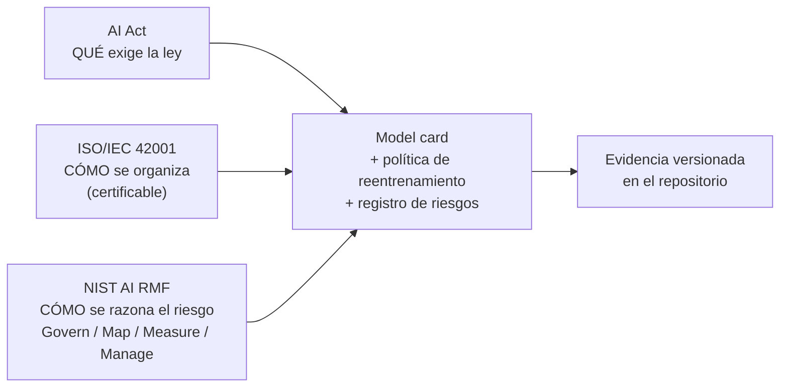

# S07 — Gobernanza: AI Act, ISO/IEC 42001 y NIST AI RMF

> **Fecha de verificación de las fechas legales: 19 de agosto de 2026.** Las fuentes
> primarias están enlazadas al final. Este documento es material docente, no asesoría
> jurídica: el cumplimiento concreto de un sistema depende de su uso, su sector y su
> rol en la cadena de valor.

Esta parte de la sesión existe por una razón operativa, no burocrática: **la
trazabilidad que exige un regulador es la misma que necesitas para depurar un
incidente**. Un equipo que no puede responder "qué modelo estaba sirviendo el 14 de
marzo, con qué datos se entrenó y quién aprobó su despliegue" no tiene un problema de
cumplimiento: tiene un problema de ingeniería que además es un problema de
cumplimiento.

---

## 1. Tres marcos, tres preguntas distintas

Se confunden constantemente. La forma más rápida de ordenarlos:

| Marco | Qué es | Qué pregunta responde | ¿Obligatorio? | ¿Certificable? |
|---|---|---|---|---|
| **AI Act** (Reglamento (UE) 2024/1689) | ley de la UE, de aplicación directa | **qué exige la ley** según el riesgo del sistema | Sí, si operas en la UE o tu output se usa allí | No: se cumple, no se certifica (hay evaluación de conformidad para alto riesgo) |
| **ISO/IEC 42001:2023** | norma de sistema de gestión de IA (AIMS) | **cómo organizas la gobernanza**: roles, políticas, ciclo de mejora | No | **Sí**, por un organismo acreditado |
| **NIST AI RMF 1.0** | marco voluntario del NIST (EE. UU.) | **cómo razonas el riesgo técnico** de un sistema | No | No |

La forma útil de usarlos juntos:



- El **AI Act** te dice si tu sistema es de alto riesgo y, si lo es, qué documentación,
  qué supervisión humana y qué monitoreo post-mercado necesita.
- **ISO/IEC 42001** te da la estructura organizativa para producir esa evidencia de
  forma repetible, y es lo que un cliente o un auditor puede exigirte por contrato.
- **NIST AI RMF** te da el vocabulario para el análisis técnico del riesgo, y su ciclo
  **Govern / Map / Measure / Manage** encaja casi uno a uno con lo que hace este curso.

### 1.1 NIST AI RMF mapeado a lo que ya construiste

| Función del RMF | Qué significa | Dónde está en este repositorio |
|---|---|---|
| **Govern** | políticas, roles, responsabilidad, cultura | `sesiones/s07-monitoreo/plantillas/politica-de-reentrenamiento.md`, los ADR en `docs/adr/`, el gate con aprobador de S06 |
| **Map** | contexto, uso previsto, límites, partes afectadas | la model card (`scripts/model_card.py`), `plantillas/riesgos.md` |
| **Measure** | métricas, tests, evaluación por subgrupo, monitoreo | `taxi.models.evaluate` (subgrupos), `taxi.monitoring` (drift), `taxi.api.metricas` (servicio) |
| **Manage** | priorizar, mitigar, responder, mejorar | exit code del check, gate de promoción, rollback por alias, política de reentrenamiento |

Que las cuatro funciones ya tengan un archivo concreto no es casualidad: son las
mismas prácticas de ingeniería con otro nombre. Lo que añade el marco es la obligación
de **escribirlas** y de poder mostrarlas.

---

## 2. AI Act: fechas vigentes después del Digital Omnibus

El calendario original del AI Act fue modificado. El **AI Omnibus entró en vigor el 27
de julio de 2026** y **aplazó las obligaciones de alto riesgo**. Cualquier material
que siga anunciando el 2 de agosto de 2026 como fecha de aplicación del alto riesgo
está desactualizado.

| Bloque de obligaciones | Fecha de aplicación | Estado |
|---|---|---|
| Prohibiciones (prácticas vedadas, art. 5) y alfabetización en IA (art. 4) | **2 de febrero de 2025** | en vigor |
| Modelos de propósito general (GPAI) y gobernanza | **2 de agosto de 2025** | en vigor |
| **Transparencia del art. 50** (revelar contenido generado por IA, etiquetar interacción con IA, marcar deepfakes) | **2 de agosto de 2026** | **en vigor — NO se aplazó** |
| Art. 50: obligaciones de marcado y detección para sistemas ya en el mercado antes del 2-ago-2026 | **2 de diciembre de 2026** | transición |
| **Alto riesgo del Anexo III** (empleo, crédito, educación, servicios esenciales, biometría…) | **2 de diciembre de 2027** | aplazado (era 2-ago-2026) |
| **Alto riesgo del Anexo I** (IA embarcada en productos ya regulados: máquinas, dispositivos médicos, automoción…) | **2 de agosto de 2028** | aplazado (era 2-ago-2027) |

Tres lecturas que hay que sacar de esta tabla:

1. **El aplazamiento no es una amnistía.** Es tiempo de preparación, y las
   obligaciones llegan igual. Un sistema que empieza a diseñar su documentación en
   noviembre de 2027 no llega.
2. **La transparencia del art. 50 sí aplica hoy.** Es la parte que más equipos pasan
   por alto porque no se sienten "de alto riesgo": si tu producto genera texto,
   imagen, audio o vídeo, o si un usuario interactúa con un sistema de IA, hay
   obligaciones de revelación **desde el 2 de agosto de 2026**.
3. **Las fechas cambian.** Este documento lleva fecha de verificación y enlaces
   primarios precisamente porque la información legal caduca. Verifica antes de
   reutilizarlo.

### 2.1 Y el caso guía, ¿es de alto riesgo?

**No.** Predecir la duración de un viaje de taxi no está en el Anexo III: no decide
sobre acceso al empleo, al crédito, a la educación ni a servicios esenciales, y no
hace inferencia biométrica ni categorización de personas. Sería de riesgo mínimo, sin
obligaciones específicas más allá de las generales.

Ese "no" es didácticamente valioso, porque el ejercicio consiste en **cambiar una cosa
del caso y ver cómo se mueve la clasificación**:

| Variante del caso | Clasificación tentativa | Por qué |
|---|---|---|
| Predecir duración del viaje (el caso guía) | riesgo mínimo | ninguna decisión sobre personas |
| Fijar el **precio** por cliente usando features personales | probablemente no Anexo III, pero con riesgo de discriminación de precios y normativa de consumo | el AI Act no lo cubre; otras normas sí |
| Decidir **qué conductores** reciben viajes, o evaluarlos | **Anexo III (empleo)** | afecta a la gestión de trabajadores y su acceso al ingreso |
| Puntuar la **solvencia** de un cliente para pago diferido | **Anexo III (crédito)** | evaluación de solvencia de personas físicas |
| Asignar ambulancias o priorizar emergencias | **Anexo III (servicios esenciales)** | acceso a servicios públicos esenciales |
| Identificar pasajeros por **reconocimiento facial** | alto riesgo, o **prohibido** según el uso | biometría; algunos usos están vedados por el art. 5 |

El patrón: lo que mueve la clasificación no es la técnica —el mismo XGBoost en todos
los casos— sino **sobre quién decide y con qué consecuencia**. Es la razón por la que
la clasificación no la puede hacer el equipo de ML por su cuenta.

### 2.2 Qué exige el AI Act a un sistema de alto riesgo, y qué ya tienes

Si tu sistema **sí** cae en el Anexo III, esto es lo que pide y lo que este curso ya
produce. La columna de la derecha es el argumento de la sesión: casi todo estaba ya
implementado como buena práctica de ingeniería.

| Obligación (art.) | Qué pide | Qué del curso lo cubre |
|---|---|---|
| Gestión de riesgos (art. 9) | proceso continuo de identificación y mitigación | `plantillas/riesgos.md`, ciclo del NIST AI RMF |
| Gobernanza de datos (art. 10) | calidad, representatividad, examen de sesgos | S02: contratos con pandera, `taxi.data.contract` |
| Documentación técnica (art. 11, anexo IV) | descripción del sistema, diseño, métricas, límites | model card autogenerada + ADR |
| Registro de eventos / logging (art. 12) | trazabilidad automática del ciclo de vida | MLflow (runs, params, métricas, artefactos), aliases y tags del registry |
| Transparencia hacia el deployer (art. 13) | instrucciones de uso, límites conocidos | model card, secciones de uso previsto y limitaciones |
| Supervisión humana (art. 14) | posibilidad de intervenir y de anular | gate de promoción con aprobador humano (S06), rollback por alias |
| Exactitud, robustez, ciberseguridad (art. 15) | métricas declaradas y sostenidas | evaluación global y por subgrupo, holdout fijo, tests |
| **Monitoreo post-mercado (art. 72)** | plan de seguimiento activo del sistema en uso | **esta sesión completa**: drift, métricas del servicio, política de reentrenamiento |

El artículo 72 es la razón por la que el monitoreo aparece en un documento de
gobernanza: **el seguimiento post-mercado es una obligación legal, no una buena
práctica opcional**, y lo que satisface esa obligación es exactamente el HTML, el JSON
y el exit code que produce `taxi.monitoring.check_drift`, más el registro escrito de
qué se hizo cuando saltó.

---

## 3. El vehículo práctico: la model card

Toda esta gobernanza se vuelve inútil si vive en un documento que nadie actualiza. El
mecanismo del curso para evitarlo es que la model card **se genera desde el registry**,
no se escribe a mano:

```bash
uv run taxi model-card
# genera docs/model-card.md desde models:/nyc-taxi-duration@champion
```

`scripts/model_card.py` lee la versión que resuelve el alias, sus métricas, su run de
origen y sus tags. Consecuencias de que sea generada:

- **no se desincroniza**: si el champion cambia, la card cambia al regenerarla;
- **es verificable en CI**: se puede exigir que la card del repositorio corresponda al
  champion actual;
- **la parte que sí requiere juicio humano** —uso previsto, límites, poblaciones
  afectadas, consideraciones éticas— es la única que se escribe a mano, y por eso se
  nota si falta.

Lo que la model card **no** puede autogenerar y hay que escribir:

1. uso previsto y usos explícitamente fuera de alcance;
2. limitaciones conocidas y condiciones en las que el modelo no debe usarse;
3. poblaciones o subgrupos afectados y resultados de la evaluación por subgrupo;
4. la política de reentrenamiento y quién aprueba;
5. el registro de riesgos con sus mitigaciones.

Los puntos 4 y 5 tienen plantilla en [`plantillas/`](plantillas/).

---

## 4. Ejercicio de gobernanza (entra en el taller)

1. **Clasifica tu proyecto.** Con la tabla de §2.1 como guía, decide si tu sistema es
   de riesgo mínimo, de transparencia (art. 50) o de alto riesgo (Anexo I o III).
   Escribe **la fecha de aplicación que te corresponde** y una frase de justificación.
   Si es de riesgo mínimo, dilo y explica qué tendría que cambiar para que no lo fuera.
2. **Rellena `plantillas/riesgos.md`**: cinco riesgos, su mitigación y quién la ejecuta.
3. **Rellena `plantillas/politica-de-reentrenamiento.md`**: trigger, datos, aprobador,
   rollback, registro.
4. **Genera la model card** y completa a mano las cinco secciones que no se
   autogeneran.

Criterio de evaluación: que un auditor —o el compañero que te haga peer review— pueda
responder con tus documentos "¿qué hace este sistema, sobre quién decide, cómo se sabe
si sigue funcionando y quién responde si no?".

---

## Fuentes

Verificadas el 19 de agosto de 2026.

- **AI Omnibus, entrada en vigor y nuevas fechas de alto riesgo** — Comisión Europea,
  *Shaping Europe's digital future*:
  <https://digital-strategy.ec.europa.eu/en/news/ai-omnibus-enters-force>
  ("On 27 July 2026, the AI Omnibus enters into force across the EU"; Anexo III: "Rules
  apply starting 2 December 2027"; Anexo I: "Rules apply starting 2 August 2028").
- **Transparencia del art. 50, fechas y transición** — Comisión Europea, FAQ oficial:
  <https://digital-strategy.ec.europa.eu/en/faqs/transparency-obligations-under-article-50-ai-act>
  ("Article 50 of the AI Act applies as from 2 August 2026"; sistemas ya en el mercado:
  "only as from 2 December 2026").
- **Texto del Reglamento (UE) 2024/1689 (AI Act)** — EUR-Lex:
  <https://eur-lex.europa.eu/eli/reg/2024/1689/oj>
- **Portal del AI Act de la Comisión** (visión general y calendario):
  <https://digital-strategy.ec.europa.eu/en/policies/regulatory-framework-ai>
- **ISO/IEC 42001:2023 — AI management system**:
  <https://www.iso.org/standard/42001>
- **NIST AI Risk Management Framework 1.0**:
  <https://www.nist.gov/itl/ai-risk-management-framework>
- **Model Cards for Model Reporting** (Mitchell et al., 2019), origen del formato:
  <https://arxiv.org/abs/1810.03993>
