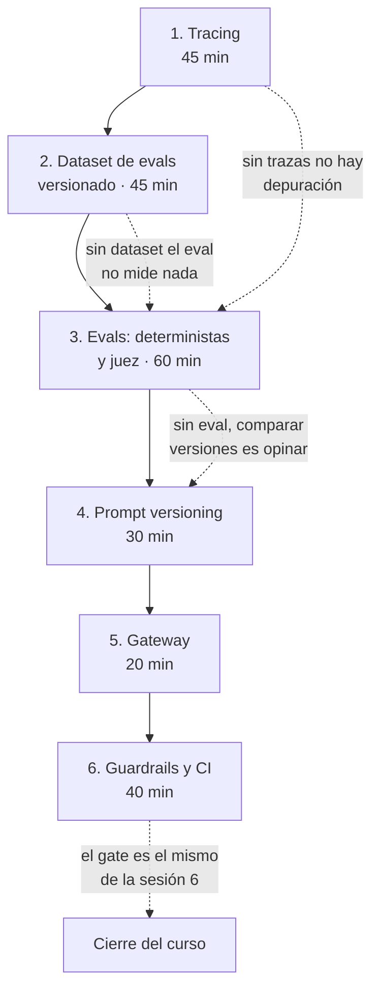

# Sesión 8 — LLMOps

**Última sesión del curso.** No introduce una disciplina nueva: toma lo que las
siete sesiones anteriores construyeron —versionado, tracking, pipelines, gates,
monitoreo— y lo aplica a un sistema donde el modelo es una API de terceros y el
artefacto que se versiona es un texto.

La pregunta que organiza la sesión es: **¿qué se transfiere de MLOps y qué cambia
de verdad?** La respuesta corta, y sorprende: se transfiere casi todo. Lo que
cambia es qué se mide.

**Sin GPU.** Toda la sesión funciona con APIs, y funciona completa **sin API key**
usando `ProveedorFake`. Colab con un modelo abierto queda como extensión opcional
para quien quiera; no es parte de la sesión.

---

## Objetivos

Al terminar, cada estudiante debe poder:

1. **Instrumentar** una función que llama a un LLM con `@mlflow.trace` y navegar
   la traza resultante para decir en cuál de los pasos —renderizado del prompt,
   llamada al modelo, parseo, reintento— se produjo un fallo concreto.
2. **Construir y validar** un dataset de evals con verdad de terreno, y explicar
   por qué el campo `notas` de cada caso es parte del dataset y no un comentario.
3. **Escribir un scorer determinista** que puntúe correctamente un caso bueno y
   un caso malo, y **justificar** por qué ese scorer no debe ser un LLM.
4. **Calibrar un juez de LLM** contra ≥10 casos etiquetados a mano, calcular el
   porcentaje de acuerdo y el kappa de Cohen, y decidir con ese número si el
   resultado del juez se reporta o no.
5. **Registrar dos versiones de un prompt**, evaluarlas sobre el mismo dataset y
   producir una tabla comparativa que separe las métricas que mejoran de las que
   empeoran.
6. **Correr el eval como gate en CI** y explicar por qué el gate es *idéntico* al
   de `scripts/promote.py` de la sesión 6.
7. **Estimar el costo por request** a partir de los tokens, y explicar por qué los
   precios viven en un archivo de configuración y no en el código.
8. **Nombrar tres riesgos** específicos de un sistema con LLM que no existen en ML
   clásico, y la mitigación operativa de cada uno.

Verificables: los ocho se comprueban con un comando o con un artefacto en el PR
del taller. Ver [`taller.md`](taller.md).

---

## Por qué esta sesión existe

Tres escenas. Las tres pasan, en este orden, en casi todos los proyectos de LLM.

### Escena 1 — La demo funciona y la clase no

La app responde perfectamente a las tres quejas que preparaste. Un estudiante
escribe la suya, y la respuesta es mala. **¿Qué salió mal?**

Sin trazas hay cuatro candidatos y ninguna forma de distinguirlos:

- el prompt se renderizó mal (una variable quedó sin sustituir),
- el modelo respondió algo razonable y el parseo lo destrozó,
- el modelo respondió mal,
- el retrieval trajo el documento equivocado (si hubiera retrieval).

Con trazas, son cuatro spans y se ve en cinco segundos cuál falló. **Por eso el
tracing va primero en esta sesión.** No es la parte vistosa; es la que hace
posible todo lo demás. Sin trazas no hay depuración, y sin depuración los evals
te dicen que algo está mal pero no dónde.

### Escena 2 — Cambias una palabra del prompt

Cambias "clasifica" por "analiza y clasifica". Pruebas tres ejemplos. Se ven
mejor. Al registry.

**Eso no es una medición: es una opinión.** La muestra la elegiste tú, después de
escribir el cambio, y no hay línea base. Es indistinguible de no tener proceso.

El antídoto tiene el mismo esfuerzo: 36 casos etiquetados a mano, un comando, una
tabla con el delta de cada métrica. Lo caro no es el proceso, es construir el
dataset una vez.

### Escena 3 — El juez que aprueba todo

Escribes un LLM-as-judge. Corre sobre 200 casos. Sale 0.87. El 0.87 va al slide.

Nadie verificó que el juez coincida con lo que una persona habría dicho. Si el
juez aprueba casi todo —el sesgo más común en un juez sin rúbrica— el 0.87 no mide
calidad: mide la propensión del juez a aprobar.

> **Un juez sin calibrar contra una muestra etiquetada por humanos no es una
> métrica: es una opinión con API.**

Esa frase es la regla no negociable de la sesión. Está implementada en código:
`scorers/juez.py` no expone ninguna forma de obtener el resultado del juez sin su
kappa al lado, porque la vía fácil es la que se usa.

---

## Qué se transfiere de MLOps y qué cambia

La tabla central de la sesión. La columna de la derecha es corta a propósito.

| Concepto | En ML clásico (S01-S07) | En LLMOps (S08) | ¿Cambia? |
|---|---|---|---|
| **Versionar el artefacto** | Un `.pkl` con pesos | **prompt + config del modelo + nombre del modelo + índice** (si hay RAG). Son cuatro cosas que cambian por separado y las cuatro cambian el comportamiento. | Sí: el artefacto se fragmenta |
| **Tracking de experimentos** | params, métricas, modelo | Lo mismo, más: **versión del prompt, temperatura, tokens de entrada/salida, costo, número de reintentos** | Se amplía |
| **Métrica offline** | RMSE, F1 — una función cerrada | **Rúbricas y jueces** para lo que no tiene respuesta única; scorers deterministas para lo que sí | Sí, y es el cambio grande |
| **Test determinista** | `assert pred == esperado` | **Propiedades y esquema**, no igualdad: JSON válido, enum, rango, longitud, ausencia de PII | Sí: de igualdad a propiedades |
| **Drift** | Drift de features de entrada | Drift **de entrada** (los usuarios escriben distinto) **y de calidad de salida** (el proveedor cambió el modelo detrás del mismo alias, sin avisar) | Se duplica |
| **Gate de promoción** | Candidato vs `@champion` en holdout fijo; exit 1 → CI rojo | Prompt v2 vs v1 en el dataset de evals; exit 1 → CI rojo | **Idéntico** |
| **Rollback** | Mover `@champion` a la versión anterior | Mover `@champion` del prompt a la versión anterior | **Idéntico** |
| **Costo** | Casi invisible: el modelo está en memoria | **Por request y proporcional al texto.** Sube al lado de la latencia y la calidad | Sí: sube de prioridad |
| **Latencia** | Milisegundos, predecible | Segundos, variable, y depende de un tercero | Sí: sube de prioridad |
| **Reproducibilidad** | Semilla fija → bit a bit | **No garantizada** ni con temperatura 0: batching en GPU, y el modelo detrás del alias puede cambiar | Sí, y se degrada |

### Lo que hay que sacar de esta tabla

**El gate no cambia.** Ni el rollback. Si la sesión 6 quedó clara, la parte
operativa de LLMOps ya la sabes. Lo único genuinamente nuevo es **con qué se
compara**: un dataset de evals etiquetado a mano en el rol que tenía
`PARTICION_TEST`.

Ese paralelo es explícito en el código: [`evaluar.py`](src/clasificador/evaluar.py)
abre con la tabla de correspondencia contra
[`scripts/promote.py`](../../scripts/promote.py), y el alias de producción del
prompt es literalmente `champion`, el mismo string que `taxi.config.ALIAS_PRODUCCION`.

**Y hay una asimetría incómoda:** la reproducibilidad, que la sesión 1 trató como
alcanzable, aquí no lo es del todo. Se puede fijar el prompt, la temperatura y la
semilla, y el proveedor puede seguir devolviendo algo distinto. Lo que queda es
registrar exactamente qué respondió y con qué modelo, para poder auditar después.
Es un cambio de estrategia: de *reproducir* a *evidenciar*.

---

## El caso: clasificar quejas de usuarios de taxi

**Entrada:** el texto libre de una queja.
**Salida:** JSON con `categoria`, `severidad` (1-5), `requiere_reembolso` y
`resumen` (≤20 palabras).

Por qué este caso y no un RAG de juguete:

1. **La salida es estructurada y verificable.** Se pueden escribir scorers
   deterministas *de verdad*, no solo opiniones de un juez. Con un RAG sobre PDFs
   inventados, todo se mide con jueces y la mitad de la sesión se vuelve circular.
2. **Hay verdad de terreno.** 36 casos etiquetados a mano, y por tanto exactitud
   real contra una etiqueta humana.
3. **Conecta con el caso guía.** Mismo dominio (taxis de la sesión 1), mismas
   convenciones (`s08-...` en los experimentos, alias `champion`).
4. **Es un caso realista.** Clasificar y enrutar texto libre es, con diferencia,
   el uso de LLM más común en producción. Los chatbots son más visibles; esto es
   más frecuente.

### El activo más valioso, y el que nadie quiere construir

[`datos/quejas.jsonl`](datos/quejas.jsonl) — 36 casos con `entrada`, `esperado` y
`notas`.

Etiquetarlo tomó un par de horas. No produce ninguna demo. No se puede delegar a
un modelo sin volverlo circular. Es la parte que se salta todo el mundo.

**Y es la que da todo el retorno.** El prompt se reescribe en cinco minutos; el
dataset se reutiliza durante años y sobrevive al cambio de modelo, de proveedor y
de framework. Cuando alguien pregunta "¿por dónde empiezo con evals?", la
respuesta es: por aquí, y va a ser aburrido.

El campo `notas` es parte del dataset, no un comentario. Documenta **por qué** cada
etiqueta es esa. Sin él, en tres meses nadie recuerda el criterio y el siguiente
anotador introduce otro. Los criterios completos están en
[`rubricas/severidad.md`](rubricas/severidad.md), incluidos **tres casos que son
genuinamente discutibles** y cuya etiqueta es una decisión declarada, no una
verdad. Esos tres son la razón por la que la exactitud de categoría nunca va a
llegar a 1.00: el techo del dataset no es 100%, es el acuerdo entre anotadores
humanos.

---

## El orden de los bloques, y por qué es ese



**Tracing primero.** Es la dependencia de todo lo demás: sin trazas no se puede
depurar, y sin depurar no se puede saber por qué un eval bajó. El orden inverso
—evals primero— produce un número que nadie sabe interpretar.

**El gateway va tarde y es corto.** Es infraestructura útil y no es un concepto de
LLMOps: es un reverse proxy que entiende de tokens. Ponerlo al principio consume
tiempo del bloque de evals, que es donde está el contenido.

---

## Cómo correrlo

Todo funciona **sin API key y sin red**.

```bash
# Desde la raíz del repo
export PYTHONPATH=sesiones/s08-llmops/src
export LLMOPS_TRACING=off        # 'local' para escribir trazas en mlruns-llmops/

# El eval completo. Es el gate: exit != 0 si baja del umbral.
python -m clasificador.evaluar

# Comparar las dos versiones del prompt
python -m clasificador.comparar_prompts

# Los tests (81, todos sin red)
make test-llmops
```

Atajos: `make evals-llm` y `make comparar-prompts`.

### Con tracing y MLflow

```bash
make mlflow                       # servidor en :5001, en otra terminal
export LLMOPS_TRACING=servidor
python -m clasificador.evaluar    # las trazas y el run aparecen en la UI
```

### Con un modelo real

```bash
uv sync --extra llmops            # openai, litellm, tiktoken
export LLMOPS_PROVEEDOR=openai
export OPENAI_API_KEY=...         # o apunta al gateway con LLMOPS_BASE_URL
python -m clasificador.evaluar --prompt v2 --juez openai
```

> **Aviso sobre el modo fake.** `ProveedorFake` **simula** sensibilidad al prompt
> para que la comparación de versiones se pueda practicar offline (ver
> `MARCADOR_RUBRICA` en [`proveedor.py`](src/clasificador/proveedor.py)). Los
> deltas que produce **no son evidencia** sobre prompts reales: con un modelo real
> un prompt más largo puede perfectamente empeorar el resultado. Además, sus reglas
> finas se escribieron mirando los 36 casos, que es sobreajuste al holdout y está
> declarado como tal en el código. Por eso el eval reporta siempre el proveedor:
> `proveedor=fake` significa "esto no midió el sistema real".

---

## Estructura

```
sesiones/s08-llmops/
├── README.md                    # este archivo
├── taller.md                    # el taller, con criterios medibles
├── costos.md                    # cómo se estima el costo y por qué sube de prioridad
├── riesgos.md                   # inyección, PII en trazas, alucinación, EU AI Act
├── prompts/
│   ├── v1-minimo.txt            # versión corta
│   └── v2-rubrica.txt           # versión con rúbrica y ejemplos
├── rubricas/
│   ├── juez-resumen.md          # LA rúbrica del juez. Es el artefacto.
│   └── severidad.md             # definición operativa de la etiqueta
├── datos/
│   ├── quejas.jsonl             # 36 casos etiquetados a mano
│   └── calibracion-juez.jsonl   # 15 veredictos humanos, para calibrar el juez
├── config/precios.yaml          # precios por modelo. Configuración, no código.
├── gateway/
│   ├── config.yaml              # LiteLLM Proxy
│   └── README.md                # qué problema resuelve y cuándo NO
├── src/clasificador/
│   ├── esquema.py               # contrato de salida (Pydantic)
│   ├── proveedor.py             # fake · eco · openai, con import tardío
│   ├── prompts.py               # archivos + Prompt Registry
│   ├── clasificador.py          # @mlflow.trace + retry con feedback
│   ├── tracing.py               # configuración del tracing, con modo degradado
│   ├── datos.py                 # carga y validación del dataset
│   ├── costos.py                # calculadora
│   ├── evaluar.py               # el eval y EL GATE
│   ├── comparar_prompts.py      # registro + comparación de versiones
│   └── scorers/
│       ├── deterministas.py     # baratos, rápidos, no mienten
│       ├── juez.py              # LLM-as-judge con rúbrica externa
│       └── acuerdo.py           # porcentaje de acuerdo y kappa de Cohen
├── tests/                       # 81 tests, sin red y sin API key
└── _soluciones/                 # no publicar antes del taller
```

Relacionado, fuera de esta carpeta:

- [`instructor/guion-s08-llmops.md`](../../instructor/guion-s08-llmops.md) — guion minutado
- [`docs/adr/004-llm-as-judge.md`](../../docs/adr/004-llm-as-judge.md) — la decisión sobre el juez
- [`.github/workflows/evals-llm.yml`](../../.github/workflows/evals-llm.yml) — el gate en CI
- [`sesiones/s07-monitoreo/`](../s07-monitoreo/) — el drift y el monitoreo que esta sesión extiende

---

## Autoverificación

Cinco preguntas. Si alguna no se puede responder sin volver al material, ese
bloque no quedó.

1. **La app clasificó una queja como `app` cuando debía ser `tarifa`.** Tienes la
   traza delante. ¿Qué miras, y en qué orden, para decidir si el problema es el
   prompt, el modelo o el parseo? ¿Qué span te lo dice?

2. **Tu juez de LLM reporta que el 91% de los resúmenes son buenos.** ¿Qué número
   necesitas ver antes de poner ese 91% en un informe, y qué haces si ese número
   es 0.3? (Pista: hay dos respuestas distintas según *hacia dónde* se equivoque el
   juez.)

3. **Alguien propone reemplazar el scorer `categoria_correcta` por un juez de LLM
   que evalúe "si la categoría es razonable".** Da dos razones concretas para
   rechazarlo, y una situación en la que sí tendría sentido.

4. **El prompt v2 sube la exactitud de categoría de 0.69 a 0.94 y es tres veces
   más largo.** ¿Qué necesitas calcular antes de promoverlo? ¿Y qué pregunta le
   harías a quien escribió el prompt sobre *cómo* llegó a ese 0.94?

5. **Tu sistema lleva un mes en producción sin cambios: mismo prompt, mismo
   modelo, mismo código.** Los usuarios se quejan de que "responde peor que
   antes". Nombra tres causas posibles que no involucran ningún cambio de tu parte,
   y qué dato necesitas de las trazas para distinguirlas.

Respuestas comentadas en [`_soluciones/autoverificacion.md`](_soluciones/autoverificacion.md).

---

## Qué NO usar

Lista corta de cosas que aparecen en tutoriales y que en este curso son un error.

| No uses | Por qué | Usa |
|---|---|---|
| `openai.ChatCompletion.create(...)` | Es de la era 0.x del SDK. **No existe** en la serie 3.x, que es la vigente. Muchos snippets de la era 1.x también circulan como si fueran actuales. | `cliente = OpenAI(...)` y `cliente.chat.completions.create(...)` |
| Los **stages** del Model Registry | Deprecados desde MLflow 2.9.0. La sesión 3 ya lo cubrió. | Aliases + tags |
| `mlflow.models.evaluate()` para evaluar un LLM | **No es interoperable** con `mlflow.genai.evaluate()`: distinta firma, distinto tipo de scorers, distinta forma del resultado. No se puede reutilizar un scorer de una en la otra ni comparar sus salidas. | `mlflow.genai.evaluate()` para GenAI, `mlflow.models.evaluate()` para ML clásico |
| Un LLM-as-judge **sin calibrar** | No es una métrica. Es la regla no negociable de la sesión. | Calibra contra ≥10 casos humanos y reporta el kappa |
| Un juez para lo que se puede medir con `==` | Más caro, más lento, con varianza, y peor. | Scorer determinista |
| El **mismo modelo** como generador y como juez | Sesgo de auto-preferencia: tiende a aprobar su propia salida. | Un modelo (mejor: un proveedor) distinto para el juez |
| Una **escala de 1 a 5** en un juez de LLM | Produce números que parecen precisos y no lo son: el mismo caso saca 3 o 4 según la temperatura. El acuerdo con humanos se derrumba. | Veredicto binario, o varios criterios binarios |
| Parseo tolerante a todo (regex, arreglar comillas, "la categoría más parecida") | El sistema deja de fallar y empieza a mentir, y el eval no lo nota porque todo parsea. | Validación estricta + retry con feedback |
| El **dataset de evals para iterar** el prompt | Deja de ser un juez y se convierte en entrenamiento. Es lo mismo que tunear contra `PARTICION_TEST`. | Un conjunto de desarrollo aparte; el de evals se toca lo mínimo |
| `set_verbose: true` en el gateway en producción | Loguea prompts completos, y los prompts contienen los datos del usuario. | Logging estructurado con redacción de PII |
| Precios de modelos **hardcodeados** en `.py` | Cambian cada mes. Nadie revisa una constante que ya está ahí, y la estimación se vuelve falsa en silencio. | `config/precios.yaml` con campo `actualizado` |
| Una **métrica global única** de "calidad" | Sube cuando algo importante empeora. Es como se aprueban regresiones. | Un valor por scorer, y mirar la lista de fallos |
| Guardar trazas con PII **sin política de retención** | Las trazas guardan los inputs de los usuarios. Ver [`riesgos.md`](riesgos.md). | Redacción en la ingesta + TTL declarado |
| `@mlflow.trace` contra un servidor caído, sin configurar el destino | La función decorada **se cuelga** en el reintento del exporter. Medido: >2 min sin retornar. | `tracing.configurar()`, con modo `off`/`local`/`servidor` |
