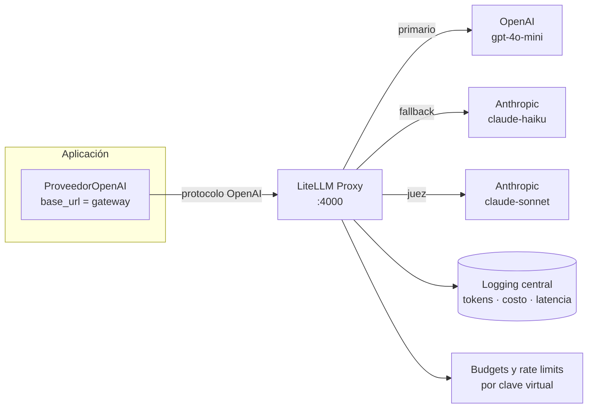

# Gateway de LLM: un endpoint, muchos proveedores

## Qué problema resuelve

Dos problemas concretos que aparecen en cuanto un sistema con LLM pasa de
prototipo a algo que otras personas usan.

### 1. Vendor lock-in que no está en el contrato, sino en el código

El SDK del proveedor se filtra por todo el código: el cliente se instancia en
cinco servicios, el manejo de errores es específico de sus excepciones, el
formato de `usage` es el suyo. Cambiar de proveedor —porque subió el precio,
porque salió un modelo mejor, porque hay que cumplir una restricción de
residencia de datos— deja de ser una decisión de negocio y se convierte en un
proyecto de refactor.

Un gateway invierte la dependencia: la aplicación habla **un** protocolo (el de
OpenAI, que es el de facto) contra **una** URL. Qué modelo responde detrás es
configuración del gateway.

Es el mismo desacoplamiento que `models:/nyc-taxi-duration@champion` en la sesión
3: un nombre estable delante de un artefacto que cambia. Si esa idea quedó clara
ahí, aquí no hay nada nuevo.



### 2. Costos sin control ni atribución

Sin gateway, la respuesta a "cuánto gastamos este mes y en qué" es la factura del
proveedor: un número agregado, a mes vencido, sin desglose por servicio ni por
persona. Y no hay ningún mecanismo que impida que un bug lo duplique.

El gateway da las tres piezas que faltan:

| Pieza | Qué evita |
|---|---|
| **Budget por clave** | Que el peor caso de un bug sea ilimitado. Con tope, el peor caso es el tope. |
| **Rate limit por clave** | Que un cliente agote la cuota compartida y tumbe a los demás. |
| **Logging central** | Tener que instrumentar cada servicio por separado para saber el costo. |

En este curso hay una razón práctica adicional: 30 estudiantes con una clave
virtual de 5 USD cada uno, y la clave real del proveedor nunca sale del gateway.
Nadie la ve y nadie la commitea.

### 3. Bonus: fallbacks, con una advertencia

El gateway puede reintentar en otro proveedor cuando el primario devuelve 429 o
5xx. Eso convierte una caída en una degradación.

**Y es la funcionalidad más peligrosa del gateway.** Un fallback silencioso
cambia el modelo que responde sin que nadie se entere: el eval se corrió contra
`gpt-4o-mini` y en producción contestó `claude-haiku`. Las salidas cambian de
distribución, la calidad se mueve, y la causa —un incidente de disponibilidad de
hace tres días— no aparece en ningún dashboard de calidad.

Mitigación, y no es opcional: **el modelo que realmente respondió se guarda en la
traza y en el resultado.** `RespuestaLLM.modelo` toma el valor que devuelve el
proveedor, no el que se pidió. Sin eso, el fallback vuelve indepurable cualquier
regresión de calidad.

## Cómo levantarlo

El gateway **no** es parte del extra `llmops` del curso: es un servicio, no una
librería de la app. Se instala aparte.

```bash
# 1. Instalar el proxy (fuera del entorno del curso, para no mezclar deps)
uv tool install 'litellm[proxy]'

# 2. Las claves van en el ENTORNO, nunca en el YAML
cp .env.example .env      # y editarlo; .env está en .gitignore
set -a && source .env && set +a

# 3. Levantar
litellm --config sesiones/s08-llmops/gateway/config.yaml --port 4000

# 4. Apuntar la app al gateway. La app NO cambia.
export LLMOPS_PROVEEDOR=openai
export LLMOPS_BASE_URL=http://127.0.0.1:4000
export OPENAI_API_KEY=<la clave VIRTUAL del gateway, no la del proveedor>

python -m clasificador.evaluar --proveedor openai
```

Verificación de que está arriba:

```bash
curl -s http://127.0.0.1:4000/health/readiness
curl -s http://127.0.0.1:4000/v1/models -H "Authorization: Bearer $OPENAI_API_KEY"
```

> Los budgets y las claves virtuales requieren `DATABASE_URL` (Postgres). Sin
> base de datos el proxy funciona como router y logger, pero no puede contabilizar
> presupuestos: no tiene dónde persistir el gasto acumulado.

## Cuándo NO vale la pena

Esta sección importa tanto como la anterior. Un gateway es infraestructura, y la
infraestructura tiene un costo de operación que se paga siempre, no solo cuando
aporta.

**No lo pongas si:**

1. **Hay un solo consumidor y un solo proveedor.** Un script, un notebook, un
   servicio. El gateway agrega un salto de red, un proceso que monitorear, un
   punto único de fallo y una base de datos. A cambio de nada que no dé una
   variable de entorno.
2. **La latencia es crítica y ajustada.** El proxy agrega un salto. Suele ser
   pequeño frente al tiempo del modelo, pero si el presupuesto de latencia ya
   está justo, hay que medirlo antes de asumirlo.
3. **No hay quien lo opere.** Un gateway caído tumba **todo** lo que depende de
   él. Concentrar todo el tráfico de LLM en un servicio sin dueño, sin alertas y
   sin runbook cambia N fallos independientes por un fallo total. Si nadie va a
   estar de guardia, el acoplamiento directo al proveedor es más robusto.
4. **La organización ya tiene una capa equivalente.** Un API gateway corporativo
   con autenticación, cuotas y logging hace el 80% de esto. Poner un segundo
   gateway detrás del primero duplica la configuración y las formas de fallar.

**Alternativa intermedia, y con frecuencia la correcta:** usar `litellm` como
**librería** dentro de la app. Da la abstracción entre proveedores y los
fallbacks sin operar un servicio. Lo que no da es lo que necesita estado
compartido: budgets, rate limits globales y logging central. Si lo que hace falta
es solo la abstracción, la librería alcanza.

| | Nada (SDK directo) | LiteLLM librería | LiteLLM gateway |
|---|---|---|---|
| Cambiar de proveedor | refactor | cambio de string | cambio de config |
| Budgets por usuario | no | no | sí |
| Rate limits globales | no | no | sí |
| Logging central | no | por proceso | sí |
| Fallbacks | a mano | sí | sí |
| Servicio que operar | no | no | **sí** |
| Punto único de fallo | no | no | **sí** |

## Alternativas al producto

- **Portkey**, **Kong AI Gateway**, **Cloudflare AI Gateway**: gateways
  gestionados o de infraestructura. Menos operación, más dependencia externa.
- **vLLM** / **Ollama** con endpoint compatible con OpenAI: si el objetivo es
  servir un modelo abierto propio, esto ya habla el mismo protocolo y el gateway
  puede enrutar hacia ellos como si fueran otro proveedor.
- **Envoy / nginx** con rate limiting: resuelve las cuotas pero no conoce tokens
  ni costos, que es justamente lo específico de un gateway de LLM.
